# 一、Mysql

mysql结构图：（需要背诵：连接器(管理权限)、分析器(语法)、优化器(索引选择)、执行器(执行引擎)）


背诵下面要当是标准的数据库设计流程来做：

先遵守三范式，

然后选数据类型，

再根据业务上是否可能会使用到事务选择不同的存储引擎来优化查询效率。

选择完存储引擎，就要选索引了，根据业务选择添加索引，比如查询多的字段添加索引，增删改多的字段尽量少索引。

以上全部都完成了实操，现在主要来了解mysql：索引数据结构B+树、索引树的类型。

在实际业务中，往往会查询多个表，不得不了解事务来避免多个表同时进行会导致的问题(需要回滚或者在数据查询/更新并发时)，引出事务的概念，避免在业务中出现不正确的读数据和死锁影响效率。

接着是一些不太常见的数据库操作和数据库运维。

 

## 1、数据库三范式

第一范式：每个列都不可以再拆分。
**第二范式：非主键列完全依赖于主键，而不能是依赖于主键的一部分。**
**第三范式：在第二范式的基础上，非主键列只依赖于主键，不依赖于其他非主键。**
在设计数据库结构的时候，要尽量遵守三范式，如果不遵守，必须有足够的理由。比如性能。事实上我们经常会为了性能而妥协数据库的设计。

 

第二范式：

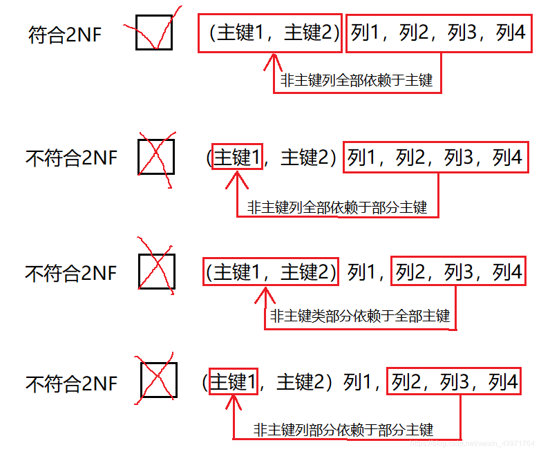

第三范式：

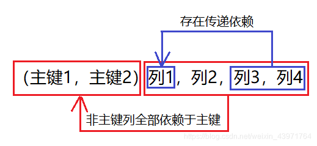

一般这时候会开始创建个文件夹放在项目中，命名：**DDL、DQL、DML、DCL**

1、数据定义语言**DDL**(Data Ddefinition Language)**CREATE,DROP,ALTER**。主要为以上操作即对逻辑结构等有操作的，其中包括表结构，视图和索引。

可能会考到：(如何添加索引)

```
(1)使用ALTER添加索引
1.PRIMARY  KEY（主键索引）
        mysql>ALTER  TABLE  `table_name`  ADD  PRIMARY  KEY (  `column`  ) 
2.UNIQUE(唯一索引)
        mysql>ALTER  TABLE  `table_name`  ADD  UNIQUE (`column` ) 
3.INDEX(普通索引)
        mysql>ALTER  TABLE  `table_name`  ADD  INDEX index_name(需要添加的索引名称) (  `column`  )

alter table table_name    drop   index index_name(需要删除的索引名字) ;

 (2)使用CREATE、DROP添加索引
create index index_name on table_name (column_list) ;
create unique index index_name on table_name (column_list) ;
drop index index_name on table_name ;
```

2、数据查询语言**DQL**(Data Query Language)**SELECT**。这个较为好理解即查询操作，以select关键字。各种简单查询，连接查询等都属于DQL。

3、数据操纵语言**DML**(Data Manipulation Language)INS**ERT,UPDATE,DELETE**。主要为以上操作即对数据进行操作的，对应上面所说的查询操作DQL与DML共同构建了多数初级程序员常用的增删改查操作。而查询是较为特殊的一种被划分到DQL中。

可能在笔试中考增删改，很多人可能会忘了手写：

```
1、基本语法  insert into 表名(列1，列2，列3，列4，...)  values(值，值，值)
例子  insert into student(name,sex,age) values('张三'，18，'男')
2、基本语法 delete from 表名 where 列=值
例子  delete from student where id=1
3、基本语法  update 表名 set 列=值，列=值，.... where...
列子  update student set name = '张三' where id=1
```

4、数据控制功能**DCL**(Data Control Language)**GRANT,REVOKE,COMMIT,ROLLBACK**主要为以上操作即对数据库安全性完整性等有操作的，可以简单的理解为权限控制等。


## 2、数据库类型

常规的int和varchar就不说了，就先看两个可能会问的点：


int/varchar易错点：

（1）varchar(50)中50的涵义
**最多存放50个字符，varchar(50)和（200)存储hello所占空间一样**，但后者在排序时会消耗更多内存，因为order by col采用fixed_length计算col长度（memory引擎也一样）。在早期MySQL版本中，50代表字节数，**现在代表字符数**。
（2）int(20)中20的涵义
是指显示字符的长度。**20表示最大显示宽度为20,但仍占4字节存储，存储范围不变**；不影响内部存储，只是影响带zerofill定义的int时，前面补多少个0,易于报表展示


精度类型：


时间类型：


**尽量使用timestamp,空间效率高于datetime**（这里经常记不住！）

**1、因为Timestamp 只需要使用 4 个字节的存储空间，但是 DateTime 需要耗费 8 个字节的存储空间**。

2、DateTime 类型是没有时区信息的（时区无关） ，DateTime 类型保存的时间都是当前会话所设置的时区对应的时间。这样就会有什么问题呢？当你的时区更换之后，**比如你的服务器更换地址或者更换客户端连接时区设置的话，就会导致你从数据库中读出的时间错误**。不要小看这个问题，很多系统就是因为这个问题闹出了很多笑话。

**Timestamp 和时区有关。Timestamp 类型字段的值会随着服务器时区的变化而变化，自动换算成相应的时间，说简单点就是在不同时区，查询到同一个条记录此字段的值会不一样**。

 

总结**：(重要)**

1、**字段为什么要求定义为不为空(not null）?**   答：null值会占用**更多的字节**，且会在程序中造成很多与预期不符的情况。可以用0代替空

2、**如果要存储用户的密码散列，应该使用什么字段进行存储？**
答：密码散列，盐，用户身份证号等固定长度的字符串应该使用char  而不是varchar来存储，这样可以节省空间且提高检索效率

 

## 3、存储引擎

根据业务上   **是否可能会使用到事务 **选择不同的存储引擎来优化查询效率。

根据这张表选择不同的存储引擎即可。但一般选择innodb，因为大多数的业务都会用来事务。而且InnoDB的主键索引的叶子节点存储着行数据，因此主键索引非常高效。

1、MyISAM索引的**叶子节点存储的是行数据地址**，需要再寻址一次才能得到数据
2、InnoDB非主键索引的**叶子节点存储的是主键和其他带索引的列数据**，因此查询时做到**覆盖索引**会非常高效


（下图是精选出与业务相关的部分，好好看看）

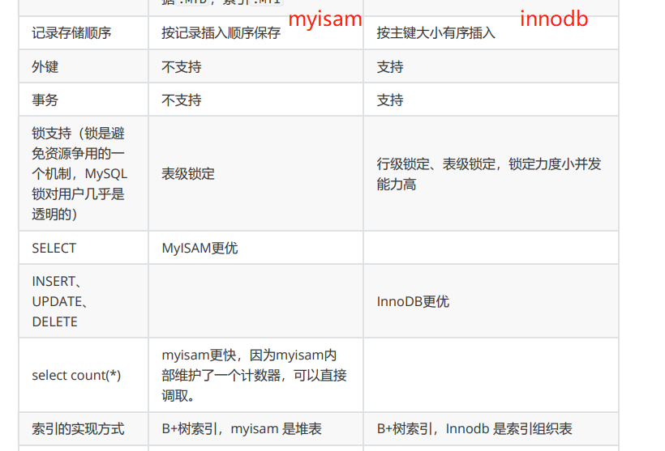

 

## 4、索引

选择完存储引擎，就要选索引了，根据业务选择添加索引，比如查询多的字段添加索引，增删改多的字段尽量少索引。

 

不展开说：定义(数据指针)、优缺点(索引需要占用空间)

***

### 1、索引使用场景

(为了方便记忆，按照查询sql的顺序来讲：join、where、orderby)

（1）join

在我们联表查询时，经常需要用join来获取别的表的数据，但是这会去查另一张表的数据(要是这张表没加索引可能还会导致全局扫描)，所以，**要是我们对join中的表需要select的字段添加"联合索引"，就不会回表查询，存储引擎会直接在索引表中查询而不会去访问原始数据，这就是“索引覆盖”**

如：

```
select
a.id,  
b.code,  //b的code、b的name、sex添加了联合索引
b.name,
b.sex
from
aaaa a
left join bbbb b
on a.id=b.aid
where
a.id=123   //直接根据主键索引去查a.id，没有回表
and b.code  //直接根据联合索引的b.code去查b.name、b.sex，没有回表
```

类似于：

（code1，name11，sex111）        （code2，name22，sex222）   ...

需要满足**最左匹配原则**！

但是需要满足**最左前缀匹配原则**，组合索引非常重要的原则，mysq|会一直向右匹配直到遇到范围查询（>、<、between、like)就停止匹配，比如a=1 and b=2 and c>3 and d=4如果建立（a,b,c,d)顺序的索引，d是用不到索引的；但如果建立（a,b,d,c)的索引则都可以用到，a,b,d的顺序可以任意调整

 

 

**索引覆盖的使用场景**有：

a、应对mysql中因为分页导致放弃数据产生的消耗

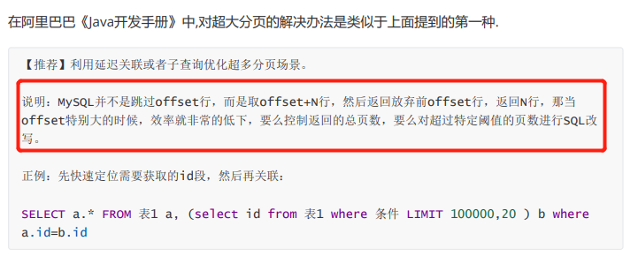

数据库层面，这也是我们主要集中关注的（虽然收效没那么大）,类似于select "星"  from table where age>20 limit 1000000,10这种查询其实也是有可以优化的余地的.这条语句需要load100000数据然后基本上全部丢弃，只取10条当然比较慢。

当时我们可以修改为：**select "星" from table where id** in (**select id from table where age > 20 limit 1000000,10**).这样虽然也load了一百万的数据，**但是由于索引覆盖，要查询的所有字段都在索引中**，所以只会查询索引，速度会很快.同时如果ID连续的好，我们还可以select  "星" from table where id>1000000 limit 10,效率也是不错的，优化的可能性有许多种。

但是核心思想都一样，就是减少load的数据.从需求的角度减少这种请求...主要是不做类似的需求（直接跳转到几百万页之后的具体某一页.只允许逐页查看或者按照给定的路线走，这样可预测，可缓存）以及防止ID泄漏且连续被人恶意攻击.

 

（若面试的时候碰到面试官问特别大的数据使用join还是子查询时，应该是子查询！因为join万一查到没索引的可能还会回表影响效率。用子查询(如上面说的子查询优化)来对特别大的数据来进行处理防止回表或者放弃数据导致的损耗）

 

 

（2）where

这不用多说，where添加索引能增加查询效率。可以用**explain**来看可选的索引有哪些，目前真正用来检索的索引是哪个(方便可以去掉那些没用到的索引)，目前查询索引的利用程度


扩展：

ALL：MySQL遍历全表

index: 全索引扫描，遍历索引数(使用了索引但还是全部都扫描了)

**range(优化时至少要这个，这个会回表)**：只检索给定范围的行，使用一个索引来选择行（用索引进行了）

ref: 表示上述表的连接匹配条件，即哪些列或常量被用于查找索引列上的值。

eq_ref: 类似ref，区别就在使用的索引是唯一索引，对于每个索引键值，表中只有一条记录匹配，简单来说，就是多表连接中使用primary key或者 unique key作为关联条件（join时的索引生效了）

const、system: 当MySQL对查询某部分进行优化，并转换为一个常量时，使用这些类型访问。如将主键置于where列表中，MySQL就能将该查询转换为一个常量，system是const类型的特例，当查询的表只有一行的情况下，使用system

**NULL**(**完全依赖索引查询，这个完全不回表**): MySQL在优化过程中分解语句，执行时甚至不用访问表或索引，例如从一个索引列里选取最小值可以通过单独索引查找完成。**（覆盖索引）**

 

（3）orderby

主要点：**若无索引需要从磁盘中查出所有数据再排序，加了索引则查询需要的数据再排序即可**

但是使用orderby和limit有坑，会造成数据丢失，需要再添加除了原排序字段的另一个字段使得数据不丢失！

***

### 2、索引失效场景

(如果写了不恰当的sql，会导致索引前功尽弃，以下还是从**sql的顺序**来讲，方便记忆)

(1**)select * ：不走索引(可能是看不到索引列吧)**，阿里巴巴规范有说

(2)字段类型不同：对varchar使用了int类型条件会失效 (但对int使用了varchar类型不会失效，查询条件字符串会转成int，仍然可走索引）

(3)where id+1=2 、where SUBSTR(height,1,2)=17：**索引列=号左边上有计算或者函数**(可能是无法识别吧)

第二种情况是查询的时候，和联合索引的顺序情况不一样，也不会走索引。

(4) like '%李'：**like左边包含%当like语句中的%**，出现在查询条件的左边时，索引会失效。(在右边不会，如like '李%')

其实很好理解，索引就像字典中的目录。一般目录是按字母或者拼音从小到大，从左到右排序，是有顺序的。

(5) XX(有索引) or XX(无索引)：**在or语句中，有的有索引，有的无索引，全部索引都会失效**，使用or全部字段都要加索引！

(6)范围查询(这里需要细看)

 in：走索引(跟着索引跳着查就行了)

exists：走索引(跟着索引跳着查就行了，比in效果好) where  exists (select 1 from user  where height=173)
not in：不走索引(索引不等于这些值的有很多，无法使用索引了)
not exists：不走索引(索引不等于这些值的有很多，无法使用索引了)
between and ：走索引

!=：不走索引（Mysql发现通过索引扫描的行记录数超过全表的10%-30%时，优化器可能会放弃走索引，自动变成全表扫描）

<>：不走索引（Mysql发现通过索引扫描的行记录数超过全表的10%-30%时，优化器可能会放弃走索引，自动变成全表扫描）

(7)**orderby：orderby的顺序(正序、倒序)和生成联合索引的顺序(正序、倒序)不一样，有的正排有的反排 ；**

***

### 3、索引类型

根据业务选好了索引，同时也要看添加什么类型的索引。

 

1、根据三范式可知，主键是全表的核心信息的字段，所以需要有**主键索引**(既然是信息核心，那就不允许重复和缺失)

2、对于其它非主键的列，若业务上也会需要增加查询速度，可以添加**普通索引**(因为这些信息是无关紧要的，可以为null和重复)**（叶子节点是主键索引）**

3、要这些普通信息有一些是不允许重复的，可以添加**唯一索引**来限制它重复(但是可以为null)

***

### 4、索引的结构

（原理，不涉及实操）

以上全部都完成了实操，现在主要来了解mysql：索引数据结构B+树、索引树的类型

（1）B树和B+树

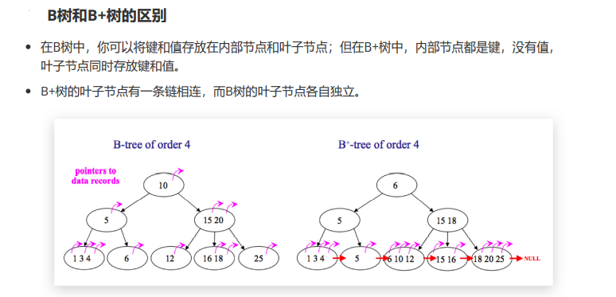

（2）聚簇索引和非聚簇索引、联合索引

非聚簇索引：将数据存储于索引分开结构，索引结构的叶子节点指向了数据的对应行

聚簇索引：将数据存储与索引放到了一块，找到素引也就找到了数据

a、在InnoDB中，**只有主键索引是聚簇索引，如果没有主键，则挑选一个唯一键建立聚簇素引。如果没有唯一键，则隐式的生成一个键来建立聚簇素引**

b、满足聚簇索引和覆盖素引的时候不需要回表查询数据

 

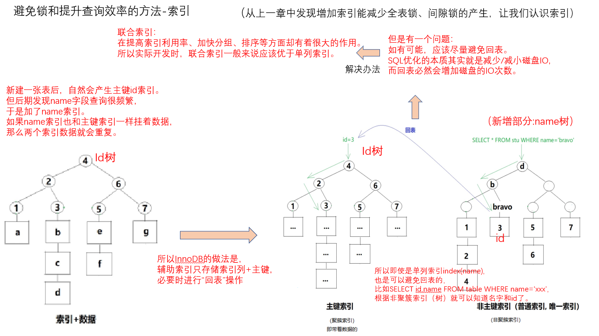

联合索引：

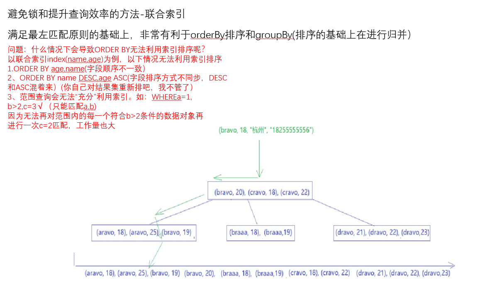

 

### 5、重点考点：数据库优化(不仅仅只有索引)

(一般问题：你一般是怎么优化数据库的)


链接：https://zhuanlan.zhihu.com/p/92913078

综合就是(按顺序来讲)：

1、**通过索引来优化**  (这是最简单的，也是最常用的，但是这远远不够，还要答出**索引失效的场景**，这也是优化的一种手段！)

2、**增加中间表/冗余字段：减少左右连接的耗时** (**这是很多人答不上的**)


3、从硬件去想：

（1）多核心和频率高的cpu，多核心可以执行多个线程，但是要注意**添加数据库连接池的连接数**(**这也是很多人想不到的得分点**)

（2）数据库内存(**很多人想不到的**)：配置大内存，提高内存，即可**提高缓存区容量，因此能减少磁盘I/O时间，从而提高响应速度**


4、分库分表：（绝大多数人想不到）

优化数据库：**因为数据库负载过高对性能会有影响，所以此时你必须得对系统做分库分表 + 读写分离，**也就是把一个库拆分为多个库，部署在多个数据库服务上，这时作为主库承载写入请求。然后每个主库都挂载至少一个从库，由从库来承载读请求。


5、**开启框架的缓存：如mybatis里面有个二级缓存，可以根据namespace作为缓存，降低数据库的压力**，可以在mybatis的xml页面用标签cache开启。

综上，都是数据库优化的点或者sql优化的点。

 

 

## 5、事务

在实际业务中，往往会查询多个表，不得不了解事务来避免多个表同时进行会导致的问题，引出事务，避免在业务中出现不正确的读数据和死锁影响效率。

 

1、事务四大特性

想想两个Navicat的查询界面就行了，当成是两个事务


***

 

2、没有事务可能产生的问题、事务的隔离级别、隔离级别导致的锁问题

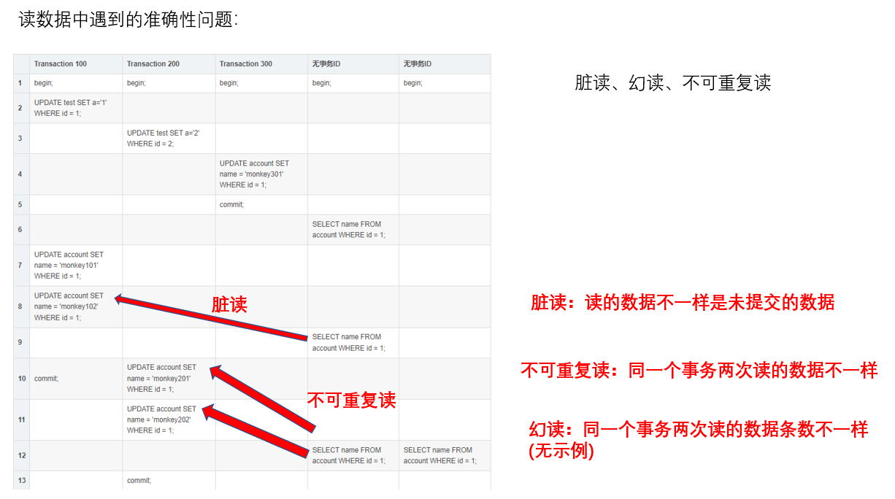

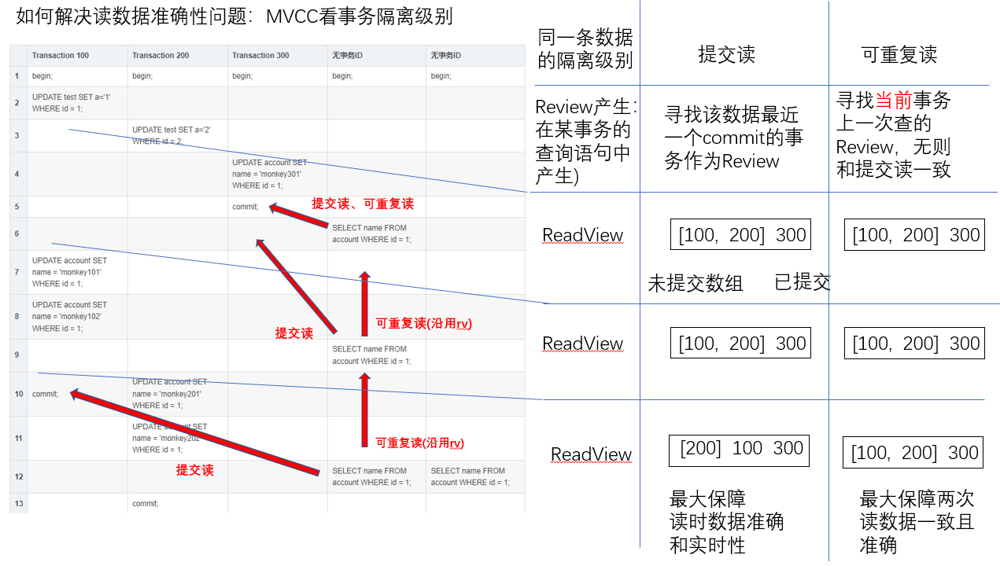

（上面挺好理解的，好好看看）

提交读：解决了脏读，但是不可重复读和幻读没解决。

可重复读：解决了脏读、不可重复读，但是幻读没解决。

串行化：全部都解决了（因为事务会逐个执行）

 

这里需要注意的是：**Mysql默认采用的REPEATABLE_READ(可重读）隔离级别，Oracle默认采用的READ-COMMITTED(读取提交内容）**

因为隔离级别越低，事务请求的锁越少，所以大部分数据库系统的隔离级别都是READ-COMMITTED(读取提交内容），

**但是你要知道的是InnoDB存储引擎默认使用REPEATABLE-READ(可重读）并不会有任何性能损失**。

InnoDB存储引擎在分布式事务的情况下一般会用到SERIALIZABLE(可串行化）隔离级别。

***

3、隔离级别导致的锁问题

 

a、共享锁：对于读加锁(这里的读不是读数据库，是读readview的更新度)

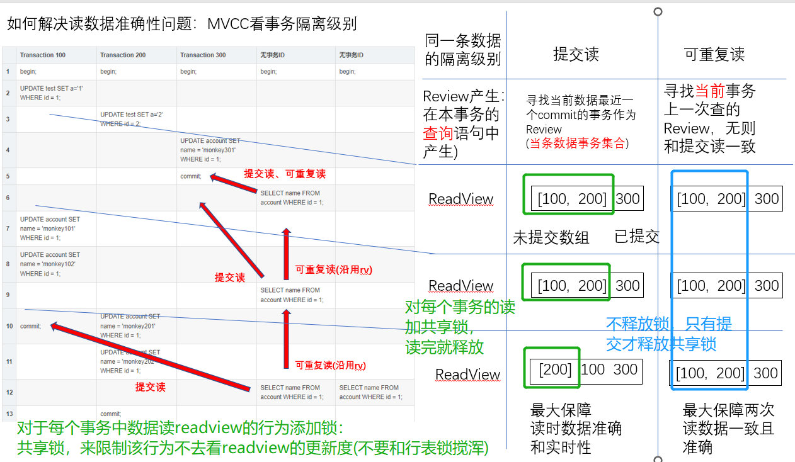

 

b、行锁/表锁/间隙锁：对于增删改的行为，对数据加锁(这才是我们平时理解的锁/死锁中的锁，不要与上面共享锁搅浑！)

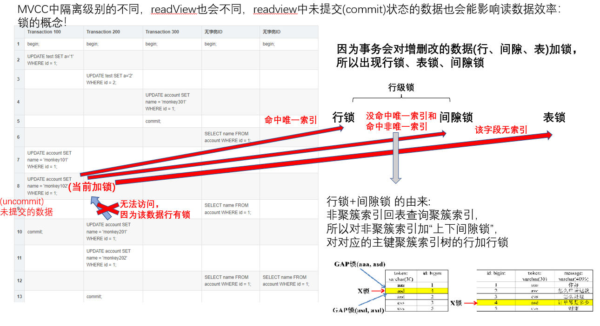

（唯一索引并不是聚簇索引！而是辅助索引）

 

但是行锁和间隙锁可能导致死锁！(假设双方都进行对某条数据更新然后去查对方更新的那条数据)

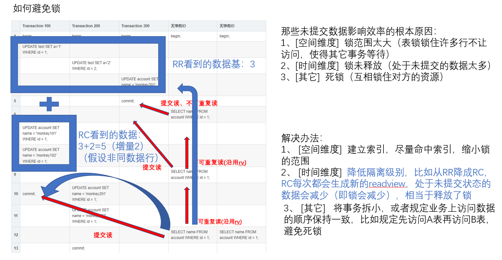

（规定访问表顺序可以防止死锁的原因是不会造成AB、BA这样的引起死锁情况）

 

## 6、不常见的数据库操作

 

1、drop、delete与truncate的区别

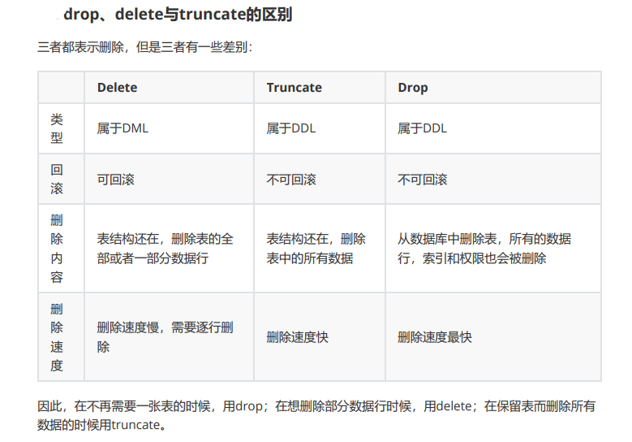

 (drop属于DDL的Alter语句中的，DDL主要是对于表来说的，所以是删除表；

delete是DML的语句，主要是对数据增删改的。

truncate也是属于DDL的语句，是想保留表但是删除数据的，属于drop和delete的综合体。

)


2、UNION与UNIONALL的区别？
（1）如果使用UNIONALL,不会合并重复的记录行
（2）效率UNION高于UNIONALL，合并重复的记录行

 

3、any_value函数：

ONLY_FULL_GROUP_BY 引发的，你既然GROUP BY 或者ORDER BY了，就需要保证你SELECT 的列都在GROUP BY 和 ORDER BY 中，而一般情况下我们只是GROUP BY 和 ORDER BY 一个，两个或者三个左右的字段，而不是全部。

通过ANY_VALUE()函数忽略没有参与分组的列：没有参与分组的字段，套一个ANY_VALUE() 即可，就不会报错误

 

4、id相同时插入变更新：on duplicate key update

插入时：主键索引或唯一索引一致时则更新部分字段，不一致则新增全部字段(不写的字段为null)

```
insert into dr_notification(notification_id,response_date,clearing_price,operate_person) 
values("0983fc7dc61449698ab928bbfbcb3e4a","2022-10-03",19,'admin_guiz2')
on duplicate key update
operate_person = values(operate_person),
clearing_price = values(clearing_price)
（这两个是notification_id一样时更新的2个字段）
```

 

## 7、数据库运维

 

**1、MySQL数据库cpu飘升到500%的话他怎么处理？**
当cpu飘升到500%时，先用操作系统命令**top命令**观察是不是mysqld占用导致的，如果不是，找出占用高的进程，并进行相关处理。
**如果是mysqld造成的，show processlist,看看里面跑的session情况，是不是有消耗资源的sql在运行。找出消耗高的sql,看看执行计划是否准确，index是否缺失，或者实在是数据量太大造成。****(重点！！！)**
一般来说，肯定要kill掉这些线程（同时观察cpu使用率是否下降）,等进行相应的调整（比如说加索引、改sql、改内存参数）之后，再重新跑这些SQL。也有可能是每个sql消耗资源并不多，但是突然之间，有大量的session连进来导致cpu飘升，这种情况就需要跟应用一起来分析为何连接数会激增，再做出相应的调整，比如说限制连接数等

 

**2、大表怎么优化？某个表有近千万数据，CRUD比较慢，如何优化？分库分表了是怎么做的？分表分库了有什么问题？有用到中间件么？他们的原理知道么？**

当MySQL单表记录数过大时，数据库的CRUD性能会明显下降，一些常见的优化措施如下：
1.限定数据的范围：务必禁止不带任何限制数据范围条件的查询语句。比如：我们当用户在查询订单历史的时候，我们可以控制在一个月的范围内。
2.读/写分离：经典的数据库拆分方案，主库负责写，从库负责读；
3.缓存：使用MySQL的缓存，另外对重量级、更新少的数据可以考虑使用应用级别的缓存；

**4、通过分库分表的方式进行优化。**

**分表又主要有垂直分表和水平分表/分库(无外乎是在别的表或别的库，就一起讲)：**

垂直分表：将字段分开，但是这样会破坏原来的表结构，不建议这样

水平分表/分库：一般使用水平分表，把数据分散在不同的表/数据库中，避免单表太大

但是遇到的问题：

1、事务(分布式事务seata来实现)、跨库join、跨表unio、**id问题（用分布式自增id(雪花算法)，uuid杂乱且占空间）**

 

 

## 8、如何统计行数？count(*)？

在Mysql中，count(*)的作用是统计表中记录的总行数。

在innodb使用count(*)时，需要从存储引擎中一行行的读出数据，然后累加起来，所以执行效率很低。

如果表中数据量小还好，一旦表中数据量很大，innodb存储引擎使用count(*)统计数据时，性能就会很差。

既然说到count(*)，就不能不说一下count家族的其他成员，比如：count(1)、count(id)、count(普通索引列)、count(未加索引列)。

那么它们有什么区别呢？

count(*) ：它会获取所有行的数据，不做任何处理，行数加1。
count(1)：它会获取所有行的数据，每行固定值1，也是行数加1。
count(id)：id代表主键，它需要从所有行的数据中解析出id字段，**其中id肯定都不为NULL，行数加1**。
count(普通索引列)：它需要从所有行的数据中解析出普通索引列，**然后判断是否为NULL，如果不是NULL，则行数+1(这里需要注意，是不为null才加一！)。**
count(未加索引列)：它会全表扫描获取所有数据，解析中未加索引列，**然后判断是否为NULL，如果不是NULL，则行数+1(这里需要注意，是不为null才加一！)。**
由此，最后count的性能从高到低是：

count(*) ≈ count(1) > count(id) > count(普通索引列) > count(未加索引列)

所以，其实count(*)是最快的。

意不意外，惊不惊喜？

千万别跟select * 搞混了。

 

 

## 9、count(*)优化？遇到mysql数据库查询瓶颈怎么办？或者一次性查询十亿条数据？

ClickHouse是基于列存储的数据库，不支持事务，查询性能非常高，号称查询十几亿的数据，能够秒级返回。

为了避免对业务代码的嵌入性，可以使用Canal监听Mysql的binlog日志。当product表有数据新增时，需要同时查询出单位、品牌和分类的数据，生成一个新的结果集，**保存到ClickHouse**当中。

查询数据时，从ClickHouse当中查询，这样使用count(*)的查询效率能够提升N倍。

需要特别提醒一下：使用ClickHouse时，新增数据不要太频繁，尽量批量插入数据。

 

原因：

mysql采用行式存储时，数据在磁盘上的组织结构为：


好处是想查某个人所有的属性时，可以通过一次磁盘查找加顺序读取就可以。但是当想查所有人的年龄时，需要不停的查找，或者全表扫描才行，遍历的很多数据都是不需要的。

 

ClickHouse:


 

 

适用场景：

绝大多数是读请求；事务不是必须的；对于读取，从数据库中提取相当多的行，但只提取列的一小部分；

在线查询意味着在没有对数据做任何预处理的情况下以极低的延迟处理查询并将结果加载到用户的页面中；

 

# 二、Redis

redis理论上的东西比较少：

1-1、redis快的原理(内存/数据结构简单/单线程/多路复用io)

1-2、持久化(RDB恢复快但可能丢失和AOF恢复慢但不丢失)、集群模式(hash槽)、过期策略（LRU回收算法）

1-3、缓存-数据库一致性

1-4、事务（不回滚）

 

主要还是实操：

2-1、使用redis数据结构(五种：string/list/set(无序)/hash/zset(有序))

2-2、如何使用(boundXXOps/OpsForXX？容易混淆/如何设计key/存什么数据结构/取出数据后json怎么使用)

2-3、redis注意点和分布式锁的设计(过期时间/缓存击穿、穿透、雪崩/锁续期/看门狗机制)

2-4、布隆过滤器的使用和注意点(要先注册否则会报错)

 

 

## 1、Redis理论

 

### 1-1 redis快的原理(不解释)、数据结构

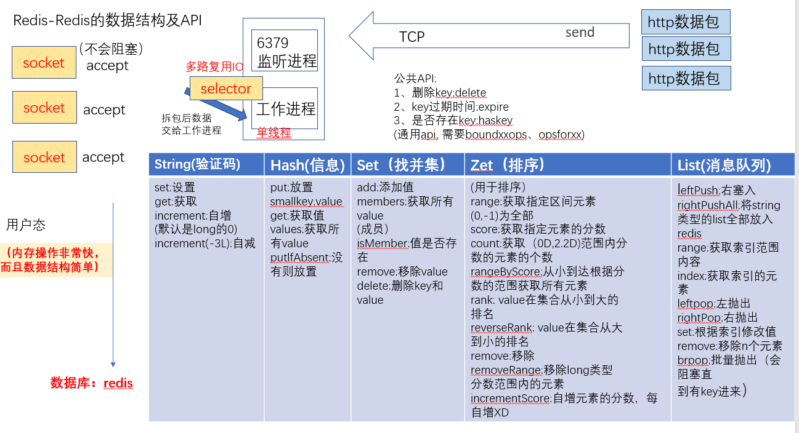

### 1-2 持久化、集群模式、过期策略(下图要好好看看)

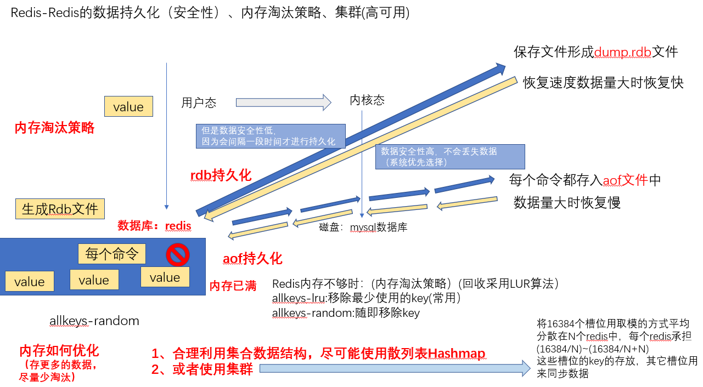

 （槽位16384个，记住的方法就是和端口6379差不多，差不多16380个就可以了）


### 1-3、缓存-数据库一致性(延迟双删)

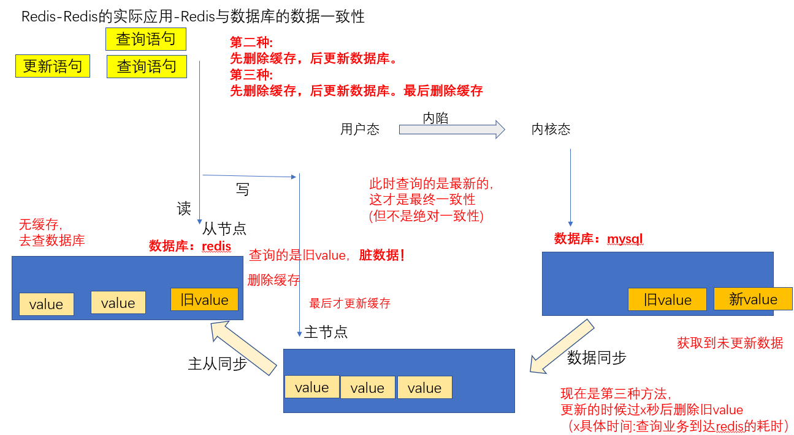

1. 服务节点删除 redis 主库数据。

2. 服务节点修改 mysql 主库数据。

3. 服务节点使得当前业务处理 `等待一段时间`，等 redis 和 mysql 主从节点数据同步成功。

   （这个节点可能会来一个删除增加缓存在redis）

4. 再次把服务节点从 redis 主库删除数据。(再次删除redis，此时就是全新的redis缓存饿了)

5. 当前或其它服务节点读取 redis 从库数据，发现 redis 从库没有数据，从 mysql 从库读取数据，并写入 redis 主库。


1-4、事务（不回滚）  不解释

 

 

## 2、实操

 

 

 

 

### 2-2、如何使用

(boundXXOps/OpsForXX？容易混淆/如何设计key/存什么数据结构/取出数据后json怎么使用)

 

实现代码：

1、首先为了不仅仅是使用String-String这种数据结构的redis存储的顺利进行，需要设置redis序列化器让存储bean或者数据集合更顺利。

```
@Configuration
public class RedisTemplateConfig {

    @Bean
    public RedisTemplate<String, Object> redisTemplate(RedisConnectionFactory connectionFactory) {
        RedisTemplate<String, Object> redisTemplate = new RedisTemplate<>();
        redisTemplate.setConnectionFactory(connectionFactory);
        //这种序列化方式存在redis是乱码，若想可以看到，需要用json序列化
        redisTemplate.setKeySerializer(RedisSerializer.string());
        //redisTemplate.setValueSerializer(RedisSerializer.json());
        return redisTemplate;
    }
}
```

2、使用：redisTemplate.opsForValue();

```
    @GetMapping("/recommend")
    public BaseResponse<Page<User>> recommendUsers(long pageSize, long pageNum, HttpServletRequest request) {
        User loginUser = userService.getLoginUser(request);
        String redisKey = String.format("niceplace:user:recommend:%s", loginUser.getId());
        //直接使用redisTemplate.opsForValue()生成ValueOperations来操作
        ValueOperations<String, Object> valueOperations = redisTemplate.opsForValue();
        // 如果有缓存，直接读缓存(取出来的值强转，因为已经加了redis序列化器)
        Page<User> userPage = (Page<User>) valueOperations.get(redisKey);
        if (userPage != null) {
            return ResultUtils.success(userPage);
        }
        // 无缓存，查数据库
        QueryWrapper<User> queryWrapper = new QueryWrapper<>();
        userPage = userService.page(new Page<>(pageNum, pageSize), queryWrapper);
        // 写缓存
        try {
            //直接设置就行，无需用json转，因为已经设置了序列化
            valueOperations.set(redisKey, userPage, 300000, TimeUnit.MILLISECONDS);
        } catch (Exception e) {
            log.error("redis set key error", e);
        }
        return ResultUtils.success(userPage);
    }
```

 

### 2-3、redis注意事项和分布式锁的设计

(过期时间/锁续期/看门狗机制/线程释放锁机制，缓存击穿、穿透、雪崩)

 

1、redis注意事项：（也是任何分布式锁都要考虑的问题）

```
1、一定记得释放锁！(死锁)
2、一定要给锁加过期时间！(死锁/占用内存空间)
3、一定不要让锁在业务没完成时提前过期或者被释放！(rediskey一致的业务释放掉本业务的锁）

解决第3点：
1、业务没完成时提前过期：watchDog看门狗进行锁续期，看门狗每10秒检查一次锁是否被(finally)删除，
如果没有删除,则将锁续期到30秒，防止锁提前过期导致业务没执行完相同key的业务又进来)
2、isHeldByCurrentThread保证了当前线程的锁不会被别的线程释放，就算当前线程挂了，
还是会释放本线程的锁，不需要别的线程来释放（如果直接关机了）
```

（**拒绝自己写分布式锁**，因为普通redis实现分布式锁需要用到lua脚本，然后可以用redission轻松实现分布式锁）

 

2、分布式锁的实现、看门狗机制、isHeldByCurrentThread线程释放锁机制

代码：

```
@Scheduled(cron = "0 31 0 * * *")
    public void doCacheRecommendUser() {
        RLock lock = redissonClient.getLock("niceplace:precachejob:docache:lock");
        try {
            // 只有一个线程能获取到锁
            // (等待时间一定是0，-1表面看是永不过期，但其实是看门狗机制，如果程序没执行完，则会为这个锁添加30秒)
            //当我们需要用到续锁功能时，一要记住不要设置锁的过期时间，可以设置成-1.一旦设了时间，
            //RedissonLock就会认为你需要自己控制锁时间，而放弃执行续锁逻辑。
            //当我们很难判断业务逻辑的执行时间时，不妨开启续锁。
            if (lock.tryLock(0, -1, TimeUnit.MILLISECONDS)) {
                System.out.println("getLock: " + Thread.currentThread().getId());
                for (Long userId : mainUserList) {
                    QueryWrapper<User> queryWrapper = new QueryWrapper<>();
                    Page<User> userPage = userService.page(new Page<>(1, 20), queryWrapper);
                    String redisKey = String.format("niceplace:user:recommend:%s", userId);
                    ValueOperations<String, Object> valueOperations = redisTemplate.opsForValue();
                    // 写缓存
                    try {
                        valueOperations.set(redisKey, userPage, 30000, TimeUnit.MILLISECONDS);
                        log.info("定时任务-分布式锁-缓存用户信息");
                    } catch (Exception e) {
                        log.error("redis set key error", e);
                    }
                }
            }
        } catch (InterruptedException e) {
            log.error("doCacheRecommendUser error", e);
        } finally {
            // 无论成功还是抛异常，只能释放自己的锁(原子性，代替了lua脚本)，再一次保证了不会释放别人的锁
            if (lock.isHeldByCurrentThread()) {
                System.out.println("unLock: " + Thread.currentThread().getId());
                lock.unlock();
            }
        }
    }
```

 

3、缓存穿透(数据库中没有就是穿透)、击穿、雪崩

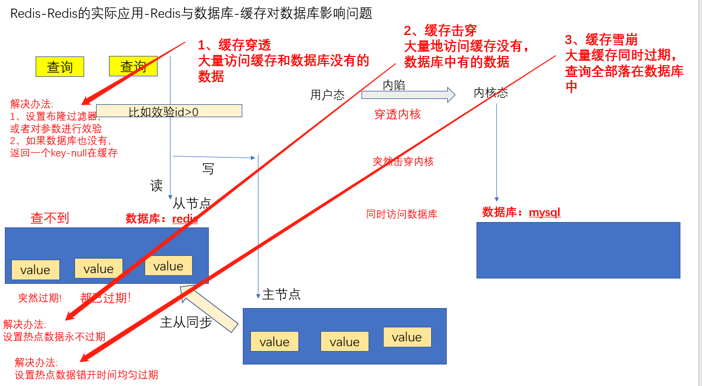

 

 击穿:（只是打穿防弹衣，里面还没事）：设置热点数据永不过期(加防弹衣)

穿透：（人都打穿透了）：设置布隆过滤器防止一些不可能的值(防弹衣)、或者数据库没有就返回一个key-null在缓存

雪崩：错开过期(多层防弹衣不要同时换啊！)


### 2-4、布隆过滤器的使用和注意点

(要先注册否则会报错)

代码实现：

1、先注册布隆过滤器，(像视频这种是通过埋点，如果是防止缓存穿透的过滤器，可以在项目启动时进行加载指定需要过滤的)

```
RBloomFilter<Integer> seqIdBloomFilter = redissonClient.getBloomFilter(userRedisMark);
 //预期元素数量和误差率:预期元素数量是指布隆过滤器预期处理的元素数量，误差率是指布隆过滤器误判的概率。
//预计视频数量在1000左右
seqIdBloomFilter.tryInit(1000, 0.01);
seqIdBloomFilter.add(videoInfo.getId());
```

2、过滤

```
long userId = currentUser.getId();
String userRedisMark = RedisCode.VIDEO_MARK.getCode() + ":" + RedisCode.ID_MARK.getCode() + ":" + userId;
//用户id对应的布隆过滤器
RBloomFilter<Object> bloomFilter = redissonClient.getBloomFilter(userRedisMark);
if (bloomFilter != null) {
    videoInfoFromMysql.forEach(res -> {
        //布隆过滤器防重推荐视频
        if (bloomFilter.contains(res.getId())) {
            //将视频id设置为-1(不可能的值,用于过滤)
            res.setId(-1);
        }
    });
}
```