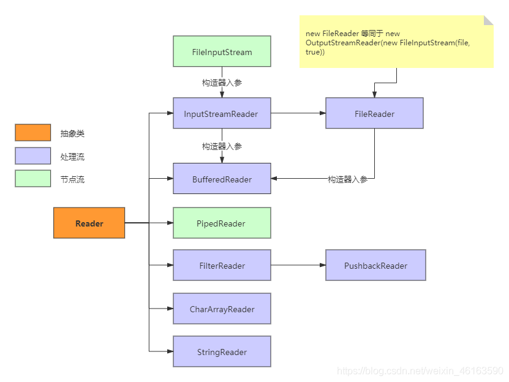

 

# 一、Socket

 

 

## 1、InetAddress 地址

```
//根据域名、用户名(一般是域名)来获取该域名(也叫作用户)的ip和名字信息
InetAddress address = InetAddress.getByName("www.baidu.com");
String name = address.getHostName();
String ip = address.getHostAddress();

```

## 2、IntetSocketAddress 网络套接字(根据地址)

```
InetSocketAddress socketAddress = new InetSocketAddress("localhost",9000);
String name =socketAddress.getHostName();	// 获取主机名
String ip =socketAddress.getAddress();		// 获取地址IP
String port =socketAddress.getPort();		// 获取端口号
————————————————
版权声明：本文为CSDN博主「imByte」的原创文章，遵循CC 4.0 BY-SA版权协议，转载请附上原文出处链接及本声明。
原文链接：https://blog.csdn.net/qq_46331050/article/details/117706050
```

## 3、URL

（获取别人的资源）

统一资源定位符，指向万维网上的“资源”的指针，用于区分、定位资源。一个标准的URL必须包括：protocol（方案或协议）、host（主机）、port（端口）、path（路径）、parameter（ 查询参数）、anchor（锚点）。

在www上，每一信息资源都有统一且唯一的地址。如：http://www.google.com:80/index.html，分四部分组成：协议、存放资源的主机域名、端口号、资源文件名

```
URL url = new URL("http://www.baidu.com:80/index.html?uname=dream&age=18#a");
// 获取四个值：协议、域名、端口、请求资源
System.out.println("协议：" + url.getProtocol());
System.out.println("域名|IP：" + url.getHost());
System.out.println("端口：" + url.getHost());
System.out.println("请求资源1：" + url.getPath());
System.out.println("请求资源2：" + url.getFile());
// 参数
System.out.println("参数：" + url.getQuery());
// 锚点
System.out.println("锚点：" + url.getRef())

协议：http
域名|IP：www.baidu.com
端口：www.baidu.com
请求资源1：/index.html
请求资源2：/index.html?uname=dream&age=18
参数：uname=dream&age=18
锚点：a
```

## 4、数据报文Datagram套接字Socket

 

### （1）学前须知：

（1）DatagramSocket：用于**发送或接收**数据报文的套接字

```
DatagramSocket client = new DatagramSocket(8888);
```

（2）DatagramPacket：数据包

```
void send(DatagramPacket p)	从此套接字发送数据报包
void receive(DatagramPacket p)	从此套接字接收数据报包（阻塞式的接收）
```

（3）byte是一个**字节**的数据结构，int是多个字节的数据结构。相当于“我”是组成【字】的数据结构，”厚德载物“是组成【成语】的数据结构。

byte是计算机存储的最小单位，也是IO流所说的“字节流”中的每一个单位。流就相当于相当于“天长地久有时尽”这一串，而“天”则是流中的字节，这是传输的最小单位，就算是int（成语），也要化成byte（字）的形式来传输


字符流就是2的字节组成的，一样的道理。（字符流是中国人字节为了传输方便发明的，就像是一个汉化工具包）

使用了字符流，就不用再转成字节流再传输了，直接用和字节流同等级的BufferedReader 就可以读取，不用再用BufferedInputStream读取字节，然后再utf-8转成字符再显示出现。

 

（4）了解来源：

每个计算机的端口都是待使用状态的，如果去使用它呢？网络编程

用了网络编程就可以编写对该端口的监控和数据结构，像mysql、redis都是同样的道理！

#### （5）io操作

伴随网络的常常是io，因为网络编程的目的是为了将本地资源（聊天室的资源就是系统键盘输入）或者别的资源传输/存入电脑，需要将资源化成和网络一样的字节进行传输。

常用的：

BufferedInputStream输入字节流

BufferedReader 读取字符流

// 接收数据（InputStreamReader是对字节流的字符流封装）
BufferedReader br = new BufferedReader(new InputStreamReader(s.getInputStream()));

 

常用的流构造器封装：缓冲区Buffered字节流（普通字节流 Input（普通字符流InputStream））

 


 

（6）常用的操作：键盘输入

```
        // 创建接收端的Socket对象(DatagramSocket)
        DatagramSocket ds = new DatagramSocket();
        
        // 自己封装键盘录入数据
        BufferedReader br = new BufferedReader(new InputStreamReader(System.in));
        String line;
        while ((line=br.readLine()) != null) {
            if ("886".equals(line)) {
                break;
            }

            // 创建数据，把数据打包
            byte[] bys = line.getBytes();
            DatagramPacket dp = new DatagramPacket(bys, bys.length, InetAddress.getByName("127.0.0.1"), 12345);

            // 调用DatagramSocket对象的方法来发送数据
            ds.send(dp);
        }
```

 

 

 

### （2）实践

这里强调一下，UDP编程属于底层开发，是网络编程，而不是网页编程，网页编程中这种Socket已经被实现。

 

#### 一、UDP发送数据的步骤

1、创建发送端的Socket对象(DatagramSocket)。如果没有指定端口，发送到本地主机所有可用端口（不常用），这里可以采用指定端口构造方法
DatagramSocket()，DatagramSocket(int port)|
2、创建数据，并把数据封装成DatagramPacket包裹，数据一定要转成字节数组，同时需要**指定这个包的目标IP地址和端口**
DatagramPacket(byte[] buf, int length, InetAddress address, int port)
3、调用DatagraSocket对象的方法发送数据包裹
void send(DatagramPacket p)
4、关闭发送端，释放资源
void close()


```
public class UDPClient {
    public static void main(String[] args) throws Exception {
        System.out.println("发送方启动中...");
        
        // 1、使用DatagramSocket指定端口，创建发送端
        DatagramSocket client = new DatagramSocket(8888);
        
        // 2、准备数据，一定要转成字节数组
        String data = "Java YYDS";
        
        // 3、封装成DatagramPacket包裹，需要指定目的地(IP+port)
        byte[] datas = data.getBytes();
        DatagramPacket packet = new DatagramPacket(datas, 0, datas.length, new InetSocketAddress("localhost", 9999));
        
        // 4、发送包裹 void send(DatagramPacket p)
        client.send(packet);
        
        // 5、释放资源
        client.close();
    }
}

```

 

 

二、UDP接收数据

1、创建接收端的Socket对象(DatagramSocket)，指定端口
DatagramSocket(int port)
2、准备容器，封装成DatagramPacket包裹，用于接收数据
DatagramPacket(byte[] buf, int length)
3、调用DatagramSocket对象的方法，阻塞式接收包裹
void receive(DatagramPacket p)
4、解析数据包，并把数据在控制台显示
byte[] getData() 和 int getLength()
5、关闭接收端，释放资源
void close()


```
public class ReceiveDemo {
    public static void main(String[] args) throws IOException {
        // 1、创建接收端的Socket对象(DatagramSocket)
        DatagramSocket ds = new DatagramSocket(10086);

        // 2、创建一个数据包，用于接收数据
        byte[] bys = new byte[1024];
        DatagramPacket dp = new DatagramPacket(bys, bys.length);

        // 3、调用DatagramSocket对象的方法接收数据
        ds.receive(dp);
        
        // 4、解析数据包，并把数据在控制台显示
        System.out.println("数据是：" + new String(dp.getData(), 0, dp.getLength()));

        // 5、关闭接收端，释放资源
        ds.close();
    }
}

```

 

#### 二、TCP发送数据的步骤

Java为客户端提供了Socket类，为服务器端提供了ServerSocket类

（UDP是datagramSocket）

 

一、tcp发送数据的步骤

1、创建客户端的Socket对象(Socket)
Socket(String host, int port)
2、获取输出流，写数据
OutputStream getOutputStream()
3、释放资源

```
public class ClientDemo {
    public static void main(String[] args) throws IOException {
        // 创建客户端的Socket对象(Socket)
        // Socket(InetAddress address, int port): 创建流套接字并将其连接到指定IP地址的指定端口号
//        Socket s = new Socket(InetAddress.getByName("127.0.0.1"), 10005);
        // Socket(String host, int port): 创建流套接字并将其连接到指定主机上的指定端口号。
        Socket s = new Socket("127.0.0.1", 10005);

        // 获取输出流，写数据
        // OutputStream getOutputStream(): 返回此套接字的输出流。
        OutputStream os = s.getOutputStream();
        os.write("Java YYDS!".getBytes());
        
        // 释放资源
        s.close();
    }
}

```

 

二、tcp接收数据的步骤

```
1、创建服务器端的Socket对象(ServerSocket)
ServerSocket(int port)
2、获取输入流InputStream，读数据，并把数据显示在控制台
Socket accept()
InputStream is = socket.getInputStream();
3、释放资源
```

```
public class ServerDemo {
    public static void main(String[] args) throws IOException {
        // 创建服务器端的Socket对象(ServerSocket)
        ServerSocket ss = new ServerSocket(10005);

        // Socket accept(): 侦听要连接到此套接字并接受它
        Socket s = ss.accept();

        // 获取输入流，读数据，并把数据显示在控制台
        InputStream is = s.getInputStream();
        byte[] bys = new byte[1024];
        int len = is.read(bys);
        String data = new String(bys, 0, len);
        System.out.println("数据是：" + data);

        // 释放资源
        ss.close();
    }
}

```

 

 

例子：上传文件

 

```
public class ClientDemo {
    public static void main(String[] args) throws IOException {
        Socket s = new Socket("127.0.0.1", 10005);

        // 封装文本文件的数据
        BufferedReader br = new BufferedReader(new FileReader("client.txt"));
        // 封装输出流写数据（OutputStreamWriter是对字节流的字符流封装）
        BufferedWriter bw = new BufferedWriter(new OutputStreamWriter(s.getOutputStream()));

        String line;
        while ((line=br.readLine()) != null) {
            bw.write(line);
            bw.newLine();
            bw.flush();
        }

        br.close();
        s.close();
    }
}

```

```
public class ServerDemo {
    public static void main(String[] args) throws IOException {
        ServerSocket ss = new ServerSocket(10005);

        // 监听客户端连接，返回一个对应的Socket对象
        Socket s = ss.accept();

        // 接收数据（InputStreamReader是对字节流的字符流封装）
        BufferedReader br = new BufferedReader(new InputStreamReader(s.getInputStream()));
        BufferedWriter bw = new BufferedWriter(new FileWriter("server.txt"));

        String line;
        while ((line=br.readLine()) != null) {
            bw.write(line);
            bw.newLine();
            bw.flush();
        }

        bw.close();
        ss.close();
    }
}

```

问题：

出现问题： 程序一直等待

原因：读数据的方法是阻塞式的

 

```
public class ClientDemo {
    public static void main(String[] args) throws IOException {
        Socket s = new Socket("127.0.0.1", 10005);

        // 封装文本文件的数据
        BufferedReader br = new BufferedReader(new FileReader("client.txt"));
        // 封装输出流写数据
        BufferedWriter bw = new BufferedWriter(new OutputStreamWriter(s.getOutputStream()));

        String line;
        while ((line=br.readLine()) != null) {
            bw.write(line);
            bw.newLine();
            bw.flush();
        }

        // 自定义结束标记
        bw.write("886");
        bw.newLine();
        bw.flush();

        // public void shutdownOutput():禁用此套接字的输出流
        s.shutdownOutput();

        // 接受反馈
        BufferedReader brClient = new BufferedReader(new InputStreamReader(s.getInputStream()));
        String data = brClient.readLine();
        System.out.println("服务器的反馈：" + data);

        br.close();
        s.close();
    }
}

```

 

```
public class ServerDemo {
    public static void main(String[] args) throws IOException {
        ServerSocket ss = new ServerSocket(10005);

        // 监听客户端连接，返回一个对应的Socket对象
        Socket s = ss.accept();

        // 接收数据
        BufferedReader br = new BufferedReader(new InputStreamReader(s.getInputStream()));
        BufferedWriter bw = new BufferedWriter(new FileWriter("server.txt"));

        String line;
        while ((line=br.readLine()) != null) {
            if ("886".equals(line)) {
                break;
            }
            bw.write(line);
            bw.newLine();
            bw.flush();
        }

        // 给出反馈
        BufferedWriter bwServer = new BufferedWriter(new OutputStreamWriter(s.getOutputStream()));
        bwServer.write("文件上传成功");
        bwServer.newLine();
        bw.flush();

        bw.close();
        ss.close();
    }
}

```

 

 

# 二、IO流

参考：https://blog.csdn.net/weixin_46163590/article/details/113698819?ops_request_misc=%257B%2522request%255Fid%2522%253A%2522168015693816800186586561%2522%252C%2522scm%2522%253A%252220140713.130102334..%2522%257D&request_id=168015693816800186586561&biz_id=0&utm_medium=distribute.pc_search_result.none-task-blog-2~all~baidu_landing_v2~default-3-113698819-null-null.142^v77^control_1,201^v4^add_ask,239^v2^insert_chatgpt&utm_term=java%E7%9A%84io%E7%B1%BB&spm=1018.2226.3001.4187

 

先看公司的例子：

```
    /**
     * 导出模板
     **/
    @Override
    public FileIoInfo downloadExcelTemplate(MsDemandPowerExtractReq req) throws Exception {
        // 模板导出
        String templatePath = "/template/模板.xlsx";
        InputStream templateInputStream = this.getClass().getResourceAsStream(templatePath);
        Workbook workbook;

        try {
            workbook = new XSSFWorkbook(templateInputStream);
        } catch (Exception e) {
            log.error(e.getMessage(), e);
            throw new RuntimeException("模板错误，请联系管理员");
        }


        try {
            //节点流输出
            ByteArrayOutputStream baos = new ByteArrayOutputStream();
            //节点流输出
            String fileName = "模板.xlsx";
            //写入输出流
            workbook.write(baos);
            byte[] bytes = baos.toByteArray();
            FileIoInfo fileIoInfo = new FileIoInfo();
            fileIoInfo.setFileName(fileName);
            fileIoInfo.setBytes(bytes);
            fileIoInfo.setType("application/ms-excel");
            fileIoInfo.setSize(bytes.length);
            return fileIoInfo;
        } catch (Exception e) {
            log.error(e.getMessage(), e);
            throw new RuntimeException("模板错误，请联系管理员");
        } finally {
            workbook.close();
        }

    }
```

 

 

## 1、字节流和字符流、节点流和处理流

字节流和字符流的其他区别：
1、字节流一般用来处理图像、视频、音频、PPT、Word等类型的文件。字符流一般用于处理纯文本类型的文件，如TXT文件等，但不能处理图像视频等非文本文件。用一句话说就是：字节流可以处理一切文件，而字符流只能处理纯文本文件。


 

2、字节流本身没有缓冲区，缓冲字节流相对于字节流，效率提升非常高。而字符流本身就带有缓冲区，缓冲字符流相对于字符流效率提升就不是那么大了


 

 

 

***

 


1、节点流：直接操作数据读写的流类，比如FileInputStream(字节流和字符流)

 

2、处理流：对一个已存在的流的链接和封装，通过对数据进行处理为程序提供功能强大、灵活的读写功能，例如BufferedInputStream（缓冲字节流）

处理流是对节点流的封装，最终的数据处理还是由节点流完成的。

在诸多处理流中，有一个非常重要，那就是**缓冲流**。程序与磁盘的交互相对于内存运算是很慢的，容易成为程序的性能瓶颈。减少程序与磁盘的交互，是提升程序效率一种有效手段。缓冲流，就应用这种思路：普通流每次读写一个字节，而缓冲流在内存中设置一个缓存区，缓冲区先存储足够的待操作数据后，再与内存或磁盘进行交互。这样，在总数据量不变的情况下，通过提高每次交互的数据量，减少了交互次数。


 

 

## 2、读懂节点流和处理流(比较容易迷糊的)：


 

 


(图中有错，应该为OutputStreamWriter，而不是OutputStreamReader)

 

注意点：(从图左看右)

1、左下角

```
File file = new File(“D:/test.txt”);

//------------------输出流(输出给别人,写入write)

OutputStream os = new FileOutputStream(file, true);
// 要写入的字符串
String string = “松下问童子，言师采药去。只在此山中，云深不知处。”;
// 写入文件
os.write(string.getBytes());
// 关闭流
os.close();

//--------------------输入流(输入我方,读取read)

//InputStream是以父类来接收，实质上还是FileInputStream
InputStream in = new FileInputStream(file);
// 一次性取多少个字节
byte[] bytes = new byte[1024];
// 用来接收读取的字节数组
StringBuilder sb = new StringBuilder();
// 读取到的字节数组长度，为-1时表示没有数据
int length = 0;
// 循环取数据
while ((length = in.read(bytes)) != -1) {
// 将读取的内容转换成字符串
sb.append(new String(bytes, 0, length));
}
// 关闭流
in.close();


//-----------------------------

// 缓冲字节流，提高了效率
BufferedOutputStream bis = new BufferedOutputStream(new FileOutputStream(file, true));

// 一次性取多少个字节
byte[] bytes = new byte[1024];
// 用来接收读取的字节数组
StringBuilder sb = new StringBuilder();
// 读取到的字节数组长度，为-1时表示没有数据
int length = 0;
// 循环取取单个字节放在bytes字节数组中，若读取时单个字节的长度为0，则返回-1
while ((length = fis.read(bytes)) != -1) {
// 将读取的内容转换成字符串
sb.append(new String(bytes, 0, length));
}
// 关闭流
fis.close();
```

 

2、中间下：字节流转字符流，即编码

```
// OutputStreamWriter可以显示指定字符集，否则使用默认字符集
OutputStreamWriter osw = new OutputStreamWriter(new FileOutputStream(file, true), “UTF-8”);
```

中间上：

```
//编码成字符流
InputStreamReader isr = new InputStreamReader(new FileInputStream(file), “UTF-8”);

// 字符数组：一次读取多少个字符
char[] chars = new char[1024];
// 每次读取的字符数组先append到StringBuilder中
StringBuilder sb = new StringBuilder();
// 读取到的字符数组长度，为-1时表示没有数据
int length;
// 循环取数据取单个字符放在chars字符数组中，若读取时单个字符的长度为0，则返回-1
while ((length = isr.read(chars)) != -1) {
// 将读取的内容转换成字符串
sb.append(chars, 0, length);
}
// 关闭流
isr.close();
```

 

右下角：对以上两个升级

```
new FileWriter等同于new OutputStreamWriter(new FileOutputStream(file, true))

//使用方式：
FileReader fr = new FileReader(file);
// 一次性取多少个字节
char[] chars = new char[1024];
// 用来接收读取的字节数组
StringBuilder sb = new StringBuilder();
// 读取到的字节数组长度，为-1时表示没有数据
int length;
// 循环取读取单个字符放在chars字符数组中，若读取时单个字符的长度为0，则返回-1
while ((length = fr.read(chars)) != -1) {
// 将读取的内容转换成字符串
sb.append(chars, 0, length);
}
// 关闭流
fr.close();
```

Java提供了FileWriter和FileReader简化字符流的读写，new FileWriter等同于new OutputStreamWriter(new FileOutputStream(file, true))，但是其仍然是节点流，可被BufferedReader、BufferedWriter（字符缓冲流）这些处理流包。

这样就不用使用OutputStreamWriter来编码了。

 

右下角：使用缓冲区再升级

```
BufferedReader br = new BufferedReader(new FileReader(file));

//使用方式：

// 用来接收读取的字节数组
StringBuilder sb = new StringBuilder();
// 按行读数据
String line;
// 循环取数据
while ((line = br.readLine()) != null) {
// 将读取的内容转换成字符串
sb.append(line);
}
// 关闭流
br.close();
```

 

 

## 3、详细解释

 

 

### (1)字节流


字节流方法
字节输入流InputStream主要方法：
read() ：从此输入流中读取一个数据字节。
read(byte[] b) ：从此输入流中将最多 b.length 个字节的数据读入一个 byte 数组中。
read(byte[] b, int off, int len) ：从此输入流中将最多 len 个字节的数据读入一个 byte 数组中。
close()：关闭此输入流并释放与该流关联的所有系统资源。
字节输出流OutputStream主要方法：
write(byte[] b) ：将 b.length 个字节从指定 byte 数组写入此文件输出流中。
write(byte[] b, int off, int len) ：将指定 byte 数组中从偏移量 off 开始的 len 个字节写入此文件输出流。
write(int b) ：将指定字节写入此文件输出流。
close() ：关闭此输入流并释放与该流关联的所有系统资源。

 

 

### （2）字符流



 

read()：读取单个字符。
read(char[] cbuf) ：将字符读入数组。
read(char[] cbuf, int off, int len) ：将字符读入数组的某一部分。
read(CharBuffer target) ：试图将字符读入指定的字符缓冲区。
flush() ：刷新该流的缓冲。
close() ：关闭此流，但要先刷新它。

 

字符输出流Writer主要方法：
write(char[] cbuf) ：写入字符数组。
write(char[] cbuf, int off, int len) ：写入字符数组的某一部分。
write(int c) ：写入单个字符。
write(String str) ：写入字符串。
write(String str, int off, int len) ：写入字符串的某一部分。
flush() ：刷新该流的缓冲。
close() ：关闭此流，但要先刷新它。
另外，字符缓冲流还有两个独特的方法：
BufferedWriter类newLine() ：写入一个行分隔符。这个方法会自动适配所在系统的行分隔符。
BufferedReader类readLine() ：读取一个文本行。

 

 

# 三、Netty

 

组件解释
channel 可以理解为数据的通道
msg 理解为流动的数据，最开始输入是 ByteBuf，但经过 pipeline 中的各个 handler 加工，会变成其它类型对象，最后输出又变成 ByteBuf
handler 可以理解为数据的处理工序
工序有多道，合在一起就是 pipeline（传递途径），pipeline 负责发布事件（读、读取完成…）传播给每个 handler， handler 对自己感兴趣的事件进行处理（重写了相应事件处理方法）
pipeline 中有多个 handler，处理时会依次调用其中的 handler
handler 分 Inbound 和 Outbound 两类
Inbound 入站
Outbound 出站


eventLoop 可以理解为处理数据的工人
eventLoop 可以管理多个 channel 的 io 操作，并且一旦 eventLoop 负责了某个 channel，就会将其与channel进行绑定，以后该 channel 中的 io 操作都由该 eventLoop 负责
eventLoop 既可以执行 io 操作，也可以进行任务处理，每个 eventLoop 有自己的任务队列，队列里可以堆放多个 channel 的待处理任务，任务分为普通任务、定时任务
eventLoop 按照 pipeline 顺序，依次按照 handler 的规划（代码）处理数据，可以为每个 handler 指定不同的 eventLoop

 

Channel
​ Channel是 Java NIO 的一个基本构造。可以看作是传入或传出数据的载体。因此，它可以被打开或关闭，连接或者断开连接。

EventLoop 与 EventLoopGroup
​ EventLoop 定义了Netty的核心抽象，用来处理连接的生命周期中所发生的事件，在内部，将会为每个Channel分配一个EventLoop。

 EventLoopGroup 是一个 EventLoop 池，包含很多的 EventLoop。

 Netty 为每个 Channel 分配了一个 EventLoop，用于处理用户连接请求、对用户请求的处理等所有事件。EventLoop 本身只是一个线程驱动，在其生命周期内只会绑定一个线程，让该线程处理一个 Channel 的所有 IO 事件。

 一个 Channel 一旦与一个 EventLoop 相绑定，那么在 Channel 的整个生命周期内是不能改变的。一个 EventLoop 可以与多个 Channel 绑定。即 Channel 与 EventLoop 的关系是 n:1，而 EventLoop 与线程的关系是 1:1。

ServerBootstrap 与 Bootstrap
​ Bootstarp 和 ServerBootstrap 被称为引导类，指对应用程序进行配置，并使他运行起来的过程。Netty处理引导的方式是使你的应用程序和网络层相隔离。

 Bootstrap 是客户端的引导类，Bootstrap 在调用 bind()（连接UDP）和 connect()（连接TCP）方法时，会新创建一个 Channel，仅创建一个单独的、没有父 Channel 的 Channel 来实现所有的网络交换。

 ServerBootstrap 是服务端的引导类，ServerBootstarp 在调用 bind() 方法时会创建一个 ServerChannel 来接受来自客户端的连接，并且该 ServerChannel 管理了多个子 Channel 用于同客户端之间的通信。

ChannelHandler 与 ChannelPipeline
​ ChannelHandler 是对 Channel 中数据的处理器，这些处理器可以是系统本身定义好的编解码器，也可以是用户自定义的。这些处理器会被统一添加到一个 ChannelPipeline 的对象中，然后按照添加的顺序对 Channel 中的数据进行依次处理。

ChannelFuture
​ Netty 中所有的 I/O 操作都是异步的，即操作不会立即得到返回结果，所以 Netty 中定义了一个 ChannelFuture 对象作为这个异步操作的“代言人”，表示异步操作本身。如果想获取到该异步操作的返回值，可以通过该异步操作对象的addListener() 方法为该异步操作添加监 NIO 网络编程框架 Netty 听器，为其注册回调：当结果出来后马上调用执行。

 Netty 的异步编程模型都是建立在 Future 与回调概念之上的。


 

 

 

## 1、Channel

数据传输流，与channel相关的概念有以下四个，上一张图让你了解netty里面的Channel。


Channel一览

Channel，表示一个连接，可以理解为每一个请求，就是一个Channel。
ChannelHandler，核心处理业务就在这里，用于处理业务请求。
ChannelHandlerContext，用于传输业务数据。
ChannelPipeline，用于保存处理过程需要用到的ChannelHandler和ChannelHandlerContext。

Channel 的常用方法
close() 可以用来关闭Channel
closeFuture() 用来处理 Channel 的关闭
sync 方法作用是同步等待 Channel 关闭
而 addListener 方法是异步等待 Channel 关闭
pipeline() 方法用于添加处理器
write() 方法将数据写入
因为缓冲机制，数据被写入到 Channel 中以后，不会立即被发送
只有当缓冲满了或者调用了flush()方法后，才会将数据通过 Channel 发送出去
writeAndFlush() 方法将数据写入并立即发送（刷出）

 

## 2、ByteBuf

ByteBuf是一个存储字节的容器，最大特点就是使用方便，它既有自己的读索引和写索引，方便你对整段字节缓存进行读写，也支持get/set，方便你对其中每一个字节进行读写，他的数据结构如下图所示：


 

//将客户端传入的消息转换为Netty的ByteBuf类型

```
ByteBuf in = (ByteBuf) msg;
```

 

## 3、简单的例子：

 

引入依赖：

<!-- https://mvnrepository.com/artifact/io.netty/netty-all -->

```
<dependency>
  <groupId>io.netty</groupId>
  <artifactId>netty-all</artifactId>
  <version>4.1.16.Final</version>
</dependency>
```

 

 

### (1)写好服务端代码

假设通道channel收到消息时的处理方法

```
import io.netty.buffer.ByteBuf;
import io.netty.buffer.Unpooled;
import io.netty.channel.ChannelFutureListener;
import io.netty.channel.ChannelHandler.Sharable;
import io.netty.channel.ChannelHandlerContext;
import io.netty.channel.ChannelInboundHandlerAdapter;
import io.netty.util.CharsetUtil;
 
@Sharable
public class EchoServerHandler extends ChannelInboundHandlerAdapter{
    @Override
    public void channelRead(ChannelHandlerContext ctx, Object msg) throws Exception {
        //将客户端传入的消息转换为Netty的ByteBuf类型
        ByteBuf in = (ByteBuf) msg;
 
        // 在控制台打印传入的消息
        System.out.println(
                "Server received: " + in.toString(CharsetUtil.UTF_8)
        );
        //将接收到的消息写给发送者，而不冲刷出站消息
        ctx.write(in);
    }
 
    @Override
    public void channelReadComplete(ChannelHandlerContext ctx) throws Exception {
        // 将未处决消息冲刷到远程节点， 并且关闭该Channel
        ctx.writeAndFlush(Unpooled.EMPTY_BUFFER)
                .addListener(ChannelFutureListener.CLOSE);
    }
 
    /**
     * 异常处理
     * @param ctx
     * @param cause
     * @throws Exception
     */
    @Override
    public void exceptionCaught(ChannelHandlerContext ctx, Throwable cause) throws Exception {
        //打印异常栈跟踪
        cause.printStackTrace();
 
        // 关闭该Channel
        ctx.close();
    }
}
```

 

### (2)将服务端注册在netty服务

```
import io.netty.bootstrap.ServerBootstrap;
import io.netty.channel.ChannelFuture;
import io.netty.channel.ChannelInitializer;
import io.netty.channel.EventLoopGroup;
import io.netty.channel.nio.NioEventLoopGroup;
import io.netty.channel.socket.SocketChannel;
import io.netty.channel.socket.nio.NioServerSocketChannel;
 
import java.net.InetSocketAddress;
 
public class EchoServer {
    private final static int port = 8080;
 
    public static void main(String[] args) {
        start();
    }
 
    private static void start() {
        final EchoServerHandler serverHandler = new EchoServerHandler();
        // 创建EventLoopGroup
        EventLoopGroup bossGroup = new NioEventLoopGroup();
        EventLoopGroup workerGroup = new NioEventLoopGroup();
        // 创建EventLoopGroup
        ServerBootstrap b = new ServerBootstrap();
        b.group(bossGroup, workerGroup)
                //指定所使用的NIO传输Channel
        .channel(NioServerSocketChannel.class)
                //使用指定的端口设置套接字地址
        .localAddress(new InetSocketAddress(port))
                // 添加一个EchoServerHandler到Channle的ChannelPipeline
        .childHandler(new ChannelInitializer<SocketChannel>() {
            @Override
            protected void initChannel(SocketChannel socketChannel) throws Exception {
                //EchoServerHandler被标注为@shareable,所以我们可以总是使用同样的案例
                socketChannel.pipeline().addLast(serverHandler);
            }
        });
 
        try {
            // 异步地绑定服务器;调用sync方法阻塞等待直到绑定完成
            ChannelFuture f = b.bind().sync();
            // 获取Channel的CloseFuture，并且阻塞当前线程直到它完成
            f.channel().closeFuture().sync();
        } catch (InterruptedException e) {
            e.printStackTrace();
        } finally {
            // 优雅的关闭EventLoopGroup，释放所有的资源
            bossGroup.shutdownGracefully();
            workerGroup.shutdownGracefully();
        }
    }
}
```

 

### (3)写好客户端代码

```
import io.netty.buffer.ByteBuf;
import io.netty.buffer.Unpooled;
import io.netty.channel.ChannelHandler.Sharable;
import io.netty.channel.ChannelHandlerContext;
import io.netty.channel.SimpleChannelInboundHandler;
import io.netty.util.CharsetUtil;
 
@Sharable
public class EchoClientHandler extends SimpleChannelInboundHandler<ByteBuf> {
    @Override
    public void channelActive(ChannelHandlerContext ctx) throws Exception {
        //当被通知Channel是活跃的时候，发送一条消息
        ctx.writeAndFlush(Unpooled.copiedBuffer("Netty rocks!", CharsetUtil.UTF_8));
    }
 
    @Override
    protected void channelRead0(ChannelHandlerContext channelHandlerContext, ByteBuf byteBuf) throws Exception {
        System.out.println(
                "Client received: " + byteBuf.toString(CharsetUtil.UTF_8)
        );
    }
 
    @Override
    public void exceptionCaught(ChannelHandlerContext ctx, Throwable cause) throws Exception {
        cause.printStackTrace();
        ctx.close();
    }
}
```

 

### (4)将客户端注册在netty

new EchoClientHandler()注册在netty的bootstrap.handler中，而且将其归属到某一个NioEventLoopGroup中(有点像kafka的topic)

```
import io.netty.bootstrap.Bootstrap;
import io.netty.channel.ChannelFuture;
import io.netty.channel.ChannelInitializer;
import io.netty.channel.EventLoopGroup;
import io.netty.channel.nio.NioEventLoopGroup;
import io.netty.channel.socket.SocketChannel;
import io.netty.channel.socket.nio.NioSocketChannel;
 
import java.net.InetSocketAddress;
 
public class EchoClient {
    private final static String HOST = "localhost";
    private final static int PORT = 8080;
 
    public static void start() {
        EventLoopGroup group = new NioEventLoopGroup();
        Bootstrap bootstrap = new Bootstrap();
        bootstrap.group(group)
                .channel(NioSocketChannel.class)
                .remoteAddress(new InetSocketAddress(HOST, PORT))
                .handler(new ChannelInitializer<SocketChannel>() {
                    @Override
                    protected void initChannel(SocketChannel socketChannel) throws Exception {
                        socketChannel.pipeline().addLast(new EchoClientHandler());
                    }
                });
        try {
            ChannelFuture f = bootstrap.connect().sync();
            f.channel().closeFuture().sync();
        } catch (InterruptedException e) {
            e.printStackTrace();
        }finally {
            group.shutdownGracefully();
        }
    }
 
    public static void main(String[] args) {
        start();
    }
}
```

先后运行EchoServer.java和EchoClient.java.如果控制台分别打印了

Server received: Netty rocks!和Client received: Netty rocks! 那么恭喜你，你已经可以开始netty的开发了。