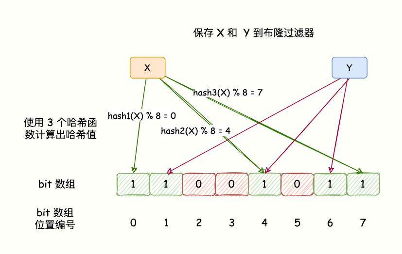
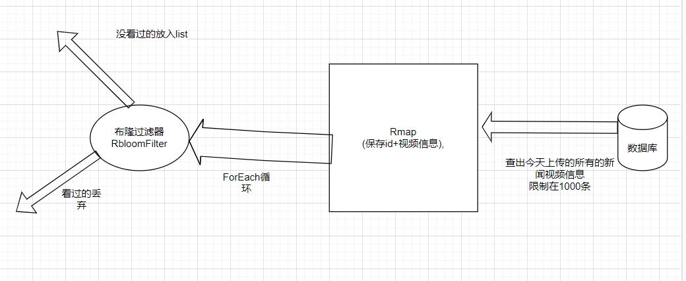

## 一、什么是布隆过滤器？


布隆过滤器 (Bloom Filter)是由 Burton Howard Bloom 于 1970 年提出，它是一种 space efficient 的概率型数据结构，用于判断一个元素是否在集合中。

当布隆过滤器说，某个数据存在时，这个数据可能不存在；当布隆过滤器说，某个数据不存在时，那么这个数据一定不存在。

哈希表也能用于判断元素是否在集合中，但是布隆过滤器只需要哈希表的 1/8 或 1/4 的空间复杂度就能完成同样的问题。

布隆过滤器可以插入元素，但不可以删除已有元素。

其中的元素越多，false positive rate(误报率)越大，但是 false negative (漏报)是不可能的。


## 二、作用？

比如我们使用「码哥跳动」开发的「明日头条」APP 看新闻，如何做到每次推荐给该用户的内容不会重复，过滤已经看过的内容呢？

你会说我们只要记录了每个用户看过的历史记录，每次推荐的时候去查询数据库过滤存在的数据实现去重。

实际上，如果历史记录存储在关系数据库里，去重就需要频繁地对数据库进行 exists 查询，当系统并发量很高时，数据库是很难扛住压力的。

码哥，我可以使用缓存啊，把历史数据存在 Redis 中。

万万不可，这么多的历史记录那要浪费多大的内存空间，所以这个时候我们就能使用布隆过滤器去解决这种去重问题。又快又省内存，互联网开发必备杀招！

当你遇到数据量大，又需要去重的时候就可以考虑布隆过滤器，如下场景：

解决 Redis 缓存穿透问题（面试重点）；

邮件过滤，使用布隆过滤器实现邮件黑名单过滤；

爬虫爬过的网站过滤，爬过的网站不再爬取；

推荐过的新闻不再推荐；


  

## 三、布隆过滤器原理：

hash碰撞，哈希函数会出现碰撞，所以布隆过滤器会存在误判。

（但是能拦截大多数了，只允许放行少部分）



在使用布隆过滤器时，需要设置预期元素数量和误差率。预期元素数量是指布隆过滤器预期处理的元素数量，误差率是指布隆过滤器误判的概率。

误差率越小，布隆过滤器的精度就越高。但同时，布隆过滤器所需的存储空间也会增大。因此，在使用布隆过滤器时，需要根据实际情况合理设置误差率，以达到比较好的平衡。

例如，在爬虫中使用布隆过滤器时，可以设置误差率为0.01，以便尽可能减少误判的概率。在推荐系统中使用布隆过滤器时，可以设置误差率为0.1，以便在保证效率的同时减少存储空间的使用。

  

## 四、redission实现布隆布隆器

### 例子1：Redisson提供了布隆过滤器的实现

可以直接使用，示例代码如下。

```
RBloomFilter seqIdBloomFilter = redisson.getBloomFilter("seqId");
// 初始化预期插入的数据量为10000000和期望误差率为0.01。即123，允许通过122.01-123.01之间的数允许通过布隆过滤器
seqIdBloomFilter.tryInit(10000000, 0.01);
// 插入部分数据
seqIdBloomFilter.add("123");
seqIdBloomFilter.add("456");
seqIdBloomFilter.add("789");
// 判断是否存在
System.out.println(seqIdBloomFilter.contains("123"));
System.out.println(seqIdBloomFilter.contains("789"));
System.out.println(seqIdBloomFilter.contains("100"));
```

  

### 例子2：使用Redisson布隆过滤器实现推荐系统的示例代码：

```
// 创建布隆过滤器
RBloomFilter<String> bloomFilter = redisson.getBloomFilter("items");
// 设置布隆过滤器的预期元素数量和误差率
bloomFilter.tryInit(1000000, 0.1);
// 获取用户偏好
RMap<String, Double> preferences = redisson.getMap("user:123:preferences");
// 遍历用户偏好
preferences.forEach((itemId, score) -> {
    // 判断商品是否已经被推荐过
    if (!bloomFilter.contains(itemId)) {
        // 将商品添加到布隆过滤器中
        bloomFilter.add(itemId);
        // 将商品推荐给用户
        recommend(itemId, score);
    }
});

```

使用RedissonClient.getBloomFilter方法获取RBloomFilter实例，并使用RBloomFilter.tryInit方法设置布隆过滤器的预期元素数量和误差率。然后，使用RedissonClient.getMap方法获取用户偏好的RMap实例，并使用RMap.forEach方法遍历用户偏好。在遍历过程中，使用RBloomFilter.contains方法判断商品是否已经被推荐过，如果没有被推荐过，则将商品添加到布隆过滤器中，并调用recommend方法将商品推荐给用户。注意，上述代码仅提供了大致的思路，实际实现过程中可能会有更多的细节需要注意。

  



  

## 五、redission实现分布式锁

  

### 案例一、使用Redisson实现分布式锁的示例代码：

```
// 获取RLock实例
RLock lock = redisson.getLock("lock");
// 尝试获取锁，如果在10秒内获取不到锁就返回失败
boolean locked = lock.tryLock(10, 30, TimeUnit.SECONDS);
if (locked) {
    try {
        // 获取到锁后执行关键操作
        doCriticalSection();
    } finally {
        // 操作完成后释放锁
        lock.unlock();
    }
} else {
    // 获取锁失败，执行失败的处理
    doFailAction();
}

```

上述代码中，使用RLock.tryLock方法尝试获取锁，并指定在10秒内等待获取锁的结果，并设置锁的有效期为30秒。如果获取锁成功，则执行关键操作，并在操作完成后调用RLock.unlock方法释放锁；如果获取锁失败，则执行失败的处理。

使用带有超时的分布式锁可以避免因为程序异常而导致的死锁情况，但是需要注意，如果超时时间过短，可能会导致锁无法被释放，影响系统的性能。

  

### 案例二、使用Redisson实现分布式锁+实现锁的续期  示例代码

使用Redisson实现锁的续期可以使用RLock.renew方法。例如，下面是使用Redisson实现带有超时的分布式锁，并在执行关键操作时定时续期锁的示例代码：

```
// 获取RLock实例
RLock lock = redisson.getLock("lock");
// 尝试获取锁，如果在10秒内获取不到锁就返回失败
boolean locked = lock.tryLock(10, 30, TimeUnit.SECONDS);
if (locked) {
    try {
        // 启动定时器，每隔20秒续期一次锁
        ScheduledExecutorService timer = Executors.newScheduledThreadPool(1);
        timer.scheduleAtFixedRate(() -> lock.renew(30, TimeUnit.SECONDS), 20, 20, TimeUnit.SECONDS);
        // 获取到锁后执行关键操作
        doCriticalSection();
        // 关闭定时器
        timer.shutdown();
    } finally {
        // 操作完成后释放锁
        lock.unlock();
    }
} else {
    // 获取锁失败，执行失败的处理
    doFailAction();
}

```

上述代码中，使用RLock.tryLock方法尝试获取锁，并指定在10秒内等待获取锁的结果，并设置锁的有效期为30秒。如果获取锁成功，则启动一个定时器，每隔20秒调用RLock.renew方法续期一次锁，并执行关键操作；在操作完成后，关闭定时器，并调用RLock.unlock方法释放锁。如果获取锁失败，则执行失败的处理。

使用RLock.renew方法续期锁可以使锁的有效期延长，避免在执行关键操作时因为锁超时而被释放，但是需要注意，如果续期频率过高或者续期时间过长，可能会对系统的性能产生影响。

  

### 案例三、使用Redisson实现分布式锁+实现看门狗机制  示例代码

Redisson的看门狗机制（watchdog）是一种可以监测分布式锁的运行状态，并在发现异常情况时自动释放锁的机制。

在使用Redisson的分布式锁时，可以通过设置看门狗机制来保证锁的有效性。例如，下面是使用Redisson实现带有看门狗机制的分布式锁的示例代码：

```
// 获取RLock实例
RLock lock = redisson.getLock("lock");
// 设置看门狗机制，锁的有效期为30秒，最大等待时间为10秒
lock.watchdog(30, TimeUnit.SECONDS, 10, TimeUnit.SECONDS);
// 尝试获取锁，如果在10秒内获取不到锁就返回失败
boolean locked = lock.tryLock(10, TimeUnit.SECONDS);
if (locked) {
    try {
        // 获取到锁后执行关键操作
        doCriticalSection();
    } finally {
        // 操作完成后释放锁
        lock.unlock();
    }
} else {
    // 获取锁失败，执行失败的处理
    doFailAction();
}

```

上述代码中，使用RLock.watchdog方法设置看门狗机制，指定锁的有效期为30秒，并设置最大等待时间为10秒。在调用RLock.tryLock方法尝试获取锁时，如果在10秒内获取不到锁，则视为获取锁失败。如果获取锁成功，则执行关键操作，并在操作完成后调用RLock.unlock方法释放锁；如果获取锁失败，则执行失败的处理。

使用看门狗机制可以保证在锁超时或者发生异常时能够自动释放锁，但是需要注意，如果锁的有效期过短或者最大等待时间过长，可能会导致锁被过早释放，影响系统的正常运行。

  

  

## 六、使用redission实现消息队列mq

### 1、使用Redisson实现消息队列，可以使用Redisson的BlockingQueue类。

  

下面是使用Redisson实现消息队列的示例代码：

```
// 获取RBlockingQueue实例
RBlockingQueue<String> queue = redisson.getBlockingQueue("queue");
// 向队列中添加消息
queue.offer("message 1");
queue.offer("message 2");
// 从队列中获取消息
String message = queue.poll();
// 处理消息
processMessage(message);

```

上述代码中，使用RBlockingQueue.offer方法向队列中添加消息，使用RBlockingQueue.poll方法从队列中获取消息，并使用processMessage方法处理消息。

使用Redisson的BlockingQueue类可以实现线程安全的消息队列，但是需要注意，如果队列为空，调用RBlockingQueue.poll方法会阻塞线程直到有消息可用，因此可能会影响系统的性能。

  

<u>*在我们日常生活中，我们可以发现：*</u>

<u>*在淘宝、京东等购物平台上下单，超过一定时间未付款，订单会自动取消。*</u>

<u>*打车的时候，在规定时间没有车主接单，平台会取消你的单并提醒你暂时没有车主接单。*</u>

<u>*点外卖的时候，如果商家在10分钟还没接单，就会自动取消订单。*</u>

<u>*收快递的时候，如果我们没有点确认收货，在一段时间后程序会自动完成订单。*</u>

<u>*在平台完成订单后，如果我们没有在规定时间评论商品，会自动默认买家不评论。*</u>

  

可以使用 Redisson 的 RBlockingQueue 类来实现延迟任务的处理。你可以将延迟任务的执行时间作为消息的延迟时间，然后使用 offer(value, delay, timeUnit) 方法将消息放入队列中。在延迟时间到达之后，你就可以使用 take() 方法从队列中获取消息并执行延迟任务了。

示例：

```
import org.redisson.api.RBlockingQueue;
import org.redisson.api.RedissonClient;

// 任务执行器
class TaskExecutor {
    private RedissonClient redisson;
    private RBlockingQueue<Runnable> tasks;
    private Executor executor;

    public TaskExecutor(RedissonClient redisson) {
        this.redisson = redisson;
        this.tasks = redisson.getBlockingQueue("tasks");
        this.executor = Executors.newFixedThreadPool(5);

        // 启动扫描任务
        this.executor.submit(this::scan);
    }

    //执行任务
    private void scan() {
    while (true) {
    //使用take取出来之前存入redis的Runnable任务交给Runnable
        Runnable task = tasks.take();
        task.run();
    }
    }

    //添加任务
    public void addTask(Runnable task, long delay, TimeUnit timeUnit) {
        //task是存入redis的Runnable对象(redission有序列化)
        tasks.offer(task, delay, timeUnit);
    }
}
```

使用示例：

```
// 使用示例
RedissonClient redisson = Redisson.create();
TaskExecutor executor = new TaskExecutor(redisson);

// 添加任务
executor.addTask(() -> {
System.out.println("Hello, world!");
}, 5, TimeUnit.SECONDS);
```

  

或者，如果消息并不重要(不需要作删除后的处理)，可以直接用Redisson的RExpirable类可以用来实现自动过期的功能。

```
// 使用RedissonClient对象的getExpirableQueue方法创建RExpirableQueue对象
RExpirableQueue<String> queue = redisson.getExpirableQueue("myQueue");

// 使用RExpirableQueue对象的offer方法添加元素，并设置过期时间
queue.offer("element1", 10, TimeUnit.SECONDS);
queue.offer("element2", 30, TimeUnit.SECONDS);
```

当过期时间到达时，元素就会从队列中自动删除。

  

### **2、如何解决上述阻塞线程的问题?**

为了解决使用Redisson的BlockingQueue时阻塞线程的问题，可以使用Redisson的BlockingQueue的另一个方法pollFromAny，该方法可以从多个队列中获取消息，并可以设置超时时间，在超时时间内如果获取不到消息就会返回null。

下面是使用pollFromAny方法实现不阻塞线程的示例代码：

```
// 获取多个RBlockingQueue实例
RBlockingQueue<String> queue1 = redisson.getBlockingQueue("queue1");
RBlockingQueue<String> queue2 = redisson.getBlockingQueue("queue2");
RBlockingQueue<String> queue3 = redisson.getBlockingQueue("queue3");
// 从多个队列中获取消息，超时时间为10秒
String message = queue1.pollFromAny(10, TimeUnit.SECONDS, queue2, queue3);
if (message != null) {
    // 处理消息
    processMessage(message);
}

```

使用pollFromAny方法可以避免阻塞线程，但是需要注意，如果超时时间过短，可能会导致线程过于频繁地调用该方法，影响系统的性能。

  

### 3、使用Redisson实现消息队列和使用Kafka实现消息队列的主要区别如下：

性能：Kafka是一个高性能的分布式消息队列系统，可以处理大量的消息，具有较高的吞吐量。而使用Redisson实现消息队列，可能存在性能瓶颈。

可用性：Kafka具有高可用性，可以通过多个副本保证消息的可靠性，而使用Redisson实现消息队列可能不具有这样的高可用性。

功能：Kafka提供了丰富的功能，包括消息的发布、订阅、分区、复制等功能，而使用Redisson实现消息队列的功能相对较少。

难度：Kafka是一个复杂的分布式消息队列系统，部署和使用较为复杂，而使用Redisson实现消息队列相对简单，可以使用简单的代码实现消息的发送和接收。

总的来说，使用Redisson实现消息队列的优点是简单易用，缺点是性能较差，功能较少。如果需要处理大量的消息，推荐使用Kafka；如果只是简单的消息队列，可以考虑使用Redisson实现。

  

### 4、使用Redisson作为消息队列的场景主要有以下几种：

系统间的异步通信：当两个系统之间需要异步通信时，可以使用Redisson作为消息队列，让一个系统发送消息到Redisson消息队列，另一个系统从Redisson消息队列中获取消息进行处理。

业务流程的拆分和解耦：当业务流程中存在多个步骤，需要拆分成多个任务进行处理时，可以使用Redisson作为消息队列，让各个任务之间进行异步通信。

分布式系统的协调：在分布式系统中，可以使用Redisson作为消息队列，让各个节点之间进行协调和通信。

延迟任务的处理：使用Redisson的BlockingQueue可以实现延迟任务的处理，可以将延迟任务的执行时间作为消息的延迟时间，然后使用pollFromAny方法获取到延迟时间已到的消息进行处理。