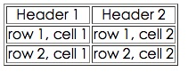
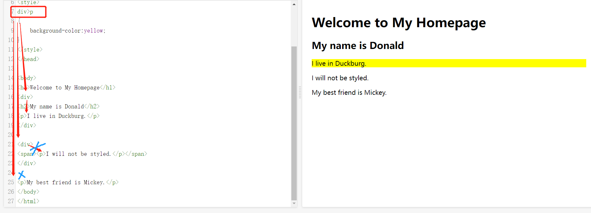
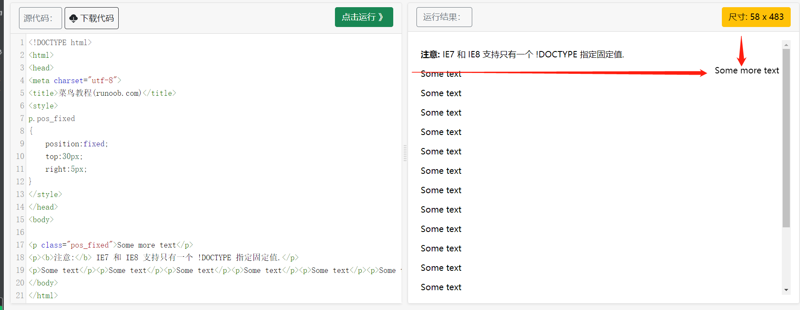

# 一、HTML

<br/>

## 1、页面结构理解


<br/>

### （1）元素

要理解元素的概念：(因为后面学的属性指的是元素的属性)


<br/>

例子：

```
<head>
<base href="http://www.runoob.com/images/" target="_blank">
</head>

//-----------------------------------------------------------
<head>
<link rel="stylesheet" type="text/css" href="mystyle.css">
</head>

<link> 标签定义了文档与外部资源之间的关系。
<link> 标签通常用于链接到样式表:

//-----------------------------------------------------------
<head>
<style type="text/css">
body {
    background-color:yellow;
}
p {
    color:blue
}
</style>
</head>

//-----------------------------------------------------------
<script> 元素


```

<br/>

<br/>

<br/>

<br/>

<br/>

## 2、基础

<br/>

标题（Heading）是通过 <h1> - <h6> 标签进行定义的。

```
<h1>这是一个标题</h1>
<h2>这是一个标题</h2>
<h3>这是一个标题</h3>
```

<br/>

```
<p>这是一个段落。</p>
<p>这是另外一个段落。</p>
```

<br/>

```
<a href="https://www.runoob.com">这是一个链接</a>
```

属性值应该始终被包括在引号内。属性和属性值对大小写不敏感。，而新版本的 (X)HTML 要求使用小写属性。

<br/>

```

```

<br/>

## 3、属性


<br/>

id例子：用属性id来定义一个元素，并在另一个链接访问它

```
id="tips">有用的提示部分</a>

...

<a href="#tips">访问有用的提示部分</a>
```

<br/>

<br/>

### 4、CSS

CSS 是在 HTML 4 开始使用的,是为了更好的渲染HTML元素而引入的.

CSS 可以通过以下方式添加到HTML中:

1、内联样式- 在HTML元素中使用"style" 属性

```
<p> style="color:blue;margin-left:20px;">这是一个段落。</p>
```

<br/>

2、内部样式表 -在HTML文档头部 <head> 区域使用<style> 元素 来包含CSS
外部引用 - 使用外部 CSS 文件

```
<head>
<style type="text/css">
body {background-color:yellow;}
p {color:blue;}
</style>
</head>
```

<br/>

3、最好的方式是通过外部引用CSS文件.

```
<head>
<link rel="stylesheet" type="text/css" href="mystyle.css">
</head>

<link> 标签定义了文档与外部资源之间的关系。
<link> 标签通常用于链接到样式表:
```

<br/>

## 5、特殊元素

可以保存下来，当忘记html标签元素时，可以去查：https://www.runoob.com/html/html-quicklist.html

<br/>

<br/>

### 1、表格

```
<table border="1">
    <tr>
        <th>Header 1</th>
        <th>Header 2</th>
    </tr>
    <tr>
        <td>row 1, cell 1</td>
        <td>row 1, cell 2</td>
    </tr>
    <tr>
        <td>row 2, cell 1</td>
        <td>row 2, cell 2</td>
    </tr>
</table>
```



<br/>

### 2、列表

自定义列表以 <dl> 标签开始。每个自定义列表项以 <dt> 开始。每个自定义列表项的定义以 <dd> 开始。

```
<dl>
<dt>Coffee</dt>
<dd>- black hot drink</dd>
<dt>Milk</dt>
<dd>- white cold drink</dd>
</dl>

```

```
浏览器显示如下：

Coffee
- black hot drink
Milk
- white cold drink
```

<br/>

3、表单

<br/>

<br/>

<br/>

## 6、元素-拼接

HTML 可以通过 <div> 和 <span>将元素组合起来

大多数 HTML 元素被定义为块级元素或内联元素。

<br/>

HTML <div> 元素是块级元素，它可用于组合其他 HTML 元素的容器。

<div> 元素没有特定的含义。除此之外，由于它属于块级元素，浏览器会在其前后显示折行。

如果与 CSS 一同使用，<div> 元素可用于对大的内容块设置样式属性。

<br/>

HTML <span> 元素是内联元素，可用作文本的容器

<span> 元素也没有特定的含义。

当与 CSS 一同使用时，<span> 元素可用于为部分文本设置样式属性。

<br/>

<br/>

## 7、颜色

<br/>

HTML 颜色由一个十六进制符号来定义，这个符号由红色、绿色和蓝色的值组成（RGB-red/green/blue）。

每种颜色的最小值是0（十六进制：#00）。最大值是255（十六进制：#FF）。


<br/>

<br/>

### 8、脚本

<br/>

<script> 标签用于定义客户端脚本，比如 JavaScript。
<script> 元素既可包含脚本语句，也可通过 src 属性指向外部脚本文件。
JavaScript 最常用于图片操作、表单验证以及内容动态更新。

```
<script>
document.write("Hello World!");
</script>
```

只有在浏览器不支持脚本或者禁用脚本时，才会显示 <noscript> 元素中的内容

```
<noscript>抱歉，你的浏览器不支持 JavaScript!</noscript>
```

<br/>

<br/>

# 二、CSS

从第一章第4点继续学习：

<br/>

## 1、格式和使用

选择器通常是您需要改变样式的 HTML 元素。

每条声明由一个属性和一个值组成。

属性（property）是您希望设置的样式属性（style attribute）。每个属性有一个值。属性和值被冒号分开。


```
/*这是个注释*/
p
{
    text-align:center;
    /*这是另一个注释*/
    color:black;
    font-family:arial;
}
```

<br/>

使用：(这里仅以外部样式表来距离，因为这样使用最多)

```
<head>
<link rel="stylesheet" type="text/css" href="mystyle.css">
</head>
```

浏览器会从文件 mystyle.css 中读到样式声明，并根据它来格式文档。

mystyle.css文件：

```
hr {color:sienna;}
p {margin-left:20px;}
body {background-image:url("/images/back40.gif");}
```

<br/>

如果既有内部又有外部样式，则以最近的、有值的为准。

```
外部：
h3
{
    color:red;
    text-align:left;
    font-size:8pt;
}

内部：
h3
{
    text-align:right;
    font-size:20pt;
}

准确：
color:red;
text-align:right;
font-size:20pt;
```

<br/>

<br/>

<br/>

<br/>

## 2、id和class选择器(选择元素)

<br/>

### a、id和class的使用

(1)、id 选择器可以为标有特定 id 的 HTML 元素指定特定的样式。HTML元素以id属性来设置id选择器,CSS 中 id 选择器以 "#" 来定义。

```
#para1
{
    text-align:center;
    color:red;
}
```

<br/>

(2) 

class 选择器用于描述一组元素的样式，class 选择器有别于id选择器，class可以在多个元素中使用。

class 选择器在 HTML 中以 class 属性表示, 在 CSS 中，类选择器以一个点 . 号显示：

在以下实例中, 所有的 p 元素使用 class="center" 让该元素的文本居中,且赋值颜色

```
p.center {text-align:center;}
.color { color:#ff0000; }
```

<br/>

<br/>

如果，有多个一样的，可以这样写：

```
h1,h2,p
{
    color:green;
}
```

对元素和class的定位：

(p.marked{ }: 为所有 class="marked" 的 p 元素指定一个样式。)

```
p.marked{
    text-decoration:underline;
}
```

<br/>

<br/>

### b、选择器

<br/>

1、后代选择器
后代选择器用于选取某元素的后代元素。


2、子元素选择器

与后代选择器相比，子元素选择器（Child selectors）只能选择作为某元素直接/一级子元素的元素。



3、相邻兄弟选择器

选取了所有位于 <div> 元素后的第一个 <p> 元素:


4、后续兄弟选择器

选取了所有 <div> 元素之后的所有相邻兄弟元素 <p> : 是相邻兄弟的升级版


<br/>

<br/>

<br/>

<br/>

## 4、盒子模型

<br/>

<br/>

### (1)盒子：


Margin(外边距) - 清除边框外的区域，外边距是透明的。
Border(边框) - 围绕在内边距和内容外的边框。
Padding(内边距) - 清除内容周围的区域，内边距是透明的。
Content(内容) - 盒子的内容，显示文本和图像。

(M->B->P:当成降落行为来记住)

<br/>

一个例题学会盒子模型（看似简单，一定要做）：

你就当是一个正方形，width宽和length高原本是相等的，但是可以只设置宽，那么高就会自己随着其它边距来自动确定

<br/>

下面的例子中的元素的总宽度为 450px：

```
div {
    width: 300px;
    border: 25px solid green;
    padding: 25px;
    margin: 25px;
}
```

让我们自己算算：
300px (宽)

- 50px (左 + 右填充)
- 50px (左 + 右边框)
- 50px (左 + 右边距)
= 450px

<br/>

试想一下，你只有 250 像素的空间。让我们设置总宽度为 250 像素的元素:

```
div {
    width: 220px;
    padding: 10px;
    border: 5px solid gray;
    margin: 0; 
}
```

最终元素的总宽度计算公式是这样的：

总元素的宽度=宽度+左填充+右填充+左边框+右边框+左边距+右边距

元素的总高度最终计算公式是这样的：

总元素的高度=高度+顶部填充+底部填充+上边框+下边框+上边距+下边距

<br/>

但是，现实中可能并不是正方形的设置，可能需要对每个边距的上下左右进行设置，以Margin外边距为例：


(上下tb，左右lr)

<br/>

### (2)定位Position

position 属性的五个值：

static
relative
fixed
absolute
sticky

<br/>

1、static

静态定位的元素不会受到 top, bottom, left, right影响。

意思就是，就算你写了left也没用

<br/>

2、fixed

固定定位

元素的位置相对于浏览器窗口是固定位置。

即使窗口是滚动的它也不会移动：



<br/>

3、absolute 

绝对定位

元素的位置相对于最近的已定位父元素，如果元素没有已定位的父元素，那么它的位置相对于<html>(相当于固定定位fixed):


<br/>

4、relative 定位

相对定位元素的定位是相对其**正常位置(原本该在的位置)**。


<br/>

5、sticky 定位

ticky 英文字面意思是粘，粘贴，所以可以把它称之为粘性定位。


6、z-index

元素的定位与文档流无关，所以它们可以覆盖页面上的其它元素


<br/>

### (3)浮动

如果你把几个浮动的元素放到一起，如果有空间的话，它们将彼此相邻。


<br/>

移动：


<br/>

### (4)Overflow内容溢出元素

<br/>

CSS overflow 属性可以控制内容溢出元素框时在对应的元素区间内添加滚动条。


修改：


<br/>

<br/>

<br/>

<br/>

<br/>

<br/>

<br/>

<br/>

<br/>

<br/>

<br/>

<br/>

# 三、NodeJs、Javascript

Node.js是一个基于Chrome V8引擎的JavaScript运行环境，可以在服务器端运行JavaScript代码。而JavaScript是一种脚本语言，主要用于在浏览器中编写交互式网页。Node.js和JavaScript都使用相同的语法和语言特性，但是它们的应用场景和运行环境不同。Node.js主要用于构建服务器端应用程序，而JavaScript主要用于编写网页交互效果和动态效果。

<br/>

尝试在html写一简单的JS:

```javascript
<!DOCTYPE html> 
<html> 
<head>
<meta charset="utf-8">
<title>菜鸟教程(runoob.com)</title>
</head>
<body> 

<div style="text-align:center"> 
  <button onclick="playPause()">播放/暂停</button> 
  <button onclick="makeBig()">放大</button>
  <button onclick="makeSmall()">缩小</button>
  <button onclick="makeNormal()">普通</button>
  <br> 
  <video id="video1" width="420">
    <source src="mov_bbb.mp4" type="video/mp4">
    <source src="mov_bbb.ogg" type="video/ogg">
    您的浏览器不支持 HTML5 video 标签。
  </video>
</div> 

<script> 
var myVideo=document.getElementById("video1"); 

function playPause()
{ 
	if (myVideo.paused) 
	  myVideo.play(); 
	else 
	  myVideo.pause(); 
} 

	function makeBig()
{ 
	myVideo.width=560; 
} 

	function makeSmall()
{ 
	myVideo.width=320; 
} 

	function makeNormal()
{ 
	myVideo.width=420; 
} 
</script> 

</body> 
</html>
```

<br/>

JavaScript 是可插入 HTML 页面的编程代码。

JavaScript 插入 HTML 页面后，可由所有的现代浏览器执行。所以j直接叫做**浏览器改变页面元素的编程语言**

如下，可以直接在浏览器写脚本来控制浏览器的元素：


<br/>

<br/>

<br/>

这里不再阐述JS，直接去看nodejs章节下的JavaScript即可，那里进行了学习。