**了解：**

HTML是元素在浏览器中的初始布局

CSS是调整元素的样式

JavaScript是浏览器处理元素的脚本，其中DOM就是管理元素的文档

jquery是在JavaScript中更好地管理元素文档的元素

Bootstrap5是用已经写好的各种**组件库(其实就是写好的元素)**来包裹其它元素，是HTML和CSS的升级**

 

 

# 一、NodeJs

JavaScript 语言自身只有字符串数据类型，没有二进制数据类型。

所以NodeJs非常容易理解，你把它当成操作Json的语言就行了

 

## 1、引入模块

 

(1)require 

使用 require 指令来加载和引入http模块(相当于import)，Node.js 会自动从 node_modules 目录中查找该模块。

```
var http = require("http");

http.createServer(function (request, response) {

    // 发送 HTTP 头部 
    // HTTP 状态值: 200 : OK
    // 内容类型: text/plain
    response.writeHead(200, {'Content-Type': 'text/plain'});

    // 发送响应数据 "Hello World"
    response.end('Hello World\n');
}).listen(8888);

// 终端打印如下信息
console.log('Server running at http://127.0.0.1:8888/');
```

 

引入自定义模块：

```
var hello = require('./hello');
hello.world();
```

接下来我们就来创建 hello.js 文件，代码如下：

```
//hello.js 
function Hello() { 
    var name; 
    this.setName = function(thyName) { 
        name = thyName; 
    }; 
    this.sayHello = function() { 
        console.log('Hello ' + name); 
    }; 
}; 
//导出
module.exports = Hello;
```

这样就可以直接获得这个对象了：(已经非常像Java了)

```
//main.js 
var Hello = require('./hello'); 
hello = new Hello(); 
hello.setName('BYVoid'); 
hello.sayHello(); 
```

 

(2)其它命令

安装

```
 npm install express -g
```

查看安装信息

```
npm list -g
```

如果要查看某个模块的版本号，可以使用命令如下：

```
 npm list express
```

更新包

```
npm update express
```

查找包

```
npm search express
```

你可以使用淘宝定制的 cnpm (gzip 压缩支持) 命令行工具代替默认的 npm:

```
npm install -g cnpm --registry=https://registry.npmmirror.com
```

 

（3）包的属性package.json

接下来让我们来看下 express 包的 package.json 文件，位于 node_modules/express/package.json 内容：

```
{
  "name": "express",
  "description": "Fast, unopinionated, minimalist web framework",
  "version": "4.13.3",
  "author": {
    "name": "TJ Holowaychuk",
    "email": "tj@vision-media.ca"
  },
  "contributors": [
    {
      "name": "Aaron Heckmann",
      "email": "aaron.heckmann+github@gmail.com"
    },
    {
      "name": "Ciaran Jessup",
      "email": "ciaranj@gmail.com"
    },
    {
      "name": "Douglas Christopher Wilson",
      "email": "doug@somethingdoug.com"
    },
    {
      "name": "Guille
      ...
```

name - 包名。

version - 包的版本号。

description - 包的描述。

homepage - 包的官网 url 。

author - 包的作者姓名。

contributors - 包的其他贡献者姓名。

dependencies - 依赖包列表。如果依赖包没有安装，npm 会自动将依赖包安装在 node_module 目录下。

repository - 包代码存放的地方的类型，可以是 git 或 svn，git 可在 Github 上。

main - main 字段指定了程序的主入口文件，require('moduleName') 就会加载这个文件。这个字段的默认值是模块根目录下面的 index.js。

keywords - 关键字

 

自定义本项目的package.json：

创建模块，package.json 文件是必不可少的。我们可以使用 NPM 生成 package.json 文件，生成的文件包含了基本的结果。

```
npm init
```

 

## 2、函数

在 JavaScript中，一个函数可以作为另一个函数的参数。我们可以先定义一个函数，然后传递，也可以在传递参数的地方直接定义函数。

**只要不写明，变量可能是字符串，也可能是方法函数**

```
//定义一个say函数
function say(word) {
  console.log(word);
}

//再定义一个两个参数分别为：someFunction、value的execute函数，里面执行了someFunction(value);
//这里很多人很懵逼，参数能执行参数，但是js就是这样，函数也是参数的一部分。
function execute(someFunction, value) {
  someFunction(value);
}

//执行
execute(say, "Hello");
```

 

 

 

 

## 3、回调函数(异步)

Node.js 异步编程的直接体现就是回调。

异步编程依托于回调来实现，但不能说使用了回调后程序就异步化了。

回调函数在完成任务后就会被调用，Node 使用了大量的回调函数，Node 所有 API 都支持回调函数。

例如，我们可以一边读取文件，一边执行其他命令，在文件读取完成后，我们将文件内容作为回调函数的参数返回。这样在执行代码时就没有阻塞或等待文件 I/O 操作。这就大大提高了 Node.js 的性能，可以处理大量的并发请求。

回调函数一般作为函数的最后一个参数出现：

```
function foo2(value, callback1, callback2) { }
```

 

例子：

创建一个文件 input.txt ，内容如下：

```
菜鸟教程官网地址：www.runoob.com
```

 

阻塞代码实例：

```
var fs = require("fs");

var data = fs.readFileSync('input.txt');

console.log(data.toString());
console.log("程序执行结束!");
```

```
$ node main.js
菜鸟教程官网地址：www.runoob.com

程序执行结束!
```

 

非阻塞代码实例：

```
var fs = require("fs");

//执行异步操作的函数将回调函数作为最后一个参数， 回调函数接收错误对象作为第一个参数。
fs.readFile('input.txt', function (err, data) {
    if (err) return console.error(err);
    console.log(data.toString());
});

console.log("程序执行结束!");
```

```
$ node main.js
程序执行结束!
菜鸟教程官网地址：www.runoob.com
```

 

 

## 4、事件：监听和触发

 

非常简单：

```
// 引入 events 模块
var events = require('events');

// 创建 eventEmitter 对象
var eventEmitter = new events.EventEmitter();

// 创建事件处理程序
var eventHandler = function connected() {
   console.log('连接成功。');
}

// 绑定事件及事件的处理程序
eventEmitter.on('eventName', eventHandler);

// 触发事件
eventEmitter.emit('eventName');

```

 

//还可以以匿名的方式来实现

```
emitter.on('eventName', function(arg1, arg2) { 
    console.log('listener2', arg1, arg2); 
}); 
emitter.emit('eventName', 'arg1 参数', 'arg2 参数'); 
```

 

 

### （1）流Stream事件

所有的 Stream 对象都是 EventEmitter 的实例。常用的事件有：(有点像实现Java的接口的事件触发)

data - 当有数据可读时触发。

end - 没有更多的数据可读时触发。

error - 在接收和写入过程中发生错误时触发。

finish - 所有数据已被写入到底层系统时触发

 

 

例子：

```javascript
var fs = require("fs");
var data = '菜鸟教程官网地址：www.runoob.com';

// 创建一个可以写入的流，写入到文件 output.txt 中
var writerStream = fs.createWriteStream('output.txt');

// 使用 utf8 编码写入数据
writerStream.write(data,'UTF8');

// 标记文件末尾
writerStream.end();

// 处理流事件 --> finish、error
writerStream.on('finish', function() {
    console.log("写入完成。");
});

writerStream.on('error', function(err){
   console.log(err.stack);
});

console.log("程序执行完毕");
```

结果：

```
$ node main.js 
程序执行完毕
写入完成。
```

 

 

## 5、路由(这里仅是学习解耦包的思想)

 

 

现在我们可以来编写路由了，建立一个名为 router.js 的文件，添加以下内容：

```
function route(pathname) {
  console.log("About to route a request for " + pathname);
}
 
exports.route = route;
```

首先，我们来扩展一下服务器的 start() 函数，以便将路由函数作为参数传递过去，server.js 文件代码如下

```
var http = require("http");
var url = require("url");
 
function start(route) {
  function onRequest(request, response) {
    var pathname = url.parse(request.url).pathname;
    console.log("Request for " + pathname + " received.");
 
    route(pathname);
 
    response.writeHead(200, {"Content-Type": "text/plain"});
    response.write("Hello World");
    response.end();
  }
 
  http.createServer(onRequest).listen(8888);
  console.log("Server has started.");
}
 
exports.start = start;
```

同时，我们会相应扩展 index.js，使得路由函数可以被注入到服务器中：

```
var server = require("./server");
var router = require("./router");
 
server.start(router.route);
```

执行：

```
$ node index.js
Server has started.
```

 

## 6、引入NodeJs框架：express

(不用Java写后端了，直接用这个框架来写一些服务就可以，适合前端同学)

Express 是一个简洁而灵活的 node.js Web应用框架, 提供了一系列强大特性帮助你创建各种 Web 应用，和丰富的 HTTP 工具。

使用 Express 可以快速地搭建一个完整功能的网站。

Express 框架核心特性：

可以设置中间件来响应 HTTP 请求。

定义了路由表用于执行不同的 HTTP 请求动作。

可以通过向模板传递参数来动态渲染 HTML 页面。

 

 

(1)第一个代码：

以下实例中我们引入了 express 模块，并在客户端发起请求后，响应 "Hello World" 字符串。

创建 express_demo.js 文件，代码如下所示：

```
var express = require('express');
var app = express();
 
//  主页输出 "Hello World"
app.get('/', function (req, res) {
   console.log("主页 GET 请求");
   res.send('Hello GET');
})
 
 
//  POST 请求
app.post('/', function (req, res) {
   console.log("主页 POST 请求");
   res.send('Hello POST');
})
 
//  /del_user 页面响应
app.get('/del_user', function (req, res) {
   console.log("/del_user 响应 DELETE 请求");
   res.send('删除页面');
})
 
//  /list_user 页面 GET 请求
app.get('/list_user', function (req, res) {
   console.log("/list_user GET 请求");
   res.send('用户列表页面');
})
 
// 对页面 abcd, abxcd, ab123cd, 等响应 GET 请求
app.get('/ab*cd', function(req, res) {   
   console.log("/ab*cd GET 请求");
   res.send('正则匹配');
})
 
 
var server = app.listen(8081, function () {
 
  var host = server.address().address
  var port = server.address().port
 
  console.log("应用实例，访问地址为 http://%s:%s", host, port)
 
})
```

还可以放置一些静态文件：

```
app.use('/public', express.static('public'));
```

例如，如果你将图片， CSS, JavaScript 文件放在public/images/logo.png 目录下

 

执行完整代码：

在浏览器中访问 http://127.0.0.1:8081/public/images/logo.png

 

 

## 7、MySQL

 

安装：

```
cnpm install mysql
```

 

简单的查询例子：

```
var mysql  = require('mysql');  
 
var connection = mysql.createConnection({     
  host     : 'localhost',       
  user     : 'root',              
  password : '123456',       
  port: '3306',                   
  database: 'test' 
}); 
 
connection.connect();
 
var  sql = 'SELECT * FROM websites';
//查
connection.query(sql,function (err, result) {
        if(err){
          console.log('[SELECT ERROR] - ',err.message);
          return;
        }
 
       console.log('--------------------------SELECT----------------------------');
       console.log(result);
       console.log('------------------------------------------------------------\n\n');  
});
 
connection.end();
```

 

 

# 二、JavaScript

JavaScript 是可插入 HTML 页面的编程代码。

JavaScript 插入 HTML 页面后，可由所有的现代浏览器执行。所以j直接叫做**浏览器改变页面元素的编程语言**

如下，可以直接在浏览器写脚本来控制浏览器的元素：

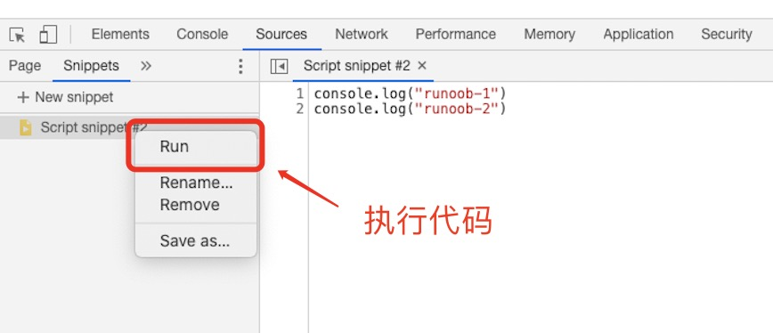

JavaScript 语句向浏览器发出的命令。语句的作用是告诉浏览器该做什么。

 

 

## 1、语法

这

 

### （1）基本数据类型：

#### 基本数据类型：

字符串（String）、数字(Number)、布尔(Boolean)、空值（Null）、未定义（Undefined）、Symbol。

JavaScript 变量有很多种类型，但是现在，我们只关注数字和字符串。

```
var pi=3.14;  
// 如果你熟悉 ES6，pi 可以使用 const 关键字，表示一个常量
// const pi = 3.14;
var person="John Doe";


//布尔：
var x=true;
var y=false;
```

还可以进行变量类型检测：

```
typeof "John"                // 返回 string
typeof 3.14                  // 返回 number
typeof false                 // 返回 boolean
typeof [1,2,3,4]             // 返回 object
typeof {name:'John', age:34} // 返回 object

typeof undefined             // undefined
typeof null                  // object
```

在 JavaScript 中, undefined 是一个没有设置值的变量。

null是一个只有一个值的特殊类型。表示一个空对象引用。

还可以类型转换：

```
String(x)   
String(123) 
x.toString()
String(false)   
String(new Date())  

Number("3.14")    // 返回 3.14
Number(false)     // 返回 0

//打印的时候自动调用toString
myVar = {name:"Fjohn"}  // toString 转换为 "[object Object]"
myVar = [1,2,3,4]       // toString 转换为 "1,2,3,4"
```

 

 


tips：

1、null，undefined的区别？

null表示一个对象被定义了，但存放了空指针，转换为数值时为0。

undefined表示声明的变量未初始化，转换为数值时为NAN。


2、变量的作用域

变量的作用域是程序中定义它的区域，JS变量只有两个作用域：

全局变量 ：全局变量具有全局作用域，这意味着它在JS代码中的任何位置都可见。如var变量、const常量

局部变量 ：局部变量仅在定义它的函数中可见，函数参数始终是该函数的本地参数。如let变量

如果变量在函数内没有声明（没有使用 var 关键字），该变量为全局变量。

全局变量有 全局作用域: 网页中所有脚本和函数均可使用。 


3、let和var的比较

总结来说，"声明提升"是JavaScript中的一种行为，它将变量和函数声明提升到当前作用域的顶部。但是"let"声明的变量不会被提升，而"var"声明的变量会被提升。因此，在编写JavaScript代码时，建议使用"let"来声明变量，以便更好地控制变量的作用域和可见性。


4、闭包

指的是一个函数可以访问另一个函数作用域中变量。常见的构造方法，是在一个函数内部定义另外一个函数。内部函数可以引用外层的变量；外层变量不会被垃圾回收机制回收。

优点：避免全局变量污染。

缺点：容易造成内存泄漏。


5、JavaScript 变量生命周期：
JavaScript 变量生命周期在它声明时初始化。

局部变量在函数执行完毕后销毁。

全局变量在页面关闭后销毁。


6、 ”==”和 “ === ”的不同?

答案：前者会自动转换类型,再判断是否相等
后者不会自动类型转换，直接去比较


#### 引用数据类型：

对象(Object)、数组(Array)、函数(Function)。


1、数组（Array）字面量 定义一个数组：


数组：

```
var cars=new Array();
cars[0]="Saab";
cars[1]="Volvo";
cars[2]="BMW";

//或者
var cars=new Array("Saab","Volvo","BMW");

//或者
var cars=["Saab","Volvo","BMW"];
```

 


2、对象（Object）字面量 定义一个对象：

```
{firstName:"John", lastName:"Doe", age:50, eyeColor:"blue"}
```


tips：

1、什么是window对象? 什么是document对象]?

window对象：代表浏览器中打开的一个窗口；

document对象：代表整个html文档。实际上，document对象是window对象的一个属性。


### （2）函数

函数（Function）字面量 定义一个函数：

```
function myFunction(a, b) { return a * b;}
```

 

tips：

1、JS延迟加载的方式？(让js(数据填充)最后再加载)

- defer属性：延迟脚本。立即下载，但延迟执行（延迟到整个页面都解析完毕后再运行），按照脚本出现的先后顺序执行。
- async属性：异步脚本。下载完立即执行，但不保证按照脚本出现的先后顺序执行；

- 使用setTimeout延迟方法

  终极办法：利用vue的声明周期(vue在后面学)

 


## 2、异常throw、try 和 catch

 和java一模一样


```
function myFunction() {
    var message, x;
    message = document.getElementById("message");
    message.innerHTML = "";
    x = document.getElementById("demo").value;
    try { 
        if(x == "")  throw "值为空";
        if(isNaN(x)) throw "不是数字";
        x = Number(x);
        if(x < 5)    throw "太小";
        if(x > 10)   throw "太大";
    }
    catch(err) {
        message.innerHTML = "错误: " + err;
    }
}
```

 

## 3、window

在 HTML 中, 所有全局变量都会成为 window 变量、

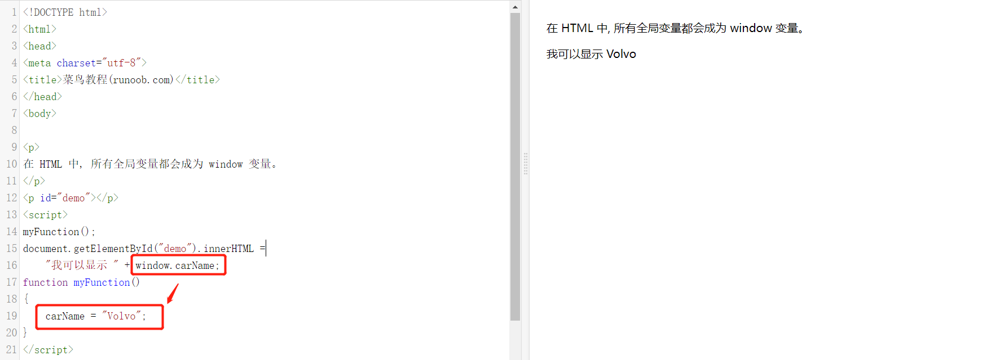

  


window.location 对象用于获得当前页面的地址 (URL)，并把浏览器重定向到新的页面。

location.href 返回url

location.hostname 返回 web 主机的域名
location.pathname 返回当前页面的路径和文件名
location.port 返回 web 主机的端口 （80 或 443）
location.protocol 返回所使用的 web 协议（http: 或 https:）


 

## 4、DOM：document

通过 HTML DOM，可访问 JavaScript HTML 文档的所有元素。

HTML DOM 模型被构造为对象的树：


 

在 DOM 中查找 HTML 元素的最简单的方法，是通过使用元素的 id。

```
var x=document.getElementById("demo");
```

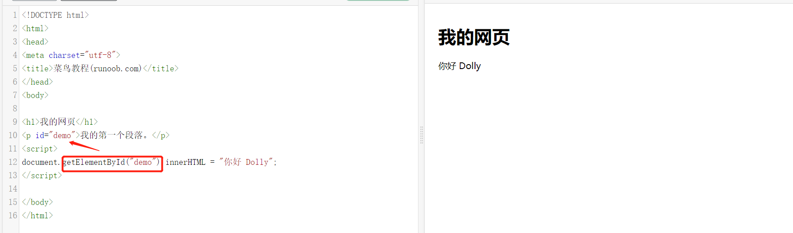

没错，这就是我们之前使用过的DOM，其实就是根据document文档来获取元素。

(这以后会被JQuery替代，用$就可以使用元素了)

 

 使用 document.write() 方法将内容写到 HTML 文档中。
使用 document. .getElementById("intro").innerHTML 写入到 HTML 元素。


这里创建dom的节点和移除这种，就不再阐述了，直接看JQuery

 

# 三、JQuery

(就是用来替代DOM的)

 

在 DOM 中查找 HTML 元素的最简单的方法，是通过使用元素的 id。

```
var x=document.getElementById("intro");
```

没错，这就是我们之前使用过的DOM，其实就是根据document文档来获取元素。

(这以后会被JQuery替代，用$就可以使用元素了)

 

通过 jQuery，您可以选取（查询，query） HTML 元素，并对它们执行"操作"（actions）。

```
$(this).hide() - 隐藏当前元素

$("p").hide() - 隐藏所有 <p> 元素

$("p.test").hide() - 隐藏所有 class="test" 的 <p> 元素

$("#test").hide() - 隐藏 id="test" 的元素
```

添加新的 HTML 内容，我们将学习用于添加新内容的四个 jQuery 方法：

append() - 在被选元素的结尾插入内容
prepend() - 在被选元素的开头插入内容
after() - 在被选元素之后插入内容
before() - 在被选元素之前插入内容

 

 

 

 

## 0、安装

```
<head>
<script src="jquery-1.10.2.min.js"></script>
</head>
```

 

## 1、id、class选择器

 

```
$(document).ready(function(){
  $("button").click(function(){
    $("p").hide();
    //id选择器
    $("#test").hide();
    //class选择器
    $(".test").hide();
  });
});
```

 

 

## 2、事件

 

常用的 jQuery 事件方法

$(document).ready()
$(document).ready() 方法允许我们在文档完全加载完后执行函数。该事件方法在 jQuery 语法 章节中已经提到过。

 

 

```
$("#p1").mouseenter(function(){
    alert('您的鼠标移到了 id="p1" 的元素上!');
});

$("#p1").mouseleave(function(){
    alert("再见，您的鼠标离开了该段落。");
});

$("#p1").mousedown(function(){
    alert("鼠标在该段落上按下！");
});

$("#p1").mouseup(function(){
    alert("鼠标在段落上松开。");
});

//hover()方法用于模拟光标悬停事件。
$("#p1").hover(
    function(){
        alert("你进入了 p1!");
    },
    function(){
        alert("拜拜! 现在你离开了 p1!");
    }
);


//当元素获得焦点时，发生 focus 事件。当元素失去焦点时，发生 blur 事件。
$("input").focus(function(){
  $(this).css("background-color","#cccccc");
});
$("input").blur(function(){
  $(this).css("background-color","#ffffff");
});

```

 

 

 

## 3、 AJAX(此节详见vue)

 

AJAX = 异步 JavaScript 和 XML（Asynchronous JavaScript and XML）。

简短地说，在不重载整个网页的情况下，AJAX 通过后台加载数据，并在网页上进行显示。

使用 AJAX 的应用程序案例：谷歌地图、腾讯微博、优酷视频、人人网等等

 

### 1、load

jQuery load() 方法是简单但强大的 AJAX 方法。

load() 方法从服务器加载数据，并把返回的数据放入被选元素中。

 

### 2、get/post

 

 

(1)post

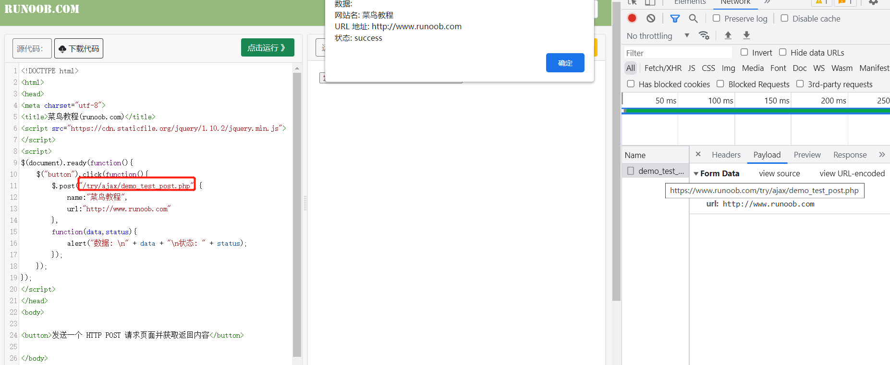

 

 

### 3、cookie

 

创建 cookie，并设置 7 天后过期：

```
$.cookie('name', 'value', { expires: 7 });
```

 

 

# 四、Vue2

 

 

## 0、承接Jquery，了解Vue


在js中，我们使用dom文档树来操作元素；

在jq中，我们使用$来操作元素；

在vue中，使用el来操作操作元素的变化和改变里面的数据data。


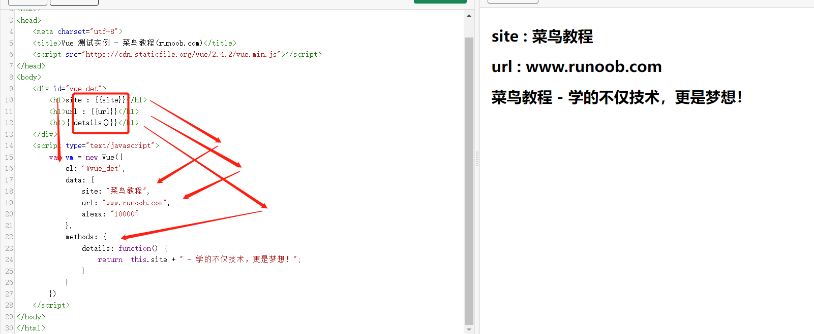

(在前端中，变量可能是字符串和数字，但是也可能是方法，所以{{}}指的既可能是data中的变量，也可能是method中的方法函数)

 

Vue.js 使用了基于 HTML 的模板语法，允许开发者声明式地将 DOM 绑定至底层 Vue 实例的数据。

Vue.js 的核心是一个允许你采用简洁的模板语法来声明式的将数据渲染进 DOM 的系统。

 

## 1、安装及初始化(可跳过继续学习理论)

安装vue环境，在用 Vue.js 构建大型应用时推荐使用 cnpm 安装：

```
cnpm install vue
```

Vue.js 提供一个官方命令行工具，可用于快速搭建大型单页应用。

```
# 全局安装 vue-cli
$ cnpm install --global vue-cli
# 创建一个基于 webpack 模板的新项目
$ vue init webpack my-project
# 这里需要进行一些配置，默认回车即可
This will install Vue 2.x version of the template.

For Vue 1.x use: vue init webpack#1.0 my-project

? Project name my-project
? Project description A Vue.js project
? Author runoob <test@runoob.com>
? Vue build standalone
? Use ESLint to lint your code? Yes
? Pick an ESLint preset Standard
? Setup unit tests with Karma + Mocha? Yes
? Setup e2e tests with Nightwatch? Yes

   vue-cli · Generated "my-project".

   To get started:
   
     cd my-project
     npm install
     npm run dev
   
   Documentation can be found at https://vuejs-templates.github.io/webpack
```

进入项目，安装并运行：

```
$ cd my-project
$ cnpm install
$ cnpm run dev
 DONE  Compiled successfully in 4388ms

> Listening at http://localhost:8080
```

 

## 2、理论

指令是带有 v- 前缀的特殊属性。指令用于在表达式的值改变时，将某些行为应用到 DOM 上。

(v- 前缀的特殊属性的值只能是data或者method上的值！)

 

```
<div id="app">
    <p>{{ message }}</p>
    <input v-model="message">
</div>
    
<script>
new Vue({
  el: '#app',
  data: {
    message: 'Runoob!',
    sites: [
      { name: 'Runoob' },
      { name: 'Google' },
      { name: 'Taobao' }
    ]
  }
})
</script>
```

这里的data就是java的基本数据类型。这里的message: 'Runoob!'相当于等于var message='Runoob!';

还有sites: [
      { name: 'Runoob' },
      { name: 'Google' },
      { name: 'Taobao' }
    ]就是

var obj1={ name: 'Runoob' }

var obj2={ name: 'Google' }

var obj3={ name: 'Taobao' }

var sites=new Array();

sites[0]=obj1;

省略...


 

### 1、v-bind

单向绑定，可以绑定样式，和v-model区分

```
<!-- 完整语法 -->
<a v-bind:href="url"></a>
<!-- 缩写 -->
<a :href="url"></a>
```

 

```
样式绑定
```

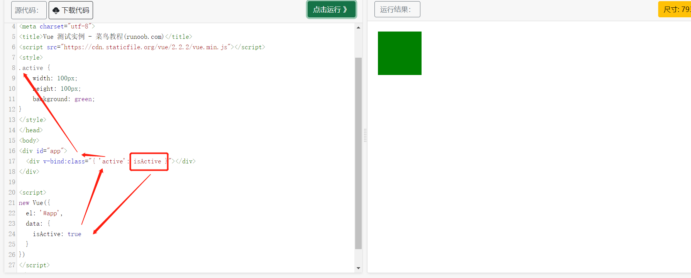

 

 

 

### 2、v-on (@click)

```
<!-- 完整语法 -->
<a v-on:click="doSomething"></a>
<!-- 缩写 -->
<a @click="doSomething"></a>
```

 

Vue.js 为 v-on 提供了事件修饰符来处理 DOM 事件细节

```
Vue.js 通过由点 . 表示的指令后缀来调用修饰符。

.stop - 阻止冒泡
.prevent - 阻止默认事件
.capture - 阻止捕获
.self - 只监听触发该元素的事件
.once - 只触发一次
.left - 左键事件
.right - 右键事件
.middle - 中间滚轮事件
```

按键修饰符：

```
<!-- 同上 -->
<input v-on:keyup.enter="submit">
<!-- 缩写语法 -->
<input @keyup.enter="submit">

<p><!-- Alt + C -->
<input @keyup.alt.67="clear">
<!-- Ctrl + Click -->
<div @click.ctrl="doSomething">Do something</div>
```

 

 

### 3、v-model

指令用来在 input、select、textarea、checkbox、radio 等表单控件元素上创建双向数据绑定，根据表单上的值，自动更新绑定的元素的值。

 

```
<div id="app">
    <p>{{ message }}</p>
    <input v-model="message">
</div>
    
<script>
new Vue({
  el: '#app',
  data: {
    message: 'Runoob!'
  }
})
</script>
```

修改输入<input元素的message，也会修改<p的{{ message }}

 

.lazy

在默认情况下， v-model 在 input 事件中同步输入框的值与数据，但你可以添加一个修饰符 lazy ，从而转变为在 change 事件中同步：

```
<!-- 在 "change" 而不是 "input" 事件中更新 -->
<input v-model.lazy="msg" >
```

 

.number

如果想自动将用户的输入值转为 Number 类型（如果原值的转换结果为 NaN 则返回原值），可以添加一个修饰符 number 给 v-model 来处理输入值：

```
<input v-model.number="age" type="number">
```

 

.trim

```
<input v-model.trim="msg">
```

 

### 4、v-if

这里， v-if 指令将根据表达式 seen 的值(true 或 false )来决定是否插入 p 元素。

```
<div id="app">
    <p v-if="seen">现在你看到我了</p>
</div>
    
<script>
new Vue({
  el: '#app',
  data: {
    seen: true
  }
})
</script>
```

用作 v-if 的 else-if 块。可以链式的多次使用

```
<div id="app">
    <div v-if="type === 'A'">
      A
    </div>
    <div v-else-if="type === 'B'">
      B
    </div>
    <div v-else-if="type === 'C'">
      C
    </div>
    <div v-else>
      Not A/B/C
    </div>
</div>
```

我们也可以使用 v-show 指令来根据条件展示元素：

```
<h1 v-show="ok">Hello!</h1>
```

 

 

 

### 5、 {{...}}（双大括号）的文本插值

是对data或者method中对应的变量或者方法的文本进行文本插值


### 6、v-for 

v-for 可以绑定数据到数组来渲染一个列表：

```
<div id="app">
  <ol>
    <li v-for="site in sites">
      {{ site.name }}
    </li>
  </ol>
</div>
 
<script>
new Vue({
  el: '#app',
  data: {
    sites: [
      { name: 'Runoob' },
      { name: 'Google' },
      { name: 'Taobao' }
    ]
  }
})
</script>
```

可以将变量的数组迭代出来，而且，会将元素重复生成迭代的个数！


***


### 7、watch:监听data中的变量

我们将为大家介绍 Vue.js 监听属性 watch，我们可以通过 watch 来响应数据的变化。

```
<div id = "app">
    <p style = "font-size:25px;">计数器: {{ counter }}</p>
    <button @click = "counter++" style = "font-size:25px;">点我</button>
</div>

<script type = "text/javascript">
var vm = new Vue({
    el: '#app',
    data: {
        counter: 1
    }
});

//***************这里************
vm.$watch('counter', function(nval, oval) {
    alert('计数器值的变化 :' + oval + ' 变为 ' + nval + '!');
});
</script>

```


### 8、＜keep-alive＞ 实现页面缓存

如果未使用keep-alive组件，则在页面回退时仍然会重新渲染页面，触发created钩子，用户体验不好。 在菜单存在多级关系，多见于列表页+详情页的场景，使用keep-alive组件会显著提高用户体验，如：商品列表页点击商品跳转到商品详情，返回后仍显示原有信息，订单列表跳转到订单详情，返回，等等场景。

```
<div id="app" class='wrapper'>
    <keep-alive>
        <!-- 需要缓存的视图组件 --> 
        <router-view v-if="$route.meta.keepAlive"></router-view>
     </keep-alive>
     
      <!-- 不需要缓存的视图组件 -->
     <router-view v-if="!$route.meta.keepAlive"></router-view>
</div>

```

还有一些实践，写得不错，还需要beforeEach清除缓存和localStorage记录页面位置等等

详情见：https://shq5785.blog.csdn.net/article/details/109312942


## 3、组件

组件（Component）是 Vue.js 最强大的功能之一。

组件可以扩展 HTML 元素，封装可重用的代码。

组件系统让我们可以用独立可复用的小组件来构建大型应用，几乎任意类型的应用的界面都可以抽象为一个组件树：


还记得我们之前看过的DOM元素文档吗，这是同理的，把组件当成是一个大元素即可。便可以自己写一些元素。

 

### 1、自定义组件


父传子(v-bind绑定，props):

component：注册

Prop：属性

template：该组件的内容(以字符形式表达)

类似于用 v-bind 绑定 HTML 特性到一个表达式，也可以用 v-bind 动态绑定 props 的值到父组件的数据中。每当父组件的数据变化时，该变化也会传导给子组件：

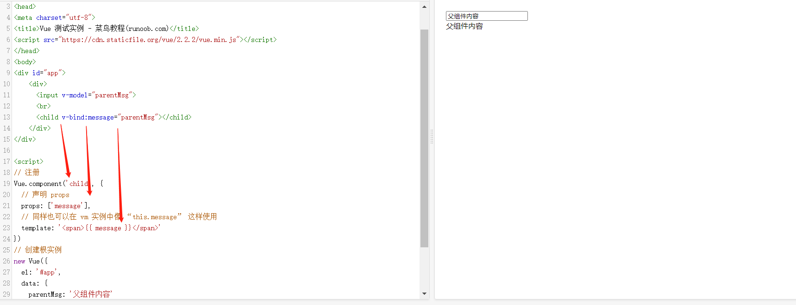

注意: prop 是单向绑定的：当父组件的属性变化时，将传导给子组件，但是不会反过来。

父组件是使用 props 传递数据给子组件，但如果子组件要把数据传递回去，就需要使用自定义事件！


子传父-自定义事件(v-on和$emit)：

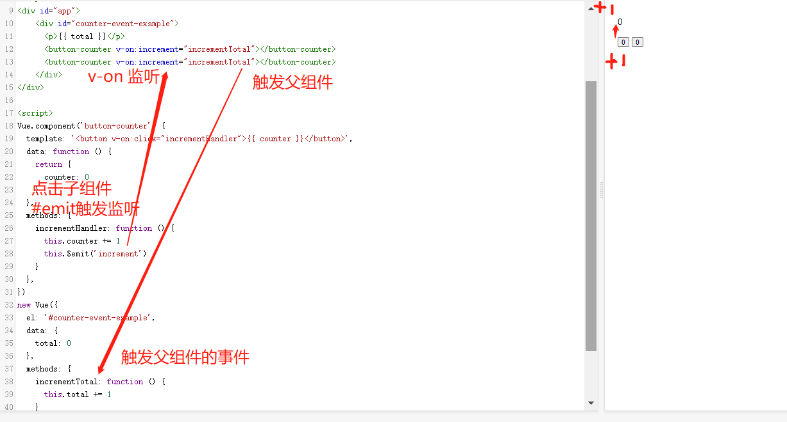


## 4、组件路由

Vue.js 路由允许我们通过不同的 URL 访问不同的内容。

通过 Vue.js 可以实现多视图的单页Web应用（single page web application，SPA）。

通俗地说，就是一个在页面里，我们可以展示不同的view视图(不要脱离mvvm的model、view这个概念)。

或者在同一个页面里，用另一个视图去覆盖原来的视图，即跳转。


### 0、先看例子


以下实例中我们将 vue-router 加进来，然后配置组件和路由映射，再告诉 vue-router 在哪里渲染它们。

```
<script src="https://unpkg.com/vue/dist/vue.js"></script>
<script src="https://unpkg.com/vue-router/dist/vue-router.js"></script>
 
<div id="app">
  <h1>Hello App!</h1>
  <p>
    <!-- 使用 router-link 组件来导航. -->
    <!-- 通过传入 `to` 属性指定链接. -->
    <!-- <router-link> 默认会被渲染成一个 `<a>` 标签 -->
    <router-link to="/foo">Go to Foo</router-link>
    <router-link to="/bar">Go to Bar</router-link>
  </p>
  
  <!-- 路由出口 -->
  <!-- 路由匹配到的组件将渲染在这里，如果不写则覆盖整个页面 -->
  <router-view></router-view>
</div>
```


### 1、尝试

0、下载

```
cnpm install vue-router
```


1、配置路由config

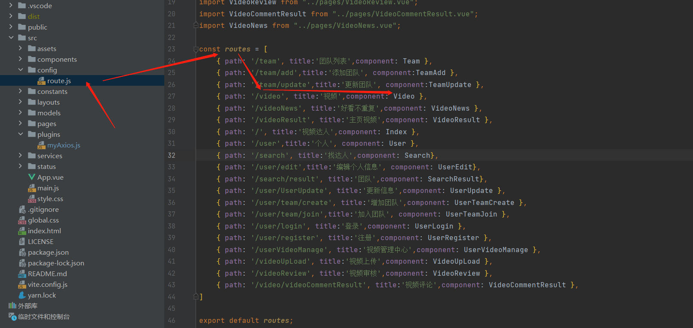

2、使用路由

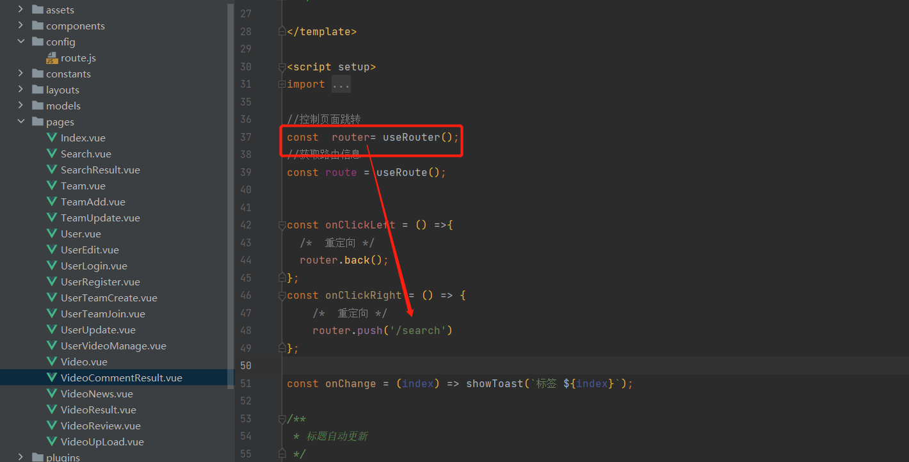


### 2、常见的路由组件和属性


#### （1）router-link


1、to
表示目标路由的链接。 当被点击后，内部会立刻把 to 的值传到 router.push()，所以这个值可以是一个字符串或者是描述目标位置的对象。


2、replace
设置 replace 属性的话，当点击时，会调用 router.replace() 而不是 router.push()，导航后不会留下 history 记录。

```
<router-link :to="{ path: '/abc'}" replace></router-link>
```


3、active-class

设置 链接激活时使用的 CSS 类名。可以通过以下代码来替代。

```
<style>
   ._active{
      background-color : red;
   }
</style>
<p>
   <router-link v-bind:to = "{ path: '/route1'}" active-class = "_active">Router Link 1</router-link>
   <router-link v-bind:to = "{ path: '/route2'}" tag = "span">Router Link 2</router-link>
</p>
```


4、event

声明可以用来触发导航的事件。可以是一个字符串或是一个包含字符串的数组。

```
<router-link v-bind:to = "{ path: '/route1'}" event = "mouseover">Router Link 1</router-link>
```


#### (2)router

为了更方便，可以使用this.$router来进行跳转。这里还涉及到一些路由跳转的参数，这也是会经常被问的，重点！


以下两种是在url上携带的

1、不带参数的跳转

```
methods：{
  insurance(id) {
     //直接调用$router.push 实现携带参数的跳转
     this.$router.push({
       path: /particulars
     })
}
```

参数是一个对象！{path: /particulars}

虽然没有引号，但是这就是一个对象


2、动态路由，带参数(id)跳转   （同个也页面就算刷新数据也不丢失）

```
methods：{
  insurance(id) {
     //直接调用$router.push 实现携带参数的跳转
     this.$router.push({
       path: `/particulars/${id}`,
     })
}

//路由配置
{
     path: '/particulars/:id',
     name: 'particulars',
     component: particulars
   }
```

接收页面通过 `this.$route.params.id` 接收


是一个对象！{path: `/particulars/${id}`}


3、路由 path 路径匹配，通过 query 传参，以`?id=？`形式展示

通过`query`来传递参数，这种情况下 `query`传递的参数会显示在`url`后面以`?id=？`形式展示

```
methods：{
  insurance(id) {
    this.$router.push({
      path: '/particulars',
      query: {
        id: id
      }
   })
 }

//路由配置
 {
  path: '/particulars',
  name: 'particulars',
  component: particulars
}
```

通过 `this.$route.query.id` 接收参数


是一个对象！{path: `/particulars/${id}`,query: { id: id }  }

这里面query: { id: id }的key:obj的对象，记住！因为可能会有多个参数，如id、name...，所以是对象更好


以下这种不是通过url传递，而是在内部使用名字name来传递(可以理解成通用变量一样吧，name是每个路由的保持的key)

4、路由 name 匹配，通过 params 传参

```
methods：{
  insurance(id) {
     this.$router.push({
        name: 'particulars',
        params: {
          id: id
        }
      })
  }

//路由配置
{
   path: '/particulars',
   name: 'particulars',
   component: particulars
 }
```

和动态路由一样，也是通过 `this.$route.params.id` 接收参数


是一个对象！{name: `/particulars/${id}`,params: { id: id }  }

这里面params: { id: id }的key:obj的对象，记住！因为可能会有多个参数，如id、name...，所以是对象更好


## 5、AJAX

Vue.js 2.0 版本推荐使用 axios 来完成 ajax 请求。

Axios 是一个基于 Promise 的 HTTP 库，可以用在浏览器和 node.js 中。

 

0、下载

```
npm install axios
```

 

 

1、使用

```
<div id="app">
  <h1>网站列表</h1>
  <div
    v-for="site in info"
  >
    {{ site.name }}
  </div>
</div>

<script type = "text/javascript">
new Vue({
  el: '#app',
  data () {
    return {
      info: null
    }
  },
  mounted () {
    axios
      .get('https://www.runoob.com/try/ajax/json_demo.json')
      .then(response => (this.info = response.data.sites))
      .catch(function (error) { // 请求失败处理
        console.log(error);
      });
  }
})
</script>

//******************************************
//可以改成：
// 直接在 URL 上添加参数 ID=12345
axios.get('/user?ID=12345')
  .then(function (response) {
    console.log(response);
  })
  .catch(function (error) {
    console.log(error);
  });
  

//******************************************
// 也可以通过 params 设置参数：
axios.get('/user', {
    params: {
      ID: 12345
    }
  })
  .then(function (response) {
    console.log(response);
  })
  .catch(function (error) {
    console.log(error);
  });
  
  
//post请求
//******************************************
axios.post('/user', {
    firstName: 'Fred',        // 参数 firstName
    lastName: 'Flintstone'    // 参数 lastName
  })
  .then(function (response) {
    console.log(response);
  })
  .catch(function (error) {
    console.log(error);
  });

//当做是postman一样，get是要params：XX:123,CC:456的；post是请求体形式的{XX:123,,CC:456}
```

这里面params: { id: 12345}的key:obj的对象，记住！因为可能会有多个参数，如id、name...，所以是对象更好

而post是请求体，不像get一样还需要params:{}，所以直接传过去一个请求体就可以了，所以是：

{
    firstName: 'Fred',        // 参数 firstName
    lastName: 'Flintstone'    // 参数 lastName
  }


## 6、常见的面试题


### 1、mvvm

一直后端springmvc中有mv两个东西，这两个就是model(前端收到的数据)和view(页面展示的数据展示)，

```
(以下是springmvc工作流程中的片段)
5.Handler执行完成后，向DispatcherServlet 返回一个ModelAndView对象；
6.根据返回的ModelAndView，选择一个适合的ViewResolver（必须是已经注册到Spring容器中的ViewResolver)返回给DispatcherServlet ；
7.ViewResolver 结合Model和View，来渲染视图
8.将渲染结果返回给客户端。
```

但是后端一般只做controller，不涉及到这两个，spring框架自会将数据打包成ModelAndView交由前端，至于前端怎么渲染视图，就是我们本节要讲的了。

而前端可以选择vue的mvvm模式去渲染视图。

**`ViewModel` 通过双向数据绑定把 `View` 层和 `Model` 层连接起来，而`View` 和 `Model` 之间的同步工作完全是自动的，无需人为干涉，因此开发者只需关注业务逻辑，不需要手动操作`DOM`, 不需要关注数据状态的同步问题，复杂的数据状态维护完全由 `MVVM` 来统一管理。**

mvvm主要解决了mvc中大量的`DOM` 操作使页面渲染性能降低，加载速度变慢，影响用户体验。`vue`是数据model驱动view，通过数据来显示视图层而不是程序员自己去写程序操作节点dom，这样数据的变化就可以自己渲染了view了。


### 2、vue的生命周期

(其实就是vue=元素=dom元素=组件，所以也叫作元素的声明周期)

很多人听到声明周期直接懵逼了，不知道是什么，其实就是元素加载和操作元素、销毁元素的时间点的函数而已，就像是我们最常用的。


**创建期间的生命周期函数：**
beforeCreate：实例刚在内存中被创建出来，此时，还没有初始化好data 和 methods 属性

created：实例已经完成了模板的编译，但是还没有挂载到页面中

beforeMount：此时已经完成了模板的翻译，但是还有完全挂载到页面中

mounted：此时，已经将编译好的模板，挂载到了页面指定的容器中显示


**运行期间的生命周期函数：**
beforeUpdate：状态更新之前执行此函数，此时 data 中的状态值是最新的，但是界面上显示的数据还是旧的，因为此时还没有开始重新渲染DOM节点
updated：实例更新完毕之后调用次函数，此时 data 中的状态值 和 界面上显示的数据，都已经完成了更新，界面已经被重新渲染好了


**销毁期间的生命周期函数：**
beforeDestroy：实例销毁之前调用，在这一步，实例仍然完全可用
当执行 beforeDestroy 钩子函数的时候，Vue实例就已经从运行阶段进入到了销毁阶段；当执行 beforeDestroy 的时候，实例身上所有的 data 和所有的 methods， 以及 过滤器、指令、、 都处于可用状态，此时，还没有真正执行销毁的过程
destroyed：Vue 实例销毁后调用。调用后，vue 实例 指示的所有东西都会解绑，所有的事件监听器会被移除，所有的子实例也会被销毁


# 五、Vue3


vue3语法几乎和vue2一样，注意一下API的改动即可


## 0、区别

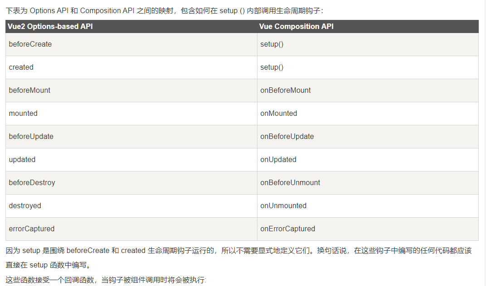

 

 

## 1、常用的钩子函数

vue的常用API：生命周期钩子

 

(1)setup() 

setup() 函数在组件创建 created() 之前执行。

注意：在 setup 中你应该避免使用 this，因为它不会找到组件实例

 

(2)onBeforeMount元素将在初始渲染(挂载)前、onMounted元素将在初始渲染(挂载)后

```
import { onBeforeMount, onMounted } from 'vue';
export default {
  setup() {
    onBeforeMount(() => {
      console.log('V3 beforeMount!');
    })
    onMounted(() => {
      console.log('V3 mounted!');
    })
  }
};
```

 

(3)ref()

在 Vue 3.0 中，我们可以通过一个新的 ref 函数使任何响应式变量在任何地方起作用

ref() 函数可以根据给定的值来创建一个响应式的数据对象，返回值是一个对象，且只包含一个 .value 属性。

在 setup() 函数内，由 ref() 创建的响应式数据返回的是对象，所以需要用 .value 来访问。

```
import { ref } from 'vue'

let count = ref(0);
```

 

一图明白：ref、onMount挂载

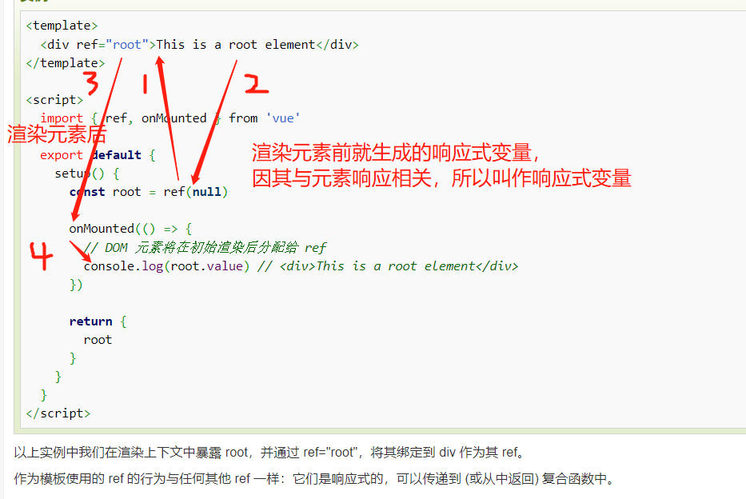

 

 

(4) watchEffect()

```
      watchEffect(() => {
        // 这个副作用在 DOM 更新之前运行，因此，模板引用还没有持有对元素的引用。
        console.log(root.value) // => null
      })
```

 

 

 

 

# 六、Bootstrap5 

(不s zhua)

 

HTML是元素在浏览器中的初始布局

CSS是调整元素的样式

JavaScript是浏览器处理元素的脚本，其中DOM就是管理元素的文档

jquery是在JavaScript中更好地管理元素文档的元素

Bootstrap5是用已经写好的各种**组件库(其实就是写好的元素)**来包裹其它元素，是HTML和CSS的升级

 

 

# 0、下载

 

```
npm install bootstrap
```

为了让 Bootstrap 开发的网站对移动设备友好，确保适当的绘制和触屏缩放，需要在网页的 head 之中添加 viewport meta 标签，如下所示：

```
<meta name="viewport" content="width=device-width, initial-scale=1">
```

width=device-width 表示宽度是设备屏幕的宽度。

initial-scale=1 表示初始的缩放比例。

 

 

## 1、其它组件

不再一一阐述，可以去菜鸟官网查看

 

 

# 七、ElementUI

和Bootstrap5 一样的组件库，更强大

 

官网：

https://element.eleme.cn/#/zh-CN/component/quickstart

 

 

0、安装

```
npm i element-ui -S
```

 

1、修改main.js 

引入分为完整引入和按需引入两种模式，按需引入可以缩小项目的体积，这里我们选择完整引入。

```
import Vue from 'vue';
import ElementUI from 'element-ui';
import 'element-ui/lib/theme-chalk/index.css';
import App from './App.vue';

Vue.use(ElementUI);

new Vue({
  el: '#app',
  render: h => h(App)
});
```

 

2、使用：

在这里阐述，可以去官网看