# 一、python常见提问

 

 

 

 

# 二、python

为什么需要学习python脚本：

场景：在服务器端的日志需要进行筛选出访问的ip进行统计，怎么办？

直接在日志所在的文件夹里面vim写一个.py的脚本，写完保存然后命令行运行即可，非常方便。

不像java这么重量级的启动，每行python命令都相当是带有mian函数执行。

 

甚至可以直接在服务端进行数据库的查询和redis的操作，很方便。

比如写一个python脚本，首先统计出最不常用的redis的key，然后结合定时crontab清除这些key。

 

还可以对cpu的情况进行监控和预警、邮件等等。

 

可以结合chatgpt生成各种各样的脚本进行运维、预警、查询、定时任务等等...

 

## 1 面向对象

以双下划线开头和双下划线结尾的，定义的是特殊方法

```
__foo__: 一般是系统定义名字 ，类似 __init__() 之类的。
```

以单下划线开头的表示的是 protected 类型的变量：

```
_foo: 即保护类型只能允许其本身与子类进行访问，不能用于 from module import *
```

以双下划线开头成员变量和方法：

```
__private_attrs：两个下划线开头，声明该属性为私有，不能在类的外部被使用或直接访问。
在类内部的方法中使用时 self.__private_attrs来访问。
```

两个下划线开头，声明该方法为私有方法，不能在类的外部调用：

```
__private_method：在类的内部调用 self.__private_methods
```

```
class JustCounter:
    __secretCount = 0  # 私有变量
    publicCount = 0    # 公开变量
 
    def count(self):
        self.__secretCount += 1
        self.publicCount += 1
        print self.__secretCount
 
counter = JustCounter()
counter.count()
counter.count()
print counter.publicCount
print counter.__secretCount  # 报错，实例不能访问私有变量
```

Python不允许实例化的类访问私有数据，但你可以使用 object._className__attrName（ 对象名._类名__私有属性名 ）访问属性，参考以下实例：

```
#!/usr/bin/python
# -*- coding: UTF-8 -*-

class Runoob:
    __site = "www.runoob.com"

runoob = Runoob()
print runoob._Runoob__site

//www.runoob.com
```

 

 

 

面向对象

```
class Employee:
    '所有员工的基类'
    empCount = 0

#第一种方法__init__()方法是一种特殊的方法，被称为类的构造函数或初始化方法，当创建了这个类的实例时就会调用该方法
#self 代表类的实例，self 在定义类的方法时是必须有的，虽然在调用时不必传入相应的参数。    
    def __init__(self, name, salary):
        self.name = name
        self.salary = salary
        Employee.empCount += 1
#__del__在对象销毁的时候被调用，当对象不再被使用时，__del__方法运行：del emp1时执行        
    def __del__(self):
      class_name = self.__class__.__name__
      print class_name, "销毁"    

    def displayCount(self):
        print("Total Employee %d" % Employee.empCount)

    def displayEmployee(self):
        print("Name : ", self.name,  ", Salary: ", self.salary)


"创建 Employee 类的第一个对象"
emp1 = Employee("Zara", 2000)
"创建 Employee 类的第二个对象"
emp2 = Employee("Manni", 5000)
emp1.displayEmployee()
emp2.displayEmployee()
print("Total Employee %d" % Employee.empCount)

```

 

类的继承

```
class Parent:        # 定义父类
   parentAttr = 100
   def __init__(self):
      print "调用父类构造函数"
 
   def parentMethod(self):
      print '调用父类方法'
 
   def setAttr(self, attr):
      Parent.parentAttr = attr
 
   def getAttr(self):
      print "父类属性 :", Parent.parentAttr
 
class Child(Parent): # 定义子类
   def __init__(self):
      print "调用子类构造方法"
 
   def childMethod(self):
      print '调用子类方法'
 
c = Child()          # 实例化子类
c.childMethod()      # 调用子类的方法
c.parentMethod()     # 调用父类方法
c.setAttr(200)       # 再次调用父类的方法 - 设置属性值
c.getAttr()          # 再次调用父类的方法 - 获取属性值

//c = Child()          # 实例化子类
c.childMethod()      # 调用子类的方法
c.parentMethod()     # 调用父类方法
c.setAttr(200)       # 再次调用父类的方法 - 设置属性值
c.getAttr()          # 再次调用父类的方法 - 获取属性值
```

如果你的父类方法的功能不能满足你的需求，你可以在子类重写你父类的方法：

```
#!/usr/bin/python
# -*- coding: UTF-8 -*-
 
class Parent:        # 定义父类
   def myMethod(self):
      print '调用父类方法'
 
class Child(Parent): # 定义子类
   def myMethod(self):
      print '调用子类方法'
 
c = Child()          # 子类实例
c.myMethod()         # 子类调用重写方法
```

 

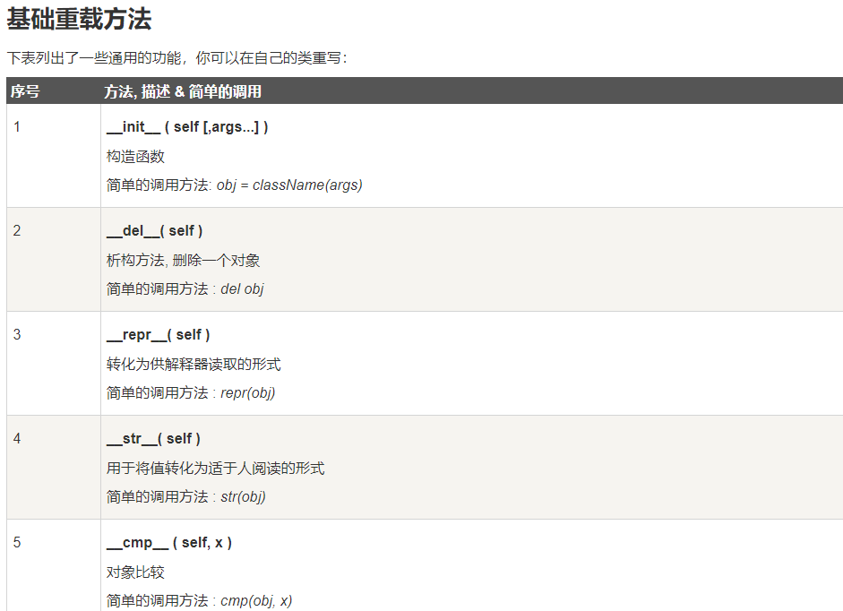

Python同样支持运算符重载：

```
#!/usr/bin/python
 
class Vector:
   def __init__(self, a, b):
      self.a = a
      self.b = b
 
   def __str__(self):
      return 'Vector (%d, %d)' % (self.a, self.b)
   
   def __add__(self,other):
      return Vector(self.a + other.a, self.b + other.b)
 
v1 = Vector(2,10)
v2 = Vector(5,-2)
print v1 + v2
//Vector(7,8)
```

 

 

 

 

 

 

 

 

## 2 规范

 

中文编码只需要在开头备注# -*- coding: UTF-8 -*-

```
#!/usr/bin/python
# -*- coding: UTF-8 -*-
```

 

学习 Python 与其他语言最大的区别就是，Python 的代码块不使用大括号 {} 来控制类，函数以及其他逻辑判断。python 最具特色的就是用缩进来写模块。

缩进的空白数量是可变的，但是所有代码块语句必须包含相同的缩进空白数量，这个必须严格执行。

缩进相同的一组语句构成一个代码块，我们称之代码组。

像if、while、def和class这样的复合语句，首行以关键字开始，以冒号( : )结束，该行之后的一行或多行代码构成代码组。

```
if expression : 
   suite 
elif expression :  
   suite  
else :  
   suite 
```

 

Python语句中一般以新行作为语句的结束符。

但是我们可以使用斜杠（ \）将一行的语句分为多行显示，如下所示

```
total = item_one + \
        item_two + \
        item_three
```

语句中包含 [], {} 或 () 括号就不需要使用多行连接符。如下实例：

```
days = ['Monday', 'Tuesday', 'Wednesday',
        'Thursday', 'Friday']
```

 

Python可以在同一行中使用多条语句，语句之间使用分号(;)分割

```
import sys; x = 'runoob'; sys.stdout.write(x + '\n')
```

 

python 中多行注释使用三个单引号 ''' 或三个双引号 """。

```
'''
这是多行注释，使用单引号。
这是多行注释，使用单引号。
这是多行注释，使用单引号。
'''

"""
这是多行注释，使用双引号。
这是多行注释，使用双引号。
这是多行注释，使用双引号。
"""
```

 

print 默认输出是换行的，如果要实现不换行需要在变量末尾加上逗号 ,。

```
x="a"
y="b"
# 换行输出
print x
print y

print '---------'
# 不换行输出
print x,
print y,

# 不换行输出
print x,y

a
b
---------
a b a b
```

 

## 3 变量

 

Python允许你同时为多个变量赋值。例如：

```
创建一个整型对象，值为1，三个变量被分配到相同的内存空间上
a = b = c = 1
您也可以为多个对象指定多个变量，两个整型对象 1 和 2 分别分配给变量 a 和 b，字符串对象 "john" 分配给变量 c。
a, b, c = 1, 2, "john"
```

 

 

标准数据类型

Python有五个标准的数据类型：

Numbers（数字）
String（字符串）
List（列表）
Tuple（元组）
Dictionary（字典）

***

python支持四种不同的数字类型：

int（有符号整型）
long（长整型，也可以代表八进制和十六进制）
float（浮点型）
complex（复数）

 

Python 中数学运算常用的函数基本都在 math 模块、cmath 模块中。

Python math 模块提供了许多对浮点数的数学运算函数。

Python cmath 模块包含了一些用于复数运算的函数。

要使用 math 或 cmath 函数必须先导入：

```
import math
import cmath

>>> import cmath
>>> cmath.sqrt(-1)
1j
>>> cmath.sqrt(9)
(3+0j)
>>> cmath.sin(1)
(0.8414709848078965+0j)
>>> cmath.log10(100)
(2+0j)
```

 

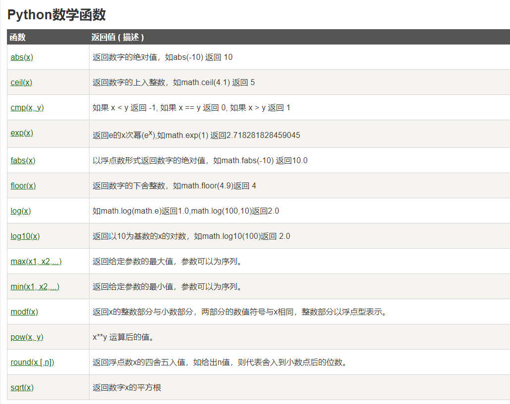

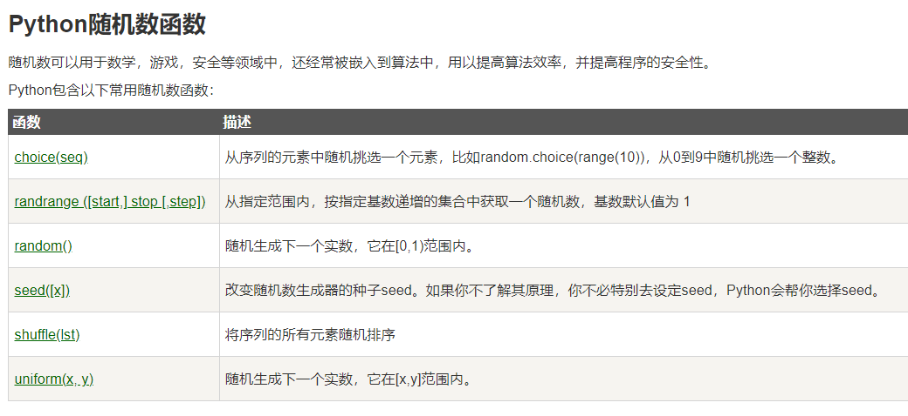

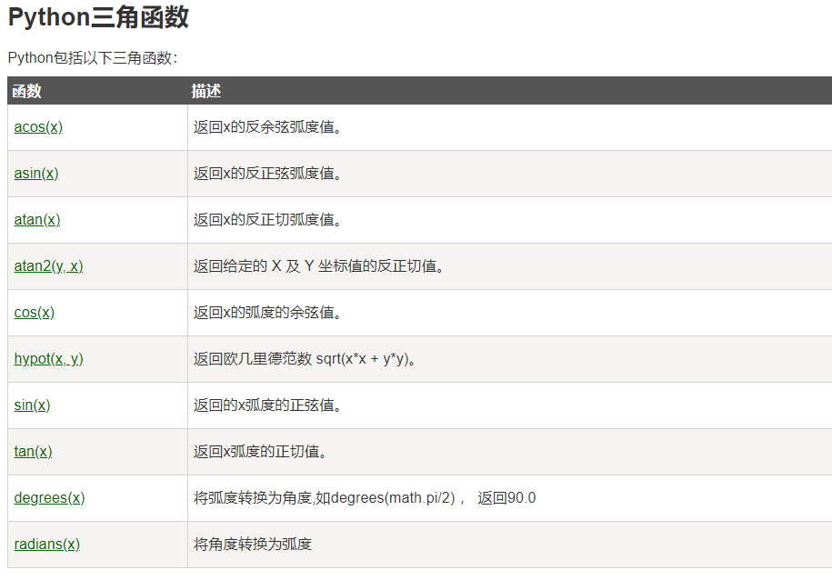

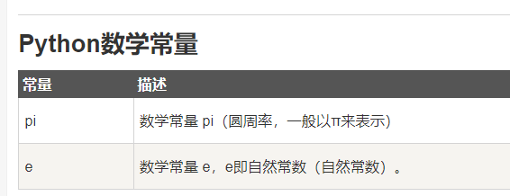

 

***

字符串或串(String)是由数字、字母、下划线组成的一串字符。

python的字串列表有2种取值顺序:

从左到右索引默认0开始的，最大范围是字符串长度少1
从右到左索引默认-1开始的，最大范围是字符串开头

如果你要实现从字符串中获取一段子字符串的话，可以使用 [头下标:尾下标] 来截取相应的字符串，其中下标是从 0 开始算起，[头下标:尾下标] 获取的子字符串包含头下标的字符，但不包含尾下标的字符。

```
>>> s = 'abcdef'
>>> s[1:5]
'bcde'
```

 

加号（+）是字符串连接运算符，星号（*）是重复操作。

```
print str * 2       # 输出字符串两次
print str + "TEST"  # 输出连接的字符串
```

 

Python 支持格式化字符串的输出 。尽管这样可能会用到非常复杂的表达式，但最基本的用法是将一个值插入到一个有字符串格式符 %s 的字符串中。

在 Python 中，字符串格式化使用与 C 中 sprintf 函数一样的语法。

```
print "My name is %s and weight is %d kg!" % ('Zara', 21) 

//以上实例输出结果
My name is Zara and weight is 21 kg!
```

(有点像log.info)

 

Python 中三引号可以将复杂的字符串进行赋值。

Python 三引号允许一个字符串跨多行，字符串中可以包含换行符、制表符以及其他特殊字符。

三引号的语法是一对连续的单引号或者双引号（通常都是成对的用）。

三引号让程序员从引号和特殊字符串的泥潭里面解脱出。一个典型的用例是，当你需要一块HTML或者SQL时，这时当用三引号标记，使用传统的转义字符体系将十分费神。

```
//html
errHTML = '''
<HTML><HEAD><TITLE>
Friends CGI Demo</TITLE></HEAD>
<BODY><H3>ERROR</H3>
<B>%s</B><P>
<FORM><INPUT TYPE=button VALUE=Back
ONCLICK="window.history.back()"></FORM>
</BODY></HTML>
'''
//sql
cursor.execute('''
CREATE TABLE users (  
login VARCHAR(8), 
uid INTEGER,
prid INTEGER)
''')
```

 

Python 中定义一个 Unicode 字符串和定义一个普通字符串一样简单：

引号前小写的"u"表示这里创建的是一个 Unicode 字符串。如果你想加入一个特殊字符，可以使用 Python 的 Unicode-Escape 编码。

```
>>> u'Hello\u0020World !'
u'Hello World !'
```

被替换的 \u0020 标识表示在给定位置插入编码值为 0x0020 的 Unicode 字符（空格符）。

 

 

Python 的字符串内建函数

还有很多，具体请看：https://www.runoob.com/python/python-strings.html

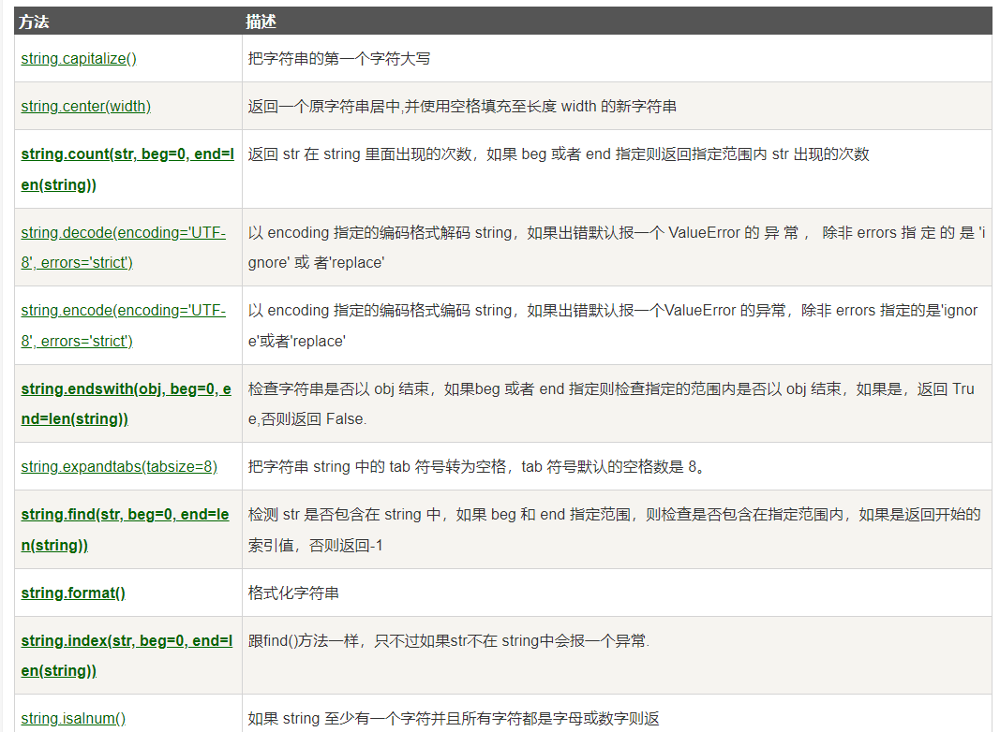

 

 

 

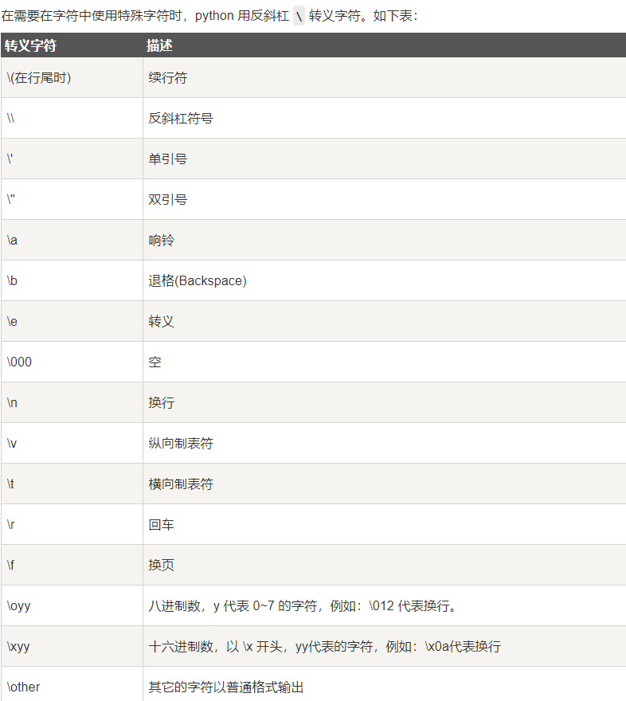

 

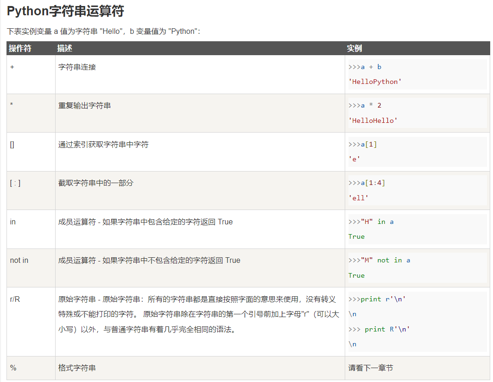

 

***

 

List（列表） 是 Python 中使用最频繁的数据类型。它支持字符，数字，字符串甚至可以包含列表（即嵌套）。

列表中值的切割也可以用到变量 [头下标:尾下标] ，就可以截取相应的列表，从左到右索引默认 0 开始，从右到左索引默认 -1 开始，下标可以为空表示取到头或尾。

加号 + 是列表连接运算符，星号 * 是重复操作。

```
list = [ 'runoob', 786 , 2.23, 'john', 70.2 ]
tinylist = [123, 'john']

print list               # 输出完整列表
print list[0]            # 输出列表的第一个元素
print list[1:3]          # 输出第二个至第三个元素 (不包括第三个，和字符串一样)
print list[2:]           # 输出从第三个开始至列表末尾的所有元素
print tinylist * 2       # 输出列表两次
print list + tinylist    # 打印组合的列表

['runoob', 786, 2.23, 'john', 70.2]
runoob
[786, 2.23]
[2.23, 'john', 70.2]
[123, 'john', 123, 'john']
['runoob', 786, 2.23, 'john', 70.2, 123, 'john']
```

 

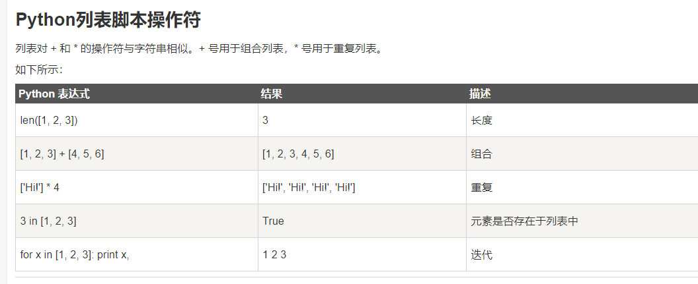

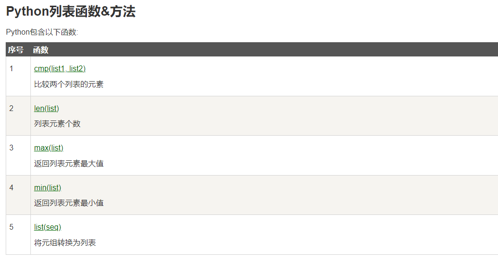

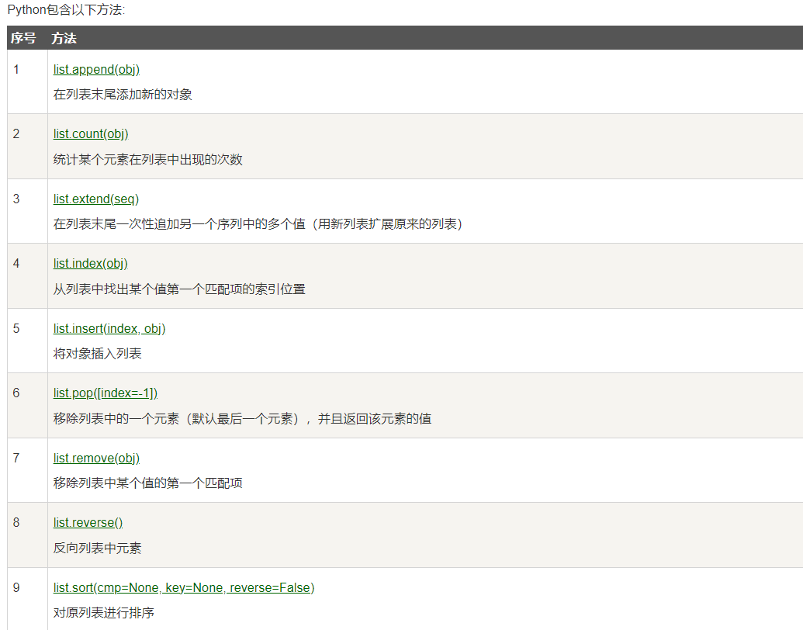

 

 

元组是另一个数据类型，类似于 List（列表）。

元组用 () 标识。内部元素用逗号隔开。但是元组不能二次赋值，相当于只读列表。

```
tuple = ( 'runoob', 786 , 2.23, 'john', 70.2 )
tinytuple = (123, 'john')
 
print tuple               # 输出完整元组
print tuple[0]            # 输出元组的第一个元素
print tuple[1:3]          # 输出第二个至第四个（不包含）的元素 
print tuple[2:]           # 输出从第三个开始至列表末尾的所有元素
print tinytuple * 2       # 输出元组两次
print tuple + tinytuple   # 打印组合的元组

('runoob', 786, 2.23, 'john', 70.2)
runoob
(786, 2.23)
(2.23, 'john', 70.2)
(123, 'john', 123, 'john')
('runoob', 786, 2.23, 'john', 70.2, 123, 'john')
```

 

以下对元组的操作是无效的，因为元组不允许更新，而列表是允许更新的：

```
tuple = ( 'runoob', 786 , 2.23, 'john', 70.2 )

tuple[2] = 1000    # 元组中是非法应用

//终端报错
Traceback (most recent call last):
  File "test.py", line 6, in <module>
    tuple[2] = 1000    # 元组中是非法应用
TypeError: 'tuple' object does not support item assignment
```

 

***

 

字典(dictionary)是除列表以外python之中最灵活的内置数据结构类型。列表是有序的对象集合，字典是无序的对象集合。(和map一样)

字典用"{ }"标识。字典由索引(key)和它对应的值value组成

字典值可以没有限制地取任何 python 对象，既可以是标准的对象，也可以是用户定义的，但键不行。

 

 

```
dict = {}
dict['one'] = "This is one"
dict[2] = "This is two"

print dict['one']          # 输出键为'one' 的值
print dict[2]              # 输出键为 2 的值

This is one
This is two


//----------------
tinydict = {'name': 'runoob','code':6734, 'dept': 'sales'}

print tinydict             # 输出完整的字典
print tinydict.keys()      # 输出所有键
print tinydict.values()    # 输出所有值

{'dept': 'sales', 'code': 6734, 'name': 'runoob'}
['dept', 'code', 'name']
['sales', 6734, 'runoob']

//----------------
tinydict = {'Name': 'Zara', 'Age': 7, 'Class': 'First'}

del tinydict['Name']  # 删除键是'Name'的条目
tinydict.clear()      # 清空字典所有条目
del tinydict          # 删除字典
```

 

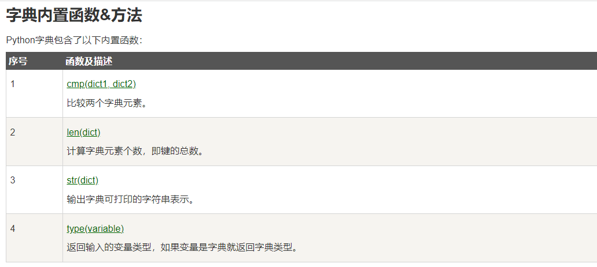

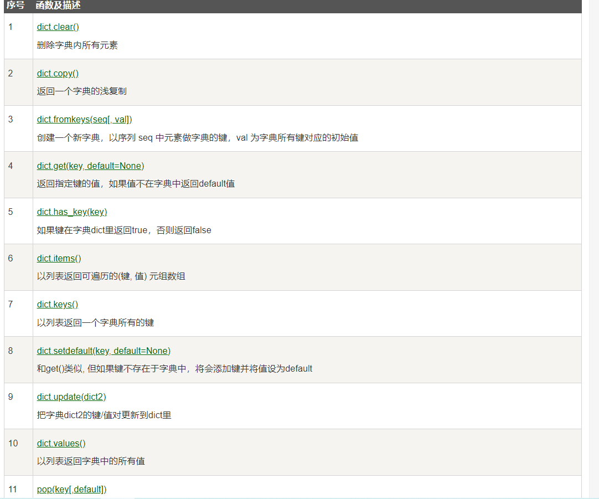

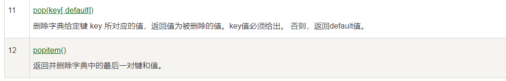

 

 

***

数据类型转换

有时候，我们需要对数据内置的类型进行转换，数据类型的转换，你只需要将**数据类型**作为函数名即可。

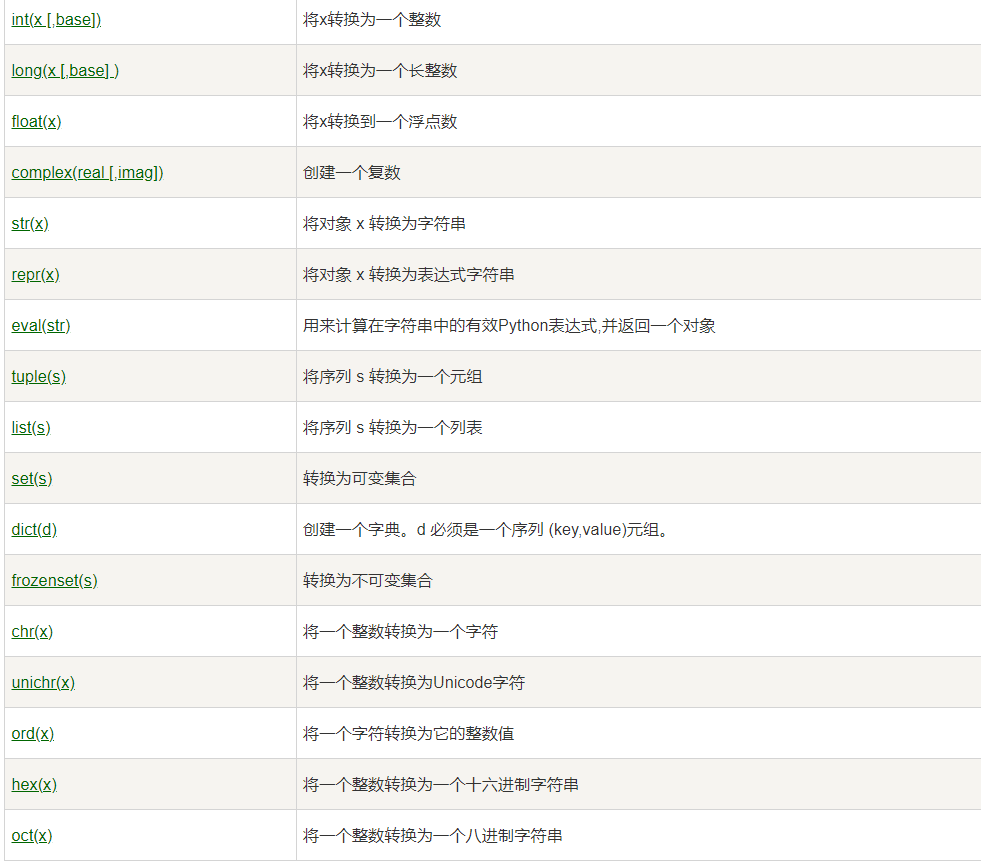

 

***

日期和时间

Python 程序能用很多方式处理日期和时间，转换日期格式是一个常见的功能。

Python 提供了一个 time 和 calendar 模块可以用于格式化日期和时间。

时间间隔是以秒为单位的浮点小数。

每个时间戳都以自从1970年1月1日午夜（历元）经过了多长时间来表示。

Python 的 time 模块下有很多函数可以转换常见日期格式。如函数time.time()用于获取当前时间戳, 如下实例:

```
import time  # 引入time模块
 
ticks = time.time()
print "当前时间戳为:", ticks

//当前时间戳为: 1459994552.51

localtime = time.localtime(time.time())
print "本地时间为 :", localtime

//本地时间为 : time.struct_time(tm_year=2016, tm_mon=4, tm_mday=7, tm_hour=10, tm_min=3, tm_sec=27, tm_wday=3, tm_yday=98, tm_isdst=0)
```

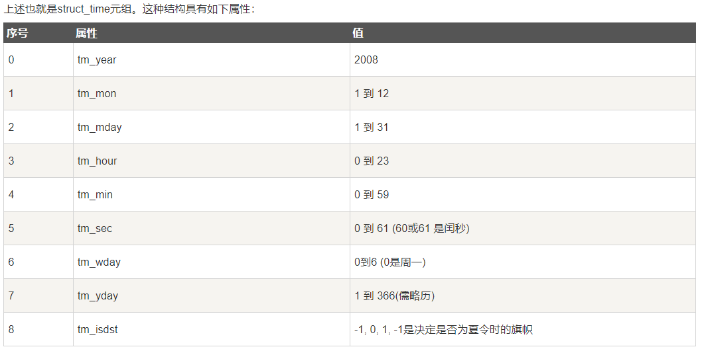

 

获取格式化的时间

你可以根据需求选取各种格式，但是最简单的获取可读的时间模式的函数是asctime():

```
localtime = time.asctime( time.localtime(time.time()) )
print "本地时间为 :", localtime

//本地时间为 : Thu Apr  7 10:05:21 2016

我们可以使用 time 模块的 strftime 方法来格式化日期，：

time.strftime(format[, t])

# 格式化成2016-03-20 11:45:39形式
print time.strftime("%Y-%m-%d %H:%M:%S", time.localtime()) 
 
# 格式化成Sat Mar 28 22:24:24 2016形式
print time.strftime("%a %b %d %H:%M:%S %Y", time.localtime()) 
  
# 将格式字符串转换为时间戳
a = "Sat Mar 28 22:24:24 2016"
print time.mktime(time.strptime(a,"%a %b %d %H:%M:%S %Y"))

//以上实例输出结果：
2016-04-07 10:25:09
Thu Apr 07 10:25:09 2016
1459175064.0
```

 

获取某月日历

Calendar模块有很广泛的方法用来处理年历和月历，例如打印某月的月历：

```
import calendar
 
cal = calendar.month(2016, 1)
print "以下输出2016年1月份的日历:"
print cal

//以下输出2016年1月份的日历:
    January 2016
Mo Tu We Th Fr Sa Su
             1  2  3
 4  5  6  7  8  9 10
11 12 13 14 15 16 17
18 19 20 21 22 23 24
25 26 27 28 29 30 31
```

 

其它：https://www.runoob.com/python/python-date-time.html

 

## 4 运算符

 

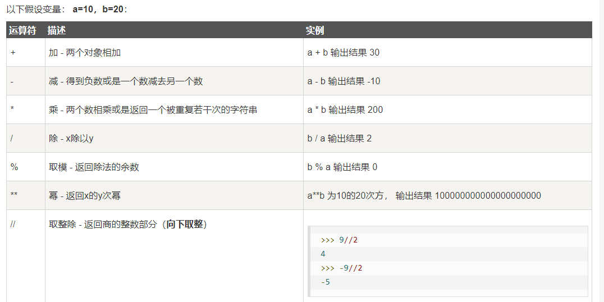

 

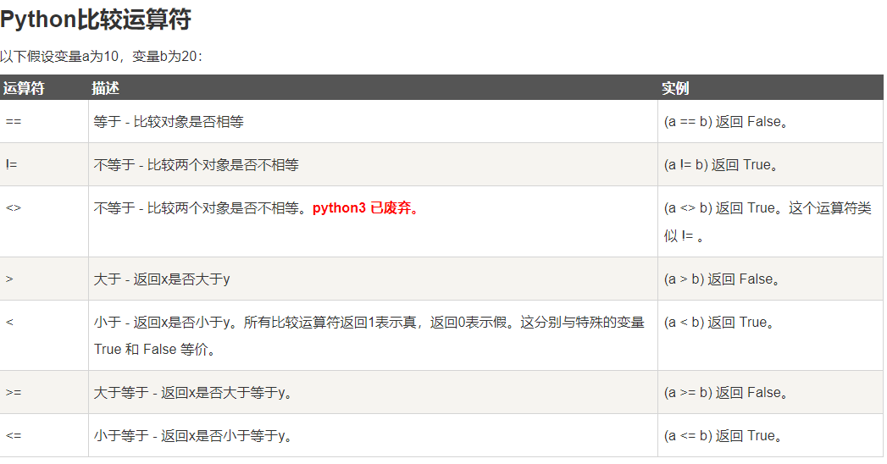

 

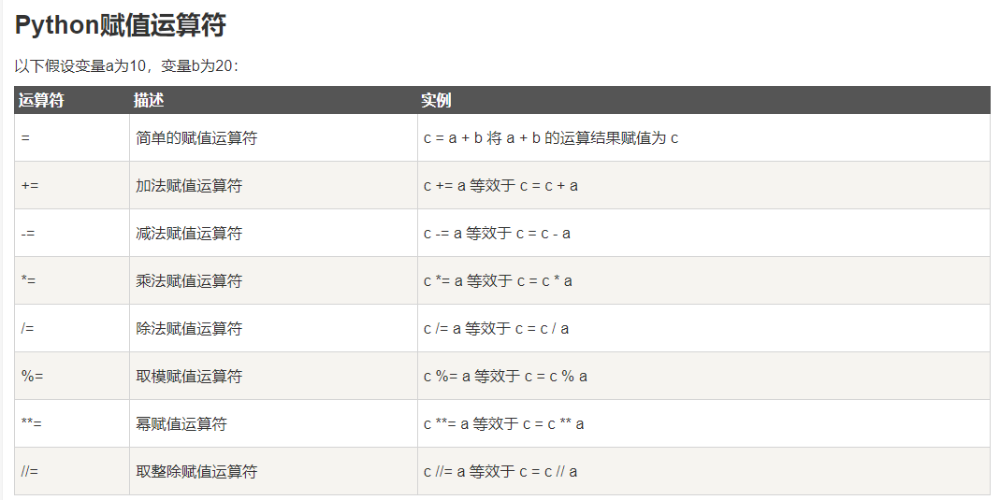

 

 

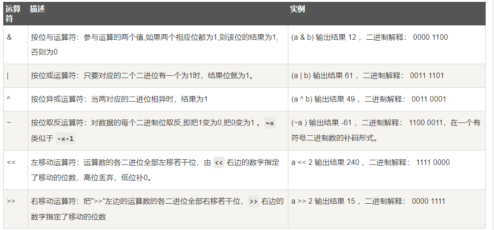

 

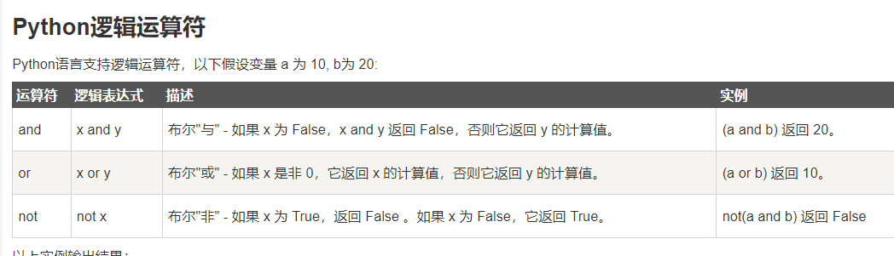

 

 

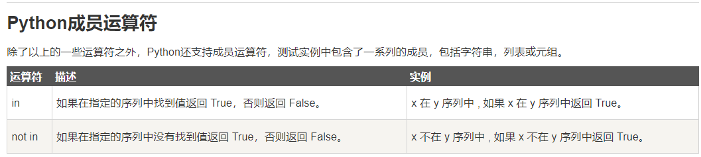

(这个有点像sql了)

 

 

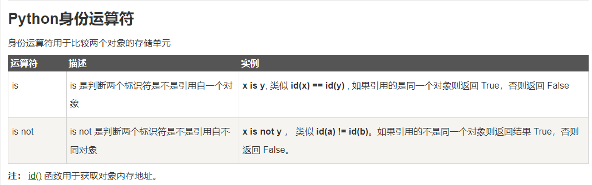

 

 

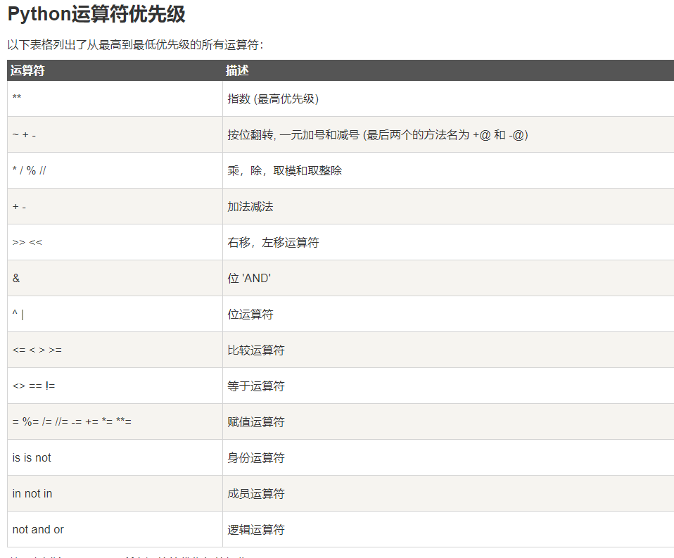

 

## 5、条件语句

 

Python 编程中 if 语句用于控制程序的执行，基本形式为：

```
if 判断条件1:
    执行语句1……
elif 判断条件2:
    执行语句2……
elif 判断条件3:
    执行语句3……
else:
    执行语句4……
```

你也可以在同一行的位置上使用if条件判断语句，如下实例：

```
var = 100 
 
if ( var  == 100 ) : print "变量 var 的值为100" 
```

 

***

Python 编程中 while 语句用于循环执行程序，即在某条件下，循环执行某段程序，以处理需要重复处理的相同任务。其基本形式为：

```
while 判断条件(condition)：
    执行语句(statements)……
```

例子

```
count = 0
while (count < 9):
   print 'The count is:', count
   count = count + 1
```

 

在 python 中，while … else 在循环条件为 false 时执行 else 语句块：

```
count = 0
while count < 5:
   print count, " is  less than 5"
   count = count + 1
else:
   print count, " is not less than 5"
```

类似 if 语句的语法，如果你的 while 循环体中只有一条语句，你可以将该语句与while写在同一行中， 如下所示：

```
flag = 1
 
while (flag): print 'Given flag is really true!'
```

 

***

for循环的语法格式如下：

```
for iterating_var in sequence:
   statements(s)
```

例子

```
fruits = ['banana', 'apple',  'mango']
for fruit in fruits:        # 第二个实例
   print ('当前水果: %s'% fruit)
```

 

另外一种执行循环的遍历方式是通过索引，如下实例：

```
fruits = ['banana', 'apple',  'mango']
for index in range(len(fruits)):
   print ('当前水果 : %s' % fruits[index])
```

 

在 python 中，for … else 表示这样的意思，for 中的语句和普通的没有区别，else 中的语句会在循环正常执行完（即 for 不是通过 break 跳出而中断的）的情况下执行，while … else 也是一样。

```
for num in range(10,20):  # 迭代 10 到 20 之间的数字
   for i in range(2,num): # 根据因子迭代
      if num%i == 0:      # 确定第一个因子
         j=num/i          # 计算第二个因子
         print ('%d 等于 %d * %d' % (num,i,j))
         break            # 跳出当前循环
   else:                  # 循环的 else 部分
      print ('%d 是一个质数' % num)
```

 

***

Python break语句，就像在C语言中，打破了最小封闭for或while循环。

break语句用来终止循环语句，即循环条件没有False条件或者序列还没被完全递归完，也会停止执行循环语句。

reak语句用在while和for循环中。

如果您使用嵌套循环，break语句将停止执行最深层的循环，并开始执行下一行代码。

 

***

Python continue 语句跳出本次循环，而break跳出整个循环。

continue 语句用来告诉Python跳过当前循环的剩余语句，然后继续进行下一轮循环。

continue语句用在while和for循环中。

 

***

Python pass 是空语句，是为了保持程序结构的完整性。

pass 不做任何事情，一般用做占位语句。（有点类似于todo，让别人知道这里又占位）

 

***

 

## 6、函数

 

函数是组织好的，可重复使用的，用来实现单一，或相关联功能的代码段。

函数能提高应用的模块性，和代码的重复利用率。你已经知道Python提供了许多内建函数，比如print()。但你也可以自己创建函数，这被叫做用户自定义函数。

```
def functionname( parameters ):
   "函数_文档字符串"
   function_suite
   return [expression]
```

例子：

```

# 传可变对象实例

def changeme(mylist):
    "修改传入的列表"
    mylist.append([1, 2, 3, 4])
    print("函数内取值: ", mylist)
    return


# 调用changeme函数
mylist = [10, 20, 30]
changeme(mylist)
print("函数外取值: ", mylist)

print("------------------------------")

# 默认参数


def printinfo(name, age=35):
    "打印任何传入的字符串"
    print("Name: ", name)
    print("Age ", age)
    return


# 调用printinfo函数
printinfo(age=50, name="miki")
printinfo(name="miki")

print("------------------------------")

# 不定长参数


def printinfo(arg1, *vartuple):
    "打印任何传入的参数"
    print("输出: ")
    print(arg1)
    for var in vartuple:
        print(var)
    return


# 调用printinfo 函数
printinfo(10)
printinfo(70, 60, 50)

print("------------------------------")

# 匿名函数lambda
# python 使用 lambda 来创建匿名函数


def sum(arg1, arg2): return arg1 + arg2


# 调用sum函数
print("相加后的值为 : ", sum(10, 20))
print("相加后的值为 : ", sum(20, 20))

```

 

 

当你导入一个模块，Python 解析器对模块位置的搜索顺序是：

1、当前目录
2、如果不在当前目录，Python 则搜索在 shell 变量 PYTHONPATH 下的每个目录。
3、如果都找不到，Python会察看默认路径。UNIX下，默认路径一般为/usr/local/lib/python/。
模块搜索路径存储在 system 模块的 sys.path 变量中。变量里包含当前目录，PYTHONPATH和由安装过程决定的默认目录。

 

把一个模块的所有内容全都导入到当前的命名空间也是可行的，只需使用如下声明：

```
我们想一次性引入 math 模块中所有的东西，语句如下：
from math import *
```

 

 

根据调用地方的不同，globals() 和 locals() 函数可被用来返回全局和局部命名空间里的名字。

如果在函数内部调用 locals()，返回的是所有能在该函数里访问的命名。

如果在函数内部调用 globals()，返回的是所有在该函数里能访问的全局名字。

 

 

	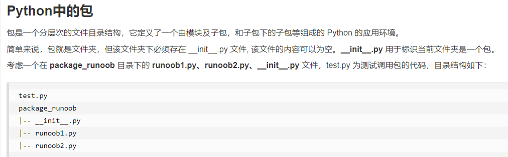

定义初始化函数：(相当于同级包test.py的静态类)

```
//现在，在 package_runoob 目录下创建 __init__.py
#!/usr/bin/python
# -*- coding: UTF-8 -*-
 
if __name__ == '__main__':
    print '作为主程序运行'
else:
    print 'package_runoob 初始化'
```

然后我们在 package_runoob 同级目录下创建 test.py：

```
# 导入 Phone 包
from package_runoob.runoob1 import runoob1
from package_runoob.runoob2 import runoob2
 
runoob1()
runoob2()
```

输出

```
package_runoob 初始化
I'm in runoob1
I'm in runoob2
```

 

### json

son.dumps 用于将 Python 对象编码成 JSON 字符串。

```
#!/usr/bin/python
import json

data = [ { 'a' : 1, 'b' : 2, 'c' : 3, 'd' : 4, 'e' : 5 } ]

data2 = json.dumps(data)
print(data2)

//[{"a": 1, "c": 3, "b": 2, "e": 5, "d": 4}]


```

json.loads 用于解码 JSON 数据。该函数返回 Python 字段的数据类型。

```
#!/usr/bin/python
import json

jsonData = '{"a":1,"b":2,"c":3,"d":4,"e":5}';

text = json.loads(jsonData)
print(text)
//{u'a': 1, u'c': 3, u'b': 2, u'e': 5, u'd': 4}
```

 

 

## 7、io

 

### 读取键盘输入

ython提供了两个内置函数从标准输入读入一行文本，默认的标准输入是键盘。如下：

raw_input
inputython提供了两个内置函数从标准输入读入一行文本，默认的标准输入是键盘。如下：

raw_input
input

 

raw_input函数
raw_input([prompt]) 函数从标准输入读取一个行，并返回一个字符串（去掉结尾的换行符）：

```
#!/usr/bin/python
# -*- coding: UTF-8 -*- 
 
str = raw_input("请输入：")
print "你输入的内容是: ", str
```

这将提示你输入任意字符串，然后在屏幕上显示相同的字符串。当我输入"Hello Python！"，它的输出如下：

```
请输入：Hello Python！
你输入的内容是:  Hello Python！
```

 

### 打开和关闭文件

现在，您已经可以向标准输入和输出进行读写。现在，来看看怎么读写实际的数据文件。

Python 提供了必要的函数和方法进行默认情况下的文件基本操作。你可以用 file 对象做大部分的文件操作。

 

write()方法可将任何字符串写入一个打开的文件。需要重点注意的是，Python字符串可以是二进制数据，而不是仅仅是文字。

write()方法不会在字符串的结尾添加换行符('\n')：

read（）方法从一个打开的文件中读取一个字符串。需要重点注意的是，Python字符串可以是二进制数据，而不是仅仅是文字。

 

```
#!/usr/bin/python
# -*- coding: UTF-8 -*-
 
# 打开一个文件
fo = open("foo.txt", "w")
print "文件名: ", fo.name
print "是否已关闭 : ", fo.closed
print "访问模式 : ", fo.mode
print "末尾是否强制加空格 : ", fo.softspace
# 写入
fo.write( "www.runoob.com!\nVery good site!\n")
# 读取
str = fo.read(10)
print "读取的字符串是 : ", str
# 关闭打开的文件
fo.close()


//文件名:  foo.txt
是否已关闭 :  False
访问模式 :  w
末尾是否强制加空格 :  0
```

 

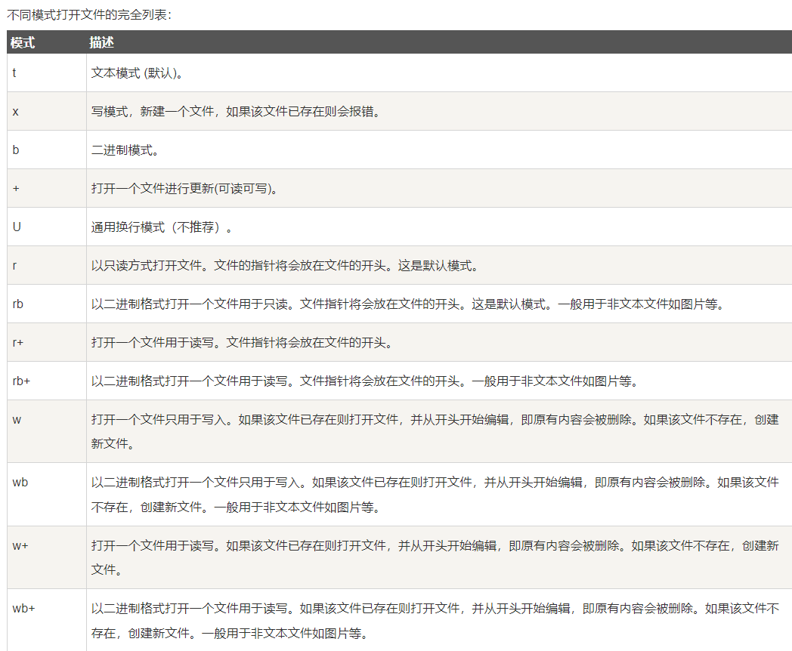

 

 

rename() 方法需要两个参数，当前的文件名和新文件名。

```
#!/usr/bin/python
# -*- coding: UTF-8 -*-

import os
 
# 重命名文件test1.txt到test2.txt。
os.rename( "test1.txt", "test2.txt" )
# 删除一个已经存在的文件test2.txt
os.remove("test2.txt")

# 创建目录test
os.mkdir("test")

# 将当前目录改为"/home/newdir"
os.chdir("/home/newdir")

# 给出当前的目录
print os.getcwd()

# 删除”/tmp/test”目录
os.rmdir( "/tmp/test"  )
```

 

 

文件file：

具体请看：https://www.runoob.com/python/file-methods.html

 

os 模块提供了非常丰富的方法用来处理文件和目录。常用的方法如下表所示：

具体请看：https://www.runoob.com/python/os-file-methods.html

 

 

## 8、异常

 

 

```
#!/usr/bin/python
# -*- coding: UTF-8 -*-

try:
    fh = open("testfile", "w")
    try:
        fh.write("这是一个测试文件，用于测试异常!!")
    finally:
        print "关闭文件"
        fh.close()
except IOError:
    print "Error: 没有找到文件或读取文件失败"
```

当在try块中抛出一个异常，立即执行finally块代码。

finally块中的所有语句执行后，异常被再次触发，并执行except块代码。

 

一个异常可以带上参数，可作为输出的异常信息参数。

你可以通过except语句来捕获异常的参数，如下所示：

```
#!/usr/bin/python
# -*- coding: UTF-8 -*-

# 定义函数
def temp_convert(var):
    try:
        return int(var)
    except ValueError, Argument:
        print "参数没有包含数字\n", Argument

# 调用函数
temp_convert("xyz")
```

Argument其实就是本方法的入参！

 

## 9、正则表达式

具体看：https://www.runoob.com/python/python-reg-expressions.html

 

 

## 10、数据库

 

 

```
#!/usr/bin/python
# -*- coding: UTF-8 -*-

# PyMysql的安装很简单：pip install pymysql
import pymysql


try:
    # 打开数据库连接
    db = pymysql.connect(host='10.92.226.28', user='SCPTPMS',
                         passwd='MS@123nfdw', port=3306, db='scptpms_test')
    print('连接成功！')
except:
    print('连接失败!')
    # 就算走了except，还是会继续往下走的，只不过是会打印东西

# 使用cursor()方法获取操作游标
cursor = db.cursor()

sql = "SELECT mrsp.settle_month as settleMonth,mrsp.unit_id as unitId  FROM ms_result_smoffi_plant mrsp"

# 使用execute方法执行SQL语句
cursor.execute(sql)

# 使用 fetchone() 方法获取一条数据
data = cursor.fetchone()

# fetchone(): 该方法获取下一个查询结果集。结果集是一个对象
# fetchall(): 接收全部的返回结果行.
# rowcount: 这是一个只读属性，并返回执行execute()方法后影响的行数。
# try:
#     # 执行SQL语句
#     cursor.execute(sql)
#     # 提交修改
#     db.commit()
#     print('数据删除成功')
# except:
#     # 发生错误时回滚
#     db.rollback()

# 获取所有记录列表（py是对空格极其敏感的，注意空格的可能胡导致的错误）
results = cursor.fetchall()
for row in results:
    settleMonth = row[0]
    unitId = row[1]
    # 打印结果
    # print('数据查询成功！')
    print("settleMonth=%s,unitId=%s" %
          (settleMonth, unitId))

# 关闭数据库连接
db.close()

```

 

 

 

## 11、web编程

和网站相关的，比如爬虫

 

### CGI编程

这里一般用java来做，python也可以：

具体请看：https://www.runoob.com/python/python-cgi.html

 

### urllib

https://www.runoob.com/python3/python-urllib.html

Python urllib 库用于操作网页 URL，并对网页的内容进行抓取处理。

 

### requests

https://www.runoob.com/python3/python-requests.html

Python 内置了 requests 模块，该模块主要用来发 送 HTTP 请求，requests 模块比 urllib 模块更简洁。

 

 

## 12、网络编程

 

这里一般用java的netty来做，python也可以：

 

具体请看：https://www.runoob.com/python/python-socket.html

 

 

## 13、多线程

 

 

使用线程可以把占据长时间的程序中的任务放到后台去处理。
用户界面可以更加吸引人，这样比如用户点击了一个按钮去触发某些事件的处理，可以弹出一个进度条来显示处理的进度
程序的运行速度可能加快

 

```
#!/usr/bin/python
# -*- coding: UTF-8 -*-
 
import thread
import time
 
# 为线程定义一个函数
def print_time( threadName, delay):
   count = 0
   while count < 5:
      time.sleep(delay)
      count += 1
      print "%s: %s" % ( threadName, time.ctime(time.time()) )
 
# 创建两个线程
try:
   thread.start_new_thread( print_time, ("Thread-1", 2, ) )
   thread.start_new_thread( print_time, ("Thread-2", 4, ) )
except:
   print "Error: unable to start thread"
 
while 1:
   pass
```

 

 

## 14、GUI可视化界面编程

 

具体请看：https://www.runoob.com/python/python-gui-tkinter.html