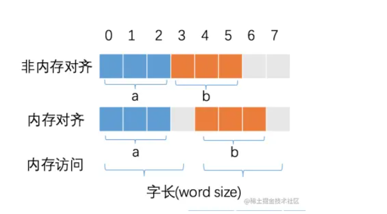

# 一、Go基础


# 二、核心


## 1、GPM模型

先看图，挺好理解：


G（Goroutine(哥楼停)）： 即Go协程，每个go关键字都会创建一个协程。

P（Processor）： 处理器  (逻辑线程)（Go中定义的一个摡念，非CPU），包含运行Go代码的必要资源，用来调度 G 和 M 之间的关联关系，其数量可通过 GOMAXPROCS() 来设置，默认为核心数。

M（Machine）：工作线程（真是线程），在Go中称为Machine，数量对应真实的CPU数（真正干活的对象）。


M必须拥有P才可以执行G中的代码；P含有一个包含多个G的队列；P可以调度G交由M执行。


常问的问题：

### 1、为什么需要协程：

答案：以前线程之前的切换太耗费cpu之前的切换，所以引出了一个GMP模型，就是加了一个P处理器，用协程代替线程去执行任务，而这些协程队列有P处理器连接这线程，就能避免线程之间切换，所以性能更好。

还有就是协程的内存是使用栈内存，只有几kb，所以能提供更大的并发数却占用很小的内存。

再有，协程之间可以通过channel来通信。


### 2、调度(器)策略：

队列轮转：

P 会周期性的将G调度到M中执行，执行一段时间后，保存上下文，将G放到队列尾部，然后从队列中再取出一个G进行调度。

除此之外，P还会周期性的查看全局队列是否有G等待调度到M中执行。


系统调用：

当G0(新协程)即将**进入系统调用时**，M0将释放P，进而某个空闲的M1(可能是线程池或新建的)获取P，继续执行P队列中剩下的G。

当G0**系统调用结束后**，如果有空闲的P，则获取一个P，继续执行G0。

如果没有，则将G0放入全局队列，等待被其他的P调度。然后M0将进入缓存池睡眠。


## 2、channel通道

(把channel当成是创建一个分布式的redission中的list即可)


作用：承接上面的Goroutine协程，用于协程之间的通信。


Channel 可**以理解是一个先进先出的队列，通过管道进行通信,发送一个数据到Channel和从Channel接收一个数据都是原子性的。不要通过共享内存来通信，而是通过通信来共享内存，前者就是传统的加锁，后者就是Channel。设计Channel的主要目的就是在多任务间传递数据的，本身就是安全的。**

(一定要背下来)


创建：

    make(chan Type)  //等价于make(chan Type, 0)
    make(chan Type, capacity)  
    //channel 无缓冲时，发送阻塞直到数据被接收，接收阻塞直到读到数据；channel有缓冲时，当缓冲满时发送阻塞，当缓冲空时接收阻塞。
    
    例子：
    c := make(chan int)


赋值：

```
    channel := make(chan int)  //创造channel(像是创造了一个redission的list)
    channel <- value      //发送value到channel() （放入list）
    <-channel             //接收并将其丢弃  (从list拿出来)
    x := <-channel        //从channel中接收数据，并赋值给x  (从list拿出来并赋值给x)
    x, ok := <-channel    //功能同上，同时检查通道是否已关闭或者是否为空  (从list拿出来并赋值给x，并检查redis的list是否还存在)
```


在Goroutine协程中使用：

（并没有通信，只是用来装一些数据）

```
package main
 
import (
    "fmt"
)
 
func main() {
    c := make(chan int)
 
    go func() {
        for i := 0; i < 5; i++ {
            c <- i
        }
        //关闭通道，能取不能存
        close(c)
    }()
 
    for {
        //ok为true说明channel没有关闭，为false说明管道已经关闭，如果ok为ture则执行{}
        if data, ok := <-c; ok {
            fmt.Println(data)
        } else {
            break
        }
    }
 
    fmt.Println("Finished")
}
```

也可以用range(阻塞获取)去操作：

```
package main
 
import (
    "fmt"
)
 
func main() {
    c := make(chan int)
 
    go func() {
        for i := 0; i < 5; i++ {
            c <- i
        }
        close(c)
    }()
 
 //range的差别就在：有数据就返回，无数据就会阻塞；用<-c就不会这样阻塞
    for data := range c {
        fmt.Println(data)
    }
    fmt.Println("Finished")
}
```


一定要关闭通道，就可以不再让人写数据，这样也不会一直去读了，因为这样会阻塞线程。


## 3、select


对于上面的range去读取channel(车闹)的弊端：只能监控一个channel并进行读取。

如果想要进行多个channel的监控并进行无阻塞时的读取，就需要select来做监控了。


select的用法与switch语言非常类似，由select开始一个新的选择块，每个选择条件由case语句来描述。

与switch语句相比，select有比较多的限制，其中最大的一条限制就是每个case语句里**必须是一个IO操作**，大致的结构如下：

```
   select {
    case <- chan1:
        // 如果chan1成功读到数据，则进行该case处理语句
    case chan2 <- 1:
        // 如果成功向chan2写入数据，则进行该case处理语句
    default:
        // 如果上面都没有成功，则进入default处理流程
    }
```


**这样做的好处就是多路复用，只要通道同有数据来，就会被读取进行操作，无论是那个通道都行，这是非常好的操作**。

这里就可以谈redis的多路复用io、qq通信


## 4、goroutine


### (1)Context

Context（上下文）是Golang应用开发常用的并发控制技术 ，它可以控制一组呈树状结构的goroutine，每个goroutine拥有相同的上下文。Context 是并发安全的，主要是用于控制多个协程之间的协作、取消操作。


#### (2)竞态

资源竞争，就是在程序中，同一块内存同时被多个 goroutine 访问。 我们使用 go build、go run、go test 命令时，添加 -race 标识可以检查代码中是否存在资源竞争。

解决这个问题，我们可以给资源进行加锁，让其在同一时刻只能被一个协程来操作。

- sync.Mutex(目test？)
- sync.RWMutex


(2.1)go 中除了加 Mutex 锁以外还有哪些方式安全读写共享变量？

Go 中 Goroutine 可以通过 Channel 进行安全读写共享变量。


（3）协程和线程和进程的区别？

进程: 进程是具有一定独立功能的程序，进程是系统资源分配和调度的最小单位。 每个进程都有自己的独立内存空间，不同进程通过进程间通信来通信。由于进程比较重量，占据独立的内存，所以上下文进程间的切换开销（栈、寄存器、虚拟内存、文件句柄等）比较大，但相对比较稳定安全。

线程: 线程是进程的一个实体,线程是内核态,而且是CPU调度和分派的基本单位,它是比进程更小的能独立运行的基本单位。线程间通信主要通过共享内存，上下文切换很快，资源开销较少，但相比进程不够稳定容易丢失数据。

协程: 协程是一种用户态的轻量级线程，协程的调度完全是由用户来控制的。协程拥有自己的寄存器上下文和栈。 协程调度切换时，将寄存器上下文和栈保存到其他地方，在切回来的时候，恢复先前保存的寄存器上下文和栈，直接操作栈则基本没有内核切换的开销，可以不加锁的访问全局变量，所以上下文的切换非常快。


- 一个线程可以有多个协程
- 线程、进程都是同步机制，而协程是异步
- 协程可以保留上一次调用时的状态，当过程重入时，相当于进入了上一次的调用状态
- 协程是需要线程来承载运行的，所以协程并不能取代线程


# 三、其它


## 1、golang中new和make的区别？

- make 仅用来分配及初始化类型为 slice(s莱)、map、chan 的数据。
- new 可分配任意类型的数据，根据传入的类型申请一块内存，返回指向这块内存的指针，即类型 *Type。


## 2、struct类型

- 相同struct类型的可以比较
- 不同struct类型的不可以比较,编译都不过，类型不匹配


### 2.0、空 struct{} 占用空间么

空结构体 struct{} 实例不占据任何的内存空间。

因为空结构体不占据内存空间，因此被广泛作为各种场景下的占位符使用。

如：将 map 作为集合(Set)使用时，可以将值value类型定义为空结构体，仅作为占位符使用即可。

```
type Set map[string]struct{}

func (s Set) Has(key string) bool {
	_, ok := s[key]
	return ok
}

func (s Set) Add(key string) {
	s[key] = struct{}{}
}

func (s Set) Delete(key string) {
	delete(s, key)
}

func main() {
	s := make(Set)
	s.Add("Tom")
	s.Add("Sam")
	fmt.Println(s.Has("Tom"))
	fmt.Println(s.Has("Jack"))
}
```


### 2.1、那两个 interface 可以比较吗？

- 可以的，可以判断类型是否一样


### 2.2、什么是 rune 类型？

- uint8 类型，或者叫 byte 型，代表了 ASCII 码的一个字符。
- rune 类型，代表一个 UTF-8 字符，当需要处理中文、日文或者其他复合字符时，则需要用到 rune 类型

```
package main
import "fmt"

func main() {
    var str = "hello 你好" //思考下 len(str) 的长度是多少？
    
    //golang中string底层是通过byte数组实现的，直接求len 实际是在按字节长度计算  
    //所以一个汉字占3个字节算了3个长度
    fmt.Println("len(str):", len(str))  // len(str): 12

    //通过rune类型处理unicode字符
    fmt.Println("rune:", len([]rune(str))) //rune: 8
}
```


## 3、map

Go中map如果要实现顺序读取的话，可以先把map中的key，通过sort包排序


## 4、Slice

若 slice 容量小于1024个元素，那么扩容的时候slice的cap就翻番，乘以2；一旦元素个数超过1024个元素，增长因子就变成1.25，即每次增加原来容量的四分之一。

若 slice 容量够用，则将新元素追加进去，slice.len++，返回原 slice

若 slice 容量不够用，将 slice 先扩容，扩容得到新 slice，将新元素追加进新 slice，slice.len++，返回新 slice。


## 5、 常见的垃圾回收算法

引用计数：每个对象维护一个引用计数，当被引用对象被创建或被赋值给其他对象时引用计数自动加 +1；如果这个对象被销毁，则计数 -1 ，当计数为 0 时，回收该对象。

- 优点：对象可以很快被回收，不会出现内存耗尽或到达阀值才回收。

- 缺点：**不能很好的处理循环引用**

  

标记-清除：从根变量开始遍历所有引用的对象，引用的对象标记“被引用”，没有被标记的则进行回收。

- 优点：解决了引用计数的缺点。

- 缺点：需要 STW（stop the world），暂时停止程序运行。

  

**分代收集**：按照对象生命周期长短划分不同的代空间，生命周期长的放入老年代，短的放入新生代，不同代有不同的回收算法和回收频率。

- 优点：回收性能好

- 缺点：算法复杂

  

三色标记法

- 初始状态下所有对象都是白色的。
- 从根节点开始遍历所有对象，把遍历到的对象变成灰色对象
- 遍历灰色对象，将灰色对象引用的对象也变成灰色对象，然后将遍历过的灰色对象变成黑色对象。
- 循环步骤3，直到灰色对象全部变黑色。
- 通过写屏障(write-barrier)检测对象有变化，重复以上操作
- 收集所有白色对象（垃圾）。


为了避免在 GC 的过程中，对象之间的引用关系发生新的变更，使得GC的结果发生错误（如GC过程中新增了一个引用，但是由于未扫描到该引用导致将被引用的对象清除了），停止所有正在运行的协程。

STW对性能有一些影响，Golang目前已经可以做到1ms以下的STW。

- **为了避免GC的过程中新修改的引用关系到GC的结果发生错误**，我们需要进行STW。但是STW会影响程序的性能，所以我们要通过写**屏障技术(不让修改)**尽可能地缩短STW的时间。


### 5.1内存泄漏

Goroutine 需要维护执行用户代码的上下文信息，在运行过程中需要消耗一定的内存来保存这类信息，如果一个程序持续不断地产生新的 goroutine，且不结束已经创建的 goroutine 并复用这部分内存，就会造成内存泄漏的现象。

**(其实就是协程一直持有这部分的内存)**


### 5.2 **内存泄露如何排查**

可以通过Go自带的工具pprof或者使用**Gops**去检测诊断当前在系统上运行的Go进程的占用的资源。

(go ps)


## 6、Go语言函数传参是值类型还是引用类型？


在Go语言中只存在值传递，要么是值的副本，要么是指针的副本。

无论是值类型的变量还是引用类型的变量亦或是指针类型的变量作为参数传递都会发生值拷贝，开辟新的内存空间。


## 7、Go语言中的内存对齐了解吗


CPU 访问内存时，并不是逐个字节访问，而是以字长（word size）为单位访问。**比如 32 位的 CPU ，字长为 4 字节，那么 CPU 访问内存的单位也是 4 字节。**

CPU 始终以字长访问内存，如果不进行内存对齐，很可能增加 CPU 访问内存的次数，例如：




变量 a、b 各占据 3 字节的空间，内存对齐后，a、b 占据 4 字节空间，CPU 读取 b 变量的值只需要进行一次内存访问。如果不进行内存对齐，CPU 读取 b 变量的值需要进行 2 次内存访问。第一次访问得到 b 变量的第 1 个字节，第二次访问得到 b 变量的后两个字节。

简言之：合理的内存对齐可以提高内存读写的性能，并且便于实现变量操作的原子性。


## 8、go 打印时 %v %+v %#v 的区别？

- %v 只输出所有的值；
- %+v 先输出字段名字，再输出该字段的值；
- %#v 先输出结构体名字值，再输出结构体（字段名字+字段的值）；

```
package main
import "fmt"
 
type student struct {
	id   int32
	name string
}
 
func main() {
	a := &student{id: 1, name: "微客鸟窝"}

	fmt.Printf("a=%v	\n", a) // a=&{1 微客鸟窝}	
	fmt.Printf("a=%+v	\n", a) // a=&{id:1 name:微客鸟窝}	
	fmt.Printf("a=%#v	\n", a) // a=&main.student{id:1, name:"微客鸟窝"}
}
```


# 三、基础


## 1、var和func

```
package main

import (
    "fmt"
)

//常量作枚举
const(
	pro1="峰时段"
	pro2="平时段"
	pro3="谷时段"
)

//常量作枚举,并使用iota实现自增(注意iota只能使用在const类型)
const(
	time1=iota
	time2
	time3
)


func main() {
		/* 简单的程序 万能的hello world */
		fmt.Println("Hello Go")

		fmt.Println("变量--------------------------------------------------")
		/* 变量 */

		//1
		var age0 int
		fmt.Println("变量不赋值,默认值为",age0)
		var age1 int =1;
		fmt.Println("变量赋值,为",age1)
		//2
		age2 := 2
		fmt.Println("变量:=赋值,为",age2)

		//3
		age3,age4 := 3,4
		fmt.Println("多变量赋值,为",age3,age4)

		fmt.Println("常量--------------------------------------------------")
		/* 常量 */

		//单个常量
		const name ="litao"
		fmt.Println("常量赋值,为",name)

		//多常量
		const a, b, c = 1, false, "str"
		fmt.Printf("多常量赋值为 : %d\n", a)
		println(a, b, c)

		fmt.Println("分割线-----------")
		//常量作枚举
		println("常量作枚举赋值,为",pro1, pro2, pro3)

		println("常量作枚举赋值,并使用iota来自增,为",time1, time2, time3)

		fmt.Println("函数--------------------------------------------------")
		/* 函数 */
		//注意变量如果没有赋值，一定要使用var和:
		 myNewAge,mynewName :=creatAge1(age2,name)
		println("使用一般函数结果为",myNewAge,mynewName)

		fmt.Println("分割线-----------")
		//错误捕获
		testErrorInRecover(10);
		//用于测试函数继续
		fmt.Println("defer/recover错误捕获:虽然错误,但错误被捕获,程序继续执行...")

		fmt.Println("分割线-----------")
		//测试取内存地址符号&(注意&不能使用在const上)和值传递符号*
		fmt.Println("取内存地址符号&:",&age1)

		var astar int = 100
		var bstar int= 200
		fmt.Printf("交换前,a 的值 : %d\n", astar )
		fmt.Printf("交换前,b 的值 : %d\n", bstar )
		//使用该函数要使用取内存地址符号&，函数里面要用*来将该地址的数值取出来转成对应的类型，如*int
		swap(&astar, &bstar);

		fmt.Printf("交换后,a 的值 : %d\n", astar )
		fmt.Printf("交换后,b 的值 : %d\n", bstar )
}


//-----------------------------------------------------------------------------------------------

//测试一般函数
func creatAge1(sourAge int,sourName string) (newAge int,newName string){
	newAge = 2
	newName="li-"+sourName
	return
}


//测试函数能接受错误的函数:defer(函数内使用了defer的都会先进后出)和recover错误拦截(拦截错误,但必须使用defer而且是首个)
func testErrorInRecover(i int) {

	//定义10个元素的数组
	var arr [10]int

	//错误拦截要在产生错误前设置
	defer func() {
		//设置recover拦截错误信息
		err := recover()
		//产生panic异常  打印错误信息
		if err != nil {
			fmt.Println(err)
		}
	}()

	//测试的错误。根据函数参数为数组元素赋值。如果i的值超过数组下标 会报错误：数组下标越界
	arr[i] = 10
	//其它代码,这里省略

}

//测试取内存地址符号&和值传递符号*
/* 定义交换值函数*/
//使用该函数要使用取内存地址符号&，函数里面要用*来将该地址的数值取出来转成对应的类型，如*int
func swap(x *int, y *int) {
	var temp int
	temp = *x    /* 保持 x 地址上的值 */
	*x = *y      /* 将 y 值赋给 x */
	*y = temp    /* 将 temp 值赋给 y */
}

```


## 2、arr和class

```
package main

import (
    "fmt"
)

//容易记：类型type 是 Friend 的结构体struct
type Friend struct{
		name string
		//大写就不可访问和设置值，访问或者设置值会返回undefined
		age int
}


func main() {
	
		fmt.Println("Hello Go")

		/* 切片 */
		fmt.Println("切片--------------------------------------------------")
		//1、定义切片(其实就是数组，但是个可变数组，和ArrayList差不多)，这个语法和Java很像了，切片是不用定义类型的，直接写[10]int{1,2,3}就是类型了
		fmt.Println("分割线-----------普通切片")

		var arr = [10]int{1,2,3,4,5,6,7,8}
		//遍历切片，用range取出一个类型(index,value)的结构
		for index,value:=range arr{
			fmt.Println("普通切片用range赋值,为:",index,value)
		}

		//切片截取(***这里和java的stream是一样的，生成新的数组，这样的好处是避免了对原数组的操作)。起始值为0，结束值不包含下标的。
	  
		newArr1:= arr[:4]
		fmt.Println("arr[:4] ==", newArr1)
		printSlice(newArr1)

		newArr2:= arr[1:4]
		fmt.Println("arr[1:4] ==", arr[1:4])
		printSlice(newArr2)

		newArr3:= arr[4:]
		//默认上限为 len(s),其它空的容量全部补0
		fmt.Println("numbers[4:] ==", newArr3)
		printSlice(newArr3)

		fmt.Println("分割线-----------make切片")

		//2、使用make自定义切片,定义(类型、初始长度len、容量cap(可选))
		arr2:=make([]int,2,4);
		//测试make切片
		printSlice(arr2)

		/* map */
		fmt.Println("map--------------------------------------------------")

		//直接用make并声明一个map，像Java的Map<String,String>。key为string(前)，value为string(后)
		map1 := make(map[string]string);
		map1["one"] = "php"
    map1["two"] = "golang"
    map1["three"] = "java"
		fmt.Println("map",map1)

		fmt.Println("分割线-----------map的另一种类型")
		//上面是普通的map，我们可以构造想Java中的Hashmap<String,Map<String,String>>类型
		map2 := make(map[string]map[string]string);
		//相当设置了map.set("广东",new HashMap(String,String))
		map2["广东"]=make(map[string]string, 4);
   //相当设置了map.set("广东",("985","华南理工大学"))
		map2["广东"]["985"]="华南理工大学"
		map2["广东"]["211"]="暨南大学"

		//相当设置了map.set("北京",new HashMap(String,String))
		map2["北京"]=make(map[string]string, 4);
		map2["北京"]["985"]="北京大学"
		map2["北京"]["211"]="人民大学"
		fmt.Println("go中的Hashmap<String,Map<String,String>>类型:",map2)

		/* 结构体:面向对象 */
		fmt.Println("结构体:面向对象--------------------------------------------------")
		
		friend := Friend{name:"lele",age:1}
		newName1:=getName(friend)
		fmt.Println("结构体名字获取新朋友名字:",newName1)
		fmt.Println("现在的新朋友:",friend)

		//注意，函数使用了(friend *Friend)作为入参，需要&传入内存地址，函数会取出来并转成另一个类型
		newName2:=getName2(&friend)
		fmt.Println("结构体名字获取新朋友名字:",newName2)
		fmt.Println("现在的新朋友:",friend)
}


//-----------------------------------------------------------------------------------------------

//测试make切片
func printSlice(x []int){
	fmt.Printf("make切片的参数示范:len=%d cap=%d slice=%v\n",len(x),cap(x),x)
}

//测试面向对象结构体
func getName(friend Friend) (hisName string){
	hisName=friend.name
	fmt.Println("原来朋友名字:",hisName)
	//设置新朋友名字
	friend.name="niuniu"
	hisName=friend.name;
	return
}

//测试面向对象结构体(和上面一个一样，不过上面是值传递的变化，下面是引用传递)
func getName2(friend *Friend) (hisName string){
		//设置新朋友名字
		friend.name="niuniu"
		hisName=friend.name;
	return
}


```


