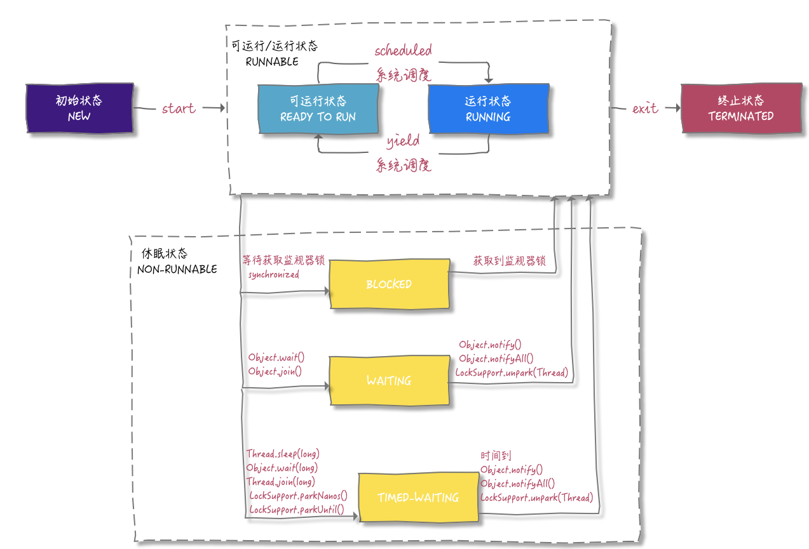
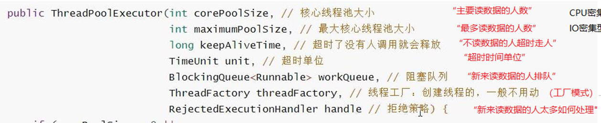
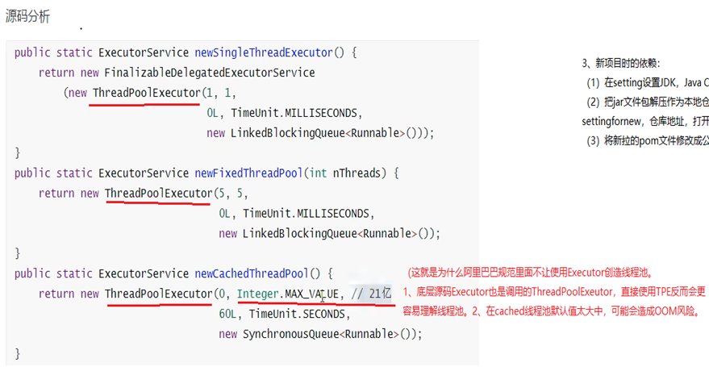
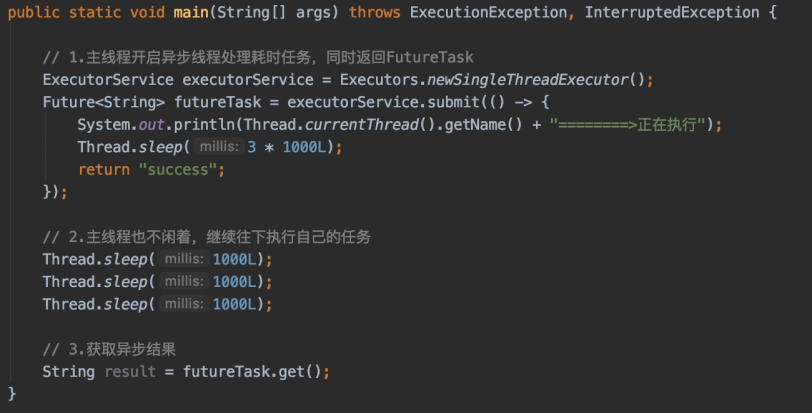
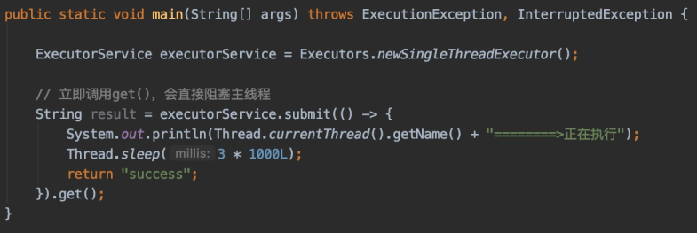
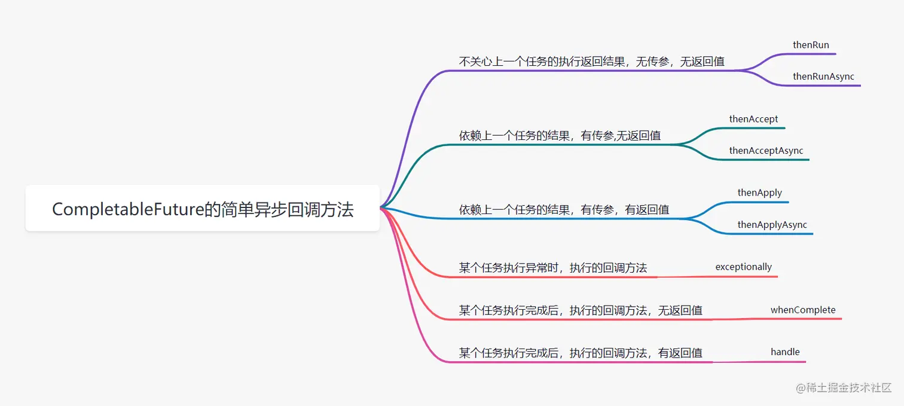
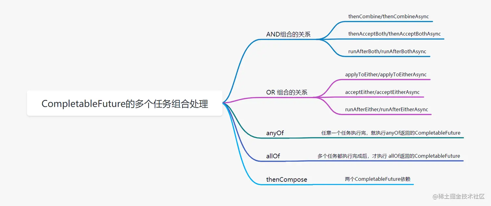

# 一、多线程

考察多线程最常见的就是做题，这也是最常见、最难(思路很重要)的一部分。


学前知识：

**（1）java.lang.IllegalMonitorStateException异常：**

官方api文档中的解释是“抛出的异常表明某一线程已经试图等待对象的监视器，或者试图通知其他正在等待对象的监视器而本身没有指定监视器的线程 ”，这段话过于官方，我相信大部分正常人和我一样基本都读不懂。

**简单的来说，当你在调用notify(), notifyAll(),wait(), wait(long), wait(long, int)等线程控制操作方法时，必须要有两个前提。**

**第一：必须要在被synchronized关键字控制的同步代码块中，才能调用这些方法。**

```
synchronized (this) {
    //在调用notify(), notifyAll(),wait(), wait(long), wait(long, int)等线程控制操作方法
    notifyAll();
    wait();
}
Collections.synchronizedList(new ArrayList<>());

HNJLLogCallbackTaskThread callbackTask = new HNJLLogCallbackTaskThread(counter, synchronizedList, req.getUserName(), "06JLSED001", meterCenterInterfaceMapper, req.getPushType());
threadPool.submit(callbackTask);
```

**第二，调用者必须为你当前的锁对象。**

```
synchronized (this) {
    //调用者必须为你当前的锁对象
    this.notifyAll();
    this.wait();
}
//但是this并不是可以被各个线程类共用的，一般使用传入公共的锁对象:

        //公共代码
        Object o=new Object();
        TakeTurnsPrint takeTurns = new TakeTurnsPrint(o);
        TurnsPrint turnsPrint = new TurnsPrint(o);
        
        //各个线程类中
            Object o;
            public TakeTurnsPrint(Object o){
              this.o=o;
            }
            
        //其同步代码块中
        synchronized (o) {
        //调用者必须为你当前的锁对象
          o.notifyAll();
          o.wait();
        }
//这样就锁对象一致了，这样的话，就不会出现此线程用notifyAll()(唤醒全部线程)唤醒了别的不相干线程
```

其实也很好理解，假如你开启两个甚至三个以上的线程，在synchronized关键字中的锁对象均为lock，此时是你的锁对象lock在管理这些线程，因此在调用这些线程状态管理的方法时，调用者应该为你的锁对象。

 

**（2）同步代码块的理解**

```
public void print1() {
    synchronized (this) {
    
    }
}
等同于
public synchronized void print1() {
      
}
```

 

（3）Join和wait/notifyAll的区别

了解Join：

```
主线程：
            //主线程进入wait(注意join其实是主线程方法，t1只是用来判断是否正在活跃，只要活跃，主线程就一直wait)
            t1.start();
            t1.join();

            t2.start();
            t2.join();
            
Join源码：
public final void join(long millis) throws InterruptedException {
    synchronized(lock) {
    ...
     while (isT1/2/3的线程Alive()) {
        //主线程进入wait
        lock.wait(0);
      }
         ...
    }
}                
```

可以看到，join是主线程对象的wait，wait()是线程锁对象的wait()。

插入一个wait()原理：

```
        //公共代码
        Object o=new Object();
        TakeTurnsPrint takeTurns = new TakeTurnsPrint(o);
        TurnsPrint turnsPrint = new TurnsPrint(o);
        
        //各个线程类中
            Object o;
            public TakeTurnsPrint(Object o){
              this.o=o;
            }
            
        //其同步代码块中
        synchronized (o) {
        //调用者必须为你当前的锁对象
          o.notifyAll();
          o.wait();
        }
//这样就锁对象一致了，这样的话，就不会出现此线程用notifyAll()(唤醒全部线程)唤醒了别的不相干线程
```

 

总结：

1、join：主线程需要阻塞等待，等子线程结束再进行

2、wait/notify：子线程需要进入等待队列，等唤醒再进行

3、synchronized：配合公共锁o.wait/notify来进行通知机制

4、ReentrantLock : 配合Condition类来进行通知机制

 

## 1、 两个线程轮流打印数字，一直到100

1、了解线程通讯的顺序：do-通知notify-等待wait

2、了解2个及2个以上的线程通讯

3、了解synchronized的锁对象及锁对象对notify/wait行为的影响

 

### 第一版：(错误示例)

```
(1)A线程打印1，挂起(wait)。(很多人此刻没意识到已经休眠该线程，以为1-2还会执行)
（1-2）通知B线程打印2
(2)B线程打印2，挂起(wait)，休眠该线程。
（2-1）通知A线程(notifyAll())打印3
(3)反复如此
```

错误代码：

```java
public class TakeTurnsPrint {
    private static boolean flag = true;

    private static int count = 0;

    public synchronized void print1() {
        for (int i = 1; i <= 50; i++) {
          //1、线程A打印
            System.out.println("print1: " + ++count);
            try {
            //2、线程进入休眠
                wait();
            } catch (InterruptedException ignored) {
            }
            //3、通知全部正在等待的线程
            notifyAll();
        }
    }

    public synchronized void print2() {
        for (int i = 1; i <= 50; i++) {
            //1、线程A打印
            System.out.println("print2: " + ++count);
            try {
            //2、线程进入休眠
                wait();
            } catch (InterruptedException ignored) {
            }
            //3、通知全部正在等待的线程
            notifyAll();
        }
    }
}
————————————————
    @Test
    void testThead() {
        TakeTurnsPrint takeTurns = new TakeTurnsPrint();
        new Thread(new Runnable() {
            @Override
            public void run() {
                takeTurns.print1();
            }
        }).start();

        new Thread(new Runnable() {
            @Override
            public void run() {
                takeTurns.print2();
            }
        }).start();
    }
```

### 第二版：(正确示例)

(1)A线程打印1，通知B线程打印2   

（1-2）挂起(wait)，休眠该线程

(2)B线程打印2，通知A线程(notifyAll())打印3

（2-1）挂起(wait)，休眠该线程

(3)反复如此

```java
public class TakeTurnsPrint {
    private static boolean flag = true;

    private static int count = 0;

    public synchronized void print1() {
        for (int i = 1; i <= 25; i++) {
          //1、线程A打印
            System.out.println("print1: " + ++count);
            try {
                //2、通知全部正在等待的线程
                notifyAll();
                //3、线程进入休眠
                wait();
            } catch (InterruptedException ignored) {
            }

        }
    }

    public synchronized void print2() {
        for (int i = 1; i <= 25; i++) {
             //1、线程A打印
            System.out.println("print2: " + ++count);
            try {
                //2、通知全部正在等待的线程
                notifyAll();
                 //3、线程进入休眠
                wait();
            } catch (InterruptedException ignored) {
            }
        }
    }
}
————————————————

    @Test
    void testThead() {
        TakeTurnsPrint takeTurns = new TakeTurnsPrint();
        new Thread(new Runnable() {
            @Override
            public void run() {
                takeTurns.print1();
            }
        }).start();

        new Thread(new Runnable() {
            @Override
            public void run() {
                takeTurns.print2();
            }
        }).start();
    }
```

**三、标准答案**

（用while(flag){}是为了当3个以上线程时，可以用flag控制这多个线程的顺序）

```java
    public static class TakeTurns {

        private static boolean flag = true;

        private static int count = 0;

        public synchronized void print1() {
            for (int i = 1; i <= 50; i++) {
                //3、线程进入休眠
                while (!flag) {
                    try {
                        System.out.println("print1: wait before");
                        //进入等待
                        wait();
                        System.out.println("print1: wait after");
                    } catch (InterruptedException e) {
                    }
                }
                //1、线程A打印
                System.out.println("print1: " + ++count);
                flag = !flag;
                //2、通知全部正在等待的线程
                notifyAll();
            }
        }

        public synchronized void print2() {
          //3、线程进入休眠
            for (int i = 1; i <= 50; i++) {
                while (flag) {
                    try {
                        System.out.println("print2: wait before");
                        wait();
                        System.out.println("print2: wait after");
                    } catch (InterruptedException e) {
                    }
                }
                //1、线程B打印
                System.out.println("print2: " + ++count);
                flag = !flag;
                //2、通知全部正在等待的线程
                notifyAll();
            }
        }
    }
————————————————

    @Test
    void testThead() {
        TakeTurnsPrint takeTurns = new TakeTurnsPrint();
        new Thread(new Runnable() {
            @Override
            public void run() {
                takeTurns.print1();
            }
        }).start();

        new Thread(new Runnable() {
            @Override
            public void run() {
                takeTurns.print2();
            }
        }).start();
    }
```

以上是2个线程的时候，以下是多个线程有序进行的例子：

```java
/**
 * 编写一个程序，启动三个线程，三个线程的ID分别是A，B，C；
 * 每个线程将自己的ID值在屏幕上打印5遍，打印顺序是ABCABC...
 */
public class ABCABCABC {

    private int flag = 0;

    public synchronized void printA() {
        for(int i = 0; i < 5; i++) {
          //线程有序
          //（while里面肯定是false，因为这是最后才执行的）
            while (flag != 0) {
                try {
                  //3、线程等待
                    wait();
                } catch (InterruptedException e) {
                    e.printStackTrace();
                }
            }
            flag = 1;
            //1、线程打印
            System.out.print("A");
            //2、线程通知
            notifyAll();
        }
    }

    public synchronized void printB() {
        for(int i = 0; i < 5; i++) {
            while (flag != 1) {
                try {
                    wait();
                } catch (InterruptedException e) {
                    e.printStackTrace();
                }
            }

            flag = 2;
            System.out.print("B");
            notifyAll();
        }
    }

    public synchronized void printC() {
        for(int i = 0; i < 5; i++) {
            while (flag != 2) {
                try {
                    wait();
                } catch (InterruptedException e) {
                    e.printStackTrace();
                }
            }

            flag = 0;
            System.out.print("C");
            notifyAll();
        }
    }
```

 

## 2、要求线程a执行完才开始线程b, 线程b执行完才开始线程

1、了解join的本质：主线程wait

 

join() 的源码：

```
public final void join(long millis) throws InterruptedException {
    synchronized(lock) {
    ...
     while (isT1/2/3的线程Alive()) {
        //主线程进入wait
        lock.wait(0);
      }
         ...
    }
}    
```

其实就是main()线程调用join()后，synchronized(lock)语句块，获得lock的锁，然后判断如果t1线程isAlive(), 就一直lock.wait(), 让自己（main()线程）阻塞住，直到t1线程 !isAlive 后才不wait, 等待着被notify(), 然后t1 死亡后会调用lock.notifyAll()。

注意：这里lock.wait(0)虽然在t1.join()内，但是join()内的代码不是运行在t1线程中，而是运行在main()线程中， t1线程中运行的是其run()方法内的代码。

 

实例代码：

```
/**
 * @author Lenovo
 */
public class JoinThread  extends Thread{

    public JoinThread(String name){
        //线程名字
        super(name);
    }

    @Override
    public void run() {
        for(int i = 0; i < 30; i++){
            System.out.println(getName() + " : " + i);
        }
    }

}


--------------
   @Test
    void testJoinThead() {
        JoinThread t1 = new JoinThread("a");
        JoinThread t2 = new JoinThread("b");
        JoinThread t3 = new JoinThread("c");

        try {
//            t1.start();
//            t2.start();
//            t3.start();
            //打印b1-30/a1-30/c1-30

           //t1进入等待队列
            t1.start();
            //主线程进入wait(注意join其实是主线程方法，t1只是用来判断是否正在活跃，只要活跃，主线程就一直wait)
            //t1在等待数组中发现无其它线程进入等待数组，执行t1(看第三题的源码)
            t1.join();

            t2.start();
            t2.join();

            t3.start();
            t3.join();
            //打印a1-30/b1-30/c1-30

        } catch (Exception e) {
            e.printStackTrace();
        }
    }

```

以下是n个线程join的例子：

```
/**
 * 编写10个线程，第一个线程从1加到10，第二个线程从11加20…第十个线程从91加到100，最后再把10个线程结果相加
 */
public class TenThreadSum {

    public static class SumThread extends Thread{

        int forct = 0;  int sum = 0;

        SumThread(int forct){
            this.forct = forct;
        }

        @Override
        public void run() {
            for(int i = 1; i <= 10; i++){
                sum += i + forct * 10;
            }
            System.out.println(getName() + "  " + sum);
        }
    }

    public static void main(String[] args) {

        int result = 0;

        for(int i = 0; i < 10; i++){
            SumThread sumThread = new SumThread(i);
            sumThread.start();
            try {
                sumThread.join();
            } catch (InterruptedException e) {
                e.printStackTrace();
            }
            result = result + sumThread.sum;
        }
        System.out.println("result   " + result);
    }
}

```

 

## 3、三个窗口同时卖票

1、了解synchronized使用同一锁对象来限制多线程的顺序

2、了解start的本质：

源码：

```
    public synchronized void start() {
        ...
        //将本线程加入线程等待队列
        group.add(this);
        ...
    }
    
    void add(Thread t) {
        synchronized (this) {
            //如果队列为空则创建
            if (threads == null) {
                //创建线程数组
                threads = new Thread[4];
            } 
            ...
            //将本线程赋值线程数组
            threads[nthreads] = t;
            
            ...
            //线程数组按照线程优先度或者cpu效率来执行
    }
```

代码：

```
/**
 * 票
 */
class Ticket {
    private int count = 1;
    public void sale() {
        while (true) {
            //模拟使用同一锁对象来限制多线程进入购买(相当于秒杀)
            synchronized (this) {
                //模拟先查数据库
                if (count > 200) {
                    System.out.println("票已经卖完啦");
                    break;
                } else {
                    //减库存
                    System.out.println(Thread.currentThread().getName() + "卖的第 " + count++ + " 张票");
                }
            }
        }
    }
}
————————————————


/**
 * 售票窗口
 */
class SaleWindows extends Thread {
    
    private Ticket ticket;

    public SaleWindows(String name, Ticket ticket) {
        //定义线程名字
        super(name);
        this.ticket = ticket;
    }

    @Override
    public void run() {
        super.run();
        ticket.sale();
    }
}

public class TicketDemo {
    public static void main(String[] args) {
        Ticket ticket = new Ticket();

        SaleWindows windows1 = new SaleWindows("窗口1", ticket);
        SaleWindows windows2 = new SaleWindows("窗口2", ticket);
        SaleWindows windows3 = new SaleWindows("窗口3", ticket);
        
        //进入等待队列
        windows1.start();
        windows2.start();
        windows3.start();
        //打印3、2、3卖票
    }
}

```

 

 

## 4、生产者消费者

比较经典的题目，其实就是第1、2题目的综合

 

1、从锁对象的角度了解synchronized、其配合锁对象.wait/notify

（这种方式的弊端，需用公共对象成为锁对象来成为一个等待/唤醒队列，如例：

```
       //公共代码
        Object o=new Object();
        TakeTurnsPrint takeTurns = new TakeTurnsPrint(o);
        TurnsPrint turnsPrint = new TurnsPrint(o);
        
        //各个线程类中
            Object o;
            public TakeTurnsPrint(Object o){
              this.o=o;
            }
            
        //其同步代码块中
        synchronized (o) {
        //调用者必须为你当前的锁对象
          o.notifyAll();
          o.wait();
        }
//这样就锁对象一致了，这样的话，就不会出现此线程用notifyAll()(唤醒全部线程)唤醒了别的不相干线程
```

）

2、从锁对象的角度了解ReentrantLock、其配合Condition类对象的.await()/signal

（可以用reentrantLock.newCondition();生成Condition对象，这种方式就可以直接将不同线程划分到不同队列，避免了第一点这种“公共对象成为一个o.等待/唤醒队列来避免唤醒别的不相干线程”的操作）

 

**synchronized代码：**

```
public class FruitPlateDemo {

    private final static String LOCK = "lock";

    private int count = 0;

    private static final int FULL = 10;

    public static void main(String[] args) {

        FruitPlateDemo fruitDemo1 = new FruitPlateDemo();

        for (int i = 1; i <= 5; i++) {
            new Thread(fruitDemo1.new Producer(), "生产者-" + i).start();
            new Thread(fruitDemo1.new Consumer(), "消费者-" + i).start();
        }
    }

    class Producer implements Runnable {
        @Override
        public void run() {
            for (int i = 0; i < 10; i++) {
                synchronized (LOCK) {
                    while (count == FULL) {
                        try {
                            LOCK.wait();
                        } catch (InterruptedException e) {
                            e.printStackTrace();
                        }
                    }

                    System.out.println("生产者 " + Thread.currentThread().getName() + " 总共有 " + ++count + " 个资源");
                    LOCK.notifyAll();
                }
            }
        }
    }

    class Consumer implements Runnable {
        @Override
        public void run() {
            for (int i = 0; i < 10; i++) {
                synchronized (LOCK) {
                    while (count == 0) {
                        try {
                            LOCK.wait();
                        } catch (InterruptedException e) {
                            e.printStackTrace();
                        }
                    }
                    System.out.println("消费者 " + Thread.currentThread().getName() + " 总共有 " + --count + " 个资源");
                    LOCK.notifyAll();
                }
            }
        }
    }
}
```

**ReentrantLock代码：**

```
public class Demo1 {

    private int count = 0;

    private final static int FULL = 10;

    private Lock lock;

    private Condition notEmptyCondition;

    private Condition notFullCondition;

    {
        lock = new ReentrantLock();
        notEmptyCondition = lock.newCondition();
        notFullCondition = lock.newCondition();

    }

    class Producer implements Runnable {

        @Override
        public void run() {

            for (int i = 0; i < 10; i++) {
                lock.lock();
                try {
                    while(count == FULL) {
                        try {
                            notFullCondition.await();
                        } catch (InterruptedException e) {
                            e.printStackTrace();
                        }
                    }
                    System.out.println("生产者 " + Thread.currentThread().getName() + " 总共有 " + ++count + " 个资源");
                    notEmptyCondition.signal();
                } finally {
                    lock.unlock();
                }
            }
        }
    }

    class Consumer implements Runnable {
        @Override
        public void run() {
            for (int i = 0; i < 10; i++) {
                lock.lock();
                try {
                    while(count == 0) {
                        try {
                            notEmptyCondition.await();
                        } catch (InterruptedException e) {
                            e.printStackTrace();
                        }
                    }
                    System.out.println("消费者 " + Thread.currentThread().getName() + " 总共有 " + --count + " 个资源");
                    notFullCondition.signal();
                } finally {
                    lock.unlock();
                }
            }
        }
    }

    public static void main(String[] args) {
        Demo1 demo1 = new Demo1();
        for (int i = 1; i <= 5; i++) {
            new Thread(demo1.new Producer(), "生产者-" + i).start();
            new Thread(demo1.new Consumer(), "消费者-" + i).start();
        }
    }
}
```

 

 

扩展：

1、了解synchronized(可重入锁)

2、了解ReentrantLock(可重入锁)

可重入锁的意思很简单：一句话："对于同一个锁对象，不用解锁就可以进入";  自己对自己原来的锁是无视的，可以再次直接进入。如果是需要对自己的锁需要和陌生人面对锁一样去索取锁，然后等待，这是不可行的。可重入的意思是，遇到本线程自己的锁不用再进行“尝试获取锁-上锁”这种操作了，直接无视进入并再次进行上锁（如果用ReentrantLock，多少次上锁就要有多少次解锁）。

而且代码中经常有while的操作，如果不可重入，一直加锁解锁，需要耗费很多性能。只需要最后解锁N次(上锁次数)即可。

（ReentrantLock 和 synchronized 不一样，需要手动释放锁，所以使用 ReentrantLock的时候一定要手动释放锁，并且加锁次数和释放次数要一样）

 

以下是synchronized和ReentrantLock示例：

```
public synchronized void get() {

System.out.println(Thread.currentThread().getName());
    set();
}

public synchronized void set() {
  System.out.println(Thread.currentThread().getName());
}


---------------ReentrantLock会有一些不一样，可重入的同时


try {
	lock.lock();
	System.out.println("第1次获取锁，这个锁是：" + lock);
	int index = 1;
	while (true) {
		try {
		  //这里
			lock.lock();
			System.out.println("第" + (++index) + "次获取锁，这个锁是：" + lock);
			... 代码省略节省篇幅...
		} finally {
//							lock.unlock();// 这里故意注释，实现加锁次数和释放次数不一样
		}

	}
} finally {
	lock.unlock();
	// 在外层的finally里头释放9次，让加锁和释放次数一样，就没问题了
	for (int i = 0; i < 9; i++) {
		lock.unlock();
	}
}

```

不可重入锁，如果碰到while操作，一直都是线程自己的锁，就会直接被挡在外面了。

 

 

# 二、多线程进阶

 

### 0、日常多线程的使用


1、导入excel的异步操作


## 1、理论(八股文)

 

### 1、线程Thread的生命周期(重点)

线程的生命周期一共有6个状态：

NEW，新生
RUNNABLE，可运行状态或运行状态
BLOCKED，锁定
WAITING，等待
TIMED_WAITING，带有时间的等待
TERMINATED，终止状态

（似乎有点迷糊，没关系，看下图和代码就可以理解了）



 

代码(了解何时是什么状态)：

NEW：

```
Thread thread = new Thread();
```

RUNNABLE：

```
Thread thread = new Thread(() -> {});
thread.start();
```

BLOCKED：

```
使用了synchronized 
```

WAITING：

```
Thread thread = new Thread(() -> {});
thread.join();
```

TIMED-WAITING：

```
Thread thread = new Thread(() -> {});
thread.sleep(3000);
```

TERMINATED：

```
Thread thread = new Thread(() -> {});
thread.start();
Thread.sleep(1000);
//此时就是终止状态
System.out.println(thread.getState());
```

 

## 1、CountDownLatch

它允许一个或多个线程一直等待，直到其他线程的操作执行完后再执行 

 

示例：

```
CountDownLatch/CyclicBrrier(这里仅以其一举例)：

//主线程
CountDownLatch latch = new CountDownLatch(2);
Runer runer1 = new Runer("刘翔", 2000, latch);	
Runer runer2 = new Runer("罗伯斯", 5000, latch);
runer1.start();   // 刘翔 开始跑步	
runer2.start();    // 罗伯斯 开始跑步	
latch.await();     // 等待计数器减至0程序才继续往下


//子线程内部
static class Runer extends Thread {		
String runerName;		
int runTime;		
CountDownLatch latch;		

public void run() {			
	doRun();// 跑步				
	latch.countDown();// 结束，计数器减1	
}
}

```

理解：

latch.await()有点像latch.join，latch.join()中latch是计数器线程，来作用Alive来使用主线程wait的；

```
public final void join(long millis) throws InterruptedException {
    synchronized(lock) {
    ...
     while (isLatch计数器的线程Alive没加完()) {
        //主线程进入wait
        lock.wait(0);
      }
         ...
    }
}  
```

 

 

## 2、线程池

 

 

### （1）实操

在第一章多线程基础章节，我们最常用的创建线程的方法是这样：

```
    new Thread(new Runnable() {
            @Override
            public void run() {
                takeTurns.print2();
            }
        }).start();
```

但是在企业级创建线程池：

1、引入并发包：org.springframework.scheduling.concurrent

2、配置线程池

```
@Configuration
public class ExecutorConfig {
    
    //核心线程池大小
    private static int  CORE_POOL_SIZE = 5;
    //最大线程池大小(即start时创建的Thread[]大小)
    private static int  MAX_POOL_SIZE = 1000;
    //等待队列大小
    private static int  QUEUE_CAPACITY_SIZE = 0;
    //超时时间1800s
    private static int  KEEP_ALIVE_SECONDS = 1800;

    @Bean(name="asyncExecutor")
    public ThreadPoolTaskExecutor dispatchExecutor(){
        ThreadPoolTaskExecutor executor = new ThreadPoolTaskExecutor();
        executor.setMaxPoolSize(MAX_POOL_SIZE);
        executor.setCorePoolSize(CORE_POOL_SIZE);
        executor.setQueueCapacity(QUEUE_CAPACITY_SIZE);
        executor.setKeepAliveSeconds(KEEP_ALIVE_SECONDS);
        executor.setWaitForTasksToCompleteOnShutdown(true);
        return executor;
    }

}
```

3、使用线程池+异步来完成线程任务

```
    @Async("asyncExecutor")
    public void asyncMethod(Req req) {
        //线程
    }
```

这样的好处是：

		a、直接new Thread初始化线程，不方便管理线程；
	
		b、当并发任务很多时，对每个任务都new Thread初始化线程会占用内存，且新建和销毁一个线程是很消耗资源的，有时初始化和销毁一		个线程的时间比线程执行任务的时间都长。

 


### （2）理论

创建线程池的方式：



其它创建线程池的方式(**不推荐**)其对应的源码：



 

 

## 3、ThreadLocal

请看：spring章节-1、IOC控制反转和DI依赖注入

 

 

 

## 4、使用了多线程就会导致问题：并发脏读问题

 

补充：

并发不安全的缘由是原JVM的“缺点”：

原JVM“缺点”(其实并不能算是缺点，有好有坏，只是在并发时原JVM会导致一些不好的结果)：

1、破坏原子性：就像i++，这句代码其实是先读取i的值，再+1，最后赋值到i，三步操作了，不能保证原子性。不像int i=1这种赋值语句是原子性的。

2、变量高速缓存破坏可见性：会从缓存中取值，“多线程并发时”，但是取到的值可能是已经被更改了的脏数据值。

3、指令重排破坏有序性：JVM为了优化，“多线程并发时”，代码顺序可能会被重新排序，可能导致数据错误。指令重排序在单线程是没有问题的，不会影响执行结果，而且还提高了性能。但是在多线程的环境下就不能保证一定不会影响执行结果了。

 

 

### （1）CAS乐观锁学术上的解释

CAS（Compare-And-Swap）,它是一条**CPU并发原语**，用于判断内存中某个位置的值是否为预期值，如果是则更改为新的值，这个过程是原子的。
调用UnSafe类中的CAS方法，JVM会帮我们实现CAS汇编指令。这是一套完全依赖于硬件的功能，通过它实现了原子操作。
原语由若干指令组成，用于完成某个功能的一个过程，并且原语的执行必须是连续的，在执行过程中不允许被中断，也就是说CAS是一条CPU的原子指令，不会造成所谓的数据不一致的问题。

原理:V=value，O=old，N=new
当执行CAS后，如果V == O ，即旧值与内存中实际值相等，表示上次修改后没有任何线程再次修改此值，因此可以将N替换到内存中。如果 V ！= O，表示该内存中的值已经被其他线程做了修改，所以无法将N替换，返回最新的值V。
当多个线程使用CAS操作一个变量时，只有一个线程会成功，并成功更新变量值，其他线程均会失败。失败线程会重新尝试或将线程挂起。

**CAS的ABA问题：**
CAS算法实现的一个重要前提需要取出内存中某时刻的数据并在当下时刻比较并替换，那么在这个时间差类会导致数据的变化。比如线程M从内存位置W取出值A，这时N也取出A，N操作后A变成了B，然后N将B又变回A，这时线程M在CAS操作时发现内存中仍然是A，然后M执行成功，M虽然执行成功，但实际上就出现了ABA问题。解决方案：Java1.5开始，JDK的Atomic包里提供了一个类AtomicStampedRefernce来解决ABA问题。这个类的compareAndSet方法的作用是首先检查当前引用是否等于预期引用，并且检查标志stamped是否为预期标志，如果全部一致，则继续。

***

上面的解释中，最重要的是理解“原语，这是原子性的”，因为volatile最大的问题就是无法保证原子性，而CAS原语保证了原子性，就不会发生i++是非原子性的操作了(看下面解释的i++)，这样volatile(可见性+有序性)+CAS(原子性)就保证了并发安全。

```
volatile特点：(属于JMM内存模型)
1、可见性：volatile 保证了变量每次修改都能立即同步到主内存，每次使用前立即从主内存刷新。
(保证每个线程每次使用拿到的都是最新值，而普通变量做不到这点)
2、有序性 （通过禁止指令重排序优化）：volatile 通过设置 Java 内存屏障禁止重排序优化。
(这会让volatile变量在写过程中插入内存屏障指令，从而付出性能代价)

为什么用volatie保证始终对主内存可见，它却还不能保证线程安全？不是保证了线程间的可见性吗？
答：很简单，可见性不能保证操作的原子性，前面说过了i++不是原子性操作，会当做三步，
先读取i的值，然后+1，最后赋值回去i变量。需要保证线程安全的话，
需要使用synchronized关键字或者lock锁，给count++这段代码上锁：
private static synchronized void add() {
    i++;
}
线程间的可见性是没问题的，但是可能就是线程自己的原子性问题导致的，与别的线程干预无关。
```

***

 

### （2）CAS在多线程下实操

原文链接：https://blog.csdn.net/weixin_53407527/article/details/127700532

 

a、直接用CAS（Compare-And-Swap） (不推荐)

b、用对CAS已封装的原子类AtomicInteger (原子类底层是原语保证原子性，但有ABA问题，不推荐) 

c、升级用AtomicMarkableReference避免ABA问题(推荐)

 

####  a、直接用CAS

```
/**
 * 请求
 */
private static void request() {
    // 模拟网络延迟
    try {
        Thread.sleep(5);
    } catch (InterruptedException e) {
        e.printStackTrace();
    }
    int expectCount; // 期望值
    // 不断自旋尝试 CAS
    while (!compareAndSwap(expectCount = getCount(), expectCount + 1)) {}
}

/**
 * synchronized 版本CAS
 * @param expectCount 期望的Count
 * @param newCount 新的Count
 * @return 比较的结果 成功 true | 失败 false
 */
public static synchronized boolean compareAndSwap(int expectCount, int newCount) {
    // 判断当前值是否和期望值一致
    if (getCount() == expectCount) {
        count = newCount; // 更新值
        return true;
    }
    return false;
}

private static int getCount() {
    return count;
}
```

####  b、用对CAS已封装的原子类AtomicInteger

 

```
public class RequestDemo5 {
    // 总人数
    private static final int peopleCount = 100;
    // 每人访问次数
    private static final int requestTime = 10;
    // 总计访问次数
    private static AtomicInteger count = new AtomicInteger(0); // 原子整数类
    
    public static void main(String[] args) throws Exception {
        CountDownLatch downLatch = new CountDownLatch(peopleCount);
        for (int i = 0; i < 100; i++) {
            new Thread(() -> {
                try {
                    for (int j = 0; j < requestTime; j++) {
                        request();
                    }
                } finally {
                    downLatch.countDown();
                }
            }).start();
        }
        downLatch.await();
        System.out.println(count.get()); // 1000
    }
    
    /**
     * 请求
     */
    private static void request() {
        // 模拟网络延迟
        try {
            Thread.sleep(5);
        } catch (InterruptedException e) {
            e.printStackTrace();
        }
        // 原子的自增操作 方法线程安全 底层使用了CAS
        count.incrementAndGet(); 
    } 
}

```

####  c、升级用AtomicMarkableReference避免ABA问题

```
public class CasABADemo02 {                               
    public static AtomicStampedReference<Integer> a = new AtomicStampedReference(1, 1); // 初始值为1 版本戳起始设置为1

    public static void main(String[] args) {
        Thread main = new Thread(() -> {
                System.out.println("操作线程" + Thread.currentThread().getName() + ", 初始值：" + a.getReference());
                try {

                    Integer expectReference = a.getReference(); // 拿到的期望值
                    Integer newReference = expectReference + 1; // 需要更新的值
                    Integer expectStamp = a.getStamp(); // 获取当前戳
                    Integer newStamp = expectStamp + 1; // 版本号+1

                    Thread.sleep(1000); // 主线程休眠一秒钟，让出cpu

                    boolean isCASSccuess = a.compareAndSet(expectReference, newReference, expectStamp, newStamp);
                    System.out.println("操作线程" + Thread.currentThread().getName() + "，CAS操作：" + isCASSccuess);
                } catch (InterruptedException e) {
                    e.printStackTrace();
                }
        }, "主线程");

        Thread other = new Thread(() -> {
                try {
                    Thread.sleep(20); // 确保Thread-main线程优先执行

                    a.compareAndSet(a.getReference(), (a.getReference() + 1), a.getStamp(), (a.getStamp() + 1));
                    System.out.println("操作线程" + Thread.currentThread().getName() + "，【increment】,值=" +a.getReference());
                    a.compareAndSet(a.getReference(), (a.getReference() - 1), a.getStamp(), (a.getStamp() + 1));
                    System.out.println("操作线程" + Thread.currentThread().getName() + "，【decrement】,值=" +a.getReference());
                } catch (InterruptedException e) {
                    e.printStackTrace();
                }

        }, "干扰线程");

        main.start();
        other.start();
    }
}

```

 

## 5、多线程基础的补充

这里比较容易忽略的

 

### (1)基础开启多线程的方式

开启一个新线程有四种方式：

**(1)继承Thread重载run方法**
		1、new MyThread().start;

**(2)实现Runnable的run方法,放入new Thread()的构造方法中**
		1、普通，不阐述
		2、Lamda表达式:new Thread(()->{sout(“nihao!”);}).start();

**(3)实现Callable的call方法(带结果的线程)，放入FutureTask的构造方法后再futureTask.run即可执行**


写法一：

```
    FutureTask futureTask=new FutureTask(new Callable() {       
             @Override       
            public String call() throws Exception {            
                Thread.sleep(3000);            
                System.out.println("calld方法执行了");           
                 return "call方法返回值";        
                    }    });    
                futureTask.run();
```

写法二：

```
    Future<String> futureTask = executor.submit(new Runnable() {
        @Override
        public void run() {
            try {
                System.out.println("Runnable异步线程开始...");
                TimeUnit.SECONDS.sleep(3);
                System.out.println("Runnable异步线程结束...");
            } catch (InterruptedException e) {
                e.printStackTrace();
            }
        }
    }, "fakeRunnableResult");
```

 

 

**(4)任意函数式接口如new Supplier、new Function等等函数式接口，消费型、生产型、功能型、改变型**

CompletableFuture<String> future = CompletableFuture.supplyAsync(new Supplier<String>() {
        @Override
        public String get() {
  				  try {
    						    Thread.sleep(1000);
    					} catch (InterruptedException e) {
       							 e.printStackTrace();
    					}
   					 return "Hello";
		});

案例二

```
    CompletableFuture userFuture = CompletableFuture.supplyAsync(() -> {
        getRemoteUserAndFill(id, userInfo);
        return Boolean.TRUE;
    }, executor);

    CompletableFuture bonusFuture = CompletableFuture.supplyAsync(() -> {
        getRemoteBonusAndFill(id, userInfo);
        return Boolean.TRUE;
    }, executor);

    CompletableFuture growthFuture = CompletableFuture.supplyAsync(() -> {
        getRemoteGrowthAndFill(id, userInfo);
        return Boolean.TRUE;
    }, executor);
    
    //调用 CompletableFuture 类的静态方法 allOf 并阻塞当前线程，直到所有 CompletableFuture 任务都完成。
    CompletableFuture.allOf(userFuture, bonusFuture, growthFuture).join();

    //获取这三个异步任务的结果
    userFuture.get();
    bonusFuture.get();
    growthFuture.get();
    
    //赋值成功后返回
    return userInfo;
```

 

### (2)开可以获取结果的多线程：FutureTask

最先开始耗时操作，并返回这个任务结果的引用备用，

然后逐个开启小任务，

最后.get阻塞获取刚开始的耗时操作的结果

 

正确写法：



错误写法：(一开始就.get阻塞，这样就发挥不了线程的作用)



 

但是！

只有一个异步任务时使用FutureTask然后.get阻塞完就返回结果，貌似没什么问题。

如果有三个异步任务使用了FutureTask都轮流.get阻塞，需要经历三次阻塞才能返回结果。意思就是.get之间并不是异步的！

此时我们需要一个不同的异步任务的.get都是同时进行的工具：CompletableFuture！

 

### (3)开可以获取结果的多线程：CompletableFuture

内置的线程池是ForkJoinPool.commonPool。

注意点：

（1）CompletableFuture的get()方法是阻塞的，我们一般建议使用future.get(3, TimeUnit.SECONDS)。并且一般建议使用自定义线程池。
但是如果线程池拒绝策略是DiscardPolicy或者DiscardOldestPolicy，当线程池饱和时，会直接丢弃任务，不会抛弃异常。因此建议，CompletableFuture线程池策略最好使用AbortPolicy，然后耗时的异步线程，做好线程池隔离(CPU密集型(n-1)和io密集型(2n)可以分成两个不同的线程池对象)。

（2）CompletableFuture代码中又使用了默认的线程池，处理的线程个数是电脑CPU核数-1。在大量请求过来的时候，处理逻辑复杂的话，响应会很慢。一般建议使用自定义线程池，优化线程池配置参数。

```
/**
* 获取CPU核数
*/
private static final int AVAILABLE_PROCESSORS = Runtime.getRuntime().availableProcessors();

private static ThreadPoolExecutor threadPoolExecutor = new ThreadPoolExecutor(
            AVAILABLE_PROCESSORS,  //核心线程数
            3 * AVAILABLE_PROCESSORS,  //最大线程数
            3, TimeUnit.SECONDS,  //keepAliveTime
            new LinkedBlockingDeque<>(20));  //阻塞队列

CompletableFuture.supplyAsync(() -> {
    try {
        Thread.sleep(1000);
    } catch (InterruptedException e) {
        e.printStackTrace();
    }
    dataMap.put("doSomeThingB", "B");
    return taskId + " is done";
}, threadPoolExecutor);
//这里自定义了线程池threadPoolExecutor来执行CompletableFuture
```

 

 






 

####  (1) supplyAsync  开启异步多线程

该方法可以接收一个 Supplier 函数作为参数，该函数用于异步处理任务。

```java
CompletableFuture<String> future = CompletableFuture.supplyAsync(() -> {
    try {
        Thread.sleep(1000);
    } catch (InterruptedException e) {
        e.printStackTrace();
    }
    return "Hello";
});

```

后续处理：

**		(1.1) thenApply：**

该方法可以接收一个 Function 函数作为参数，该函数用于对异步任务的结果进行处理。

```
future.thenApply(s -> s + " World");
```

**        (1.2) thenAccept：**

该方法可以接收一个 Consumer 函数作为参数，该函数用于对异步任务的结果进行消耗。

```
future.thenAccept(s -> System.out.println(s + " World"));
```

**		(1.3) thenRun：**

该方法可以接收一个 Runnable 函数作为参数，该函数用于在异步任务完成后运行。

```
future.thenRun(() -> System.out.println的 " World")；
```

		**(1.4) exceptionally**

该方法可以在异步任务出现异常时执行指定的处理。

```
future.exceptionally(e -> "Error");
```

		**(1.5) handle**

该方法可以在异步任务完成时执行指定的处理，不管任务是正常完成还是异常完成。

```
future.handle((result, exception) -> {
    if (exception != null) {
        return "Error";
    } else {
        return result + " World";
    }
});
```

		**(1.6) whenComplete**

该方法可以在异步任务完成时执行指定的处理，不管任务是正常完成还是异常完成。与 handle 不同，whenComplete 不能修改任务的结果，而只能在完成时执行一些处理。

```
future.whenComplete((result, exception) -> {
    if (exception != null) {
        System.out.println("Error");
    } else {
        System.out.println(result + " World");
    }
});
```

		** (1.7) getNow**

该方法用于获取 CompletableFuture 的结果，如果任务尚未完成，则返回指定的默认值。

```
String result = future.getNow("World");
System.out.println(result);

```

		** (1.8)cancel**

该方法用于取消任务的执行。如果任务已经开始执行，则无法取消；如果任务尚未开始执行，则可以取消。

```
future.cancel(true);
```

 

***

#### (2) thenCombine 合并异步多线程

该方法可以接收另一个 CompletableFuture 对象，并等待两个异步任务都完成，然后将两个任务的结果合并。

```
CompletableFuture<String> future1 = CompletableFuture.supplyAsync(() -> {return "Hello";});
CompletableFuture<String> future2 = CompletableFuture.supplyAsync(() -> {
    try {
          Thread.sleep(1000);
        } catch (InterruptedException e) {
          e.printStackTrace();
        }
          return " World";
});

CompletableFuture<String> future = future1.thenCombine(future2, (s1, s2) -> s1 + s2);
```

***

#### (3) join  异步多线程的主线程阻塞join行为

该方法用于阻塞当前线程，直到 CompletableFuture 执行结束。该方法返回 CompletableFuture 的结果，或者在执行过程中抛出的异常。

```
 //调用 CompletableFuture 类的静态方法 allOf 并阻塞当前线程，直到所有 CompletableFuture 任务都完成。
 CompletableFuture.allOf(userFuture, bonusFuture, growthFuture).join();
```