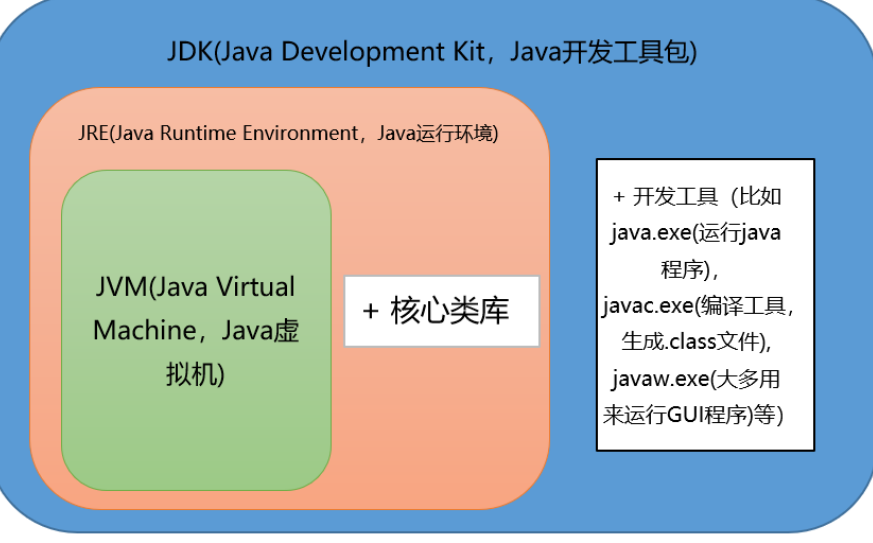
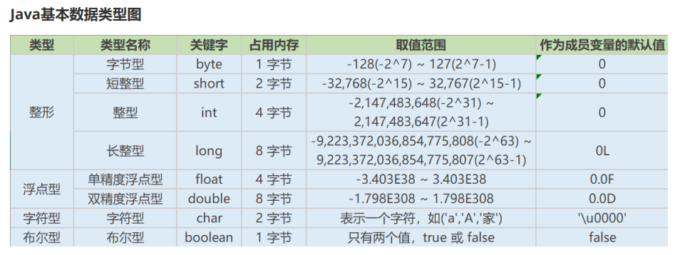
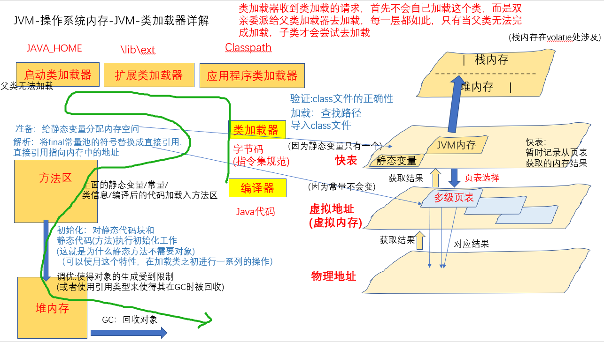
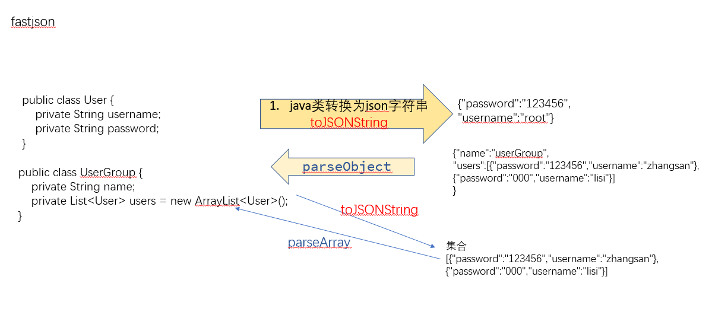

 

# 一、Java基础

 

 

## 1、JDK、JRE、JVM

JVM
Java Virtual Machine是Java虚拟机，Java程序需要运行在虚拟机上，不同的平台有自己的虚拟机，因此Java语言可以实现跨平台。

JRE
Java Runtime Environment包括Java虚拟机和Java程序所需的核心类库等。核心类库主要是java.lang包：包含了运行Java程序必不可少的系统类，如基本数据类型、基本数学函数、字符串处理、线程、异常处理类等，系统缺省加载这个包；如果想要运行一个开发好的Java程序，计算机中只需要安装JRE即可。


JDK
Java Development Kit是提供给Java开发人员使用的，其中包含了Java的开发工具，也包括了JRE。所以安装了JDK,就无需再单独安装JRE了。其中的开发工具：编译工具（javac.exe),打包工具（jar.exe)等

 

JDK相当于自己写的SDK包(开发/编译工具)，JRE相当于引入的maven依赖包(核心类库，也叫作运行环境)，JVM相当于在我的SDK里面写了一个main函数和其它List<对象>来执行外部的代码。



 

## 2、访问修饰符

由上面可知，其实我们写的项目都是SDK，那么，别人在使用我们的SDK时，对于使用者我们应该减少不必要信息的暴露(封装)，让使用者明确知道有SDK中有哪些API可以调用：

 

private:在同一类内可见。使用对象：变量、方法。注意：不能修饰类（外部类）
default(即缺省，什么也不写，不使用任何关键字）:在同一包内可见，不使用任何修饰符。使用对象：类、接口、变量、方法。
protected:对同一包内的类和所有子类可见。使用对象：变量、方法。注意：不能修饰类（外部类）。
public:对所有类可见。使用对象：类、接口、变量、方法

 

private：对SDK的创造者**(私用时)**，来避免调用类时明确API

default：默认这些API对外界不可见**(仅团队用时)**，比如工具类

protected：这些API对外界不可见**(仅团队或者其它开发团队用时)**，但是子类可见，比如提供外界二次开发的接口类

public：用于可以暴露的API**(公用时)**，明确可以读取使用的API

 

 

## 3、基本数据类型

这比较容易忘记，因为日常只用到int。

（字节*2+1就是实际的位数）

byte：1字节，一般用来比作男女或者状态码，等3位以内的数字

short：2字节，这个很少用，可以用作五位的网络状态码，比如10400/10500这些。在32000以内

int：4字节，这个就比较大了，一共十位数，可以用作密码或者常规的数字

long：8字节，这个非常大，一共17位，可以存储任意数字

 

（对于小数点，字节*2-1就是实际的精度位数）

java中小数默认为double类型的，如果想要使用float类型的，则需要在小数后面加f，例如float a=3.14f；

float：4字节，精度在7位

double：8字节，精度在15位

 

char：字符型，一般在做字符数组的算法题时会经常遇到

boolean：布尔型，true、false

 



 

 

 

### 3.1、由二进制引入BigDecimal的精度问题

来源CSDN：https://blog.csdn.net/Sky_QiaoBa_Sum/article/details/111880511

```
    public static void main(String[] args) {
        BigDecimal a = new BigDecimal("1");
        BigDecimal b = new BigDecimal("1.0");
        System.out.println(a.equals(b)); // false
        System.out.println(a.compareTo(b)); //0 表示相等
    }
```

【阿里巴巴Java开发手册强制】如上所示BigDecimal的等值比较应使用compareTo()方法，而不是equals()方法。
说明：equals()方法会比较值和精度(1.0和1.00返回结果为false),而compareTo()则会忽略精度。

#### 1、原因：

十进制整数如何转化为二进制整数？
将被除数每次都除以2，只要除到商为0就可以停止这个过程。

```
5 / 2 = 2 余 1
2 / 2 = 1 余 0
1 / 2 = 0 余 1 
    
// 结果为 101
```

这个算法永远都不会无限循环，整数永远都可以使用二进制数精确表示，但小数呢？
十进制小数如何转化为二进制数？
每次将小数部分乘2，取出整数部分，如果小数部分为0，就可以停止这个过程。

```
0.1 * 2 = 0.2 取整数部分0
0.2 * 2 = 0.4 取整数部分0
0.4 * 2 = 0.8 取整数部分0
0.8 * 2 = 1.6 取整数部分1
0.6 * 2 = 1.2 取整数部分1
0.2 * 2 = 0.4 取整数部分0 

//... 我想写到这就不必再写了，你应该也已经发现，上面的过程已经开始循环，小数部分永远不能为0
```

这个算法有一定概率会存在无限循环，即无法用有限长度的二进制数表示十进制的小数，这就是精度丢失问题产生的原因。

#### 2、如何用BigDecimal解决double精度问题？

BigDecimal类位于java.math包下，用于对超过16位有效位的数进行精确的运算。一般来说，double类型的变量可以处理16位有效数，但实际应用中，如果超过16位，就需要BigDecimal类来操作。

```
    public static void main(String[] args) {
		// 方法1
        BigDecimal a = new BigDecimal(0.1);
        System.out.println("a --> " + a);
		// 方法2
        BigDecimal b = new BigDecimal("0.1");
        System.out.println("b --> " + b);
		// 方法3
        BigDecimal c = BigDecimal.valueOf(0.1);
        System.out.println("c --> " + c);
    }


控制台：
a --> 0.1000000000000000055511151231257827021181583404541015625
b --> 0.1
c --> 0.1
```

函数：

```
    // 传入double
	public BigDecimal(double val) {
        this(val,MathContext.UNLIMITED);
    }
	// 传入string
    public BigDecimal(String val) {
        this(val.toCharArray(), 0, val.length());
    }

    public static BigDecimal valueOf(double val) {
        // Reminder: a zero double returns '0.0', so we cannot fastpath
        // to use the constant ZERO.  This might be important enough to
        // justify a factory approach, a cache, or a few private
        // constants, later.
        // 可以看到实际上就是第二种
        return new BigDecimal(Double.toString(val));
    }
```

 

 

### 3.2byte[]数据类型的由来

在Java中，基本数据类型有以下几种：

整型：Java提供了4种整型类型，分别是byte、short、int、long。
浮点型：Java提供了2种浮点型类型，分别是float、double。
布尔型：Java提供了布尔型类型boolean，表示真或假。
字符型：Java提供了字符型类型char，表示单个Unicode字符。

 

在网络编程中使用byte数据类型的作用：

因为网络传输只有和0和1，所以并不需要太多位数的0来占位置，这样使用很少的字节就可以表示0和1这两个整型，节省空间。

所以经常使用byte[]来装数据。

 

## 4、二进制、无符号右移

 

### (1)二进制：

在计算机内存中，整数一律采用补码的形式来存储。
这意味着，当读取整数时还要采用逆向的转换，也就是将补码转换为原码。
将补码转换为原码也很简单：先减去 1，再将数值位取反即可。

1、原码：就是一个整数本来的二进制形式。
2、反码：对于正数，它的反码就是其原码（原码和反码相同）；
负数的反码是将原码中除符号位以外的所有位（数值位）取反，也就是 0 变成 1，1 变成 0。
3、补码：对于正数，它的补码就是其原码（原码、反码、补码都相同）；负数的补码是其反码加 1
可以认为，补码是在反码的基础上打了一个补丁，进行了一下修正，所以叫“补码”。


### (2)无符号左右移：

首先注意：只有 左移(<<)、右移(>>)、无符号右移(>>>)，不存在无符号左移。

1、<<表示左移移，不分正负数，低位补0；　
正数：r = 20 << 2

　　20的二进制补码：0001 0100

　　向左移动两位后：0101 0000

　　　　   　　结果：r = 80

负数：r = -20 << 2

　　-20 的二进制原码 ：1001 0100

　　-20 的二进制反码 ：1110 1011

　　-20 的二进制补码 ：1110 1100

　　左移两位后的补码：1011 0000

　　　　　　　　反码：1010 1111

　　　　　　　　原码：1101 0000 

　　　　　　　　结果：r = -80
　　　　　　　　
　实际作用：相当于乘4

2、>>表示右移，如果该数为正，则高位补0，若为负数，则高位补1；

正数：r = 20 >> 2

　　20的二进制补码：0001 0100

　　向右移动两位后：0000 0101

　　　　　　　结果：r = 5

负数：r = -20 >> 2

　　-20 的二进制原码 ：1001 0100

　　-20 的二进制反码 ：1110 1011

　　-20 的二进制补码 ：1110 1100 

　　右移两位后的补码：1111 1011 

　　　　　　　　反码：1111 1010

　　　　　　　　原码：1000 0101

　　　　　　　　结果：r = -5
　　　　　　　　
实际作用：java >>1得意思是二进制右移一位。数被除2不取余。举一个11111=31，右移1变成1111=15，即是31/2=15余1，
不取余的话，就是1111=15。

3、>>>表示无符号右移，也叫逻辑右移，即若该数为正，则高位补0，而若该数为负数，则右移后高位同样补0
正数：　r = 20 >>> 2

　　　　的结果与 r = 20 >> 2 相同；

负数：　r = -20 >>> 2

注：以下数据类型默认为int 32位

　　-20:源码：10000000 00000000 00000000 00010100

　　　　反码：11111111  11111111   11111111   11101011

　　　　补码：11111111  11111111   11111111   11101100

　　　　右移：00111111  11111111   11111111   11111011

　　　　结果：r = 1073741819

**实际作用：数值除以 2 的快速实现，无符号右移一位相当于除以 2，无符号右移两位相当于除以 4，以此类推。**

 

### (3)与运算、或运算以及异或运算

1、与运算：我们通常可以用来清零 想给哪一位清零就把哪一位置为0 若不想清零这一位 这一位为1即可
0010 1100 & 0000 0000 = 0000 0000
0010 1100 & 0010 0000 = 0010 0000

2、或运算：我们经常可以用来给给定位置置为1 比如我要给最后一位和倒数第三位置为1
0000 | 0101 = 0101

3、异或运算：相同为0 相异为1

 

 

 

## 5、Java关键字

 

### （1）final

用于修饰类、属性和方法；
1、被final修饰的类不可以被继承
2、被final修饰的方法不可以被重写
3、被final修饰的变量不可以被改变，被final修饰不可变的是变量的引用，而不是引用指向的内容，用指向的内容是可以改变的

原理：

在Java加载时就加载进内存，之后无论如何都不可以被改变



 

扩展：(一般会一起考察)

finally：一般作用在try-catch代码块中，在处理异常的时候，通常我们将一定要执行的代码方法finally代码块中，表示不管是否出现异常，该代码块都会执行，一般用来存放一些关闭资源的代码。
finalize：是一个方法，属于Object类的一个方法，而Object类是所有类的父类，该方法一般由垃圾回收器来调用，当我们调用System.gc()方法的时候，由垃圾回收器调用finalize(),回收垃圾，一个对象是否可回收的最后判断。

 

### （2）this、super

 

#### a、this

是自身的一个对象，代表对象本身，可以理解为：指向对象本身的一个指针

常见：

```
public person(string name,int age){
    this.name=name;
    this.age=age;
}
```

 

#### b、super

super可以理解为是指向自己超（父）类对象的一个指针，而这个超类指的是离自己最近的一个父类

最常见的就是多线程设置名字：

```
public class JoinThread  extends Thread{

    public JoinThread(String name){
        //用父类的构造方法设置线程名字
        super(name);
    }

    @Override
    public void run() {
        for(int i = 0; i < 30; i++){
        //打印线程名字，getName() 是父类的方法
            System.out.println(getName() + " : " + i);
        }
    }

}


--------------
   @Test
    void testJoinThead() {
        //设置方法名字
        JoinThread t1 = new JoinThread("a");
        JoinThread t2 = new JoinThread("b");
        JoinThread t3 = new JoinThread("c");

        try {

           //t1进入等待队列
            t1.start();
            //主线程进入wait(注意join其实是主线程方法，t1只是用来判断是否正在活跃，只要活跃，主线程就一直wait)
            //t1在等待数组中发现无其它线程进入等待数组，执行t1(看第三题的源码)
            t1.join();

            t2.start();
            t2.join();

            t3.start();
            t3.join();
            //打印a1-30/b1-30/c1-30

        } catch (Exception e) {
            e.printStackTrace();
        }
    }
```

 

 

1、**super()和this()均需放在构造方法内第一行。**

2、**this和super不能同时出现在一个构造函数里面**，因为this必然会调用其它的构造函数，其它的构造函数必然也会有super语句的存在，所以在同一个构造函数里面有相同的语句，就失去了语句的意义，编译器也不会通过。

3、**this()和super()都指的是对象，所以，均不可以在static环境中使用**。包括：static变量，static方法，static语句块

4、从本质上讲，this是一个指向本对象的指针，然而super是一个Java关键字。

 

### （3）static 静态

 


 

因为static是被类的实例对象所共享，因此如果某个成员变量是被所有对象所共享的，那么这个成员变量就应该定义为静态变量。

因此比较常见的static应用场景有：
1.修饰成员变量
2.修饰成员方法
3.静态代码块
4.修饰类【只能修饰内部类也就是静态内部类】
5.静态导包

 

 

# 二、Java8

 

 

## 1、Stream

 

适用stream有几点需要注意：

1、因为流的原理是fork多线程的，所以里面的数字只能使用：常量、原子类修饰等来保证线程安全

 

经典例子：

```
        AtomicInteger num = new AtomicInteger(1);
        AtomicInteger orderNum = new AtomicInteger(1);
        //计数器
        AtomicInteger count = new AtomicInteger(0);
        AtomicInteger countPage = new AtomicInteger(spotGoodsMonthSettleReq.getPageSize());
        
        List<SpotGoodsMonthSettleDetailDTO> collect=new ArrayList<>();
        if (!spotGoodsMonthSettleReq.getIsExport()) {
            collect = lists.stream()
                    .sorted(Comparator.comparing(SpotGoodsMonthSettleDetailDTO::getCustomerId).
                            thenComparing(SpotGoodsMonthSettleDetailDTO::getTradeMode).
                            thenComparing(SpotGoodsMonthSettleDetailDTO::getProjectNameOrder))
                    .map(item -> {
                        item.setMergeSign(num.get());
                        item.setOrderSign(orderNum.get());
                        count.incrementAndGet();

                        //此处的3是指量价费
                        if (count.get() == 3) {
                            num.getAndIncrement();
                            orderNum.getAndIncrement();
                            //每3条记录一次
                            countPage.incrementAndGet();
                            count.set(0);
                        };
                        if (countPage.get() == spotGoodsMonthSettleReq.getPageSize()) {
                            num.set(1);
                            countPage.set(0);
                        };
                        return item;
                    })
                    .filter(rem -> rem.getOrderSign() > (spotGoodsMonthSettleReq.getCurrentPage() - 1) * spotGoodsMonthSettleReq.getPageSize())
                    .limit((spotGoodsMonthSettleReq.getPageSize() == null ? 10 : spotGoodsMonthSettleReq.getPageSize()) * 3)
                    .collect(Collectors.toList());
        }
        
        
        List<SpotGoodsMonthSettleDetailDTO> exportCollect=new ArrayList<>();
        if (spotGoodsMonthSettleReq.getIsExport()) {
            exportCollect = lists.stream()
                    .sorted(Comparator.comparing(SpotGoodsMonthSettleDetailDTO::getCustomerId).
                            thenComparing(SpotGoodsMonthSettleDetailDTO::getTradeMode).
                            thenComparing(SpotGoodsMonthSettleDetailDTO::getProjectNameOrder))
                    .map(item -> {
                        item.setMergeSign(num.get());
                        item.setOrderSign(orderNum.get());
                        count.incrementAndGet();

                        //此处的3是指量价费
                        if (count.get() == 3) {
                            num.getAndIncrement();
                            orderNum.getAndIncrement();
                            //每3条记录一次
                            countPage.incrementAndGet();
                            count.set(0);
                        };
                        if (countPage.get() == 10) {
                            num.set(1);
                            countPage.set(0);
                        };
                        return item;
                    })
                    .collect(Collectors.toList());
        }
        result.put("csgTableDynamicColumns", csgTableDynamicColumns);
        PageInfo<SpotGoodsMonthSettleDetailDTO> pageInfo = new PageInfo<>(collect);
        pageInfo.setTotal(total);
        if (!spotGoodsMonthSettleReq.getIsExport()) {
            result.put("pageList", pageInfo);
        } else {
            result.put("list", exportCollect);
        }
```

 

## 2、方法引用

方法引用的格式是类名::方法名。一般是用作 Lambda表达式，是对 Lambda 表达式的一种简写形式。

形如 ClassName::methodName 或者 objectName::methodName 的表达式，
叫做方法引用(Method Reference)。
看看编译器是如何根据 “晦涩难懂” 的 Method Reference 来推断开发者的意图的。例如：

1.表达式：
person -> person.getName();
可以替换成：
Person::getName

2.表达式：
() -> new HashMap<>();
可以替换成：
HashMap::new

 

方法引用有四种形式：

静态方法引用，使用类名::静态方法名的形式。
实例方法引用，使用实例::实例方法名的形式。
构造函数引用，使用类名::new 的形式。
特定对象的方法引用，使用特定对象::实例方法名的形式。

```
// 静态方法引用
list.forEach(System.out::println);

// 实例方法引用
list.forEach(String::toUpperCase);

// 构造函数引用
List<String> newList = list.stream().map(String::new).collect(Collectors.toList());

// 特定对象的方法引用
String separator = ", ";
list.forEach(separator::concat);

```

 

## 3、default 

default 方法是 Java 8 中新增的特性，可以让接口更加灵活，在保证接口的稳定性的同时，也能够增加新的功能。

Java 接口中的 default 方法是 Java 8 中新增的特性，允许在接口中定义默认方法。

default 方法使用 default 修饰符来声明，并在方法体内实现具体逻辑。

 

 1、例如，定义一个接口，包含两个 default 方法：

```
public interface MyInterface {
  default void sayHello() {
    System.out.println("Hello");
  }

  default void sayWorld() {
    System.out.println("World");
  }
}


//这个接口的实现类也可以直接使用这两个 default 方法：

public class MyClass implements MyInterface {
  public void sayHi() {
    sayHello();
    sayWorld();
  }
}

//也可以在实现类中重写 default 方法：
public class MyClass implements MyInterface {
  @Override
  public void sayHello() {
    System.out.println("Hi");
  }

  public void sayHi() {
    sayHello();
    sayWorld();
  }
}

```

 

## 4、可变参数

可变参数作为参数的方法可以传入数组类型的数据或者直接传入多个数据，

但是数组作为参数的方法只能传入数组类型的数据。

```

public void printNumbers(int... numbers) {
  for (int number : numbers) {
    System.out.println(number);
  }
}


printNumbers(); // 不传入任何参数
printNumbers(1, 2, 3); // 传入 3 个参数
printNumbers(1, 2, 3, 4, 5); // 传入 5 个参数
int[] numbers = {1, 2, 3, 4, 5};
printNumbers(numbers); // 传入数组

```

可变形参的参数个数是可以为 0 的。如果使用可变形参作为方法或构造函数的参数，那么这个方法或构造函数的调用者就不用关心参数的个数了。

 

 

# 三、Java进阶

 

## 1、反射

1、在使用Java中的反射时，应该注意以下几点：

反射操作可能会很慢：反射操作相对于直接调用方法要慢得多，因此在性能关键的地方应该尽量避免使用反射。
反射操作可能会破坏封装性：使用反射可以访问私有字段和方法，这可能会破坏类的封装性。应该谨慎使用反射，避免对类的内部实现造成不必要的依赖。
反射操作可能会带来安全问题：使用反射可以调用任意的方法，包括私有方法和未检查的方法。这可能会带来安全问题，因此在使用反射时应该注意安全性。
反射操作可能会导致类型安全问题：使用反射可以调用任意的方法，包括类型不匹配的方法。这可能会导致类型安全问题，因此在使用反射时应该注意类型安全性。
反射操作可能会使代码难以维护：使用反射的代码可能比较复杂，难以理解和维护。应该尽量避免使用反射，以免使代码难以维护。因此，在使用反射时应该谨慎考虑是否真的需要使用它。

2、使用反射的情况包括：

动态加载类：使用反射可以动态加载类，并获取其实例。这在某些情况下可能很有用，例如在插件系统中。
在调试和测试工具中使用：使用反射可以方便地获取类的信息，并调用其方法。这在调试和测试工具中可能很有用。
在反射操作中需要使用泛型：使用反射可以在运行时获取泛型信息，这在某些情况下可能很有用。(**在动态列的工具类有使用到**，**对于List<T>的元素进行反射获取，看其属性是否是LinkedHashMap**)
在反射操作中需要使用数组：使用反射可以在运行时创建和操作数组，这在某些情况下可能很有用。
然而，使用反射也有一些缺点，例如可能会使代码变得更复杂，并且可能会带来额外的运行时间开销。因此，在使用反射时应该谨慎考虑是否真的需要使用它。

 4、例子

**需求：用来遍历list获取其实体类中的属性的注解，并判断该注解是否存在。**
**第一种方式**：使用了Class.getDeclaredFields方法来获取实体类的属性，并使用Field.getAnnotation方法来获取属性的注解。如果注解不为空，则表示属性有MyAnnotation注解。

```
List<MyEntity> list = ...;
for (MyEntity entity : list) {
    Class<?> clazz = entity.getClass();
    Field[] fields = clazz.getDeclaredFields();
    for (Field field : fields) {
        MyAnnotation annotation = field.getAnnotation(MyAnnotation.class);
        if (annotation != null) {
            // field has MyAnnotation annotation
        }
    }
}

```

**第二种方式**：可以使用Class.getAnnotatedFields(带有注解的属性)方法来获取有MyAnnotation注解的属性

```
List<MyEntity> list = ...;
for (MyEntity entity : list) {
    Class<?> clazz = entity.getClass();
    AnnotatedElement[] fields = clazz.getAnnotatedFields();
    for (AnnotatedElement field : fields) {
        MyAnnotation annotation = field.getAnnotation(MyAnnotation.class);
        if (annotation != null) {
            // field has MyAnnotation annotation
        }
    }
}

```

**第三种方式**：使用Class.getAnnotations方法来获取类的注解(把所有注解都拿出来)

```
List<MyEntity> list = ...;
for (MyEntity entity : list) {
    Class<?> clazz = entity.getClass();
    Annotation[] annotations = clazz.getAnnotations();
    for (Annotation annotation : annotations) {
        if (annotation instanceof MyAnnotation) {
            // class has MyAnnotation annotation
        }
    }
}
```

 

## 2、枚举类

开发时可能用到，当需要用到枚举类的每个对象时：

```
public static final Map<String, WorkflowEnum> lookup= new HashMap<>();
static {
    for (WorkflowEnum s : EnumSet.allOf(WorkflowEnum.class))
        //获取枚举类的每个
        lookup.put(s.getBusinessType(), s);
}
```

 

 

# 四、其它常用类

 

