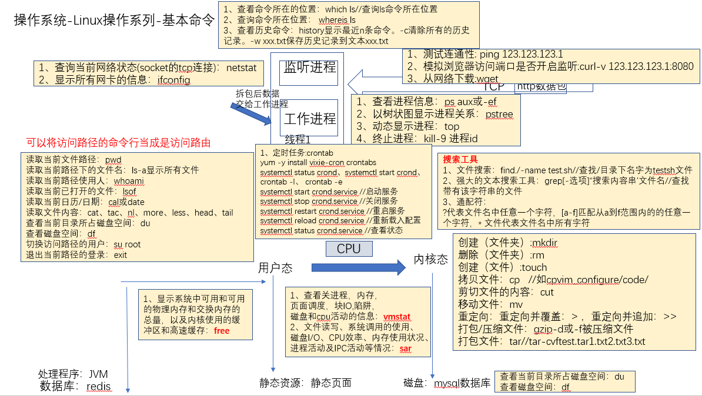
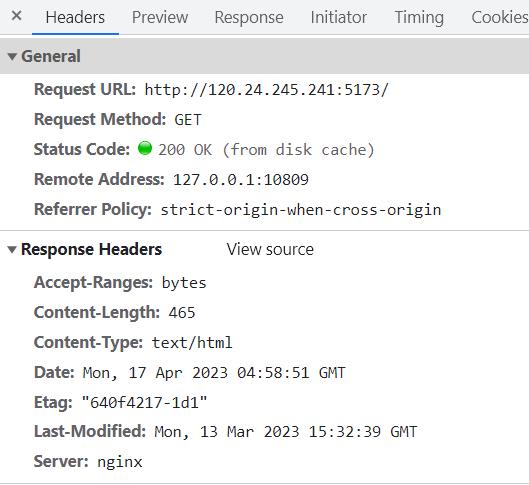

# 一、linux

考前背一背就行了

面试常问：你最常用的linux命令是什么

答：ps -ef | grep “redis”

 




# 二、背诵版


### 00、查看cpu

1、top

顶部标题部分显示系统的整体状态信息，例如正常运行时间，平均负载，总进程计数，当前CPU使用率状态以及内存和交换空间的使用情况。进程列表按 CPU 使用率的百分比排序。

下面来看一下哪个用户的的cpu使用率

```
top -u root
```


2、ps -ef | grep “redis”

这个不解释，也查看cpu使用率

也可以使用这个命令来查看具体的cpu信息

```
ps -C redis -o %cpu
```


### 0、查看内存

`free`命令可以显示当前系统未使用的和已使用的内存大小


### 1、查看端口占用(非常常问)

两种：(务必要记住)

**netstat -tunlp | grep 8000**

**lsof -i:8000**


1、lsof
lsof(list open files)是一个列出当前系统打开文件的工具。

```
# lsof -i:8000
COMMAND   PID USER   FD   TYPE   DEVICE SIZE/OFF NODE NAME
nodejs  26993 root   10u  IPv4 37999514      0t0  TCP *:8000 (LISTEN)
```

2、netstat 

netstat -tunlp 用于显示 tcp，udp 的端口和进程等相关情况

-t (tcp) 仅显示tcp相关选项
-u (udp)仅显示udp相关选项
-n 拒绝显示别名，能显示数字的全部转化为数字
-l 仅列出在Listen(监听)的服务状态
-p 显示建立相关链接的程序名

```
# netstat -tunlp | grep 8000
tcp        0      0 0.0.0.0:8000            0.0.0.0:*               LISTEN      26993/nodejs   
```


### 2、查看进程

1、ps -ef | grep “redis”

这个不解释，也查看cpu使用率


### 3、查看服务(ip+端口的)是否正常

1、curl  (这是个http请求！像mysql这种是不行的！)

curl相当于直接访问网页

```
curl -v 120.24.245.241:5173
```

(会像网页一样返回该端口的响应)


### 4、查找文件find、查看文件内容(如日志)tail、匹配文件内容grep


1、find

查找文件

```
find . -name "*.log"
```

2、tail

查看文件内容

```
//查看从最后30的那部分日志(-30代表倒数30行)，一般都是发生在最近的
tail -n -30 niceplace-backend-0.log
```

3、grep

查看文件中的字符串

```
grep 2023-04-17 niceplace-backend-0.log 
```


### 5、解压、压缩tar 

解压缩命令格式：(装卸v费)

```
tar -zxvf 压缩文件名.tar.gz
```

压缩命令格式：(装菜v费)

```
tar -zcvf 压缩文件名.tar.gz 被压缩文件名
```

(tar在linux中用得多，zip、rar在window是用得多)


### 6、便捷指令

1、history

2、whereis：whereis python3

3、which


### 7、管理

1、查看文件的权限信息

```
ls -l
```

2、赋值权限

```
sudo chmod 777
```


### 8、文件夹操作

1、创建文件夹dirtionary

make dir=  

```
mkdir
```

2、删除文件夹

remove

```
rm
```

3、移动文件夹或者重命名

move

```
mv
```

4、拷贝

```
cp
```


5、创建文件

```
touch
```


# 三、详情版


按实际情景的常用顺序:

突然有一天用户反应网页出问题了，但是没有明说是什么问题，此刻进入排查：

## 1、查看前后端的服务是否已经挂了：

这经常还会看端口是否开启，因为会返回这个端口的信息，相当于是访问了这个网页。

```
curl -v 120.24.245.241:5173
```

返回:

```
* About to connect() to 120.24.245.241 port 5173 (#0)
*   Trying 120.24.245.241...
* Connected to 120.24.245.241 (120.24.245.241) port 5173 (#0)
> GET / HTTP/1.1
> User-Agent: curl/7.29.0
> Host: 120.24.245.241:5173
> Accept: */*
> 
< HTTP/1.1 200 OK
< Server: nginx
< Date: Mon, 17 Apr 2023 04:59:14 GMT
< Content-Type: text/html
< Content-Length: 465
< Last-Modified: Mon, 13 Mar 2023 15:32:39 GMT
< Connection: keep-alive
< ETag: "640f4217-1d1"
< Accept-Ranges: bytes
< 
<!DOCTYPE html>
<html lang="en">
  <head>
    <meta charset="UTF-8" />
    <link rel="icon" type="image/svg+xml" href="/douying.webp" />
    <meta name="viewport" content="width=device-width, initial-scale=1.0" />
    <title>抖影-好看不重复</title>
    <script type="module" crossorigin src="/assets/index-6ac7bc95.js"></script>
    <link rel="stylesheet" href="/assets/index-e7cd25fa.css">
  </head>
  <body>
    <div id="app"></div>
    
  </body>
</html>
* Connection #0 to host 120.24.245.241 left intact
```




前后端的服务没挂，那可能是后端问题，查看一下日志。

## 2、后端日志查看


### 进入:

```
cd 省略
```


### 懒得输入命令了:

```
history
```

将之前查看日志的命令粘贴过来。


### 忘了日志在哪个文件夹了：

```
//将当前目录及其子目录下所有文件后缀为 .c 的文件列出来:
find . -name "*.log"
```

返回：

```
./logs/niceplace-backend-0.log
```


### 为了避免cat查看日志会太多，用tail替代:

```
//查看从最后30的那部分日志(-30代表倒数30行)，一般都是发生在最近的
tail -n -30 niceplace-backend-0.log
```


但是最近的貌似没有，直接在文件中搜索关键字:

### 搜索字符串查看:

```
//查看今天2023-04-17的日志
grep 2023-04-17 niceplace-backend-0.log 
```

格式：grep 字符串 文件名

返回：

```
2023-04-17 12:58:52.665  INFO 29606 --- [0.0-8081-exec-5] c.taoli.niceplace.config.MyInterceptor   : 进入拦截器的用户:null
2023-04-17 12:58:52.671 ERROR 29606 --- [0.0-8081-exec-5] c.t.n.exception.GlobalExceptionHandler   : businessException: 无权限
2023-04-17 12:59:01.864  INFO 29606 --- [.0-8081-exec-13] c.taoli.niceplace.config.MyInterceptor   : 进入拦截器的用户:null
2023-04-17 12:59:01.867 ERROR 29606 --- [.0-8081-exec-13] c.t.n.exception.GlobalExceptionHandler   : businessException: 无权限
```

找到问题(假设问题就是redis无法连接)


### 发现问题,查看对应的进程

```
//ps -aux查看进程表(当做是text文件)，再通过grep查看其对应的字符redis
ps -aux | grep redis
```

返回：

```
polkitd   7476  0.1  0.0  43120   812 ?        Ssl  Mar03  87:36 redis-server 0.0.0.0:56379
root     24871  0.0  0.0 112812   980 pts/2    R+   13:33   0:00 grep --color=auto redis
```

(假设是已经挂了)

重启redis，解决。


### 写一个py脚本来定时检查redis是否在线，不在线则发邮件给相关负责人


脚本:

```
省略

//下载py库:pip3 install XX
```


### 查看目前的定时任务

```
//状态
service crond status
//列表
crontab -l
```


### 防止调错命令，查看python3的指令位置

```
whereis python3
```

返回:

```
python3: /usr/bin/python3.6-config /usr/bin/python3.6m /usr/bin/python3 
/usr/bin/python3.6 /usr/bin/python3.6m-x86_64-config /usr/bin/python3.6m-config 
/usr/lib/python3.6 /usr/lib64/python3.6 /usr/local/lib/python3.6 
/usr/include/python3.6m /usr/share/man/man1/python3.1.gz
```


进入定时任务编辑

```
crontab -e
```

### 等同于vim编辑文本：

```
按i进行插入

4 0 * * *  /var/tmp/springboot/vhost/logs/logSearch-regex-niceplace.py

按esc退出插入模式

然后:wq保存退出
```