 

# 一、集合

面试是主要是从【集合用在哪(存储查出的数据/数据容器更换(数组转List))->集合使用(线程安全/集合修改错误ConcurrentModificationException异常)->最后改写该方法成为自己的工具类(泛型)】

流程即：业务选型决定集合、是否具有多线程场景/规范使用集合、集合排序、写工具类

 

## 0、Map作接口和直接使用HashMap有什么区别？(集合接口)

Map<String, String> map = new HashMap<>();

和HashMap<String, String> hashmap = new HashMap<>();

 

答：

其实是一样的，都约束了键值对的类型，不会发生类型转换错误。

不易扩展：如果需要更换映射关系的实现类，例如从 HashMap 替换为 TreeMap，则需要修改大量的代码。

如果在程序中有多处使用了 HashMap 类实现的映射关系，则还需要修改每处使用的变量类型（前后都需要修改）

```
Map<String, Integer> map = new HashMap<>();
// 需要修改的代码如下
Map<String, Integer> map = new TreeMap<>();

Map<String, Integer> m = new HashMap<>();
// 需要修改的代码如下
Map<String, Integer> m = new TreeMap<>();

HashMap<String, Integer> hm = new HashMap<>();
// 需要修改的代码如下
TreeMap<String, Integer> hm = new TreeMap<>();

```

如果使用 Map<K, V> map = new HashMap<>(); 这种方式创建映射关系，则只需要修改一行代码即可：

```
Map<String, Integer> map = new HashMap<>();
// 需要修改的代码如下
Map<String, Integer> map = new TreeMap<>();

```

这样就可以使用 TreeMap 类实现的映射关系了。

所以，建议使用 Map<K, V> map = new HashMap<>(); 这种方式来创建映射关系，以提高代码的可扩展性。

 

 

## 1、业务选型决定集合

 

### （1）存储查出的数据

#### a、ArrayList和LinkedList

**分别用来数据装查出的数据(LinkedList可以用在Stream时会有序)，区别是什么？**

ArrayList是动态数组的数据结构实现，

```
1、ArrayList比LinkedList在随机访问的时候效率要高，因为LinkedList是线性的数据存储方式，
所以需要移动指针从前往后依次查找

```

扩展1：为什么数组是从0开始而非1开始？

Dijkstra 是这样解释的：从下标 0 开始能够给出更好的不等式，因为元素的下标就等于序列中它前面的元素数（或者说 “偏移量”）。

扩展2:特殊类型Pair

```
List的特殊类型Pair
Pair是一个Java集合类，它允许您将两个相关的对象存储在一个对象中，这里它是一个用户和长整型数据的对。
```

 

**LinkedList是双向链表的数据结构实现**

```
1、在非首尾的增加和删除操作，LinkedList要比ArrayList效率要高，因为
ArrayList增删操作要影响数组内的其他数据的下标
2、LinkedList比ArrayList更占内存，因为LinkedList的节点除了存储数据，还存储
了两个引用，一个指向前一个元素，一个指向后一个元素
```

ArrayList和LinkedList都是不同步的，也就是不保证线程安全；综合来说，在需要频繁读取集合中的元素时，更推荐使用ArrayList,而在插入和删除操作较多时，更推荐使用LinkedList。

 

**扩展LinkedList的开发中的使用**

当利用stream去除list的map时如果无序，可以用LinkedHashMap::new来使得List有序：

```
 //业务：对code分组并排序后的数据,取排序后的第一条数据,插入到目标表
 List<DTO> list = mapper.getList(req);
 Map<String, List<DTO>> collect = list.stream().filter(item -> StringUtils.isNotBlank(item.getCode()))
 .collect(Collectors.groupingBy(DTO::getCode,LinkedHashMap::new,Collectors.toList()));
```

LinkedList与LinkedHashMap的区别

LinkedHashMap是HashMap的基础上，维护了每个元素的前驱和后继指针(因此占用更多的内存)。

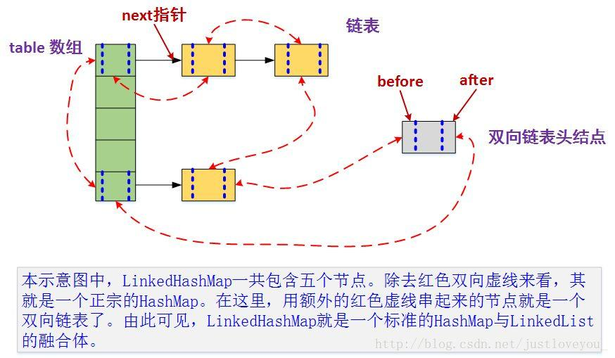

 

使用场景：例如在使用Stream时，我们平时都是使用以下代码去分组：

```java
Map<String, List<DTO>> timeCollect = excelList.stream()
.filter(item ->StringUtils.isNotBlank(item.getResponseDate()))
.collect(Collectors.groupingBy(DTO::getResponseDate));
//.groupingBy(DTO::getResponseDate)中默认已经有toList了
```

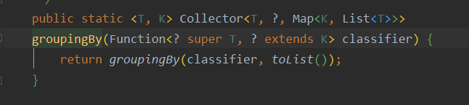

弊端：取出的map中的list中的元素是无序的(因为默认是hashmap)，如果想取第一个是不行的。

 

改进如下：

```java
 //业务：对按power_consumer_code分组并排序后的数据,取排序后的第一条数据,插入到目标表
 List<MsDrsMpowerConsumerInfoDTO> solidifyCompanyList = mapper.getMonthSolidifyList(req);
 
 Map<String, List<DTO>> collect = solidifyCompanyList.stream().
 filter(item -> StringUtils.isNotBlank(item.getPowerConsumerCode()))
 .collect(Collectors.groupingBy(DTO::getPowerConsumerCode,
 LinkedHashMap::new,Collectors.toList()));
```

由上述可知，可以传入 LinkedHashMap::new来传入mapFactory和Collectors.toList()方法

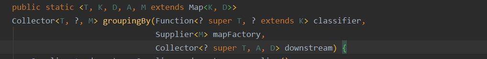

 

所以这样groupby出来的分组每一个map，key是DTO::getPowerConsumerCode，value是有顺序的元素的List

（不要纠结 LinkedHashMap::new为什么会影响到list，反正就这样）

 

 

#### b、HashMap、HashSet

（重要）

HashMap

JDK1.8之前采用的是拉链法。拉链法：将链表和数组相结合。也就是说创建一个链表数组，数组中每一格就是一个链表。若遇到哈希冲突，则将冲突的值加到链表中即可。

相比于之前的版本，jdk1.8在解决哈希冲突时有了较大的变化，当链表长度大于间值（默认为8)时，将链表转化为红黑树，以减少搜索时间。

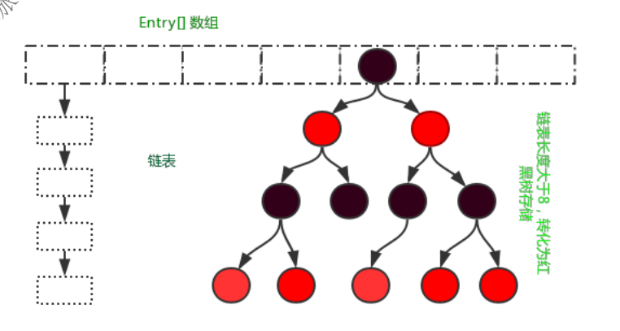

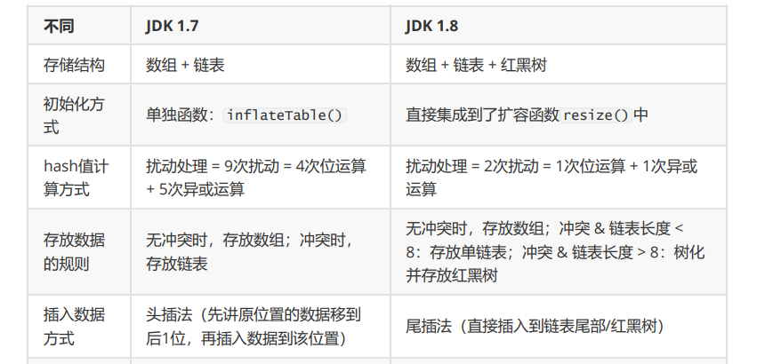

HashMap的重点：

**1、hash函数：**

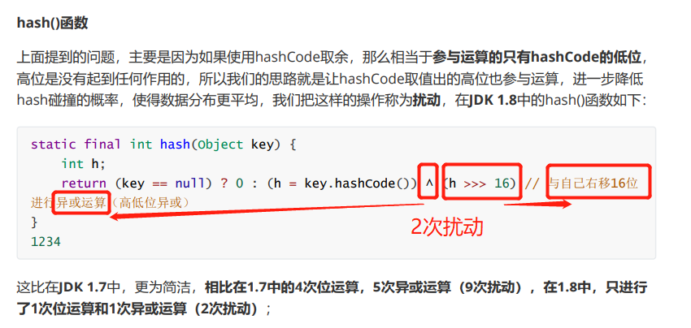

那为什么是两次扰动呢？
答：这样就是加大哈希值低位的随机性，使得分布更均匀，减少Hash冲突，两次就够了，已经达到了高位低位同时参与运算的目的

2、

**能否使用任何类作为Map的key?**
可以使用任何类作为Map的key,然而在使用之前，需要考虑以下几点：
1、如果类重写了equals()方法，也应该重写hashCode()方法
2、类的所有实例需要遵循与equals()和hashCode()相关的规则
3、如果一个类没有使用equals(),不应该在hashCode()中使用它
4、用户自定义Key类最佳实践是使之为不可变的，这样hashCode()值可以被缓存起来，拥有更好的性能。不可变的类也可以确保hashCode()和equals()在未来不会改变，这样就会解决与可变相关的问题了

**为什么HashMap中String、Integer这样的包装类适合作为K?**
答：String、Integer等包装类的特性能够保证Hash值的不可更改性和计算准确性，能够有效的减少Hash碰撞的几率
1.都是final类型，即不可变性，保证key的不可更改性，不会存在获取hash值不同的情况
2.内部已重写了equals()、hashcode()等方法，遵守了HashMap内部的规范（不清楚可以去上面看看putValue的过程）,不容易出现Hash值计算错误的情况；

**3、HashMap的长度为什么是2的雾次方**

我们首先可能会想到采用%取余的操作来实现。但是，重点来了：“取余（%)操作中如果hash的  除数length是2的幕次  则等价于与其除数length减一的与（&)操作

（也就是说hash%length==hash&(length-1)的前提是length是2的n次方)。

并且采用二进制位与操作&,相对于除操作%能够提高运算效率，这就解释了HashMap的长度为什么是2的寡次方。

**（一般我们都是用hashcode除以长度，但是这样会慢，如果用与长度-1会更快，因为二进制运算快）**

**4、HashMap的key可以为null？为什么？**

```
static final int hash(Object key) {
    int h;
    //当key等于null的时候，不走hashCode()方法
    return (key == null) ? 0 : (h = key.hashCode()) ^ (h >>> 16);
}
```

可以看到，在key==null的时候，将key的hash值置为0，从而解决了当key为null时，走hashCode方法导致空指针异常

**5、ConcurrentHashMap的key可以为null？为什么？**

ConcurrentHashMapsourceCode

```
    final V putVal(K key, V value, boolean onlyIfAbsent) {
        if (key == null || value == null) throw new NullPointerException();
        int hash = spread(key.hashCode());
        int binCount = 0;
        ......
    }
```

get方法获取到的value的结果都为null。所以当我们用get方法获取到一个value为null的时候，这里会产生二义性：

可能没有test这个key；可能有test这个key，只不过value为null

HashMap如何解决二义性问题：
containsKey方法的结果一个为false一个为true，可以通过这个方法来区分上面说道的二义性问题

ConcurrentHashMap为什么不能解决二义性问题：
因为ConcurrentHashMap是线程安全的，一般使用在并发环境下，你一开始get方法获取到null之后，再去调用containsKey方法，没法确保get方法和containsKey方法之间，没有别的线程来捣乱，刚好把你要查询的对象设置了进去或者删除掉了。

(这有点get和containsKey并非是原子操作的味道；比如，先get()，然后中间有个别的线程put了，这时候再containsKey()，你是不知道中间可能受到指令重排或者别的原因导致的)

 

***

HashSet(用hashmap的巧妙利用(key重复被覆盖)达到了集合set的效果)

```
1、实现原理：
HashSet是基于HashMap实现的，HashSet的值存放于HashMap的key上，HashMap的value统一为“preset虚值”,
因此HashSet的实现比较简单，相关HashSet的操作，基本上都是直接调用底层HashMap的相关方法来完成，HashSet不允许重复的值。

2、HashSet如何检查重复？HashSet是如何保证数据不可重复的？
向HashSet中add()元素时，判断元素是否存在的依据，不仅要比较hash值，同时还要结合equles方法比较。
HashSet中的add()方法会使用HashMap的put()方法。
HashMap的key是唯一的，由源码可以看出HashSet添加进去的值就是作为HashMap的key,并且在HashMap中如果K/相同时，
会用新的V覆盖掉日的V,然后返回旧的V。
所以不会重复（HashMap比较key是否相等是先比较hashcode再比较equals(即先比较地址再比较内容))。

扩展：
hashCode()与equals()的相关规定：
1.如果两个对象相等，则hashcode一定也是相同的
2.两个对象相等，对两个equals方法返回true
3.两个对象有相同的hashcode值，它们也不一定是相等的
4.综上，equals方法被覆盖过，则hashCode方法也必须被覆盖
5.hashCode()的默认行为是对堆上的对象产生独特值。如果没有重写hashCode(),则该class的两个
对象无论如何都不会相等（即使这两个对象指向相同的数据）。

==与equals的区别
1.==是判断两个变量或实例是不是指向同一个内存空间equals是判断两个变量或实例所指向的内存
空间的值是不是相同
2.==是指对内存地址进行比较equals()是对字符串的内容进行比较3.=指引用是否相，同equals()指的
是值是否相同


```

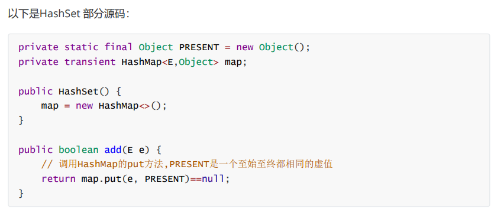

 

### （2）数据容器更换(数组转List)

#### a、如何实现数组和List之间的转换

```
    1、数组转List:使用Arrays.asList(array)进行转换
    2、List转数组：使用List自带的toArray()方法
```

```java
代码示例：
// list to array
List<String> list = new ArrayList<String> O;
list.add("123");
list.add("456");
list.toArray();

// array to list
string[] array = new String[]{"123","456"};
Arrays.asList(array);
```

#### b、HashMap和TreeMap，无序变有序

对于在Map中插入、删除和定位元素这类操作，HashMap是最好的选择。然而，**假如你需要对一个有序的key集合进行遍历，TreeMap是更好的选择**。基于你的collection的大小，也许向HashMap中添加元素会更快，将map换为TreeMap进行有序key的遍历。

```
 @Test
    void testHashMapAndTreeMap() {
        Map<String,String> hashMap = new HashMap<>(32);
        hashMap.put("nihao0","taoli0");
        hashMap.put("nihao1","taoli1");
        hashMap.put("nihao2","taoli2");
        hashMap.forEach((k,value)->{
            System.out.println(k+value);
        });
        //nihao0taoli0
        //nihao2taoli2
        //nihao1taoli1
        TreeMap<String,String> treeMap = new TreeMap<>(hashMap);
        treeMap.forEach((k,value)->{
            System.out.println(k+value);
        });
        //nihao0taoli0
        //nihao1taoli1
        //nihao2taoli2
    }
```

TreeMap要求存放的键值对映射的键(一般用String类型)必须实现Comparable接口从而根据键对元素进行排序。
Collections工具类的sort方法有两种重载的形式，
第一种要求传入的待排序容器中存放的对象比较实现Comparable接口以实现元素的比较；
第二种不强制性的要求容器中的元素必须可比较，但是要求传入第二个参数，参数是Comparator接口的子类型（需要重写compare方法实现元素的比较）,相当于一个临时定义的排序规则，其实就是通过接口注入比较元素大小的算法，也是对回调模式的应用（Java中对函数式编程的支持）。

 

 

 

 

## 2、是否具有多线程场景/规范使用集合

1、加锁synchronized。诞生了vector、collection.synchronizedList(list)。使用了性能低的synchronized
2、其它：
(1)copyOnWriteArrayList:在写入的时候以复制代替覆，而且使用了Lock锁更灵活
(2)copyOnWriteArraySet:拷贝
(3)ConcurrentHashMap:使用分段锁

 

 

### (1)线程安全

 

#### a、ArrayList

a-1、

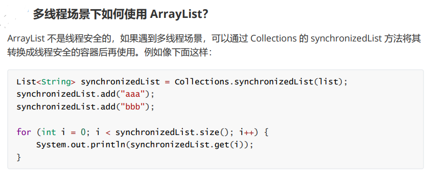

a-2：copyOnWriteArrayList:在写入的时候以复制代替覆，而且使用了Lock锁更灵活

 

#### b、 HashMap 和 ConcurrentHashMap

1.ConcurrentHashMap，在JDK1.8中，放弃了Segment雕肿的设计，取而代之的是采用Node+CAS+Synchronized来保证并发安全进行实现，synchronized只锁定当前链表或红黑二叉树的首节点，这样只要hash不冲突，就不会产生并发，效率又提升N倍。

2、ConcurrentHashMap相对于HashTable的synchronized锁的粒度更精细了一些(而HashTable是锁住整个表)，并发性能更好，而HashMap没有锁机制，不是线程安全的。（JDK1.8之后ConcurrentHashMap启用了一种全新的方式实现，利用CAS算法。）
**2、HashMap的键值对允许有null,但是ConCurrentHashMap都不允许。**

 


#### c、set

copyOnWriteArraySet:拷贝

 

 

### (2)集合修改异常

为什么会出现这样的情况：1、想去除集合中无用的数据(其实可以用stream设置一个不可能的值来解决)

 

 

**a.常见的：**

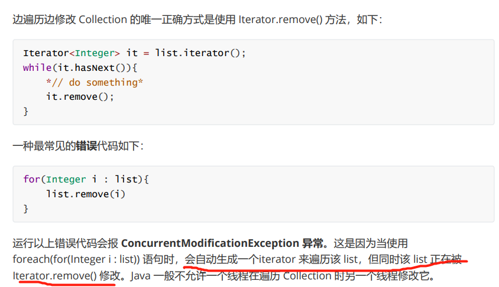

 

**b、解决方法：**

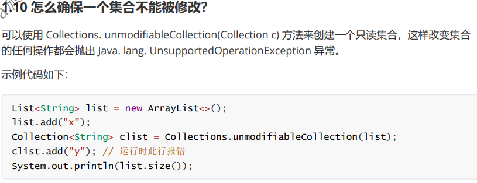

 

 

 

## 3、集合排序

都是根据数字>0(大于),<0(小于),=0(等于)来判断排序

 

Collection(List、set)常用的两种排序方法(除map外，map可以用TreeMap排序)：

```
collect.sort((p1, p2) -> Integer.parseInt(p1.geTime()) - Integer.parseInt(p2.getTime()));
// collect.sort(Comparator.comparingInt(p -> Integer.parseInt(p.getTime())));
```

1、comparable接口实际上是出自java.lang包，它有一个compareTo(Object obj)方法用来排序
2、comparator接口实际上是出自java.util包，它有一个compare(Object obj1,Object obj2)方法用来排序


# 二、JVM

JVM对很多人来说是个神秘的概念，可能是因为我么平时开发中接触不到JVM，所以这才是陌生的根本。

其实内容就是我们的写的Java代码是如何在JVM环境中与操作系统交互工作的。

我们可以冲实际中出发：

1、为什么要写静态变量 (无需等待对象new出就给出变量，静态方法执行前就可以使用)

2、为什么我要需要写常量？（这样就会被分配在常量池直接指向内存中的地址，不会被修改和快速响应）

3、为什么要写静态方法？静态代码块？（在类信息加载完就可以调用了(因为静态方法存在类信息中)，无需等待对象new出）

4、为什么要JVM调优？(因为我们生成的对象在内存中可能会占用太多，一开始程序员就要设置好。还有GC的一些参数也是同理，控制对象的GC速度和其GC的回收器(算法))

5、为什么要JVM查找？(GC存在的缺陷(程序员没考虑好内存的处理)，内存中不可被回收的部分(像ThreadLocal就是程序员忘了remove导致内存泄露)就需要人工来解决源头问题了，解决后重启(JVM也会重启)就不会存在)

 

## 1、了解我们写代码的意义：静态变量/常量/静态方法、静态代码块

 


 **加载验证，准备解析，初始化**

 

 

## 2、调优

 

 

### （1）对象的生成受到限制

(和下面的加速GC有共同图)

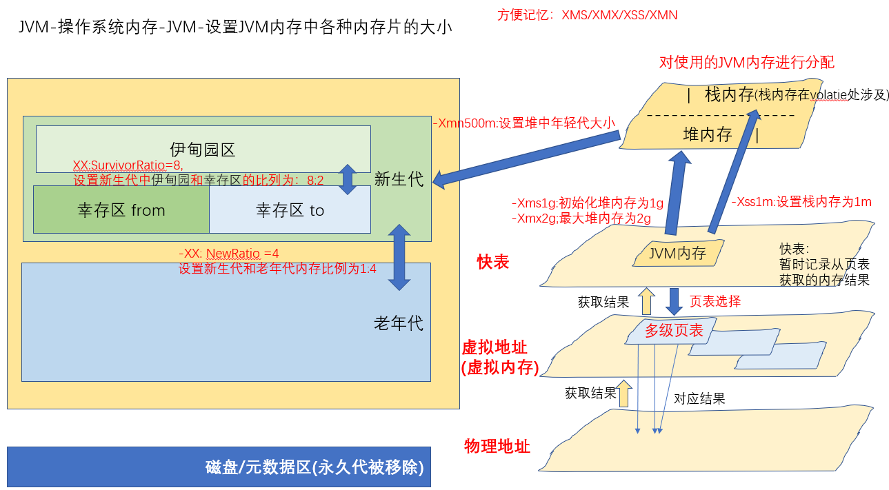

 

 

### （2）在GC时被快速回收

首先要理解GC回收的判断条件：

1、引用计数器法：为每个对象创建一个引用计数，有对象引用时计数器+1,引用被释放时计数-1,当计数器为0时就可以被回收。它有一个缺点不能解决循环引用的问题；
2、可达性分析算法：从GC Roots开始向下搜索，搜索所走过的路径称为引用链。当一个对象到GCRoots没有任何引用链相连时，则证明此对象是可以被回收的。

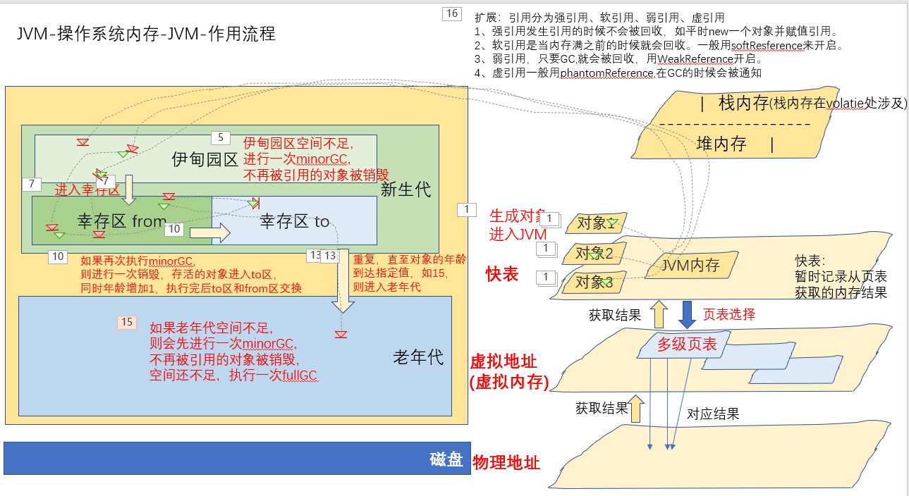

 

a、程序员写程序时，故意控制引用类型

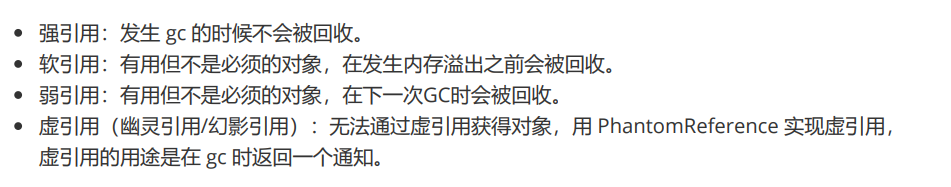

b、程序员在启动程序时，设置堆内存中各区(年轻代/老年代)大小，加速GC的速度和GC的回收器(算法)来控制对象回收

b1、控制GC的速度


 

b2、控制GC的回收器(算法)

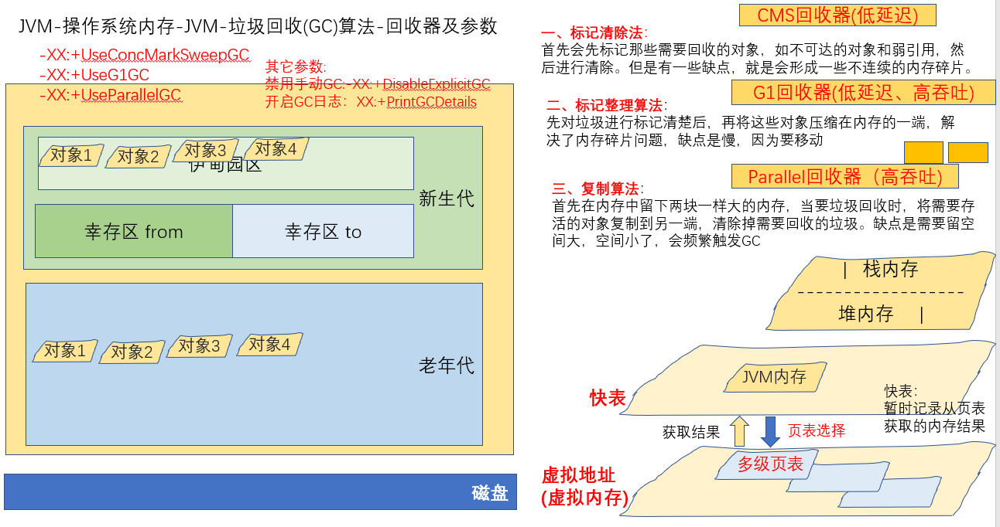

如何记住：

1、标记清除法-->cms的全名concmarksS中的mark就是标记的意思->所以意思几时标记一些内存并回收

2、G1回收器-->1就是一端，表示先拉垃圾压缩到一端，然后回收->标记整理法(这是最优的，G1就是第一名)->缺点就是慢

3、并行回收器->并行，两边要保持一样的内存，每个并行处理器处理一个->复制算法->缺点就是留空多


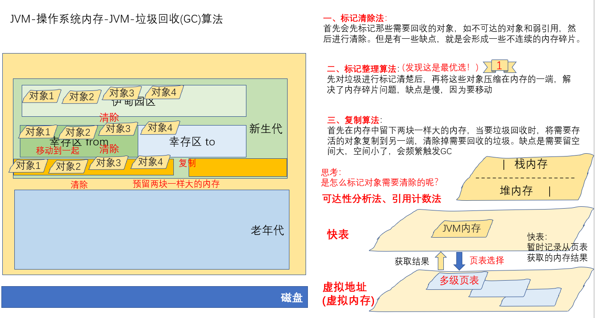

 

# 三、扩展JVM(JMM/String类、常量池、拆装箱)

 

## 1、JMM内存模型

**原JVM“缺点”(其实并不能算是缺点，有好有坏，只是在并发时原JVM会导致一些不好的结果)：**

1、破坏原子性：就像i++，这句代码其实是先读取i的值，再+1，最后赋值到i，三步操作了，不能保证原子性。不像int i=1这种赋值语句是原子性的。

2、变量高速缓存破坏可见性：会从缓存中取值，“多线程并发时”，但是取到的值可能是已经被更改了的脏数据值。

3、指令重排破坏有序性：JVM为了优化，“多线程并发时”，代码顺序可能会被重新排序，可能导致数据错误。指令重排序在单线程是没有问题的，不会影响执行结果，而且还提高了性能。但是在多线程的环境下就不能保证一定不会影响执行结果了。

***

解决：JMM内存模型的作用(用JVM的一些内存模型JMM来避免了原JVM与操作系统在并发下的一些缺点)

1、原子性：用synchronized关键字保证不受线程的影响，要么全部成功，要么全部失败。原子性指的是一个操作是不可分割，不可中断的，一个线程在执行时不会被其他线程干扰。

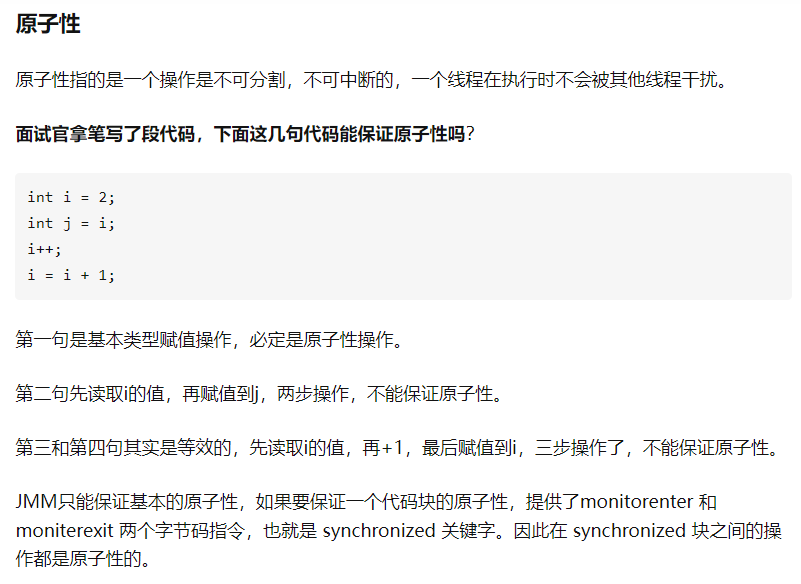

2、可见性：不受高速缓存的影响，用volatie保证始终对主内存可见(线程间的可见性)

```
为什么用volatie保证始终对主内存可见，它却还不能保证线程安全？不是保证了线程间的可见性吗？
答：很简单，可见性不能保证操作的原子性，前面说过了i++不是原子性操作，会当做三步，
先读取i的值，然后+1，最后赋值回去i变量。需要保证线程安全的话，
需要使用synchronized关键字或者lock锁，给count++这段代码上锁：
private static synchronized void add() {
    i++;
}
线程间的可见性是没问题的，但是可能就是线程自己的原子性问题导致的，与别的线程干预无关。
```

3、有序性：volatile关键字是使用内存屏障达到禁止指令重排序，以保证有序性。

```
在进行指令优化时，不能将在对volatile变量访问的语句放在其后面执行，也不能把volatile变量后面的语句放到其前面执行。
```

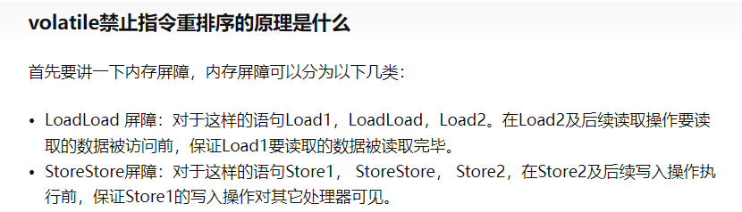

 

 

## 2、String类、常量池、拆装箱

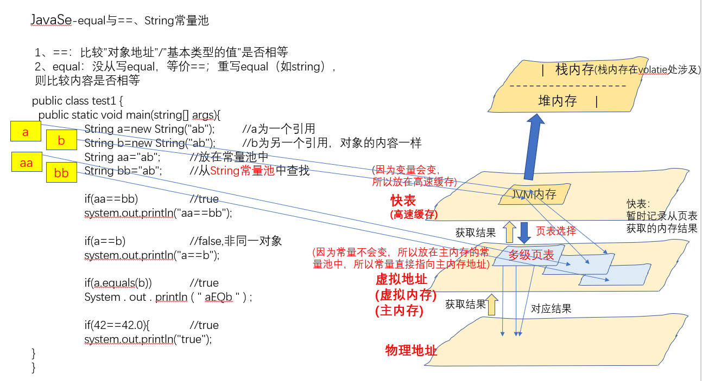

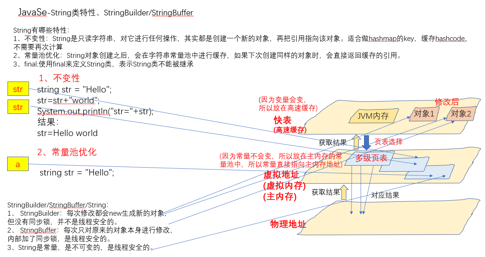

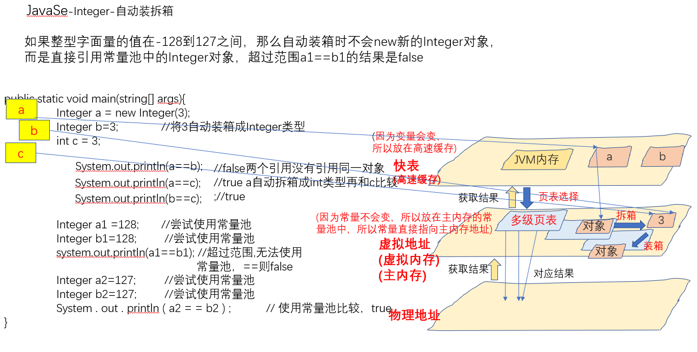

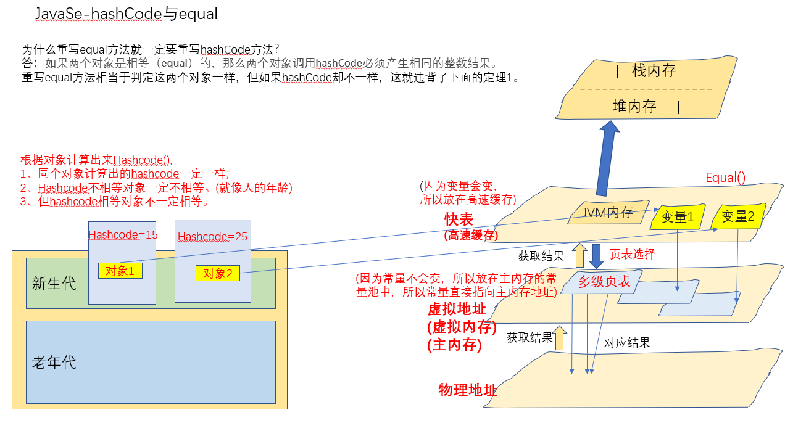