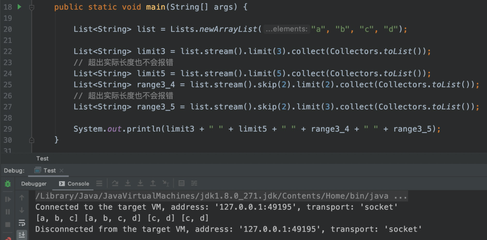

# 一、泛型

<br/>

## 1、泛型类型检查错误

Unchecked call to 'put(K, V)' as a member of raw type 'java.util.HashMap' 
这是因为，使用原始类型声明的集合类型在编译时不会进行类型检查，它可以存储任何类型的对象，
导致类型安全问题。
为了避免这种情况，可以使用带有类型参数的泛型声明 Map 类型，
如 Map<Key, Value>，这样就可以在编译时进行类型检查，保证类型安全。

<br/>

错误示范：

```
List list = new ArrayList();
list.add("Hello");
list.add(123);

for (int i = 0; i < list.size(); i++) {
    String str = (String) list.get(i);
    System.out.println(str);
}
```

在上面的代码中，List 类型被声明为原始类型 List，因此可以存储任何类型的对象。

在循环中，使用强制类型转换将 List 中的元素转换为 String 类型，如果 List 中存储的元素不是 String 类型，就会出现类型转换异常。

为了避免这种情况，可以使用带有类型参数的泛型声明 List 类型，如 List<String>，这样就可以在编译时进行类型检查，保证类型安全。

```
List<String> list = new ArrayList<>();
list.add("Hello");
list.add("World");

for (int i = 0; i < list.size(); i++) {
    String str = list.get(i);
    System.out.println(str);
}
```

在修改后的代码中，List 类型被声明为 List<String>，只能存储 String 类型的对象。

在循环中，不需要使用强制类型转换，直接从 List 中获取元素就是 String 类型，保证了类型安全。

<br/>

出现这个错误主要是接口使用泛型：

使用泛型方法的优点是，可以在调用方法时指定参数的类型，这样就可以保证类型安全。

例如，定义一个泛型方法 getMiddle，用于获取列表的中间元素：

```
public static <T> T getMiddle(List<T> list) {
    int size = list.size();
    int middle = size / 2;
    return list.get(middle);
}

//上面中首先声明一个泛型T的泛型方法，然后这个泛型被接收List的入参时赋予
```

调用方法时，可以指定参数的类型，例如：

```
List<String> strList = Arrays.asList("Hello", "World");
String middle = getMiddle(strList);

List<Integer> intList = Arrays.asList(1, 2, 3);
Integer middle = getMiddle(intList);

```

在调用方法时指定参数的类型，可以保证类型安全，避免类型转换异常。

<br/>

## 2、泛型通配符

(泛型数据结构List<T>的同义但起到提前告知和限制的一种形式，一般使用在自定义方法时想要提前告知使用者以下代码是做了只读还是只取的操作，方便修改和理解该方法的作用，比如只是读出来，或者要取出来处理后再存进去的操作。很多文章只举了简单的例子，没有讲提前告知这个点，导致很多人学到这里就会懵逼)。

首先是理解使用场景：著名的PECS(即"Producer Extends, Consumer Super" 网上翻译为"生产者使用extends, 消费者使用super", 我觉得还是不翻译的好). 也有的地方写作"in out"原则, 总的来说就是:

- in或者producer就是你要读取出数据以供随后使用(想象一下List的get), 这时使用extends关键字, 固定上边界的通配符. 你可以将该对象当做一个只读对象;(提前告知调用者下面的代码只使用到get)
- out或者consumer就是你要将已有的数据写入对象(想象一下List的add), 这时使用super关键字, 固定下边界的通配符. 你可以将该对象当做一个只能写入的对象;(提前告知调用者下面的代码只使用到add)
- 当你希望in或producer的数据能够使用Object类中的方法访问时, 使用无边界通配符;(提前告知调用者下面的代码没使用到add、get)
- 当你需要一个既能读又能写的对象时, 就不要使用通配符了.(提前告知调用者下面的代码可能都使用到add、get)

<br/>

这也满足日常开发规范：1、扼杀编译错误的bug。2、明确方法的参数，即其使用对象，不让随意调用。3、list经常使用，可以提**前告知使用者本方法中对其限制了什么方法**，如add或get

<br/>

日常我们使用List<T>都是**作为方法参数**用来接收对象，但是这个list是无限制的，只要调用这个方法再传入一个list<T>就可以使用。

但是，代码中这个list的**存取属性**(只存？只存？可存可取？)是不明确的，我们需要提前在入参的时候就说明其存取属性，那么其余开发者就**提前知道**以下的代码中是没有使用到add这个存方法(假设是List<？>或List<？extends XX>)，

例子：

```
1 public static void addTest(List<?> list) {
2     Object o = new Object();
3     // list.add(o); // 编译报错
4     // list.add(1); // 编译报错
5     // list.add("ABC"); // 编译报错
6     list.add(null);
7 }
```

或者没有使用到get这个属性(假设是List<？>、List<？super XX>)。

<br/>

同时，限制了List的范围，告知使用者传入参数时，不要乱传入List对象，因为可能在这个方法中有对List的实体有向上/下转型的行为，否则会造成错误。在写方法时要注意，特别是写通用工具类时要注意。

<br/>

<br/>

1. **无边界的通配符的使用, 我们以在集合List中使用<?>为例. 如:**

有一点我们必须明确, 我们不能对List<?>使用add方法, 仅有一个例外, 就是add(null). 为什么呢? 因为我们不确定该List的类型, 不知道add什么类型的数据才对, 只有null是所有引用数据类型都具有的元素. 请看下面代码:

```
1 public static void addTest(List<?> list) {
2     Object o = new Object();
3     // list.add(o); // 编译报错
4     // list.add(1); // 编译报错
5     // list.add("ABC"); // 编译报错
6     list.add(null);
7 }
```

由于我们根本不知道list会接受到具有什么样的泛型List, 所以除了null之外什么也不能add.
还有, List<?>也不能使用get方法, 只有Object类型是个例外. 原因也很简单, 因为我们不知道传入的List是什么泛型的, 所以无法接受得到的get, 但是Object是所有数据类型的父类, 所以只有接受他可以, 请看下面代码:

```
1 public static void getTest(List<?> list) {
2     // String s = list.get(0); // 编译报错
3     // Integer i = list.get(1); // 编译报错
4     Object o = list.get(2);
5 }
```

那位说了, 不是有强制类型转换么? 是有, 但是我们不知道会传入什么类型, 比如我们将其强转为String, 编译是通过了, 但是如果传入个Integer泛型的List, 一运行还会出错. 那位又说了, 那么保证传入的String类型的数据不就好了么? 那样是没问题了, 但是那还用<?>干嘛呀? 直接List<String>不就行了。

这就是写通用工具类时经常会碰到的情况，需要**提前告知使用者**这个方法中有没有使用到add、get这些方法，万一以后改方法代码，也心中有数。

<br/>

**2.固定上边界的通配符的使用, 我仍旧以List为例来说明:**

<br/>

有一点我们需要记住的是, List<? extends E>不能使用add方法, 请看如下代码:

```
1 public static void addTest2(List<? extends Number> l) {
2     // l.add(1); // 编译报错
3     // l.add(1.1); //编译报错
4     l.add(null);
5 }
```

原因很简单, 泛型<? extends E>指的是E及其子类, 这里传入的可能是Integer, 也可能是Double, 我们在写这个方法时不能确定传入的什么类型的数据

 但是get的时候是可以得到一个Number, 也就是上边界类型的数据的, 因为不管存入什么数据类型都是Number的子类型, 得到这些就是一个父类引用指向子类对象. 

<br/>

**3、固定下边界通配符的使用. 这个较前面的两个有点难理解, 首先仍以List为例:**

我们看到, List<? super E>是能够调用add方法的, 因为我们在addNumbers所add的元素就是Integer类型的, 而传入的list不管是什么, 都一定是Integer或其父类泛型的List, 这时add一个Integer元素是没有任何疑问的. 但是, 我们不能使用get方法, 请看如下代码:

```
1 public static void getTest2(List<? super Integer> list) {
2     // Integer i = list.get(0); //编译报错
3     Object o = list.get(1);
4 }
```

这个原因也是很简单的, 因为我们所传入的类都是Integer的类或其父类, 所传入的数据类型可能是Integer到Object之间的任何类型, 这是无法预料的, 也就无法接收. 唯一能确定的就是Object, 因为所有类型都是其子类型.

<br/>

以上来源CSDN：https://blog.csdn.net/jarniyy/article/details/105156246

<br/>

## 2-1、扩展：由泛型通配符到尽量避免删改List(并发修改异常)和stream的使用

注意：List删除不能用remove，否则会并发修改异常ConcurrentModificationException，需要用迭代器。

```
        List<String> list = new ArrayList<>();
        list.add("a");
        list.add("b");
        list.add("c");
 
        Iterator<String> iterator = list.iterator();
        while (iterator.hasNext()) {
            String value = iterator.next();
            if ("a".equals(value)) {
                iterator.remove();
            }
        }
```

但是，最好尽量避免删改List，上篇文章讲的List<？>通配符也是同样的目的，实现PECS(生产者extends，消费者super)就是只读或者只写。

对于一个初始化完毕的List，尽量把它当做只读的，不要贸然做增删改操作。比如Java8的Stream，它所有的操作都是基于新的List，并不会改变原数据，包括JDK、Google Common以及Apache Common等工具类提供的不可变集合（Immutable Collections），其实都是在传递这种思想（Google Common甚至直接屏蔽了增删改方法）。

Stream一个很重要的特性是，不修改原数据，而是新产生一个流。

### 1、截取：用Stream的skip()、limit()代替List的subList()



### 2、删除：用filter()代替remove()

对于List这样有并发修改限制的容器来说，一不留神就有可能出现问题。

假设有两个list，一个是正常需要推送的商品，一个是需要会员付费推荐的商品。

现在需要将这些信息推送到前端，但是这里面可能会有重复的信息，就是正常推送的商品里面含有付费推荐的商品。现在需要做去重处理。

很多人直接对list进行操作，例如for循环，删除等操作。都是错误的。

一个可行的处理方式是：

```
    // 正常List
    List<Item> aList = Lists.newArrayList(
            new Item(1, "甲"),
            new Item(2, "乙"),
            new Item(3, "丙")
    );
    // 付费List
    List<Item> bList = Lists.newArrayList(
            new Item(3, "丙"),
            new Item(99, "对照数据")
    );

    // 对aList进行筛选（bList中不存在的item）
    Map<Integer, Item> bItemMap = bList.stream().collect(Collectors.toMap(Item::getId, v -> v, (v1, v2) -> v1));
    List<Item> filteredAList = aList.stream()
            .filter(aItem -> !bItemMap.containsKey(aItem.getId()))
            .collect(Collectors.toList());

    // 组合去重后的两个List，后台List置顶
    bList.addAll(filteredAList);
```

List本身提供了诸如allAll()、retainAll()、removeAll()等操作，可以很方便的实现并集、交集、差集。所以，上面的去重取并集可以这样：

```
public class ListRemoveTest {

    public static void main(String[] args) {
        // 前台List
        List<Item> aList = Lists.newArrayList(
                new Item(1, "甲"),
                new Item(2, "乙"),
                new Item(3, "丙")
        );
        // 后台List
        List<Item> bList = Lists.newArrayList(
                new Item(3, "丙"),
                new Item(99, "对照数据")
        );

        // 先去重，再合并
        aList.removeAll(bList);
        bList.addAll(aList);
        System.out.println(JSON.toJSONString(bList));
    }

    @Getter
    @Setter
    @AllArgsConstructor
    @EqualsAndHashCode // 注意，这里要重写equals和hash，否则默认比较地址值
    static class Item {
        private Integer id;
        private String title;
    }

}
```

无论是并发修改异常还是数组越界，通常情况下都不会发生，但当你企图对原List进行增删改操作时，只要没考虑周全，就有极大概率发生。由于Stream的任何操作都不会改变原数据，所以从根源上杜绝了增删改可能隐藏的问题，是比较安全的方式，也推荐大家多使用Stream，无论从代码可读性还是健壮性来说，都会好很多。

<br/>

## 3、泛型类型推断

java8里面泛型的目标类型推断主要2个:
1.支持通过方法上下文推断泛型目标类型
2.支持在方法调用链路当中，泛型类型推断传递到最后一个方法让我们看看官网的例子

```
class List {
static  List nil() { ... };
static  List cons(Z head, List tail) { ... };
E head() { ... }
}
```

根据JEP101的特性，我们在调用上面方法的时候可以这样写

```
//通过方法赋值的目标参数来自动推断泛型的类型
List l = List.nil();
//而不是显示的指定类型
//List l = List.nil();
//通过前面方法参数类型推断泛型的类型(调用链路)
List.cons(42, List.nil());
//而不是显示的指定类型
//List.cons(42, List.nil());
```