**了解：**

HTML是元素在浏览器中的初始布局

CSS是调整元素的样式

JavaScript是浏览器处理元素的脚本，其中DOM就是管理元素的文档

jquery是在JavaScript中更好地管理元素文档的元素

Bootstrap5是用已经写好的各种**组件库(其实就是写好的元素)**来包裹其它元素，是HTML和CSS的升级**

<br/>

<br/>

# 一、NodeJs

JavaScript 语言自身只有字符串数据类型，没有二进制数据类型。

所以NodeJs非常容易理解，你把它当成操作Json的语言就行了

<br/>

## 1、引入模块

<br/>

(1)require 

使用 require 指令来加载和引入http模块(相当于import)，Node.js 会自动从 node_modules 目录中查找该模块。

```
var http = require("http");

http.createServer(function (request, response) {

    // 发送 HTTP 头部 
    // HTTP 状态值: 200 : OK
    // 内容类型: text/plain
    response.writeHead(200, {'Content-Type': 'text/plain'});

    // 发送响应数据 "Hello World"
    response.end('Hello World\n');
}).listen(8888);

// 终端打印如下信息
console.log('Server running at http://127.0.0.1:8888/');
```

<br/>

引入自定义模块：

```
var hello = require('./hello');
hello.world();
```

接下来我们就来创建 hello.js 文件，代码如下：

```
//hello.js 
function Hello() { 
    var name; 
    this.setName = function(thyName) { 
        name = thyName; 
    }; 
    this.sayHello = function() { 
        console.log('Hello ' + name); 
    }; 
}; 
//导出
module.exports = Hello;
```

这样就可以直接获得这个对象了：(已经非常像Java了)

```
//main.js 
var Hello = require('./hello'); 
hello = new Hello(); 
hello.setName('BYVoid'); 
hello.sayHello(); 
```

<br/>

(2)其它命令

安装

```
 npm install express -g
```

查看安装信息

```
npm list -g
```

如果要查看某个模块的版本号，可以使用命令如下：

```
 npm list express
```

更新包

```
npm update express
```

查找包

```
npm search express
```

你可以使用淘宝定制的 cnpm (gzip 压缩支持) 命令行工具代替默认的 npm:

```
npm install -g cnpm --registry=https://registry.npmmirror.com
```

<br/>

（3）包的属性package.json

接下来让我们来看下 express 包的 package.json 文件，位于 node_modules/express/package.json 内容：

```
{
  "name": "express",
  "description": "Fast, unopinionated, minimalist web framework",
  "version": "4.13.3",
  "author": {
    "name": "TJ Holowaychuk",
    "email": "tj@vision-media.ca"
  },
  "contributors": [
    {
      "name": "Aaron Heckmann",
      "email": "aaron.heckmann+github@gmail.com"
    },
    {
      "name": "Ciaran Jessup",
      "email": "ciaranj@gmail.com"
    },
    {
      "name": "Douglas Christopher Wilson",
      "email": "doug@somethingdoug.com"
    },
    {
      "name": "Guille
      ...
```

name - 包名。

version - 包的版本号。

description - 包的描述。

homepage - 包的官网 url 。

author - 包的作者姓名。

contributors - 包的其他贡献者姓名。

dependencies - 依赖包列表。如果依赖包没有安装，npm 会自动将依赖包安装在 node_module 目录下。

repository - 包代码存放的地方的类型，可以是 git 或 svn，git 可在 Github 上。

main - main 字段指定了程序的主入口文件，require('moduleName') 就会加载这个文件。这个字段的默认值是模块根目录下面的 index.js。

keywords - 关键字

<br/>

自定义本项目的package.json：

创建模块，package.json 文件是必不可少的。我们可以使用 NPM 生成 package.json 文件，生成的文件包含了基本的结果。

```
npm init
```

<br/>

## 2、函数

在 JavaScript中，一个函数可以作为另一个函数的参数。我们可以先定义一个函数，然后传递，也可以在传递参数的地方直接定义函数。

**只要不写明，变量可能是字符串，也可能是方法函数**

```
//定义一个say函数
function say(word) {
  console.log(word);
}

//再定义一个两个参数分别为：someFunction、value的execute函数，里面执行了someFunction(value);
//这里很多人很懵逼，参数能执行参数，但是js就是这样，函数也是参数的一部分。
function execute(someFunction, value) {
  someFunction(value);
}

//执行
execute(say, "Hello");
```

<br/>

<br/>

<br/>

<br/>

## 3、回调函数(异步)

Node.js 异步编程的直接体现就是回调。

异步编程依托于回调来实现，但不能说使用了回调后程序就异步化了。

回调函数在完成任务后就会被调用，Node 使用了大量的回调函数，Node 所有 API 都支持回调函数。

例如，我们可以一边读取文件，一边执行其他命令，在文件读取完成后，我们将文件内容作为回调函数的参数返回。这样在执行代码时就没有阻塞或等待文件 I/O 操作。这就大大提高了 Node.js 的性能，可以处理大量的并发请求。

回调函数一般作为函数的最后一个参数出现：

```
function foo2(value, callback1, callback2) { }
```

<br/>

例子：

创建一个文件 input.txt ，内容如下：

```
菜鸟教程官网地址：www.runoob.com
```

<br/>

阻塞代码实例：

```
var fs = require("fs");

var data = fs.readFileSync('input.txt');

console.log(data.toString());
console.log("程序执行结束!");
```

```
$ node main.js
菜鸟教程官网地址：www.runoob.com

程序执行结束!
```

<br/>

非阻塞代码实例：

```
var fs = require("fs");

//执行异步操作的函数将回调函数作为最后一个参数， 回调函数接收错误对象作为第一个参数。
fs.readFile('input.txt', function (err, data) {
    if (err) return console.error(err);
    console.log(data.toString());
});

console.log("程序执行结束!");
```

```
$ node main.js
程序执行结束!
菜鸟教程官网地址：www.runoob.com
```

<br/>

<br/>

## 4、事件：监听和触发

<br/>

非常简单：

```
// 引入 events 模块
var events = require('events');

// 创建 eventEmitter 对象
var eventEmitter = new events.EventEmitter();

// 创建事件处理程序
var eventHandler = function connected() {
   console.log('连接成功。');
}

// 绑定事件及事件的处理程序
eventEmitter.on('eventName', eventHandler);

// 触发事件
eventEmitter.emit('eventName');

```

<br/>

//还可以以匿名的方式来实现

```
emitter.on('eventName', function(arg1, arg2) { 
    console.log('listener2', arg1, arg2); 
}); 
emitter.emit('eventName', 'arg1 参数', 'arg2 参数'); 
```

<br/>

<br/>

### （1）流Stream事件

所有的 Stream 对象都是 EventEmitter 的实例。常用的事件有：(有点像实现Java的接口的事件触发)

data - 当有数据可读时触发。

end - 没有更多的数据可读时触发。

error - 在接收和写入过程中发生错误时触发。

finish - 所有数据已被写入到底层系统时触发

<br/>

<br/>

例子：

```javascript
var fs = require("fs");
var data = '菜鸟教程官网地址：www.runoob.com';

// 创建一个可以写入的流，写入到文件 output.txt 中
var writerStream = fs.createWriteStream('output.txt');

// 使用 utf8 编码写入数据
writerStream.write(data,'UTF8');

// 标记文件末尾
writerStream.end();

// 处理流事件 --> finish、error
writerStream.on('finish', function() {
    console.log("写入完成。");
});

writerStream.on('error', function(err){
   console.log(err.stack);
});

console.log("程序执行完毕");
```

结果：

```
$ node main.js 
程序执行完毕
写入完成。
```

<br/>

<br/>

## 5、路由(这里仅是学习解耦包的思想)

<br/>

<br/>

现在我们可以来编写路由了，建立一个名为 router.js 的文件，添加以下内容：

```
function route(pathname) {
  console.log("About to route a request for " + pathname);
}
 
exports.route = route;
```

首先，我们来扩展一下服务器的 start() 函数，以便将路由函数作为参数传递过去，server.js 文件代码如下

```
var http = require("http");
var url = require("url");
 
function start(route) {
  function onRequest(request, response) {
    var pathname = url.parse(request.url).pathname;
    console.log("Request for " + pathname + " received.");
 
    route(pathname);
 
    response.writeHead(200, {"Content-Type": "text/plain"});
    response.write("Hello World");
    response.end();
  }
 
  http.createServer(onRequest).listen(8888);
  console.log("Server has started.");
}
 
exports.start = start;
```

同时，我们会相应扩展 index.js，使得路由函数可以被注入到服务器中：

```
var server = require("./server");
var router = require("./router");
 
server.start(router.route);
```

执行：

```
$ node index.js
Server has started.
```

<br/>

## 6、引入NodeJs框架：express

(不用Java写后端了，直接用这个框架来写一些服务就可以，适合前端同学)

Express 是一个简洁而灵活的 node.js Web应用框架, 提供了一系列强大特性帮助你创建各种 Web 应用，和丰富的 HTTP 工具。

使用 Express 可以快速地搭建一个完整功能的网站。

Express 框架核心特性：

可以设置中间件来响应 HTTP 请求。

定义了路由表用于执行不同的 HTTP 请求动作。

可以通过向模板传递参数来动态渲染 HTML 页面。

<br/>

<br/>

(1)第一个代码：

以下实例中我们引入了 express 模块，并在客户端发起请求后，响应 "Hello World" 字符串。

创建 express_demo.js 文件，代码如下所示：

```
var express = require('express');
var app = express();
 
//  主页输出 "Hello World"
app.get('/', function (req, res) {
   console.log("主页 GET 请求");
   res.send('Hello GET');
})
 
 
//  POST 请求
app.post('/', function (req, res) {
   console.log("主页 POST 请求");
   res.send('Hello POST');
})
 
//  /del_user 页面响应
app.get('/del_user', function (req, res) {
   console.log("/del_user 响应 DELETE 请求");
   res.send('删除页面');
})
 
//  /list_user 页面 GET 请求
app.get('/list_user', function (req, res) {
   console.log("/list_user GET 请求");
   res.send('用户列表页面');
})
 
// 对页面 abcd, abxcd, ab123cd, 等响应 GET 请求
app.get('/ab*cd', function(req, res) {   
   console.log("/ab*cd GET 请求");
   res.send('正则匹配');
})
 
 
var server = app.listen(8081, function () {
 
  var host = server.address().address
  var port = server.address().port
 
  console.log("应用实例，访问地址为 http://%s:%s", host, port)
 
})
```

还可以放置一些静态文件：

```
app.use('/public', express.static('public'));
```

例如，如果你将图片， CSS, JavaScript 文件放在public/images/logo.png 目录下

<br/>

执行完整代码：

在浏览器中访问 http://127.0.0.1:8081/public/images/logo.png

<br/>

<br/>

## 7、MySQL

<br/>

安装：

```
cnpm install mysql
```

<br/>

简单的查询例子：

```
var mysql  = require('mysql');  
 
var connection = mysql.createConnection({     
  host     : 'localhost',       
  user     : 'root',              
  password : '123456',       
  port: '3306',                   
  database: 'test' 
}); 
 
connection.connect();
 
var  sql = 'SELECT * FROM websites';
//查
connection.query(sql,function (err, result) {
        if(err){
          console.log('[SELECT ERROR] - ',err.message);
          return;
        }
 
       console.log('--------------------------SELECT----------------------------');
       console.log(result);
       console.log('------------------------------------------------------------\n\n');  
});
 
connection.end();
```

<br/>

<br/>

# 二、JavaScript

JavaScript 是可插入 HTML 页面的编程代码。

JavaScript 插入 HTML 页面后，可由所有的现代浏览器执行。所以j直接叫做**浏览器改变页面元素的编程语言**

如下，可以直接在浏览器写脚本来控制浏览器的元素：

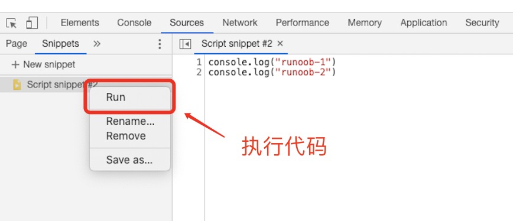

JavaScript 语句向浏览器发出的命令。语句的作用是告诉浏览器该做什么。

<br/>

<br/>

## 1、语法

这里和Nodejs是一样的：

<br/>

数组（Array）字面量 定义一个数组：

```
[40, 100, 1, 5, 25, 10]
```

对象（Object）字面量 定义一个对象：

```
{firstName:"John", lastName:"Doe", age:50, eyeColor:"blue"}
```

函数（Function）字面量 定义一个函数：

```
function myFunction(a, b) { return a * b;}
```

<br/>

等等...都nodejs是一样的，不再阐述，直接去看nodejs

<br/>

<br/>

## 2、控制浏览器元素

<br/>

(1)输出

使用 window.alert() 弹出警告框。
使用 document.write() 方法将内容写到 HTML 文档中。
使用 innerHTML 写入到 HTML 元素。
使用 console.log() 写入到浏览器的控制台。

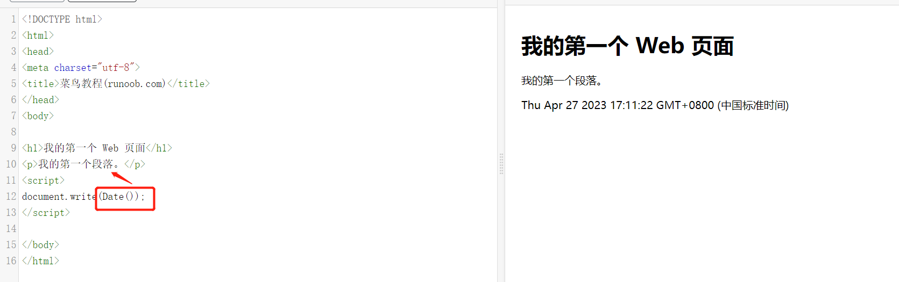

<br/>

(2)对id的元素进行简单的操作

下面的 JavaScript 语句向 id="demo" 的 HTML 元素输出文本 "你好 Dolly" ：

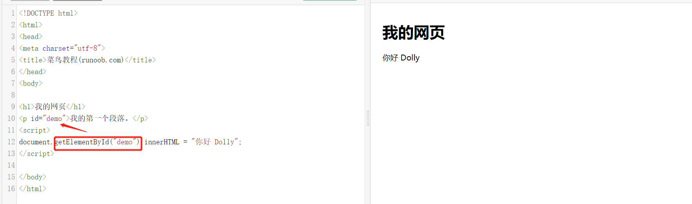

<br/>

<br/>

## 3、变量

JavaScript 变量有很多种类型，但是现在，我们只关注数字和字符串。

```
var pi=3.14;  
// 如果你熟悉 ES6，pi 可以使用 const 关键字，表示一个常量
// const pi = 3.14;
var person="John Doe";
```

数组：

```
var cars=new Array();
cars[0]="Saab";
cars[1]="Volvo";
cars[2]="BMW";

//或者
var cars=new Array("Saab","Volvo","BMW");

//或者
var cars=["Saab","Volvo","BMW"];
```

<br/>

布尔：

```
var x=true;
var y=false;
```

<br/>

1、JavaScript 变量生命周期：
JavaScript 变量生命周期在它声明时初始化。

局部变量在函数执行完毕后销毁。

全局变量在页面关闭后销毁。

<br/>

2、全局变量和局部变量

如果变量在函数内没有声明（没有使用 var 关键字），该变量为全局变量。

全局变量有 全局作用域: 网页中所有脚本和函数均可使用。 

<br/>

3、window 变量

在 HTML 中, 所有全局变量都会成为 window 变量、

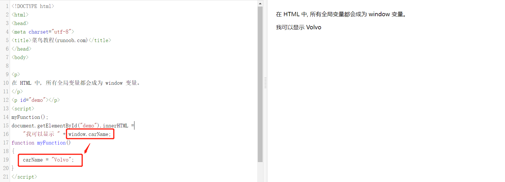

<br/>

4、变量类型检测

```
typeof "John"                // 返回 string
typeof 3.14                  // 返回 number
typeof false                 // 返回 boolean
typeof [1,2,3,4]             // 返回 object
typeof {name:'John', age:34} // 返回 object

typeof undefined             // undefined
typeof null                  // object
```

在 JavaScript 中, undefined 是一个没有设置值的变量。

null是一个只有一个值的特殊类型。表示一个空对象引用。

<br/>

5、类型转换

```
String(x)   
String(123) 
x.toString()
String(false)   
String(new Date())  

Number("3.14")    // 返回 3.14
Number(false)     // 返回 0

//打印的时候自动调用toString
myVar = {name:"Fjohn"}  // toString 转换为 "[object Object]"
myVar = [1,2,3,4]       // toString 转换为 "1,2,3,4"
```

<br/>

6、

ES2015(ES6) 新增加了两个重要的 JavaScript 关键字: let 和 const。

let 声明的变量只在 let 命令所在的代码块内有效。

const 声明一个只读的常量，一旦声明，常量的值就不能改变。

在 ES6 之前，JavaScript 只有两种作用域： 全局变量 与 函数内的局部变量

<br/>

<br/>

## 4、对象

<br/>

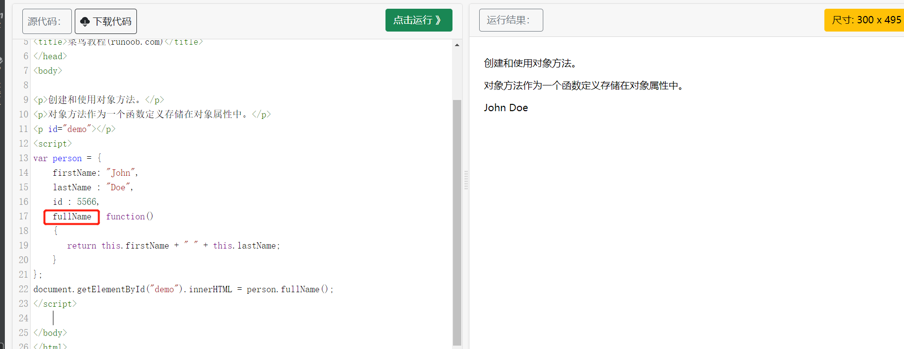

<br/>

<br/>

## 5、异常throw、try 和 catch

<br/>

```
function myFunction() {
    var message, x;
    message = document.getElementById("message");
    message.innerHTML = "";
    x = document.getElementById("demo").value;
    try { 
        if(x == "")  throw "值为空";
        if(isNaN(x)) throw "不是数字";
        x = Number(x);
        if(x < 5)    throw "太小";
        if(x > 10)   throw "太大";
    }
    catch(err) {
        message.innerHTML = "错误: " + err;
    }
}
```

<br/>

## 6、window

window.location 对象用于获得当前页面的地址 (URL)，并把浏览器重定向到新的页面。

location.href 返回url

location.hostname 返回 web 主机的域名
location.pathname 返回当前页面的路径和文件名
location.port 返回 web 主机的端口 （80 或 443）
location.protocol 返回所使用的 web 协议（http: 或 https:）

<br/>

## 7、DOM

通过 HTML DOM，可访问 JavaScript HTML 文档的所有元素。

HTML DOM 模型被构造为对象的树：

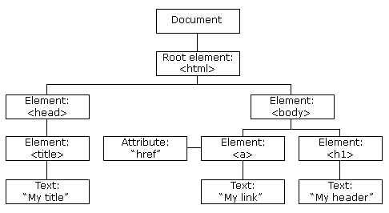

<br/>

在 DOM 中查找 HTML 元素的最简单的方法，是通过使用元素的 id。

```
var x=document.getElementById("intro");
```

没错，这就是我们之前使用过的DOM，其实就是根据document文档来获取元素。

(这以后会被JQuery替代，用$就可以使用元素了)

<br/>

<br/>

这里创建dom的节点和移除这种，就不再阐述了，直接看JQuery

<br/>

# 三、JQuery

(就是用来替代DOM的)

<br/>

在 DOM 中查找 HTML 元素的最简单的方法，是通过使用元素的 id。

```
var x=document.getElementById("intro");
```

没错，这就是我们之前使用过的DOM，其实就是根据document文档来获取元素。

(这以后会被JQuery替代，用$就可以使用元素了)

<br/>

通过 jQuery，您可以选取（查询，query） HTML 元素，并对它们执行"操作"（actions）。

```
$(this).hide() - 隐藏当前元素

$("p").hide() - 隐藏所有 <p> 元素

$("p.test").hide() - 隐藏所有 class="test" 的 <p> 元素

$("#test").hide() - 隐藏 id="test" 的元素
```

添加新的 HTML 内容，我们将学习用于添加新内容的四个 jQuery 方法：

append() - 在被选元素的结尾插入内容
prepend() - 在被选元素的开头插入内容
after() - 在被选元素之后插入内容
before() - 在被选元素之前插入内容

<br/>

<br/>

<br/>

<br/>

## 0、安装

```
<head>
<script src="jquery-1.10.2.min.js"></script>
</head>
```

<br/>

## 1、id、class选择器

<br/>

```
$(document).ready(function(){
  $("button").click(function(){
    $("p").hide();
    //id选择器
    $("#test").hide();
    //class选择器
    $(".test").hide();
  });
});
```

<br/>

<br/>

## 2、事件

<br/>

常用的 jQuery 事件方法

$(document).ready()
$(document).ready() 方法允许我们在文档完全加载完后执行函数。该事件方法在 jQuery 语法 章节中已经提到过。

<br/>

<br/>

```
$("#p1").mouseenter(function(){
    alert('您的鼠标移到了 id="p1" 的元素上!');
});

$("#p1").mouseleave(function(){
    alert("再见，您的鼠标离开了该段落。");
});

$("#p1").mousedown(function(){
    alert("鼠标在该段落上按下！");
});

$("#p1").mouseup(function(){
    alert("鼠标在段落上松开。");
});

//hover()方法用于模拟光标悬停事件。
$("#p1").hover(
    function(){
        alert("你进入了 p1!");
    },
    function(){
        alert("拜拜! 现在你离开了 p1!");
    }
);


//当元素获得焦点时，发生 focus 事件。当元素失去焦点时，发生 blur 事件。
$("input").focus(function(){
  $(this).css("background-color","#cccccc");
});
$("input").blur(function(){
  $(this).css("background-color","#ffffff");
});

```

<br/>

<br/>

<br/>

## 3、 AJAX

<br/>

AJAX = 异步 JavaScript 和 XML（Asynchronous JavaScript and XML）。

简短地说，在不重载整个网页的情况下，AJAX 通过后台加载数据，并在网页上进行显示。

使用 AJAX 的应用程序案例：谷歌地图、腾讯微博、优酷视频、人人网等等

<br/>

### 1、load

jQuery load() 方法是简单但强大的 AJAX 方法。

load() 方法从服务器加载数据，并把返回的数据放入被选元素中。

<br/>

### 2、get/post

<br/>

<br/>

(1)post

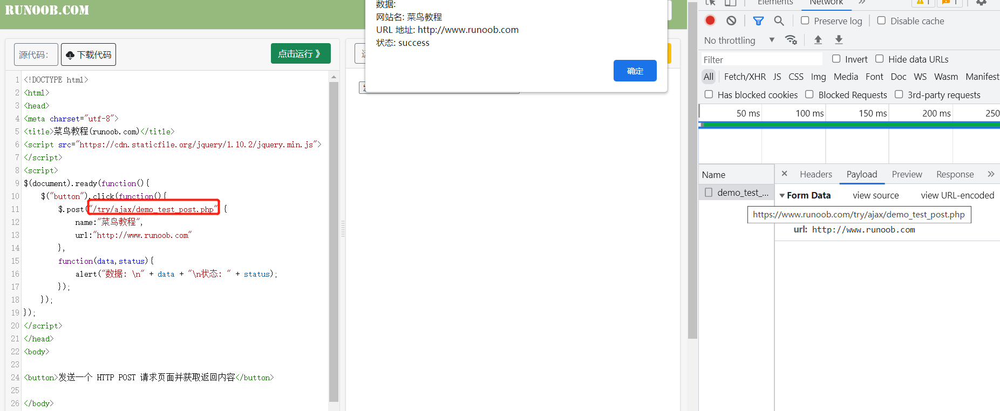

<br/>

<br/>

### 3、cookie

<br/>

创建 cookie，并设置 7 天后过期：

```
$.cookie('name', 'value', { expires: 7 });
```

<br/>

<br/>

# 四、Vue2

<br/>

<br/>

## 0、承接Jquery，了解Vue

<br/>

在js中，我们使用dom文档树来操作元素；

在jq中，我们使用$来操作元素；

在vue中，使用el来操作操作元素的变化和改变里面的数据data。

<br/>

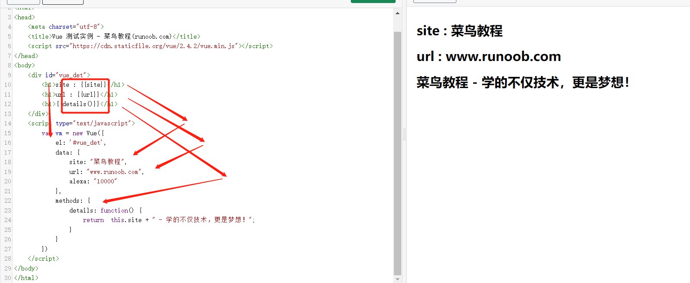

(在前端中，变量可能是字符串和数字，但是也可能是方法，所以{{}}指的既可能是data中的变量，也可能是method中的方法函数)

<br/>

Vue.js 使用了基于 HTML 的模板语法，允许开发者声明式地将 DOM 绑定至底层 Vue 实例的数据。

Vue.js 的核心是一个允许你采用简洁的模板语法来声明式的将数据渲染进 DOM 的系统。

<br/>

## 1、安装及初始化(可跳过继续学习理论)

安装vue环境，在用 Vue.js 构建大型应用时推荐使用 cnpm 安装：

```
cnpm install vue
```

Vue.js 提供一个官方命令行工具，可用于快速搭建大型单页应用。

```
# 全局安装 vue-cli
$ cnpm install --global vue-cli
# 创建一个基于 webpack 模板的新项目
$ vue init webpack my-project
# 这里需要进行一些配置，默认回车即可
This will install Vue 2.x version of the template.

For Vue 1.x use: vue init webpack#1.0 my-project

? Project name my-project
? Project description A Vue.js project
? Author runoob <test@runoob.com>
? Vue build standalone
? Use ESLint to lint your code? Yes
? Pick an ESLint preset Standard
? Setup unit tests with Karma + Mocha? Yes
? Setup e2e tests with Nightwatch? Yes

   vue-cli · Generated "my-project".

   To get started:
   
     cd my-project
     npm install
     npm run dev
   
   Documentation can be found at https://vuejs-templates.github.io/webpack
```

进入项目，安装并运行：

```
$ cd my-project
$ cnpm install
$ cnpm run dev
 DONE  Compiled successfully in 4388ms

> Listening at http://localhost:8080
```

<br/>

## 2、理论

指令是带有 v- 前缀的特殊属性。指令用于在表达式的值改变时，将某些行为应用到 DOM 上。

(v- 前缀的特殊属性的值只能是data或者method上的值！)

<br/>

<br/>

### 1、v-bind

单向绑定，可以绑定样式，和v-model区分

```
<!-- 完整语法 -->
<a v-bind:href="url"></a>
<!-- 缩写 -->
<a :href="url"></a>
```

<br/>

```
样式绑定
```

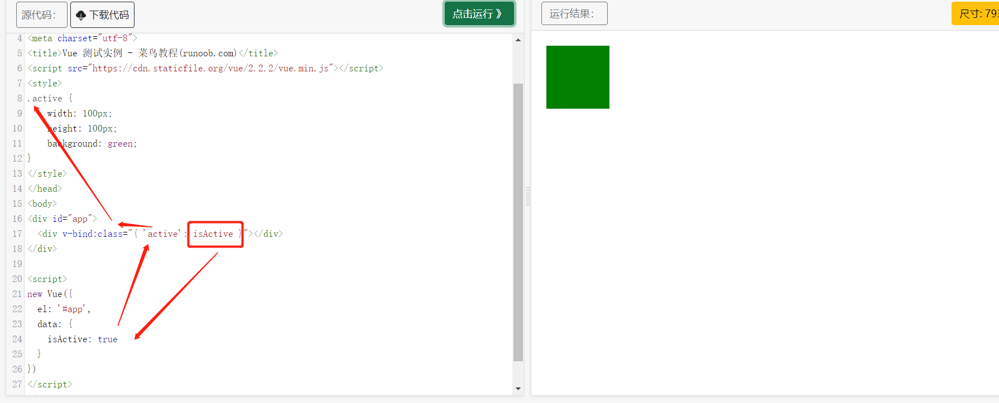

<br/>

<br/>

<br/>

### 2、v-on 

```
<!-- 完整语法 -->
<a v-on:click="doSomething"></a>
<!-- 缩写 -->
<a @click="doSomething"></a>
```

<br/>

Vue.js 为 v-on 提供了事件修饰符来处理 DOM 事件细节

```
Vue.js 通过由点 . 表示的指令后缀来调用修饰符。

.stop - 阻止冒泡
.prevent - 阻止默认事件
.capture - 阻止捕获
.self - 只监听触发该元素的事件
.once - 只触发一次
.left - 左键事件
.right - 右键事件
.middle - 中间滚轮事件
```

按键修饰符：

```
<!-- 同上 -->
<input v-on:keyup.enter="submit">
<!-- 缩写语法 -->
<input @keyup.enter="submit">

<p><!-- Alt + C -->
<input @keyup.alt.67="clear">
<!-- Ctrl + Click -->
<div @click.ctrl="doSomething">Do something</div>
```

<br/>

<br/>

### 3、v-model

指令用来在 input、select、textarea、checkbox、radio 等表单控件元素上创建双向数据绑定，根据表单上的值，自动更新绑定的元素的值。

<br/>

```
<div id="app">
    <p>{{ message }}</p>
    <input v-model="message">
</div>
    
<script>
new Vue({
  el: '#app',
  data: {
    message: 'Runoob!'
  }
})
</script>
```

修改输入<input元素的message，也会修改<p的{{ message }}

<br/>

.lazy

在默认情况下， v-model 在 input 事件中同步输入框的值与数据，但你可以添加一个修饰符 lazy ，从而转变为在 change 事件中同步：

```
<!-- 在 "change" 而不是 "input" 事件中更新 -->
<input v-model.lazy="msg" >
```

<br/>

.number

如果想自动将用户的输入值转为 Number 类型（如果原值的转换结果为 NaN 则返回原值），可以添加一个修饰符 number 给 v-model 来处理输入值：

```
<input v-model.number="age" type="number">
```

<br/>

.trim

```
<input v-model.trim="msg">
```

<br/>

### 4、v-if

这里， v-if 指令将根据表达式 seen 的值(true 或 false )来决定是否插入 p 元素。

```
<div id="app">
    <p v-if="seen">现在你看到我了</p>
</div>
    
<script>
new Vue({
  el: '#app',
  data: {
    seen: true
  }
})
</script>
```

用作 v-if 的 else-if 块。可以链式的多次使用

```
<div id="app">
    <div v-if="type === 'A'">
      A
    </div>
    <div v-else-if="type === 'B'">
      B
    </div>
    <div v-else-if="type === 'C'">
      C
    </div>
    <div v-else>
      Not A/B/C
    </div>
</div>
```

我们也可以使用 v-show 指令来根据条件展示元素：

```
<h1 v-show="ok">Hello!</h1>
```

<br/>

<br/>

<br/>

### 5、 {{...}}（双大括号）的文本插值

是对data或者method中对应的变量或者方法的文本进行文本插值

<br/>

<br/>

### 6、v-for 

v-for 可以绑定数据到数组来渲染一个列表：

<br/>

```
<div id="app">
  <ol>
    <li v-for="site in sites">
      {{ site.name }}
    </li>
  </ol>
</div>
 
<script>
new Vue({
  el: '#app',
  data: {
    sites: [
      { name: 'Runoob' },
      { name: 'Google' },
      { name: 'Taobao' }
    ]
  }
})
</script>
```

可以将变量的数组迭代出来，而且，会将元素重复生成迭代的个数！

<br/>

***

<br/>

### 7、监听data中的变量

我们将为大家介绍 Vue.js 监听属性 watch，我们可以通过 watch 来响应数据的变化。

```
<div id = "app">
    <p style = "font-size:25px;">计数器: {{ counter }}</p>
    <button @click = "counter++" style = "font-size:25px;">点我</button>
</div>
<script type = "text/javascript">
var vm = new Vue({
    el: '#app',
    data: {
        counter: 1
    }
});
//***************这里************
vm.$watch('counter', function(nval, oval) {
    alert('计数器值的变化 :' + oval + ' 变为 ' + nval + '!');
});
</script>
```

<br/>

## 3、组件

组件（Component）是 Vue.js 最强大的功能之一。

组件可以扩展 HTML 元素，封装可重用的代码。

组件系统让我们可以用独立可复用的小组件来构建大型应用，几乎任意类型的应用的界面都可以抽象为一个组件树：

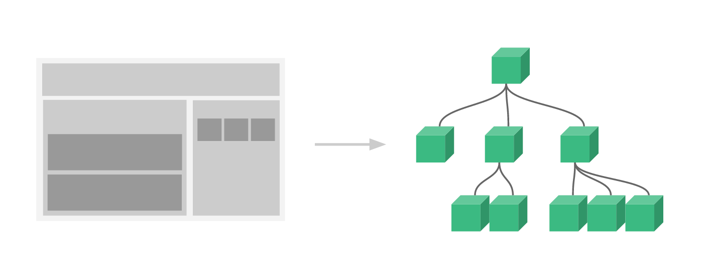

还记得我们之前看过的DOM元素文档吗，这是同理的，把组件当成是一个大元素即可。便可以自己写一些元素。

<br/>

### 1、自定义组件

component：注册

Prop：属性

template：该组件的内容(以字符形式表达)

类似于用 v-bind 绑定 HTML 特性到一个表达式，也可以用 v-bind 动态绑定 props 的值到父组件的数据中。每当父组件的数据变化时，该变化也会传导给子组件：

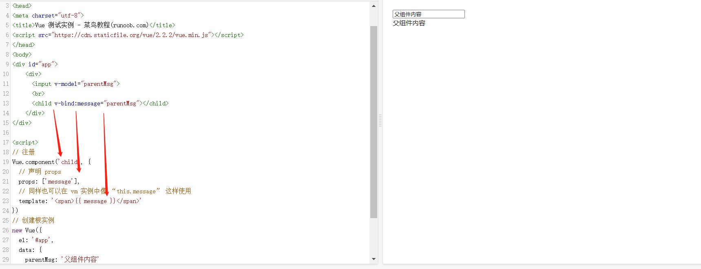

注意: prop 是单向绑定的：当父组件的属性变化时，将传导给子组件，但是不会反过来。

父组件是使用 props 传递数据给子组件，但如果子组件要把数据传递回去，就需要使用自定义事件！

<br/>

## 4、组件路由

Vue.js + vue-router 可以很简单的实现单页应用。

<br/>

### 0、下载

```
cnpm install vue-router
```

<br/>

### 1、尝试

1、配置路由config

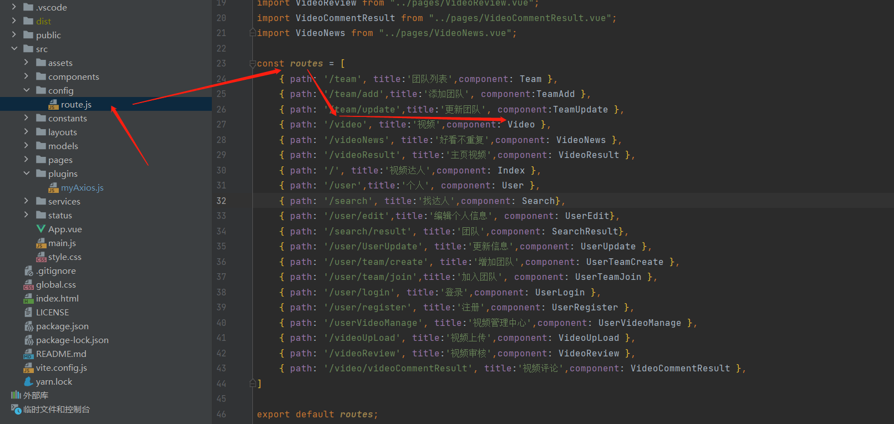

2、使用路由

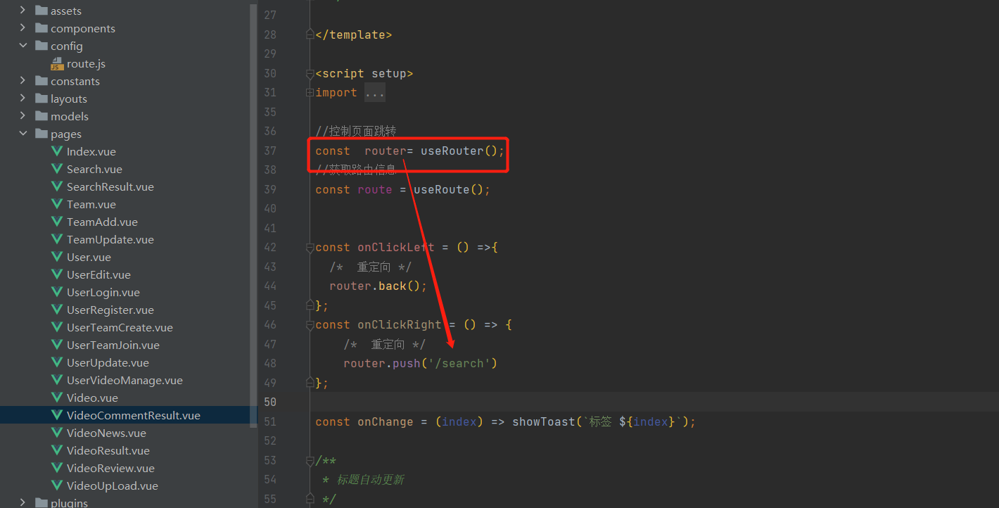

<br/>

<br/>

<br/>

### 2、常见的路由组件和属性

<br/>

#### （1）<router-link>

<br/>

1、to
表示目标路由的链接。 当被点击后，内部会立刻把 to 的值传到 router.push()，所以这个值可以是一个字符串或者是描述目标位置的对象。

<br/>

2、replace
设置 replace 属性的话，当点击时，会调用 router.replace() 而不是 router.push()，导航后不会留下 history 记录。

```
<router-link :to="{ path: '/abc'}" replace></router-link>
```

<br/>

3、active-class

设置 链接激活时使用的 CSS 类名。可以通过以下代码来替代。

```
<style>
   ._active{
      background-color : red;
   }
</style>
<p>
   <router-link v-bind:to = "{ path: '/route1'}" active-class = "_active">Router Link 1</router-link>
   <router-link v-bind:to = "{ path: '/route2'}" tag = "span">Router Link 2</router-link>
</p>
```

<br/>

4、event

声明可以用来触发导航的事件。可以是一个字符串或是一个包含字符串的数组。

```
<router-link v-bind:to = "{ path: '/route1'}" event = "mouseover">Router Link 1</router-link>
```

<br/>

<br/>

## 5、AJAX

Vue.js 2.0 版本推荐使用 axios 来完成 ajax 请求。

Axios 是一个基于 Promise 的 HTTP 库，可以用在浏览器和 node.js 中。

<br/>

0、下载

```
npm install axios
```

<br/>

<br/>

1、使用

```
<div id="app">
  <h1>网站列表</h1>
  <div
    v-for="site in info"
  >
    {{ site.name }}
  </div>
</div>

<script type = "text/javascript">
new Vue({
  el: '#app',
  data () {
    return {
      info: null
    }
  },
  mounted () {
    axios
      .get('https://www.runoob.com/try/ajax/json_demo.json')
      .then(response => (this.info = response.data.sites))
      .catch(function (error) { // 请求失败处理
        console.log(error);
      });
  }
})
</script>

//******************************************
//可以改成：
// 直接在 URL 上添加参数 ID=12345
axios.get('/user?ID=12345')
  .then(function (response) {
    console.log(response);
  })
  .catch(function (error) {
    console.log(error);
  });
  

//******************************************
// 也可以通过 params 设置参数：
axios.get('/user', {
    params: {
      ID: 12345
    }
  })
  .then(function (response) {
    console.log(response);
  })
  .catch(function (error) {
    console.log(error);
  });
  
  
//post请求
//******************************************
axios.post('/user', {
    firstName: 'Fred',        // 参数 firstName
    lastName: 'Flintstone'    // 参数 lastName
  })
  .then(function (response) {
    console.log(response);
  })
  .catch(function (error) {
    console.log(error);
  });

//当做是postman一样，get是要params：XX:123,CC:456的；post是请求体形式的{XX:123,,CC:456}
```

<br/>

<br/>

# 五、Vue3

<br/>

<br/>

vue3语法几乎和vue2一样，注意一下API的改动即可

<br/>

## 0、区别

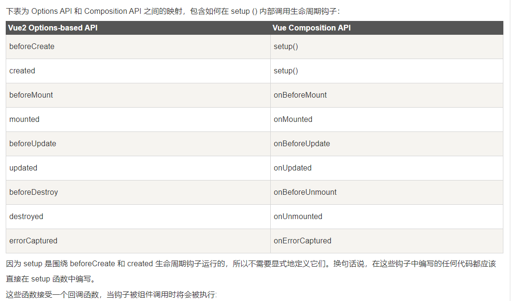

<br/>

<br/>

## 1、常用的钩子函数

vue的常用API：生命周期钩子

<br/>

(1)setup() 

setup() 函数在组件创建 created() 之前执行。

注意：在 setup 中你应该避免使用 this，因为它不会找到组件实例

<br/>

(2)onBeforeMount元素将在初始渲染(挂载)前、onMounted元素将在初始渲染(挂载)后

```
import { onBeforeMount, onMounted } from 'vue';
export default {
  setup() {
    onBeforeMount(() => {
      console.log('V3 beforeMount!');
    })
    onMounted(() => {
      console.log('V3 mounted!');
    })
  }
};
```

<br/>

(3)ref()

在 Vue 3.0 中，我们可以通过一个新的 ref 函数使任何响应式变量在任何地方起作用

ref() 函数可以根据给定的值来创建一个响应式的数据对象，返回值是一个对象，且只包含一个 .value 属性。

在 setup() 函数内，由 ref() 创建的响应式数据返回的是对象，所以需要用 .value 来访问。

```
import { ref } from 'vue'

let count = ref(0);
```

<br/>

一图明白：ref、onMount挂载

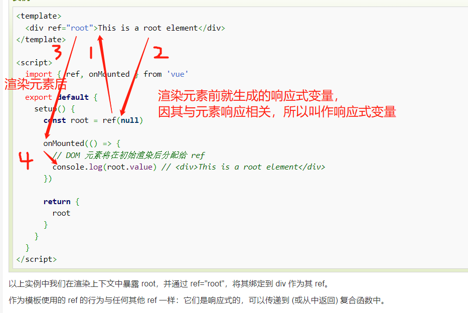

<br/>

<br/>

(4) watchEffect()

```
      watchEffect(() => {
        // 这个副作用在 DOM 更新之前运行，因此，模板引用还没有持有对元素的引用。
        console.log(root.value) // => null
      })
```

<br/>

<br/>

<br/>

<br/>

# 六、Bootstrap5 

(不s zhua)

<br/>

HTML是元素在浏览器中的初始布局

CSS是调整元素的样式

JavaScript是浏览器处理元素的脚本，其中DOM就是管理元素的文档

jquery是在JavaScript中更好地管理元素文档的元素

Bootstrap5是用已经写好的各种**组件库(其实就是写好的元素)**来包裹其它元素，是HTML和CSS的升级

<br/>

<br/>

# 0、下载

<br/>

```
npm install bootstrap
```

为了让 Bootstrap 开发的网站对移动设备友好，确保适当的绘制和触屏缩放，需要在网页的 head 之中添加 viewport meta 标签，如下所示：

```
<meta name="viewport" content="width=device-width, initial-scale=1">
```

width=device-width 表示宽度是设备屏幕的宽度。

initial-scale=1 表示初始的缩放比例。

<br/>

<br/>

## 1、其它组件

不再一一阐述，可以去菜鸟官网查看

<br/>

<br/>

# 七、ElementUI

和Bootstrap5 一样的组件库，更强大

<br/>

官网：

https://element.eleme.cn/#/zh-CN/component/quickstart

<br/>

<br/>

0、安装

```
npm i element-ui -S
```

<br/>

1、修改main.js 

引入分为完整引入和按需引入两种模式，按需引入可以缩小项目的体积，这里我们选择完整引入。

```
import Vue from 'vue';
import ElementUI from 'element-ui';
import 'element-ui/lib/theme-chalk/index.css';
import App from './App.vue';

Vue.use(ElementUI);

new Vue({
  el: '#app',
  render: h => h(App)
});
```

<br/>

2、使用：

在这里阐述，可以去官网看