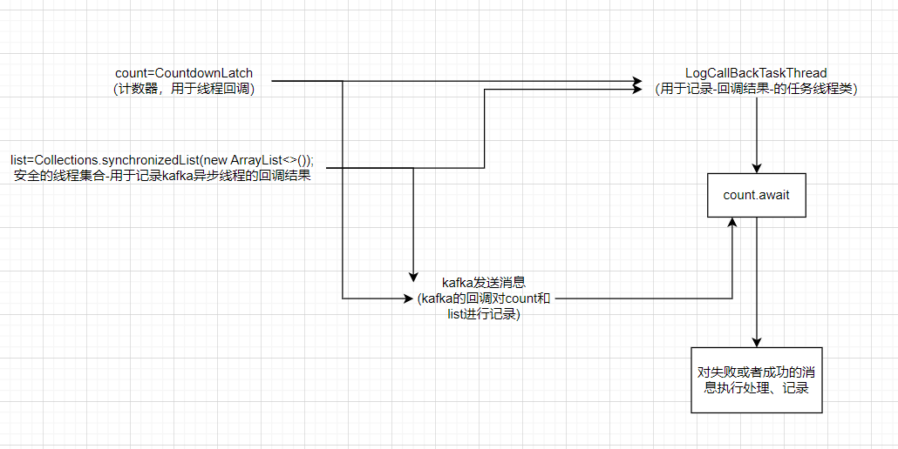
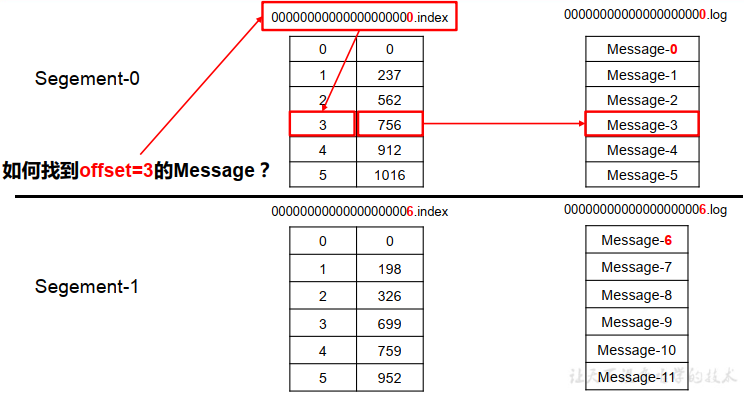
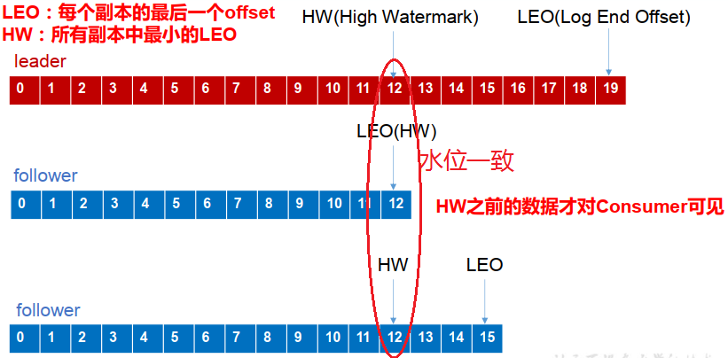

# 一、kafka

Kafka对于学习不友好的原因：

1、部署麻烦。需要zookeeper才能使用kafka，导致学习困难。

2、大多数人无实际业务使用场景。（一般用在分布式的信息推送，如档案推送）

3、涉及的知识面比较广。涉及到多线程(Runnable、线程池)、线程安全集合(Collections.synchronizedList)、多线程工具(CountDownLatch的await)、kafka的回调概念(kafka的onFailure、onSuccess)、Json及序列化。这些在学习kafka前应该掌握

<br/>

## 1、流程图

<br/>

业务：

1、任务类task准备，即刻await，等kafka回调后就调用

2、kafka全部用异步发送

3、消费后会回调方法对count和list进行减和赋值集合

4、count减至0，任务类task唤醒，将回调结果的list进行插入数据库或者记录

<br/>



<br/>

<br/>

## 2、代码

<br/>

### （0）下载部署kafka

直接用镜像解决部署kafka麻烦的问题！

```
# docker直接拉取kafka和zookeeper的镜像
docker pull wurstmeister/kafka
docker pull wurstmeister/zookeeper 
# 首先需要启动zookeeper，如果不先启动，启动kafka没有地方注册消息
docker run -it --name zookeeper -p 12181:2181 -d wurstmeister/zookeeper:latest
# 启动kafka容器，注意需要启动三台,注意端口的映射，都是映射到9092
# 第一台
docker run -it --name kafka01 -p 19092:9092 -d -e KAFKA_BROKER_ID=0 -e KAFKA_ZOOKEEPER_CONNECT=192.168.233.129:12181 -e KAFKA_ADVERTISED_LISTENERS=PLAINTEXT://192.168.233.129:19092 -e KAFKA_LISTENERS=PLAINTEXT://0.0.0.0:9092 wurstmeister/kafka:latest
# 第二台
docker run -it --name kafka02 -p 19093:9092 -d -e KAFKA_BROKER_ID=1 -e KAFKA_ZOOKEEPER_CONNECT=192.168.233.129:12181 -e KAFKA_ADVERTISED_LISTENERS=PLAINTEXT://192.168.233.129:19093 -e KAFKA_LISTENERS=PLAINTEXT://0.0.0.0:9092 wurstmeister/kafka:latest
# 第三台
docker run -it --name kafka03 -p 19094:9092 -d -e KAFKA_BROKER_ID=2 -e KAFKA_ZOOKEEPER_CONNECT=192.168.233.129:12181 -e KAFKA_ADVERTISED_LISTENERS=PLAINTEXT://192.168.233.129:19094 -e KAFKA_LISTENERS=PLAINTEXT://0.0.0.0:9092 wurstmeister/kafka:latest

```

常见命令：

```
# 创建topic名称为first，3个分区，1个副本
./kafka-topics.sh --zookeeper 192.168.233.129:12181 --create --topic first --replication-factor 1 --partitions 3

# 查看first此topic信息
./kafka-topics.sh --zookeeper 192.168.233.129:12181 --describe --topic first

<root>:
  Topic: first	PartitionCount: 3	ReplicationFactor: 1	Configs: 
	Topic: first	Partition: 0	Leader: 2	Replicas: 2	Isr: 2
	Topic: first	Partition: 1	Leader: 0	Replicas: 0	Isr: 0
	Topic: first	Partition: 2	Leader: 1	Replicas: 1	Isr: 1

# 调用生产者生产消息
./kafka-console-producer.sh --broker-list 192.168.233.129:19092,192.168.233.129:19093,192.168.233.129:19094 --topic first

# 调用消费者消费消息，from-beginning表示读取全部的消息
./kafka-console-consumer.sh --bootstrap-server 192.168.233.129:19092,192.168.233.129:19093,192.168.233.129:19094 --topic first --from-beginning

# 利用__consumer_offsets读取数据(查看消费者消费过的数据)
./kafka-console-consumer.sh --topic __consumer_offsets --bootstrap-server 192.168.233.129:19092,192.168.233.129:19093,192.168.233.129:19094  --formatter "kafka.coordinator.group.GroupMetadataManager\$OffsetsMessageFormatter" --consumer.config ../config/consumer.properties --from-beginning

# 删除topic
./kafka-topic.sh --zookeeper 192.168.233.129:12181 --delete --topic second
<root>:
Topic second is marked for deletion.
Note : This will have no impact if delete . topic . enable is not set to true .
bash-4.4#
从上可以看到删除的时候只是被标记为删除marked for deletion并没有真正的删除，
如果需要真正的删除，需要再config/server.properties中设置delete.topic.enable=true

# 修改分区数
./kafka-topics.sh --zookeeper 192.168.233.129:12181 --alter --topic test2 --partitions 3

```

<br/>

### （1）引入Kafka的client

```
@Configuration
@Slf4j
public class KafkaProducerConfiguration {

    /**
     * 不包含事务 producerFactory
     * @return
     */
    public ProducerFactory<String, String> producerFactory() {
        Map<String, Object> props = new HashMap<>();
        String bootstrap_servers_config = DXMSApplication.getDXMSApplication().getProperties().getProperty("kafka.url.servers");
        log.info("kafka调用地址：{}", bootstrap_servers_config);
        //kafka 集群地址
        props.put(ProducerConfig.BOOTSTRAP_SERVERS_CONFIG, bootstrap_servers_config);
        //重试次数
        props.put(ProducerConfig.RETRIES_CONFIG, 3);
        // 幂等性
        props.put("enable.idompotence", true);
        //应答级别
        //acks=0 把消息发送到kafka就认为发送成功
        //acks=1 把消息发送到kafka leader分区，并且写入磁盘就认为发送成功
        //acks=all 把消息发送到kafka leader分区，并且leader分区的副本follower对消息进行了同步就任务发送成功
        props.put(ProducerConfig.ACKS_CONFIG, "all");
        //KafkaProducer.send() 和 partitionsFor() 方法的最长阻塞时间 单位 ms
        props.put(ProducerConfig.MAX_BLOCK_MS_CONFIG, 6000);
        //批量处理的最大大小 单位 byte
        props.put(ProducerConfig.BATCH_SIZE_CONFIG, 16384); // 4096
        //发送延时,当生产端积累的消息达到batch-size或接收到消息linger.ms后,生产者就会将消息提交给kafka
        props.put(ProducerConfig.LINGER_MS_CONFIG, 1); // 1000
        //生产者可用缓冲区的最大值 单位 byte
        props.put(ProducerConfig.BUFFER_MEMORY_CONFIG, 33554432);
        //每条消息最大的大小
        props.put(ProducerConfig.MAX_REQUEST_SIZE_CONFIG, 1048576);
        //客户端ID
        props.put(ProducerConfig.CLIENT_ID_CONFIG, IdUtils.getUUID());
        //Key 序列化方式
        props.put(ProducerConfig.KEY_SERIALIZER_CLASS_CONFIG, StringSerializer.class.getName());
        //Value 序列化方式
        props.put(ProducerConfig.VALUE_SERIALIZER_CLASS_CONFIG, StringSerializer.class.getName());
        //消息压缩：none、lz4、gzip、snappy，默认为 none。
        props.put(ProducerConfig.COMPRESSION_TYPE_CONFIG, "gzip");
        //自定义分区器
        props.put(ProducerConfig.PARTITIONER_CLASS_CONFIG, MyPartitioner.class.getName());
        return new DefaultKafkaProducerFactory<>(props);
    }
    
     /**
     * 不包含事务 kafkaTemplate   (最常用)
     * @return
     */
    @Bean("kafkaTemplate")
    public KafkaTemplate<String, String> kafkaTemplate() {
        return new KafkaTemplate<>(producerFactory());
    }
    
    //----------------------------------是否有事务分割线------------------------------------------
    
    /**
     * 包含事务 producerFactory
     * @return
     */
    public ProducerFactory<String, String> producerFactoryWithTransaction() {
        DefaultKafkaProducerFactory<String, String> defaultKafkaProducerFactory = (DefaultKafkaProducerFactory<String, String>) producerFactory();
        //设置事务Id前缀
        defaultKafkaProducerFactory.setTransactionIdPrefix("tx");
        return defaultKafkaProducerFactory;
    }
    /**
     * 包含事务 kafkaTemplate
     * @return
     */
    @Bean("kafkaTemplateWithTransaction")
    public KafkaTemplate<String, String> kafkaTemplateWithTransaction() {
        return new KafkaTemplate<>(producerFactoryWithTransaction());
    }
    
}
```

<br/>

### （2）、建立Kafka通用服务及其接口

```
@Slf4j
@Service
public class KafkaProducerServiceImpl implements KafkaProducerService {

    @Autowired
    private KafkaTemplate<String, String> kafkaTemplate;


    /**
     * 发送消息（异步）
     * @param topic 主题
     * @param message 消息内容
     */
    @Override
    public void sendMessageAsync(String topic, String message, CountDownLatch counter, List<String> synchronizedList) {
        ListenableFuture<SendResult<String, String>> future = kafkaTemplate.send(topic, message);
        //添加回调
        future.addCallback(new ListenableFutureCallback<SendResult<String, String>>() {
            @Override
            public void onFailure(Throwable throwable) {
                counter.countDown();
                synchronizedList.add("0");
                log.error("sendMessageAsync failure! topic : {}, message: {}", topic, message);
            }

            @Override
            public void onSuccess(SendResult<String, String> stringStringSendResult) {
                counter.countDown();
                synchronizedList.add("1");
                log.info("sendMessageAsync success! topic: {}, message: {}", topic, message);
            }
        });
    }
    
     /**
     * 发送消息（同步）
     * @param topic 主题
     * @param key 键
     * @param message 值
     */
    @Override
    public void sendMessageSync(String topic, String key, String message) throws InterruptedException, ExecutionException, TimeoutException {
        //可以指定最长等待时间，也可以不指定
        kafkaTemplate.send(topic, message).get(10, TimeUnit.SECONDS);
        log.info("sendMessageSync => topic: {}, key: {}, message: {}", topic, key, message);
        //指定key，kafka根据key进行hash，决定存入哪个partition
//        kafkaTemplate.send(topic, key, message).get(10, TimeUnit.SECONDS);
        //存入指定partition
//        kafkaTemplate.send(topic, 0, key, message).get(10, TimeUnit.SECONDS);
    }
    
}
```

<br/>

### （3）、kafka回调处理类

```
@Slf4j
public class HNJLLogCallbackTaskThread implements Runnable {

    /**
     * 共享计数器
     */
    private final CountDownLatch counter;

    /**
     * 问题记录的列表
     */
    private final List<String> synchronizedList;

    private final String userName;
    private final String interfaceCode;
    private final String pushType;

    private HnMeterCenterInterfaceMapper meterCenterInterfaceMapper;

    public HNJLLogCallbackTaskThread(CountDownLatch counter, List<String> synchronizedList, String userName, String interfaceCode, HnMeterCenterInterfaceMapper meterCenterInterfaceMapper) {
        this.counter = counter;
        this.synchronizedList = synchronizedList;
        this.userName = userName;
        this.interfaceCode = interfaceCode;
        this.meterCenterInterfaceMapper = meterCenterInterfaceMapper;
        this.pushType = "0";
    }

    public HNJLLogCallbackTaskThread(CountDownLatch counter, List<String> synchronizedList, String userName, String interfaceCode, HnMeterCenterInterfaceMapper meterCenterInterfaceMapper, String pushType) {
        this.counter = counter;
        this.synchronizedList = synchronizedList;
        this.userName = userName;
        this.interfaceCode = interfaceCode;
        this.meterCenterInterfaceMapper = meterCenterInterfaceMapper;
        this.pushType = pushType;
    }

    /**
     * desc: 回调通知完成
     */
    @Override
    public void run() {
        if (counter != null) {
            int timeOutSeconds = 15 * 60;
            try {
                log.info("通知执行结果等待线程，timeOutSeconds：{}", timeOutSeconds);
                counter.await(timeOutSeconds, TimeUnit.SECONDS);
            } catch (InterruptedException e) {
            }
        }
        log.info("回调通知结束{}", this.synchronizedList.size());
        List<DrhnPushManageLogDTO> logs = new ArrayList<>();
        if (CollectionUtils.isNotEmpty(synchronizedList)) {
            List<String> fail = synchronizedList.parallelStream().filter(e -> "0".equals(e)).collect(Collectors.toList());
            List<String> success = synchronizedList.parallelStream().filter(e -> "1".equals(e)).collect(Collectors.toList());
            if (CollectionUtils.isNotEmpty(fail)) {
                // 失败
                DrhnPushManageLogDTO log = instanceFail(fail);
                logs.add(log);
            }
            if (CollectionUtils.isNotEmpty(success)) {
                // 成功
                DrhnPushManageLogDTO log = instanceSuccess(success);
                logs.add(log);
            }
        } else {
            // 失败
            DrhnPushManageLogDTO log = instanceFail(new ArrayList<>());
            logs.add(log);
        }
        if (CollectionUtils.isNotEmpty(logs)) {
            this.meterCenterInterfaceMapper.insertManageLogs(logs);
        }
    }

    private DrhnPushManageLogDTO instanceFail(List<String> fail) {
        DrhnPushManageLogDTO log = new DrhnPushManageLogDTO();
        log.setLogId(IdUtils.getUUID());
        log.setInterfaceCode(interfaceCode);
        log.setPushType(pushType);
        log.setPushStatus("1");
        log.setPushRows(fail.size() + "");
        log.setOperateTime(LocalDateTime.now());
        log.setOperatePerson(userName);
        return log;
    }

    private DrhnPushManageLogDTO instanceSuccess(List<String> success) {
        DrhnPushManageLogDTO log = new DrhnPushManageLogDTO();
        log.setLogId(IdUtils.getUUID());
        log.setInterfaceCode(interfaceCode);
        log.setPushType(pushType);
        log.setPushStatus("0");
        log.setPushRows(success.size() + "");
        log.setOperateTime(LocalDateTime.now());
        log.setOperatePerson(userName);
        return log;
    }

}
```

<br/>

### （4）、推送至kafka并将kafka回调的结果进行处理

```
@Slf4j
@Service
public class HnMeterCenterInterfaceManagerImpl implements HnMeterCenterInterfaceManager {

    @Autowired
    private KafkaProducerService kafkaProducerService;
    
    @Autowired
    private ThreadPoolTaskExecutor threadPool;
    
    @Autowired
    private 回调Mapper mapper;
    
    private String pushResponseResource(HnMeterCenterPushReq req) {

        try {
            List<HnRegisterUserDTO> mdrRegisterUser =XXX查询;
            if (CollectionUtils.isNotEmpty(mdrRegisterUser)) {
                final CountDownLatch counter = new CountDownLatch(mdrRegisterUser.size());
                List<String> synchronizedList = Collections.synchronizedList(new ArrayList<>());
                // 完成的线程任务
                HNJLLogCallbackTaskThread callbackTask = new HNJLLogCallbackTaskThread(counter, synchronizedList,
                req.getUserName(), "06JLSED001", mapper, req.getPushType());
                threadPool.submit(callbackTask);
                log.info("符合推送条件的注册数据数据量：{}",mdrRegisterUser.size());
                for (HnRegisterUserDTO item : mdrRegisterUser) {
                    String jsonStr = JSONObject.toJSONString(item, SerializerFeature.WriteNullStringAsEmpty, SerializerFeature.WriteNullBooleanAsFalse, SerializerFeature.WriteNullNumberAsZero);
                    this.kafkaProducerService.sendMessageAsync(HnKafkaConstant.REGISTER_USER, jsonStr, counter, synchronizedList);
                }
//                this.kafkaProducerService.sendMessageGetResult(KafkaConstant.REGISTER_USER, KafkaConstant.REGISTER_USER, jsonStr);
            } else {
                log.error("kafka推送数据为空");
                throw new BusinessException("无符合条件数据可以推送");
//                this.kafkaProducerService.sendMessageAsync(KafkaConstant.REGISTER_USER, "");
            }
        } catch (BusinessException be) {
            log.error("kafka推送数据报错:{}", be.getMessage(), be);
            throw be;
        } catch (Exception e) {
            log.error("kafka推送数据报错:{}", e.getMessage(), e);
            throw new BusinessException("推送数据报错:" + e.getMessage());
        }
        return "推送成功";
    }
}
```

<br/>

<br/>

### （5）消费接口及实现类

client配置几乎是一样的：(以下是参考，具体的需要查询文档)

```
@Configuration
@Slf4j
public class KafkaConsumerConfiguration {

    /**
     *  consumerFactory
     * @return
     */
    public ProducerFactory<String, String> consumerFactory() {
        Map<String, Object> props = new HashMap<>();
        //kafka 集群地址
         props.put(ConsumerConfig.BOOTSTRAP_SERVERS_CONFIG, "192.168.233.129:19092");
        // 设置消费者组
        props.put(ConsumerConfig.GROUP_ID_CONFIG, "abc");
        // 设置offset的自动提交
        props.put(ConsumerConfig.ENABLE_AUTO_COMMIT_CONFIG, "true");
        // offset重置,需要设置自动重置为earliest
        props.put(ConsumerConfig.AUTO_OFFSET_RESET_CONFIG,"earliest");
        // 设置offset自动化提交的间隔时间
        props.put(ConsumerConfig.AUTO_COMMIT_INTERVAL_MS_CONFIG, "1000");
        // 生产者是序列化，消费者则为反序列化
        props.put(ConsumerConfig.KEY_DESERIALIZER_CLASS_CONFIG, StringDeserializer.class);
        props.put(ConsumerConfig.VALUE_DESERIALIZER_CLASS_CONFIG, StringDeserializer.class);

        return new DefaultKafkaConsumerFactory<>(props);
    }
    
     /**
     * 不包含事务 kafkaTemplate   (最常用)
     * @return
     */
    @Bean("kafkaTemplate")
    public KafkaTemplate<String, String> kafkaTemplate() {
        return new KafkaTemplate<>(consumerFactory());
    }
    
    
}
```

<br/>

重点：

1、@KafkaListener(id、topics、topicPartitions)等，可以指定topic上的的partitions和partitions上的initialOffset

```
/*    @KafkaListener(id = "consumerBatch", topicPartitions = {
            @TopicPartition(topic = "hello-batch1", partitions = "0"),
            @TopicPartition(topic = "hello-batch2", partitionOffsets = @PartitionOffset(partition = "2", initialOffset = "4"))
    })*/
```


offset表示当前消息的编号，首先可以通过二分法定位当前消息属于哪个.index文件中，随后采用seek定位的方法查找到当前offset在.index中的位置，此时可以拿到初始的偏移量。通过初始的偏移量再通过seek定位到.log中的消息即可找到。



<br/>

2、单条消费、批量消费

<br/>

具体：

```
@Slf4j
@Service
public class HnKafkaConsumerServiceImpl {

    @Autowired
    private HnMeterCenterInterfaceManager meterCenterInterfaceManager;

    /**
     * 消费单条消息,topics 可以监听多个topic，如：topics = {"topic1", "topic2"}
     * @param message 消息
     */
    @KafkaListener(id = "hnConsumerBaseLoadInfo", topics = HnKafkaConstant.BASE_LOAD_INFO, groupId = "hlpt_tmr_xqcxypt_24")
    public void consumerBaseLoadInfo(String message) {
        log.info("hnConsumerBaseLoadInfo ====> message: {}", message);
        //消费者
        this.meterCenterInterfaceManager.consumerInfo(message);
    }

    @KafkaListener(id = "hnConsumerActualLoadInfo", topics = HnKafkaConstant.ACTUAL_LOAD_INFO, groupId = "hlpt_tmr_xqcxypt_24")
    public void consumerActualLoadInfo(String message) {
        log.info("hnConsumerActualLoadInfo ====> message: {}", message);
        this.meterCenterInterfaceManager.consumerInfo(message);
    }


    /**
     * 批量消费消息
     * @param messages
     */
    @KafkaListener(id = "hnConsumerBatch", topics = "hello-batch")
    public void consumerBatch(List<ConsumerRecord<String, String>> messages) {
        log.info("consumerBatch =====> messageSize: {}", messages.size());
        log.info(messages.toString());
    }

    /**
     * 指定消费异常处理器
     * @param message
     */
    @KafkaListener(id = "hnConsumerException", topics = "hello-kafka-test-topic", errorHandler = "consumerAwareListenerErrorHandler")
    public void consumerException(String message) {
        log.error("kafka消费报错：{}", message);
        throw new RuntimeException("consumer exception");
    }

    /**
     * 验证ConsumerInterceptor
     * @param message
     */
    @KafkaListener(id = "hnInterceptor", topics = "consumer-interceptor")
    public void consumerInterceptor(String message) {
        log.info("consumerInterceptor ====> message: {}", message);
    }
}
```

<br/>

具体消费者代码：

```
@Override
    @Transactional(rollbackFor = Exception.class)
    public String consumerInfo(String message) {
        if (StringUtils.isBlank(message)) {
            return "";
        }
        try {
            //反序列化
            HnBaseLoadInfoDTO baseLoadInfoDTO = JSONObject.parseObject(message, HnBaseLoadInfoDTO.class);
            //批量反序列化
//            List<BaseLoadInfoDTO> baseLoadInfoDTOS = JSONObject.parseArray(message, BaseLoadInfoDTO.class);
              //....其它逻辑处理
        } catch (Exception e){
            log.error("保存失败：{}", e.getMessage(), e);
        }
        return "保存成功";
    }              
```

<br/>

#### (6)可视化监控

Eagle是开源的额可视化和管理软件，允许查询、可视化、提醒和探索存储在任何地方的指标，简而言之，Eagle为您提供了将Kafka集群数据转换为漂亮的图形和可视化的工具。

实质 一个运行在tomcat上的web应用。

https://www.cnblogs.com/keatsCoder/p/13291615.html

<br/>

<br/>

## 3、理论

<br/>

看了上面，也不难，现在讲的是面试时常问的理论知识

<br/>

### （1）常见的组成部分

Broker：经纪人，一台Kafka服务器就是一个Broker，一个集群由多个Broker组成，一个Broker可以容纳多个Topic。

Kafka集群中有一个broker会被选举为Controller，负责管理集群broker的上下线、所有topic的分区副本分配和leader的选举等工作。Controller的工作管理是依赖于zookeeper的。

<br/>

Topic：主题，可以理解为一个队列，生产者和消费者都是面向一个Topic

<br/>

Partition：(概念的东西，实质上是.log文件)分区，为了实现扩展性，一个非常大的Topic可以分布到多个Broker上，一个Topic可以分为多个Partition，每个Partition是一个有序的队列(分区有序，不能保证全局有序)

Kafka分区对于Kafka集群来说，分区可以做到负载均衡，对于消费者来说分区可以提高并发度，提高读取效率

<br/>

Replica：副本Replication，为保证集群中某个节点发生故障，节点上的Partition数据不丢失，Kafka可以正常的工作，Kafka提供了副本机制，一个Topic的每个分区有若干个副本，一个Leader和多个Follower

失效副本为速率比leader相差大于10s的follower，ISR会将这些失效的follower踢出，等速率接近leader的10s内，会重新加入ISR

<br/>

Leader：每个分区多个副本的主角色，生产者发送数据的对象，以及消费者消费数据的对象都是Leader。

在ISR中需要选举出Leader，选择策略为先到先得。在分区中需要选举，需要选举出Leader和follower。

Kafka 中的 ISR(InSyncRepli)、 OSR(OutSyncRepli)、 AR(AllRepli)代表什么？

ISR：速率和leader相差低于10s的follower的集合

OSR：速率和leader相差大于10s的follwer

AR：所有分区的follower


Follower：每个分区多个副本的从角色，实时的从Leader中同步数据，保持和Leader数据的同步，Leader发生故障的时候，某个Follower会成为新的Leader。

可以配置Producer-ack参数配置来决定Follower同步Leader的时机

<br/>

***

LEO(Log End Offset)：每个副本最后的一个offset
HW(High Watermark)：高水位，指代消费者能见到的最大的offset，ISR队列中最小的LEO。



follower故障：follower发生故障后会被临时提出ISR，等待该follower恢复后，follower会读取本地磁盘记录的上次的HW，并将log文件高于HW的部分截取掉，从HW开始向leader进行同步，等待该follower的LEO大于等于该partition的HW，即follower追上leader之后，就可以重新加入ISR了。
leader故障：leader发生故障之后，会从ISR中选出一个新的leader，为了保证多个副本之间的数据的一致性，其余的follower会先将各自的log文件高于HW的部分截掉，然后从新的leader中同步数据。

**这只能保证副本之间的数据一致性，并不能保证数据不丢失或者不重复(ACK参数配置才会影响！请马上看3、理论-(2)-c )**


***

<br/>

<br/>

### （2）重要规则

#### a、topic

```
topic=N*partition；partition=log
```

Topic是逻辑上的改变，Partition是物理上的概念，每个Partition对应着一个log文件，该log文件中存储的就是producer生产的数据，

Kafka中消息是以topic进行分类的，Producer生产消息，Consumer消费消息，都是面向topic的

<br/>

1、topic 的分区数可不可以增加？如果可以怎么增加？如果不可以，那又是为什么？

		可以增加，修改分区个数--alter可以修改分区个数

2、topic 的分区数可不可以减少？如果可以怎么减少？如果不可以，那又是为什么？

		不可以减少，减少了分区之后，之前的分区中的数据不好处理

3、Kafka 有内部的 topic 吗？如果有是什么？有什么所用？

		有，__consumer_offsets主要用来在0.9版本以后保存消费者消费的offset

<br/>

#### b、Producer

```
Producer => Topic（Log with offset）=> Consumer.
```

Producer生产的数据会被不断的追加到该log文件的末端，且每条数据都有自己的offset，consumer组中的每个consumer，都会实时记录自己消费到了哪个offset，以便出错恢复的时候，可以从上次的位置继续消费

***

#### c、Producer-ack参数配置

（这是非常容易忘记的，因为这是藏在kafka后面的，无关开发者的）

开发场景：当生产者想对kafka回调调用countdownlatch的减1前，会等待ack来回调onSucces、onFailure，调成0、1、-1，会直接影响countdownlatch和收集list的结果，可能会导致**消息重复(太慢了，如-1)、消息丢失(太快了，如0/1)**的问题

该配置关系ack的发送时间，而ack关系到生产者回调方法onSucces、onFailure的执行时机、快慢

```
producer返ack：0无落盘直接返，1只leader落盘然后返，-1全部落盘然后返
```

0：(0：即0个broker响应)producer不等待broker的ack，这一操作提供了最低的延迟，broker接收到还没有写入磁盘就已经返回，当broker故障时有可能丢失数

1：(0：只有1个broker响应)producer等待broker的ack，partition的leader落盘成功后返回ack，如果在follower同步成功之前leader故障，那么将丢失数据。（只是leader落盘）

-1(all)：(-1：所有broker(follower)响应)producer等待broker的ack，partition的leader和ISR的follower全部落盘成功才返回ack，但是如果在follower同步完成后，broker发送ack之前，如果leader发生故障，会造成数据重复。(这里的数据重复是因为没有收到，所以继续重发导致的数据重复)


<br/>

**c1、如何解决数据重复和消息丢失？**

在0.11版本的Kafka之前，只能保证数据不丢失，在下游对数据的重复进行去重操作，多余多个下游应用的情况，则分别进行全局去重，对性能有很大影响。

0.11版本的kafka，引入了一项重大特性：**幂等性，幂等性指代Producer不论向Server发送了多少次重复数据，Server端都只会持久化一条数据启用幂等性**，即在Producer的参数中设置enable.idempotence=true即可，Kafka的幂等性实现实际是将之前的去重操作放在了数据上游来做，开启幂等性的Producer在初始化的时候会被分配一个PID，发往同一个Partition的消息会附带Sequence Number，而Broker端会对<PID,Partition,SeqNumber>做缓存，当具有相同主键的消息的时候，Broker只会持久化一条。

但PID在重启之后会发生变化，同时不同的Partition也具有不同的主键，所以幂等性无法保证跨分区跨会话的Exactly Once。

<br/>

c2、Producer-事务

kafka从0.11版本开始引入了事务支持，事务可以保证Kafka在Exactly Once语义的基础上，生产和消费可以跨分区的会话，要么全部成功，要么全部失败


***

#### d、consumer

consumer采用pull拉的方式来从broker中读取数据。

push推的模式很难适应消费速率不同的消费者，因为消息发送率是由broker决定的，它的目标是尽可能以最快的速度传递消息，但是这样容易造成consumer来不及处理消息，典型的表现就是拒绝服务以及网络拥塞。而pull方式则可以让consumer根据自己的消费处理能力以适当的速度消费消息。
pull模式不足在于如果Kafka中没有数据，消费者可能会陷入循环之中 (因为消费者类似监听状态获取数据消费的)，一直返回空数据，针对这一点，Kafka的消费者在消费数据时会传入一个时长参数timeout，如果当前没有数据可供消费，consumer会等待一段时间之后再返回，时长为timeout。

```
    /**
     *  consumerFactory
     * @return
     */
    public ProducerFactory<String, String> consumerFactory() {
        Map<String, Object> props = new HashMap<>();
        //kafka 集群地址
         props.put(ConsumerConfig.BOOTSTRAP_SERVERS_CONFIG, "192.168.233.129:19092");
        // 设置消费者组
        props.put(ConsumerConfig.GROUP_ID_CONFIG, "abc");
        // 设置offset的自动提交
        props.put(ConsumerConfig.ENABLE_AUTO_COMMIT_CONFIG, "true");
        // offset重置,需要设置自动重置为earliest
        props.put(ConsumerConfig.AUTO_OFFSET_RESET_CONFIG,"earliest");
        // 设置offset自动化提交的间隔时间
        props.put(ConsumerConfig.AUTO_COMMIT_INTERVAL_MS_CONFIG, "1000");
        // 生产者是序列化，消费者则为反序列化
        props.put(ConsumerConfig.KEY_DESERIALIZER_CLASS_CONFIG, StringDeserializer.class);
        props.put(ConsumerConfig.VALUE_DESERIALIZER_CLASS_CONFIG, StringDeserializer.class);

        return new DefaultKafkaConsumerFactory<>(props);
    }
```

<br/>

**d0、数据重复消费和消息漏消费？(和消息重复、消息丢失区分，这两个概念只对生产者来说的，而目前这里是对消费者来说的！)**

1、有哪些情形会造成重复消费？

先消费后提交offset，如果消费完宕机了，则会造成重复消费

2、哪些情景会造成消息漏消费？

先提交offset，还没消费就宕机了，则会造成漏消费

<br/>

**d1、为什么能消费这么快？**

1、零拷贝技术：

只用将磁盘文件的数据复制到页面缓存中一次，然后将**数据从页面缓存直接发送到网络**中（发送给不同的订阅者时，都可以使用同一个页面缓存），从而避免了重复复制的操作。

如果有10个消费者，传统方式下，数据复制次数为4*10=40次，而使用“零拷贝技术”只需要1+10=11次，一次为从磁盘复制到页面缓存，10次表示10个消费者各自读取一次页面缓存。

2、顺序写

的过程是追加到文件末端，顺序写的方式，官网有数据表明，同样的磁盘，顺序写能够到600M/s，而随机写只有200K/s，这与磁盘的机械结构有关，顺序写之所以快，是因为其省去了大量磁头寻址的时间

<br/>

**d2-1、消费者重置offset**

Consumer消费数据时的可靠性很容易保证，因为数据在Kafka中是持久化的，不用担心数据丢失问题。但由于Consumer在消费过程中可能遭遇断电或者宕机等故障，Consumer恢复之后，需要从故障前的位置继续消费，所以Consumer需要实时记录自己消费的offset位置，以便故障恢复后可以继续消费。
offset的维护是Consumer消费数据必须考虑的问题。

```
        // offset重置,需要设置自动重置为earliest
        props.put(ConsumerConfig.AUTO_OFFSET_RESET_CONFIG,"earliest");
```

注意，这里的auto.offset.reset="earliest"的作用等同于在linux控制台，消费者监听的时候添加的--from-beginning命令。

auto.offset.reset取值：

earliest：重置offset到最早的位置
latest：重置offset到最新的位置，默认值
none：如果在消费者组中找不到前一个offset则抛出异常
anything else：抛出异常给消费者


**d2-2、消费者手动提交offset**

手动提交offset的方法主要有两种：

commitSync：同步提交
commitAsync：异步提交
相同点：两种方式的提交都会将本次poll拉取的一批数据的最高的偏移量提交。

不同点：commitSync阻塞当前线程，持续到提交成功，失败会自动重试（由于不可控因素导致，也会出现提交失败）；而commitAsync则没有失败重试机制，有可能提交失败。

自动提交offset十分便利，但是由于其实基于时间提交的，开发人员难以把握offset提交的时机，因此kafka提供了手动提交offset的API。


```
        // 设置offset的自动提交
        props.put(ConsumerConfig.ENABLE_AUTO_COMMIT_CONFIG, "true");
```

<br/>

<br/>

#### f、拦截器 ProducerInterceptor

```
/**
 * @author caoduanxi
 * @Date 2021/1/13 14:15
 * @Motto Keep thinking, keep coding!
 */
public class TimeInterceptor implements ProducerInterceptor<String, String> {
    private int errorCounter = 0;
    private int successCounter = 0;
    
    @Override
    public ProducerRecord<String, String> onSend(ProducerRecord<String, String> record) {
        return new ProducerRecord(record.topic(), record.partition(), record.timestamp(), record.key(),
                "TimeInterceptor:" + System.currentTimeMillis() + "," + record.value());
    }

    @Override
    public void onAcknowledgement(RecordMetadata metadata, Exception exception) {
        if (exception == null) {
            successCounter++;
        } else {
            errorCounter++;
        }
    }

    @Override
    public void close() {
        // 输出结果，结束输出
        System.out.println("Sent successful:" + successCounter);
        System.out.println("Sent failed:" + errorCounter);
    }

}

```

<br/>

加入生产者配置中：

```
// 加入拦截器
List<Object> interceptors = new ArrayList<>();
interceptors.add(TimeInterceptor.class);
interceptors.add(CounterInterceptor.class);
props.put(ProducerConfig.INTERCEPTOR_CLASSES_CONFIG, interceptors);

```