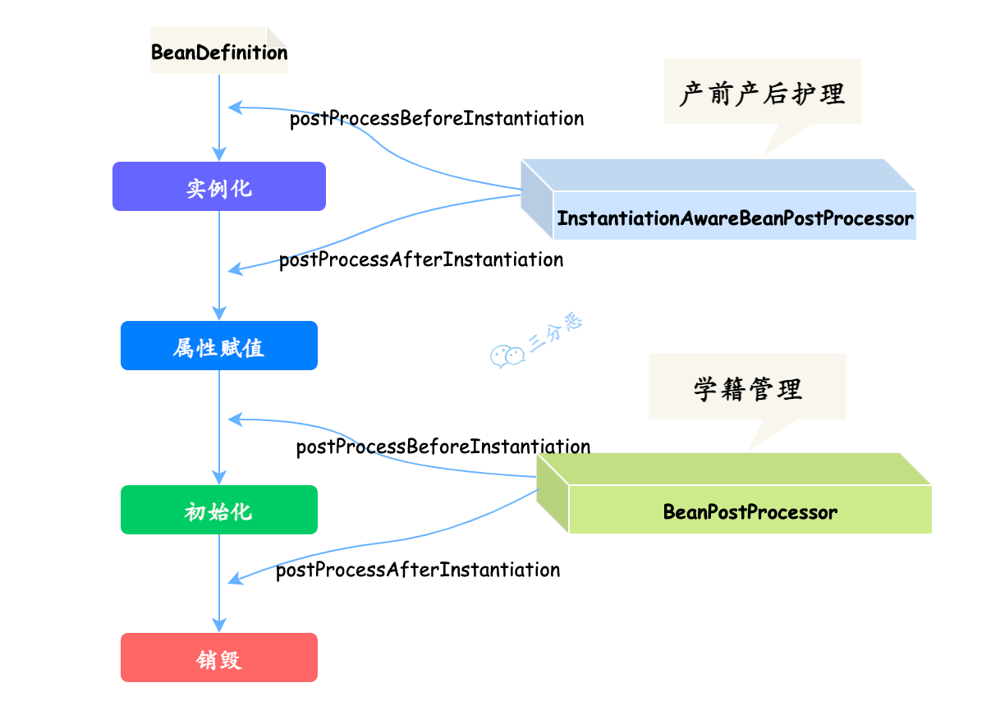
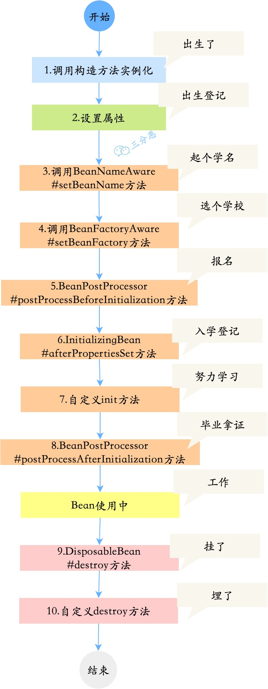
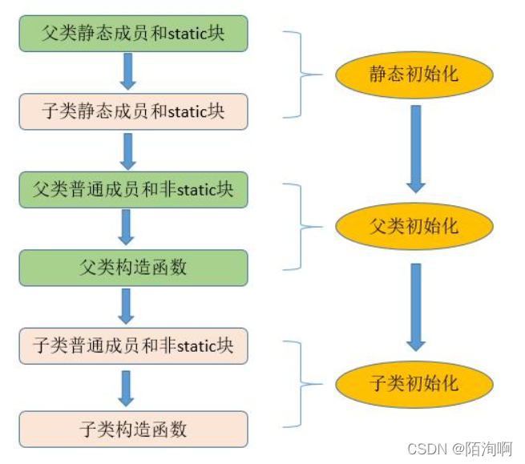

<br/>

# 一、Spring

首先是：

**IOC控制反转想办法引入我们需要的对象，比如配置数据源Database对象，**

**然后写web，**

**然后用mybatis引入数据库增删改查，**

**然后再次基础上使用声明式事务@Translation和传播行为，**

**然后如果需要用到框架式访问对象，可以使用springContext的applicationContext，**

**然后可能需要写一些切面，就用到了AOP面向切面，**

**最后进行单元测试springtest的单元测试junit**

<br/>

这里一破传统的先看重点aop和ioc区分开(这样会让面试者看着很多的知识点摸不着头脑)，而是直接按**业务流程来看全部的spring功能**，这样可以有利于了解spring到底在我们的业务中起到了什么作用！

（按照常见业务顺序来排名：IOC引入-web-mybatis-数据库声明式事务-框架访问-面向切面-单元测试）这里只讲1456重点

**1、IOC控制反转和DI依赖注入(mybatis多数据源、日常config引入client(引入别人的SDK)，依赖注入就是使用@Autowired而已)**

2、springWeb：针对web的applicationContext

3、集合各种优秀的框架（mybatis)

**4、数据库：声明式事务(@Translation)**

**5、springContext：框架式访问对象方法applicationContext、BeanFactroy**

**6、AOP面向切面(权限控制、Decimal单位转换)**

7、springtest：支持单元测试junit

<br/>

<br/>

## 1、IOC控制反转和DI依赖注入

控制反转，比较常用，一般用在初始化引入的client客户端对象(像redis)或者修饰一些工厂类(sqlsessiontemplate)这些

<br/>

<br/>

### (1)、IOC控制反转

引入依赖后一般有以下几种操作：直接用bean(最简单的SDK)、二次配置bean(IOC的根本)

<br/>

实操1：从已封装的包直接用bean

```
ApiClinet client=new ApiClinet(new Param());
client.XX();
```

<br/>

实操2：二次配置bean(IOC的根本)

**//配置文件式配置bean：ConfigurationProperties**

支持配置多个，如：

```
task:
  list:
    - name: task1 #任务名
      monitor: zsxq #监控者
      answerer: openai #回答者
      cron: '0/30 * * * * ?' #执行周
```

<br/>

例子：

```
//用默认的来配置bean：
@Configuration
public class RedisTemplateConfig {

    @Bean
    public RedisTemplate<String, Object> redisTemplate(RedisConnectionFactory connectionFactory) {
        RedisTemplate<String, Object> redisTemplate = new RedisTemplate<>();
        redisTemplate.setConnectionFactory(connectionFactory);
        redisTemplate.setKeySerializer(RedisSerializer.string());
        redisTemplate.setValueSerializer(RedisSerializer.json());
        return redisTemplate;
    }
}


//配置文件式配置bean：ConfigurationProperties
@Configuration
@ConfigurationProperties(prefix = "spring.redis")
@Data
public class RedissonConfig {

    private String host;

    private String port;

    @Bean
    public RedissonClient redissonClient() {
        // 1. 创建配置
        Config config = new Config();
        String redisAddress = String.format("redis://%s:%s", host, port);
        config.useSingleServer().setAddress(redisAddress).setDatabase(Constant.REDIS_DATABASE_NUM);
        // 2. 创建实例
        RedissonClient redisson = Redisson.create(config);
        return redisson;
    }
}

//例子2：mybatis多数据源
@Configuration
//// 扫描 Mapper 接口并容器管理
@MapperScan(basePackages = SlaveDataSourceConfig.PACKAGE, sqlSessionFactoryRef = "slaveSqlSessionFactory")
@Slf4j
public class SlaveDataSourceConfig {

    // 精确到 cluster 目录，以便跟其他数据源隔离
    static final String PACKAGE = "cn.csg.zt.upt.ms.demand.response.mm.mapper";
    static final String MAPPER_LOCATION = "classpath:/mapper/slave/*.xml";

    @Value("${spring.datasource2.url}")
    private String url;

    @Value("${spring.datasource2.username}")
    private String user;

    @Value("${spring.datasource2.password}")
    private String password;

    @Value("${spring.datasource2.driverclassname:com.mysql.jdbc.Driver}")
    private String driverClass;

    @Bean(name = "slaveDataSource")
    public DataSource clusterDataSource() {
        DruidDataSource dataSource = new DruidDataSource();
        dataSource.setDriverClassName(this.driverClass);
        dataSource.setUrl(this.url);
        dataSource.setUsername(this.user);
        Properties properties = DXMSApplication.getDXMSApplication().getProperties();
        String pubKey = properties.getProperty("dx.datasource.password.pubKey");
        if (StringUtils.isBlank(pubKey)) {
            pubKey = "MFwwDQYJKoZIhvcNAQEBBQADSwAwSAJBAKwI2dicJn1SM5AuCZvspZdoueAAF0oP1QfdryAIe2lWO2RZl9mI+l57wdF4Y7qIisdEkPeFzpLCHsOs3qU/c70CAwEAAQ==";
            log.info("-----获取的加密公钥:dx.datasource.password.pubKey--为空, 使用默认公钥-------");
        }
        try {
            this.password = ConfigTools.decrypt(pubKey, password);
            dataSource.setPassword(this.password);
        } catch (Exception var4) {
            dataSource.setPassword(this.password);
            log.error("---- 数据库密码解密失败 -----");
        }
        return dataSource;
    }

    @Bean(name = "slaveTransactionManager")
    public DataSourceTransactionManager clusterTransactionManager() {
        return new DataSourceTransactionManager(clusterDataSource());
    }

    @Bean(name = "slaveSqlSessionFactory")
    public SqlSessionFactory clusterSqlSessionFactory(@Qualifier("slaveDataSource") DataSource clusterDataSource, MybatisProperties mybatisProperties)
            throws Exception {
        final SqlSessionFactoryBean sessionFactory = new SqlSessionFactoryBean();
        sessionFactory.setDataSource(clusterDataSource);
        //设置日志打印
        org.apache.ibatis.session.Configuration configuration = new org.apache.ibatis.session.Configuration();
        configuration.setLogImpl(mybatisProperties.getConfiguration().getLogImpl());
        sessionFactory.setConfiguration(configuration);
        //        Properties properties = DXMSApplication.getDXMSApplication().getProperties();
        sessionFactory.setMapperLocations(new PathMatchingResourcePatternResolver()
                .getResources(SlaveDataSourceConfig.MAPPER_LOCATION));
        return sessionFactory.getObject();
    }

    @Bean(name = "slaveSqlSessionTemplate")
    public SqlSessionTemplate clusterSqlSessionTemplate(@Qualifier("slaveSqlSessionFactory") SqlSessionFactory sqlSessionFactory)
            throws Exception {
        final SqlSessionTemplate sqlSessionTemplate = new SqlSessionTemplate(sqlSessionFactory);
        return sqlSessionTemplate;
    }
}

使用：
    @Autowired
    @Qualifier("slaveSqlSessionTemplate")
    private SqlSessionTemplate sqlSessionTemplate;


//获取映射器maper
mapper = sqlSessionTemplate.getMapper(MmHnDrPowerDailySolidifyMapper.class);
sessionMapper.deleteSettledConsumerInfo(req.getSettleVersion());
List<String> powerConsumerId = mapper.getPowerConsumerId(responseDate);
//无需自动commit
//sqlSessionTemplate.commit();
```

<br/>

Spring框架支持以下五种bean的作用域：**( 使用@Scope(value = "singleton")来加在@Bean上实现)**
1、singleton:bean在每个Spring ioc容器中只有一个实例。
2、prototype:一个bean的定义可以有多个实例。
3、request:每次http请求都会创建一个bean,该作用域仅在基于web的Spring ApplicationContext情形下有效。
4、session:在一个HTTP Session中，一个bean定义对应一个实例。该作用域仅在基于web的SpringApplicationContext情形下有效。
5、global-session:在一个全局的HTTP Session中，一个bean定义对应一个实例。该作用域仅在基于web的Spring ApplicationContext情形下有效。

<br/>

Spring框架中的单例bean是线程安全的吗？
不是，Spring框架中的单例bean不是线程安全的。spring中的bean默认是单例模式，spring框架并没有对单例bean进行多线程的封装处理。
实际上大部分时候springbean无状态的（比如dao类）,所有某种程度上来说bean也是安全的，但如果bean有状态的话（比如view model对象）,那就要开发者自己去保证线程安全了，最简单的就是改变bean的作用域，把"singleton"变更为"prototype",这样请求bean相当于new Bean()了，所以就可以保证线程安全了。
1、有状态就是有数据存储功能。
2、无状态就是不会保存数据。

<br/>

那如果bean是有状态的呢？多线程下怎么办？Spring如何处理线程并发问题？
在一般情况下，只有无状态的Bean才可以在多线程环境下共享，在Spring中，绝大部分Bean都可以声明为singleton作用域，因为Spring对一些Bean中非线程安全状态采用ThreadLocal进行处理，解决线程安全问题。
ThreadLocal和线程同步机制都是为了解决多线程中相同变量的访问冲突问题。同步机制采用了“时间换空间”的方式，仅提供一份变量，不同的线程在访问前需要获取锁，没获得锁的线程则需要排队。而ThreadLocal采用了“空间换时间”的方式。
ThreadLocal会为每一个线程提供一个独立的变量副本，从而隔离了多个线程对数据的访问冲突。因为每一个线程都拥有自己的**变量副本**，从而也就没有必要对该变量进行同步了。ThreadLocal提供了线程安全的共享对象，在编写多线程代码时，可以把不安全的变量封装进ThreadLocal。

实操3：有状态的bean(因为大多数人可能都没见过ThreadLocal这玩意)：

```
@Data
public class VideoInfo implements Serializable {
    private static final long serialVersionUID = -81721029826522896L;

    //使用ThreadLocal就是在原来的VideoInfo上增加静态方法add、get、remove
    private static final ThreadLocal<VideoInfo> THREAD_LOCAL = new ThreadLocal<>();

    //都是使用静态方法
    public static void add(VideoInfo videoInfo){
        THREAD_LOCAL.set(videoInfo);
    }

    public static VideoInfo get(){
        return THREAD_LOCAL.get();
    }

    public static void remove() {
        THREAD_LOCAL.remove();
    }

    /**
     * 主键
     */
    private Integer id;
    /**
     * 视频描述
     */
    private String description;
    
    ....省略
}


使用：
    @Test
    void testTheadLocal() {
        VideoInfo videoInfo = new VideoInfo();
        videoInfo.setVideoUrl("123");
        //存入的是静态方法内！
        VideoInfo.add(videoInfo);

        //静态方法！取出来的都是videoInfo的副本！
        VideoInfo videoInfo1 = VideoInfo.get();
        String videoUrl = videoInfo1.getVideoUrl();
        System.out.println(videoUrl);
        //打印123

        //删除全部副本
        VideoInfo.remove();
        VideoInfo videoInfo2 = Optional.ofNullable(VideoInfo.get()).orElse(new VideoInfo());
        String videoUr2 = Optional.ofNullable(videoInfo2.getVideoUrl()).orElse("456");
        System.out.println(videoUr2);
        //打印456
    }
```

注意可能会造成内存泄露问题，记得Remove!

<br/>

#### a、内存泄露

 1、原因：

内存泄露一般是因为使用List、Map等数据结构时存入了无法被回收的“对象”，导致List无法**被清空后回收**

所以一般有两步：**1、List所有对象被回收。2、清空了List，回收List**

<br/>

 2、所以会导致内存泄漏的情况包括：

**1、对象无法被回收**

这些对象之间存在循环引用，导致这些对象无法被回收。**（A持有B，B持有A，无法被回收）**

存储的是**静态**对象的引用，导致这些对象始终存在，无法被回收。**(静态是在类加载时就已经存在内存中)**

存储的是匿名内部类的引用，导致这些内部类无法被回收**(内部类是无法被回收的)。**

**2、List没有做清空操作**

没有执行clear操作来清空List或map容器，导致List无法被回收

<br/>

 3、如何避免

**第一种方式：使用引用**

为了避免这些情况，可以使用弱引用、软引用、虚引用等引用类型来存储对象，或者在使用完 ConcurrentHashMap 后手动清空引用，从而避免内存泄漏。

例如，可以使用 WeakReference **弱引用**来存储对象的引用，这样当对象不再被引用时，就可以被垃圾回收器回收，从而避免内存泄漏：

```
Map<String, WeakReference<Object>> map = new ConcurrentHashMap<>();
map.put("key", new WeakReference<>(new Object()));

```

如果想要使用**软引用**来存储对象的引用，可以使用 Java 中的 SoftReference 类：软引用在系统内存空间不足时，才会被垃圾回收器回收。

```
Map<String, SoftReference<Object>> map = new ConcurrentHashMap<>();
map.put("key", new SoftReference<>(new Object()));

```

如果想要使用**虚引用**来存储对象的引用，可以使用 Java 中的 PhantomReference 类：虚引用只能通过 ReferenceQueue 来访问，在系统内存空间不足时，虚引用会被垃圾回收器回收。

```
Map<String, PhantomReference<Object>> map = new ConcurrentHashMap<>();
map.put("key", new PhantomReference<>(new Object(), null));

```

但是，要注意，如果使用了**弱引用或软引用，**那么在系统内存空间不足时，这些对象可能会被意外地回收，因此要注意处理好这种情况。

<br/>

**第二种方式：使用清空容器**

如果在方法内部使用 ConcurrentHashMap，只要在方法执行完后手动清空引用，就不会导致内存泄露。

```
public void foo() {
    Map<String, Object> map = new ConcurrentHashMap<>();
    // 使用 map
    map.clear();
}
```

<br/>

<br/>

#### b、bean的声明周期(重点！)

可能是日常使用得比较少，所以这一方面经常会被忽略。既然如此，那就撇开理论，举个例子讲如何自定义bean的生命周期吧。

先给出两个非常常见且重要的图(可先直接跳过)：

了解几个英文：

post：把..放入

process：过程





场景：假设你写了一个bean，这个bean比较特殊，你需要观察它的声明周期是否存在，你需要在它消失前做一些行为，将它的数据打印出来。

创建一个PersonBean，让它实现几个特殊的接口，我们来观察一下它的生命周期的流转。

```
具体的：                                                
public class PersonBean implements 
//这里有个InstantiationAwareBeanPostProcessor#postProcessBeforeInstantiation产前护理
//构造方法
//这里有个InstantiationAwareBeanPostProcessor#postProcessAfterInstantiation产后护理
//这里有个InstantiationAwareBeanPostProcessor#postProcessProperties属性赋值，出生登记
BeanNameAware,//Aware是获取各种社会资源，如起个学名
BeanFactoryAware,//Aware是获取各种社会资源，这里是选择学校
//这里有个BeanPostProcessor相当于学籍管理(在Initialization(初始化)前后)中获取各种手续和证，如报名
InitializingBean, //Initializing(初始化)代表个人选择，这里是在学校学习成长中，这里有个init方法
//这里有个BeanPostProcessor相当于学籍管理(在Initialization(初始化)前后)中获取各种手续和证，如拿到毕业证
//bean正在使用中
DisposableBean  //DisposableBean也是代表个人选择，人可能无法选择如何出生，但可以选择如何活着和死去，这里是死去
//自定义destroy，相当于埋了
{
  /**
     * 身份证号
     */
    private Integer no;
    ...
}

上面仅仅是了解，为了更清楚，写一个大概的：
public class PersonBean implements InitializingBean, BeanFactoryAware, BeanNameAware, DisposableBean{

    /**
     * 身份证号
     */
    private Integer no;

    /**
     * 姓名
     */
    private String name;

    //实例化
    public PersonBean() {
        System.out.println("1.调用构造方法：我出生了！");
    }

    public Integer getNo() {
        return no;
    }

    public void setNo(Integer no) {
        this.no = no;
    }

    public String getName() {
        return name;
    }

    public void setName(String name) {
        this.name = name;
        System.out.println("2.设置属性：我的名字叫"+name);
    }

    @Override
    public void setBeanName(String s) {
        System.out.println("3.调用BeanNameAware#setBeanName方法:我要上学了，起了个学名");
    }

    @Override
    public void setBeanFactory(BeanFactory beanFactory) throws BeansException {
        System.out.println("4.调用BeanFactoryAware#setBeanFactory方法：选好学校了");
    }

    @Override
    public void afterPropertiesSet() throws Exception {
        System.out.println("6.InitializingBean#afterPropertiesSet方法：入学登记");
    }

    public void init() {
        System.out.println("7.自定义init方法：努力上学ing");
    }

    @Override
    public void destroy() throws Exception {
        System.out.println("9.DisposableBean#destroy方法：平淡的一生落幕了");
    }

    public void destroyMethod() {
        System.out.println("10.自定义destroy方法:睡了，别想叫醒我");
    }

    public void work(){
        System.out.println("Bean使用中：工作，只有对社会没有用的人才放假。。");
    }

}
```

自定义了一个后处理器InstantiationAwareBeanPostProcessor接口：

```
@Component
@Slf4j
public class MyInstantiationAwareBeanPostProcessor implements InstantiationAwareBeanPostProcessor {
 
    @SneakyThrows
    @Override
    public Object postProcessBeforeInstantiation(Class<?> beanClass, String beanName) throws BeansException {
        System.out.println("1.0.构造方法执行前-产前护理");
        return null;
    }
 
    @Override
    public boolean postProcessAfterInstantiation(Object bean, String beanName) throws BeansException {
        System.out.println("1.2.构造方法执行后-产后护理");
        return true;
    }
 
    @Override
    public PropertyValues postProcessProperties(PropertyValues pvs, Object bean, String beanName) throws BeansException {
        System.out.println("1.3.属性赋值执行前-出生登记");
        return pvs;
    }
  
    //如果这里不写，可自定义了一个后处理器MyBeanPostProcessor，在下面
    //InstantiationAwareBeanPostProcessor也属于Bean级的后置处理器，还继承于BeanPostProcessor
    @Override
    public Object postProcessBeforeInitialization(Object bean, String beanName) throws BeansException {
        System.out.println("5.BeanPostProcessor.postProcessBeforeInitialization方法：到学校报名啦");
        return bean;
    }
 
    @Override
    public Object postProcessAfterInitialization(Object bean, String beanName) throws BeansException {
        System.out.println("8.BeanPostProcessor#postProcessAfterInitialization方法：终于毕业，拿到毕业证啦！");
        return bean;
    }
}
```

<br/>

自定义了一个后处理器MyBeanPostProcessor：

```
                      //Processor相当于在学校中的学籍管理(在Initialization(初始化)前后)中获取各种手续和证
public class MyBeanPostProcessor implements BeanPostProcessor {

    @Override
    public Object postProcessBeforeInitialization(Object bean, String beanName) throws BeansException {
        System.out.println("5.BeanPostProcessor.postProcessBeforeInitialization方法：到学校报名啦");
        return bean;
    }

    @Override
    public Object postProcessAfterInitialization(Object bean, String beanName) throws BeansException {
        System.out.println("8.BeanPostProcessor#postProcessAfterInitialization方法：终于毕业，拿到毕业证啦！");
        return bean;
    }
}
```

定义一个配置文件spring-config.xml：定义init-method和destroy-method

```
<?xml version="1.0" encoding="UTF-8"?>
<beans xmlns="http://www.springframework.org/schema/beans"
       xmlns:xsi="http://www.w3.org/2001/XMLSchema-instance"
       xsi:schemaLocation="http://www.springframework.org/schema/beans http://www.springframework.org/schema/beans/spring-beans.xsd">

    <bean name="myBeanPostProcessor" class="cn.fighter3.spring.life.MyBeanPostProcessor" />
    <bean name="personBean" class="cn.fighter3.spring.life.PersonBean"
          init-method="init" destroy-method="destroyMethod">
        <property name="idNo" value= "80669865"/>
        <property name="name" value="张铁钢" />
    </bean>

</beans>

```

最后测试一下，观察PersonBean的生命周期的流转：

```
public class Main {

    public static void main(String[] args) {
        ApplicationContext context = new ClassPathXmlApplicationContext("spring-config.xml");
        PersonBean personBean = (PersonBean) context.getBean("personBean");
        personBean.work();
        ((ClassPathXmlApplicationContext) context).destroy();
    }
}
```

运行结果：

```
1.0.构造方法执行前-产前护理
1.调用构造方法：我出生了！
1.2.构造方法执行后-产后护理"
1.3.属性赋值执行前-出生登记
2.设置属性：我的名字叫张铁钢
3.调用BeanNameAware#setBeanName方法:我要上学了，起了个学名
4.调用BeanFactoryAware#setBeanFactory方法：选好学校了
5.BeanPostProcessor#postProcessBeforeInitialization方法：到学校报名啦
6.InitializingBean#afterPropertiesSet方法：入学登记
7.自定义init方法：努力上学ing
8.BeanPostProcessor#postProcessAfterInitialization方法：终于毕业，拿到毕业证啦！
Bean使用中：工作，只有对社会没有用的人才放假。。
9.DisposableBean#destroy方法：平淡的一生落幕了
10.自定义destroy方法:睡了，别想叫醒我
```

以上，完。

<br/>

#### c、类的初始化过程/顺序

类的初始化过程和bean的生命周期极为容易混淆，因为它们其实是包含的关系，所以，既然了解了bean的声明周期，务必也要看类的初始化过程，对bean生命周期的的初始化部分有更深的了解。

<br/>

父类：

```
class Father {

    //--------------------------
    static {
        System.out.println("1.父类 static块执行");
    }
    
    static Sample staticSam1 = new Sample("2.父类 静态成员 staticSam1 初始化");
    
    
    //--------------------------   
    {
        System.out.println("5.父类 非静态块 1  执行");
    }

    Sample sam1 = new Sample("6.父类 普通成员 sam1 初始化");
    
    Father() {
        System.out.println("7.父类 默认构造函数被调用");
    }

}
```

成员变量：

```
class Sample {
    //带参数构造方法
    Sample(String s) {
        System.out.println(s);
    }
    
    //不带参数不会被执行
    Sample() {
        System.out.println("Sample默认构造函数被调用");
    }
}
```

<br/>

子类：

```
class Son extends Father {

    static {
        System.out.println("3.子类 static块1  执行");
    }
    
     static Sample staticSamSub2 = new Sample("4.子类 静态成员 staticSamSub 初始化");


    //--------------------------
    {
        System.out.println("8.子类 非静态块 1  执行");
    }
    
    Sample sam1 = new Sample("9.子类 普通成员 sam1 初始化");


    //--------------------------
    Son() {
        System.out.println("10.子类 默认构造函数被调用");
    }

}
```

执行：

```
public class InitialOrderWithExtend {
    public static void main(String[] args) {
        Father ts = new Son();
    }
}
```

执行结果：

```
1.父类 static块 执行
2.父类 静态成员 staticSam 初始化

3.子类 static块 执行
4.子类 静态成员 staticSamSub 初始化

5.父类 非静态块 执行
6.父类 普通成员 sam 初始化
7.父类 默认构造函数被调用

8.子类 非静态块  执行
9.子类 普通成员 sam 初始化
10.子类 默认构造函数被调用

```



<br/>

#### d、深拷贝和浅拷贝

问到spring单例和原型模式时，还会文档深拷贝和浅拷贝

浅克隆**：不会克隆对象中的引用类型属性，仅仅会把引用地址拷贝过来（也就是两者引用类型**属性**指向同一个地址）。

**比如Person下面有个Address属性对象，则会继续引用原来的。如果没有这样的属性，比如只有String类型，则用浅克隆就行。如果有，就要用深克隆。**

**深克隆**：会克隆对象中的所有信息(包括属性实体类)，原对象不会对新对象产生任何影响。

<br/>

第一种方式：实现 Cloneable接口

浅克隆，需要implements Cloneable并重写clone()方法：

```
@Override
public Object clone() throws CloneNotSupportedException {
    // 实现浅克隆
    Person person = (Person) super.clone();
    // 实现深克隆
    person.setAddress((Address) address.clone());
    return person;
}
```

如果是深克隆，还要加上：Address实现Cloneable接口并重写clone()方法(其实和上面是一样的)

```
public class Address implements Cloneable{
    
    // ......
    
    @Override
    protected Object clone() throws CloneNotSupportedException {
        return super.clone();
    }
}

```

这样就可以完成深克隆了。

<br/>

第二种方式：BeanUtils.copyProperties

如果你想要进行深拷贝，你可以使用 org.springframework.beans.BeanUtils.copyProperties 方法，它可以接受一个第三个参数，表示是否进行深拷贝。

```
import org.springframework.beans.BeanUtils;

// 浅拷贝
BeanUtils.copyProperties(source, target);

// 深拷贝
BeanUtils.copyProperties(source, target, true);

```

注意：这个方法是 Spring 框架的，如果你使用的是 Apache Commons BeanUtils 库，那么它并不支持深拷贝。

```
import org.apache.commons.beanutils.PropertyUtils;

// 浅拷贝
PropertyUtils.copyProperties(target, source);
```

<br/>

#### e、循坏依赖

在 Java 中，循环依赖指的是两个对象之间的相互依赖，形成一个环的结构。例如：

```
class A {
    private B b;
    // 省略其他代码
}

class B {
    private A a;
    // 省略其他代码
}

```

这样的话，对象 A 和对象 B 就会产生循环依赖，因为 A 依赖 B，B 又依赖 A。

（依赖是设计模式中的词语，指的是在A类中使用的类B，通常new一个A时，内部也会去使用类B，所以会new一个类B。循坏依赖就是说，在类B中，也使用到了类A，new了一个类A，但是这样子的话，就会不断地循环new了）

循环依赖通常会在单例模式或者依赖注入的场景下出现。如果你在使用 Spring 框架的话，你需要注意这个问题，因为 Spring 会在程序启动时自动管理 bean 的生命周期，如果出现循环依赖，它可能会导致死循环或者内存泄漏。

**所以，如果你的程序中有需要互相依赖的情况，记得要自己动手管理bean的顺序！可以加上@lazy或者@DependsOn(“b”)来解决！**

<br/>

**解决办法：**

<br/>

 **第1种**：@Lazy 

(来源chatgpt)

如果你使用的是 Spring 框架，你还可以使用 @Lazy 注解来避免循环依赖，该注解会使得 Spring 在真正需要的时候才创建 bean，而不是在容器启动的时候就创建。

```
@Configuration
class Config {
    @Bean
    @Lazy
    public A a() {
        return new A();
    }
    @Bean
    @Lazy
    public B b() {
       return new B();
    }
}
```

这样的话，Spring 在创建 A 和 B 的时候，就不会相互依赖了。

 **第2种： @DependsOn**

你还可以使用 @DependsOn 注解来控制 bean 的创建顺序，从而避免循环依赖的问题。

```
@Configuration
class Config {
    @Bean
    @DependsOn("b")
    public A a() {
        return new A();
    }

    @Bean
    public B b() {
        return new B();
    }
}

```

这样的话，Spring 在创建 A 的时候，会先创建 B，然后再创建 A。

<br/>

<br/>

### (2)、DI依赖注入

上面已经做好了对bean的处理，那么就可以使用了

<br/>

最经典的**@Autowired**，如果只有一个Client对象时，自动装配。

如果有定制化的Client(这下就会有多个Client了)，这一使用@Autowired("名称")来查找@Bean(“名称”)的bean（或者用**@Qualifier**来指定某个名字的bean）

如果Client对象不存在，使用@Autowired则会报错，需要用@Autowired(required=false)

<br/>

也可以使用**@Resource**来直接根据名字装配(默认是小写的类名)，名字找不到时，就会根据类型装配

<br/>

<br/>

## 4、数据库：声明式事务(@Translation)和传播行为

<br/>

（1）隔离级别(这个只要知道默认的就行)

spring有五大隔离级别，默认值为ISOLATION_DEFAULT(使用数据库的设置）,其他四个隔离级别和数据库的隔离级别一致：
**1.ISOLATION_DEFAULT:用底层数据库的设置隔离级别，数据库设置的是什么我就用什么；**
2.ISOLATION_READ_UNCOMMITTED:未提交读，最低隔离级别、事务未提交前，就可被其他事务读取（会出现幻读、脏读、不可重复读）;
3.ISOLATION_READ_COMMITTED:提交读，一个事务提交后才能被其他事务读取到（会造成幻读、不可重复读）,SQL server的默认级别；
4.ISOLATION_REPEATABLE_READ:可重复读，保证多次读取同一个数据时，其值都和事务开始时候的内容是一致，禁止读取到别的事务未提交的数据（会造成幻读）,MySQL的默认级别；
5.ISOLATION_SERIALIZABLE:序列化，代价最高最可靠的隔离级别，该隔离级别能防止脏读、不可重复读、幻读。

<br/>

(2)事务传播行为

<br/>


（传播行为就是要打破ACID原则的隔离性，**spring让类的本方法   做出针对外来方法  是否存在事务时  的各种事件动作**）

<br/>

1、PROPAGATION_REQUIRED:如果外来方法没有事务，就创建一个新事务，如果外来方法存在事务，本方法的sql就加入该事务，**该设置是最常用的设置。**

2、PROPAGATION_REQUIRES_NEW:创建新事务，无论外来方法存不存在事务，本方法的sql都创建新事务。

<br/>

3、PROPAGATION_SUPPORTS:支持外来方法事务，如果外来方法存在事务，就加入该事务，如果外来方法不存在事务，就本方法的sql以非事务执行。

4、PROPAGATION_NOT_SUPPORTED:以非事务方式执行操作，如果外来方法存在事务，就把外来方法事务先挂起。如果外来方法不存在事务，就本方法的sql以非事务执行。

（**挂起**：如果方法在一个事务中被调用，该事务会被挂起，在方法调用结束后，原先的事务便会恢复执行。**通俗地说是本方法优先！**）

<br/>

3、PROPAGATION_MANDATORY:支持外来方法事务，如果外来方法存在事务，就加入该事务，如果外来方法不存在事务，就抛出异常。

（只有外来方法有事务才行！）

6、PROPAGATION_NEVER:以非事务方式执行，如果外来方法存在事务，则抛出异常。

<br/>

7、PROPAGATION_NESTED:如果外来方法存在事务，则在嵌套事务内执行。如果外来方法没有事务，则按REQUIRED属性执行。

<br/>

## 5、springContext：BeanFactroy和ApplicationContext

这两个可能会被问到，但基本上都是一些基础性的东西，实操会比较少。

<br/>

（1）BeanFactroy

BeanFactroy采用的是延迟加载形式来注入Bean的，即只有在使用到某个Bean时（调用getBean()),才对该Bean进行加载实例化。这样，我们就不能发现一些存在的Spring的配置问题。如果Bean的某一个属性没有注入，BeanFacotry加载后，直至第一次使用调用getBean方法才会抛出异常。

BeanFactory简单粗暴，可以理解为就是个HashMap,Key是BeanName,Value是Bean实例。通常只提供注册（put),获取（get)这两个功能。我们可以称之为“低级容器”。

<br/>

（2）ApplicationContext

ApplicationContext,它是在容器启动时，一次性创建了所有的Bean。这样，在容器启动时，我们就可以发现Spring中存在的配置错误，这样有利于检查所依赖属性是否注入。ApplicationContext启动后预载入所有的单实例Bean,通过预载入单实例bean,确保当你需要的时候，你就不用等待，因为它们已经创建好了。相对于基本的BeanFactory,ApplicationContext唯一的不足是占用内存空间。当应用程序配置Bean较多时程序启动较慢。

ApplicationContext可以称之为“高级容器”。因为他比BeanFactory多了更多的功能。他继承了多个接口。因此具备了更多的功能。例如资源的获取，支持多种消息（例如JSP tag的支持）,对BeanFactory多了工具级别的支持等待。所以你看他的名字，已经不是BeanFactory之类的工厂了，而是“应用上下文”，代表着整个大容器的所有功能。该接口定义了一个refresh方法，此方法是所有阅读Spring 源码的人的最熟悉的方法，用于刷新整个容器，即重新加载/刷新所有的bean。

<br/>

这个“事件”可以当做是像前端一样的事件，如@click=“”一样，当怎么就会怎样，比较容易理解。

Spring ApplicationContext提供了以下5种标准的事件：
1.**上下文更新事件**（ContextRefreshedEvent):在调用ConfigurableApplicationContext接口中的refresh()方法时被触发。
2.**上下文开始事件**（ContextStartedEvent):当容器调用ConfigurableApplicationContext的Start()方法开始/重新开始容器时触发该事件。
3.**上下文停止事件**（ContextStoppedEvent):当容器调用ConfigurableApplicationContext的Stop()方法停止容器时触发该事件
4.**上下文关闭事件**（ContextClosedEvent):当ApplicationContext被关闭时触发该事件。容器被关闭时，其管理的所有单例Bean都被销毁。
5.**请求处理事件**（RequestHandledEvent):在Web应用中，当一个http请求（request)结束触发该事件。如果一个bean实现了ApplicationListener接口，当一个ApplicationEvent被发布以后，bean会自动被通知。

<br/>

ApplicationContext实操：SpringUtils的创建

```
public class SpringUtils implements ApplicationContextAware {

    private static ApplicationContext applicationContext;

    /**
    * 入参：ApplicationContext
    */
    @Override
    public void setApplicationContext(ApplicationContext applicationContext) throws BeansException {
        if (SpringUtils.applicationContext == null) {
            SpringUtils.applicationContext = applicationContext;
            log.info("ApplicationContext Initialized.");
        }
    }

    public static ApplicationContext getApplicationContext() {
        return applicationContext;
    }

    public static <T> T getBean(Class<T> clazz){
        return getApplicationContext().getBean(clazz);
    }

    //获取bean
    public static Object getBean(String name) {
        return getApplicationContext().getBean(name);
    }

    public static void copyObject(Object source, Object target){
        BeanUtils.copyProperties(source, target);
    }
}
```

<br/>

<br/>

## 6、AOP面向切面

AOP实现的关键在于代理模式，AOP代理主要分为静态代理和动态代理。静态代理的代表为AspectJ;动态代理则以Spring AOP为代表。

<br/>

(1)AspectJ是静态代理的增强，所谓静态代理，就是AOP框架会在编译阶段生成AOP代理类，因此也称为**编译时增强，他会在编译阶段将Aspect](切面）织入到Java字节码中**，运行的时候就是增强之后的AOP对象。

(2)Spring AOP使用的动态代理，所谓的动态代理就是**说AOP框架不会去修改字节码，而是每次运行时在内存中临时为方法生成一个AOP对象，这个AOP对象包含了目标对象的全部方法，并且在特定的切点做了增强处理，并回调原对象的方法**。

<br/>

<br/>

实操:（AOP经常涉及到注解、反射，很多人经常会懵逼）

```
一、构思
（1）注解在方法上就可以实现方法执行时间的日志打印
（2）AOP环绕(以带注解的方法为切入点)、注解、反射(获取方法名字、参数、注解信息)
（3）了解使用规则：（可参考springaop word文档）

环绕通知中的ProceedingJoinPoint：
实际传入对象是子类MethodInvocationProceedingJoinPoint类型proceedingJoinPoint对象的主要方法

1.获取切入点所在目标对象
Object targetObj = proceedingJoinPoint.getTarget();    
2. 获取方法和方法名
MethodSignature ms= (MethodSignature) proceedingJoinPoint.getSignature();
Method method = ms.getMethod();
String name = method.getName();
3. 获取方法上参数
Object[] args = proceedingJoinPoint.getArgs();
4. 获取方法上的注解
Transactional ts=  method.getAnnotation(Transactional.class);
注解也是一种类型，也有实例化的对象，Transactional是一个开启事务的注解，spring内部已经内置了对应的解析器，
也是通过aop来实现的
5.执行目标对象方法并获取返回值
返回值类型  变量=（返回值类型）joinPoint.proceed();


四、执行方法时间日志框架 代码实例

/**
 * @author litao
 */
@Retention(RetentionPolicy.RUNTIME)
@Target(ElementType.METHOD)
public @interface MethodLog {
    public String value() default "";
    //自定义测试id,将会在日志上出现。若为空则取线程id
    public String id() default "";
}

/**
 * @author litao
 * @Date 2022-9-21 14:44:47
 * framework of MethodLog.class
 */
@Slf4j
@Component
@Aspect
public class MethodLogAspect {

    /**
     * 切入点空方法
     */
    @Pointcut("@annotation(com.dr.server.frameworkUtils.annotion.MethodLog)")
    public void methodCutPoint(){}

    /**
     * 带返回值的环绕切面:日志上打印方法执行时间
     * @param proceedingJoinPoint
     * @return target方法的返回值
     * @throws Throwable
     */
    @Around("methodCutPoint()")
    public Object logTime(ProceedingJoinPoint proceedingJoinPoint) throws Throwable{

        //proceedingJoinPoint是传入的对象的子类,获取方法名字
        MethodSignature signature = (MethodSignature) proceedingJoinPoint.getSignature();
        String name = signature.getName();
        //获取方法注解上的用户自定义id
        Method method = signature.getMethod();
        MethodLog annotation = method.getAnnotation(MethodLog.class);
        String id = annotation.id();
        //如果id为空,取当前线程id
        if (StringUtils.isBlank(id)){
            long threadId = Thread.currentThread().getId();
            id = String.valueOf(threadId);
        }
        long startTime = System.currentTimeMillis();
        log.info("id为 "+id+" 的"+name+" 方法开始执行!");
        //有返回值的方法这里需要捕获返回给,否则响应会为空
        Object proceed = proceedingJoinPoint.proceed();
        long endTime = System.currentTimeMillis();
        log.info("id为 "+id+" 的"+name+" 方法结束,执行时间为:{}"+" ms",endTime-startTime);
        return proceed;
    }

}

@EnableAspectJAutoProxy
@SpringBootApplication
public class ExhibitApplication {
    public static void main(String[] args) {
        SpringApplication.run(ExhibitApplication.class, args);
    }
}
```

<br/>

### 1、AOP原理:动态代理Dynamic proxy(高频)

来源：https://zhuanlan.zhihu.com/p/65501610

<br/>

先看静态代理：

```
public class HuangNiu implements Human{

    private Me me;

    public HuangNiu() {
        me = new Me();
    }

    @Override
    public void eat() {
    }

    @Override
    public void sleep() {
    }

    @Override
    public void lookConcert() {
        // 添加排队买票方法
        this.lineUp();
        me.lookConcert();
    }

    public void lineUp() {

        System.out.println("line up");

    }

}
```

客户端：

```
public class Client {

    public static void main(String[] args) {

        Human human = new HuangNiu();
        human.lookConcert();

    }

}
```

<br/>

<br/>

**（考点）缺点很明显：**

**1、每个类我们都要手写一个代理类**

**我们需要一个类：**

**1、无论什么类，传进来，都能生成一个一模一样的它，来作为代理。-->InvocationHandler的getProxyInstance**

**2、调用被代理的方法。--->InvocationHandler的invoke**

<br/>

.....注意，我们并不是所有的方法都需要黄牛这个代理去排队。我们知道只有我看演唱会和我的狗去看医生时，才需要黄牛，如果要实现我们想要的方法上面添加特定的代理，可以通过 invoke 方法里面的方法反射获取 method 对象方法名称即可实现，所以动态代理类可以变成这样：

```
public class HuangNiuHandle implements InvocationHandler {

    private Object proxyTarget;

    public Object getProxyInstance(Object target) {
        this.proxyTarget = target;
        return Proxy.newProxyInstance(proxyTarget.getClass().getClassLoader(), proxyTarget.getClass().getInterfaces(), this);
    }

    @Override
    public Object invoke(Object proxy, Method method, Object[] args) throws Throwable {

        Object methodObject = null;

        if ("lookConcert".equals(method.getName()) ||
        "seeADoctor".equals(method.getName())) {

            System.out.println("line up");
            // 调用目标方法
            methodObject = method.invoke(proxyTarget, args);
        } else {
            // 不使用第一个proxy参数作为参数，否则会造成死循环
            methodObject = method.invoke(proxyTarget, args);
        }

        return methodObject;
    }

}
```

客户端实现：

```
public class Client {

    public static void main(String[] args) {

        HuangNiuHandle huangNiuHandle = new HuangNiuHandle();
        Human human = (Human) huangNiuHandle.getProxyInstance(new Me());

        human.eat();
        human.run();
        human.lookConcert();

        System.out.println("------------------");

        Animal animal = (Animal) huangNiuHandle.getProxyInstance(new Dog());
        animal.eat();
        animal.run();
        animal.seeADoctor();
    }

}
```

这样就能实现不同的代理对象都能用同一个黄牛代理了。

<br/>

//todo

在我们的API项目中，可以使用动态代理生成我们的API接口，不用每个都去写一个方法。

<br/>

# 二、SpringBoot

主要核心：约定大于配置

<br/>

### （1）Spring Boot的核心注解

启动类上面的注解是@SpringBootApplication,它也是Spring Boot的核心注解，也可以关闭某个自动配置的选项，如关闭数据源自动配置功能：@SpringBootApplication(exclude={DataSourceAutoConfiguration.class)，**这样引入SDK依赖就不会因为没有配置报错了**

<br/>

主要组合包含了以下4个注解：

1、@EnableAutoConfiguration：打开自动配置的功能，给容器导入META-INF/spring.factories里定义的自动配置类（如SDK的Client）

```
META-INF/spring.factories对应的是SDK里面的bean，这些配置类上会加注解：
@Conditional、@ConditionaOnBean、@ConditionaOnMissingBean、@ConditionaOnClass、@ConditionaOnMissingClass
都是当xx存在时/当xx不存在时的条件加载。
```

如：

```
//META-INF/spring.factories文件：
org.springframework.boot.autoconfigure.EnableAutoConfiguration=com.taoli.apiclientsdk.ApiClientConfig


//其对应的bean：

@Configuration
//标注使用sdk者需要输入的信息
@ConfigurationProperties("api.client")
@Data
@ComponentScan
@ConditionaOnMissingBean
public class ApiClientConfig {

    private String accessKey;

    private String secretKey;

    @Bean
    public ApiClient getApiClient() {
        return new ApiClient(accessKey, secretKey);
    }

}
```

2、@SpringBootConfiguration：组合了@Configuration注解，实现配置文件的功能，读取配置文件进行配置

3、@ComponentScan：Spring组件扫描。

4、@Import：加载所有Meta-INF上的jar包

***

<br/>

### （2）如何理解Spring Boot配置加载顺序

a、bootstrap(.yml或者.properties):boostrap由父ApplicationContext加载的，比applicaton
优先加载，配置在应用程序上下文的引导阶段生效。一般来说我们在Spring Cloud Config或者
Nacos中会用到它。且boostrap里面的属性不能被覆盖

b、properties文件；

c、YAML文件；1.配置有序，在一些特殊的场景下，配置有序很关键 2.支持数组，数组中的元素可以是基本数据类型也可以是对象

<br/>

# 三、Maven

Maven和SpringBoot是不可分离的！

<br/>

## （1）Maven版本控制

SpringBoot使用<dependencyMangement>和<version>$(xx.version)<>进行版本控制的锁定，实质上控制的是启动包Starter中各种Jar包中各种工厂factories中的configuration配置类中的类的版本。可以用<properties>和<xx.version>1.1.5<>标签来控制版本号。
这样的好处是锁定了各种类的版本，坏处是锁定类的版本后，如果要使用这个类（在factorties中）新的版本而引入时，可能会导致版本冲突

<br/>

## （2）我们的项目和引入的Jar包打包时

使用<scope>来设置是否要将引入的这个依赖要再次打包进我们写的项目的jar包中，即我们写的factorties和引入的factorties是否要一起打包成jar。如果是，那么别的项目就不用再引入我们“已引入的jar"了。
1、默认为：complie:全部打包进jar,是一个很强的依赖。虽然是“引入的jar"貌似会引起依赖冲突，但是还是会以路径最短者优先原则来解决冲突。
2、runtime,和complie没什么差别，只是无需参与项目的编译
3、test,不会打包进jar,只参与本项目的测试
4、provided,不打包进去，别的设施会提供。（本质是在打包阶段用了exclude来排除了这个依赖）

<br/>

## （3）解决依赖冲突

所谓依赖冲突，就是factories中的类与别的版本有冲突，比如SpringBoot的factories的redis是1.0,我们项目的类的引入的jar的redis是1.1,我们在使用时就会引起版本冲突。Maven用两种方法帮我们解决冲突：
1、路径最短者原则：依赖传递中，先到达的优先。
2、（路径一样长时）第一声明者原则：在pom中优先使用的优先使用
3、（添加依赖时注意）可选依赖：在原jar中一般都会用<optional>提供可选，这样导入时就不会全部导入了，只需要需要的jar包即可
4、（要是原jar没用<optional>全部导入了）依赖排除：用<exclusions><exclusion>在引入时排除在原jar中的部分依赖，避免版本上的冲突
5、冲突解决工具MavenHelper,操作去csdn看