# 一、接口

<br/>

## 1、接口幂等性

计算机科学中，幂等表示一次和多次请求某一个资源应该具有同样的副作用，或者说，多次请求所产生的影响与一次请求执行的影响效果相同。

<br/>

### （1）分布式锁

**对于同一个接口，无论客户端调用多少次，最终的效果/期望都是一样的**(因为程序中会先查数据库，如果有订单了就不会执行添加订单的代码，所以无论执行多少次都是一样的) 。例如，对于一个创建订单的接口，如果客户端在网络异常的情况下多次调用了这个接口，那么最终的结果就可能是创建了多个订单，这就与预期的结果不一致。为了避免这种情况的发生，我们就需要使用接口幂等性来保证接口的正确性。

为什么要用到分布式锁：因为导致接口不幂等的原因是“**多个线程进入程序，先查数据库是否有订单时，查到的都是没有，所以添加了多个重复订单，所以效果/(期望只有一个订单的效果）就不一样了**”。所以如果用分布式锁，同一个用户添加订单时，多个线程都是线性进行的，所以都会接连查询订单是否存在，所以效果/期望是一样的，这就实现了接口幂等。

用到分布式锁需要考虑到性能的问题。如果你的系统中有大量的并发请求，使用这些工具可能会造成性能瓶颈。

<br/>

### （2）前端点击后置灰

让同个用户的线程有充分的时间逐一通过。但是这样做，接口反应时间过长，则还是可能不幂等

<br/>

### （3）数据库唯一主键约束(也可以当做防重处理)

(tips：幂等是接口多次点击的结果是一样的；接口防重是接口多次返回的结果中是不重复的。防重是幂等的子集，重复了就不幂等了)

防重和幂等设计其实是有区别的。防重主要为了避免产生重复数据，把重复请求拦截下来即可。而幂等设计除了拦截已经处理的请求，还要求每次相同的请求都返回一样的效果。不过呢，很多时候，它们的处理流程、方案是类似的哈。

<br/>

在多个线程查完订单时若没有，插入数据库会做一次主键判断。

```
CREATE TABLE orders (
    id INTEGER PRIMARY KEY,
    customer_id INTEGER NOT NULL,
    amount INTEGER NOT NULL,
    status VARCHAR(255) NOT NULL
);

//然后你就可以在你的代码中使用下面的 SQL 语句来实现接口幂等性：

INSERT INTO orders (id, customer_id, amount, status) VALUES (1, 2, 100, 'pending')
ON CONFLICT (id) DO UPDATE SET status = 'pending' WHERE orders.status = 'pending';

//查的时候要把主键先查出来！
```

在上面的 SQL 语句中，我们使用了 ON CONFLICT 子句来定义当发生主键冲突时，如何处理。
在这个例子中，我们使用了 DO UPDATE 子句，并将更新的值设置为 'pending'，这意味着如果发生了主键冲突，
就会将订单的状态更新为 'pending'。

使用主键约束来实现接口幂等性的优点是，它可以在数据库层面保证接口的幂等性，并且效率较高。
但是，这种方式并不能用于所有的接口，因为它只适用于插入数据的接口。
如果你的接口需要更新、删除数据，就不能使用这种方式来实现接口幂

<br/>

这种方式一般都要用上，作为兜底的方案！

<br/>

## 2、接口扩展性

### （1）扩展性

根据实际业务场景设计接口，充分考虑接口的可扩展性。

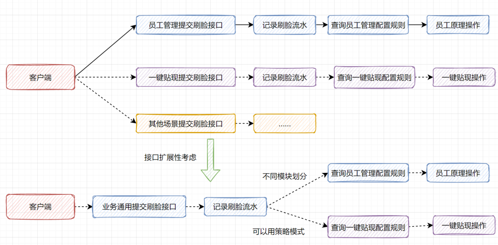

### （2）要保持扩展性，接口功能要单一

单一性是指接口做的事情比较单一、专一。比如一个登陆接口，它做的事情就只是校验账户名密码，然后返回登陆成功以及userId即可。但是如果你为了减少接口交互，把一些注册、一些配置查询等全放到登陆接口，就不太妥。

其实这也是微服务一些思想，接口的功能单一、明确。比如订单服务、积分、商品信息相关的接口都是划分开的。将来拆分微服务的话，是不是就比较简便啦。

### （3）可变参数配置化

假如产品经理提了个红包需求，圣诞节的时候，红包皮肤为圣诞节相关的，春节的时候，为春节红包皮肤等。

如果在代码写死控制，可有类似以下代码：

```
if(duringChristmas){
   img = redPacketChristmasSkin;
}else if(duringSpringFestival){
   img =  redSpringFestivalSkin;
}
```

如果到了元宵节的时候，运营小姐姐突然又有想法，红包皮肤换成灯笼相关的，这时候，是不是要去修改代码了，重新发布了？

从一开始接口设计时，可以实现一张红包皮肤的配置表，将红包皮肤做成配置化呢？更换红包皮肤，只需修改一下表数据就好了。

当然，还有一些场景适合一些配置化的参数：一个分页多少数量控制、某个抢红包多久时间过期这些，都可以搞到参数配置化表里面。这也是扩展性思想的一种体现。

**直接写在配置表里读取即可。**

<br/>

## 3、接口线程池/异步

<br/>

### (1)隔离性

一些登陆、转账交易、下单等重要接口，考虑线程池隔离哈。如果你所有业务都共用一个线程池，有些业务出bug导致线程池阻塞打满的话，那就杯具了，所有业务都影响了。因此进行线程池隔离，重要业务分配多一点的核心线程，就更好保护重要业务。

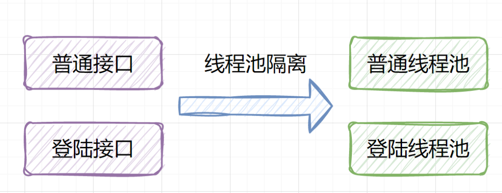

<br/>

### (2)异步

举个简单的例子，比如你实现一个用户注册的接口。用户注册成功时，发个邮件或者短信去通知用户。这个邮件或者发短信，就更适合异步处理。因为总不能一个通知类的失败，导致注册失败吧。

至于做异步的方式，简单的就是用**线程池**。还可以使用消息队列，就是用户注册成功后，生产者产生一个注册成功的消息，消费者拉到注册成功的消息，就发送通知。

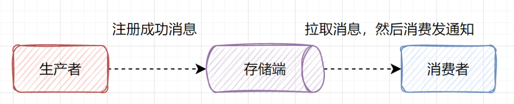

不是所有的接口都适合设计为同步接口。比如你要做一个转账的功能，如果你是单笔的转账，你是可以把接口设计同步。用户发起转账时，客户端在静静等待转账结果就好。如果你是批量转账，一个批次一千笔，甚至一万笔的，你则可以把接口设计为异步。就是用户发起批量转账时，持久化成功就先返回受理成功。然后用户隔十分钟或者十五分钟等再来查转账结果就好。又或者，批量转账成功后，再回调上游系统。

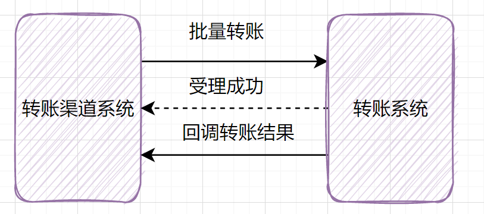

<br/>

### (3)、接口优化：串行改并行-异步编程-CompletableFuture

假设我们设计一个APP首页的接口，它需要查用户信息、需要查banner信息、需要查弹窗信息等等。那你是一个一个接口串行调，还是并行调用呢？


如果是串行一个一个查，比如查用户信息200ms，查banner信息100ms、查弹窗信息50ms，那一共就耗时350ms了，如果还查其他信息，那耗时就更大了。这种场景是可以改为并行调用的。也就是说查用户信息、查banner信息、查弹窗信息，可以同时发起。

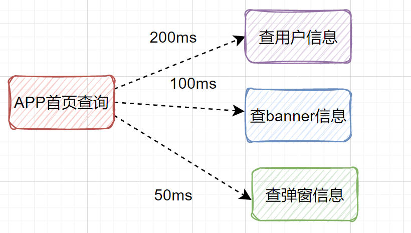

在Java中有个异步编程利器：CompletableFuture，就可以很好实现这个功能。

```
public UserInfo getUserInfo(Long id) throws InterruptedException, ExecutionException {

    //用户信息
    final UserInfo userInfo = new UserInfo();
    
    CompletableFuture userFuture = CompletableFuture.supplyAsync(() -> {
        getRemoteUserAndFill(id, userInfo);
        return Boolean.TRUE;
    }, executor);

    CompletableFuture bonusFuture = CompletableFuture.supplyAsync(() -> {
        getRemoteBonusAndFill(id, userInfo);
        return Boolean.TRUE;
    }, executor);

    CompletableFuture growthFuture = CompletableFuture.supplyAsync(() -> {
        getRemoteGrowthAndFill(id, userInfo);
        return Boolean.TRUE;
    }, executor);
    
    //调用 CompletableFuture 类的静态方法 allOf 并阻塞当前线程，直到所有 CompletableFuture 任务都完成。
    CompletableFuture.allOf(userFuture, bonusFuture, growthFuture).join();

    //获取这三个异步任务的结果
    userFuture.get();
    bonusFuture.get();
    growthFuture.get();
    
    //赋值成功后返回
    return userInfo;
}
```

但有个问题：status字段只有1和0两个值，重复度很高，区分度非常低，不能走索引，会全表扫描，效率也不高。

还有其他的解决方案不？

答：使用多线程处理。

```
我们可以使用CompleteFuture使用两个线程异步调用统计有效订单的sql和统计无效订单的sql，
最后汇总数据，这样能够提升查询接口的性能查询接口的性能。
```

<br/>

### (4)数据并发安全

多线程并发的时候，保证数据的正确性,等等。

1、比如你做一笔转账交易，扣减余额的时候，可以通过CAS乐观锁的方式保证余额扣减正确吧。

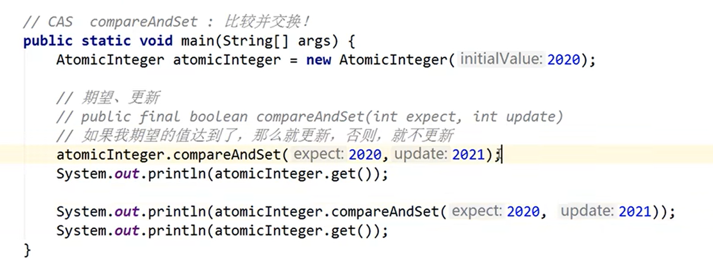

2、如果你是实现秒杀接口，得防止超卖问题吧。你可以使用Redis分布式锁防止超卖问题。

```java
// 每天执行，预热推荐用户
    @Scheduled(cron = "0 31 0 * * *")
    public void doCacheRecommendUser() {
        RLock lock = redissonClient.getLock("yupao:precachejob:docache:lock");
        try {
            // 只有一个线程能获取到锁
            // (等待时间一定是0，-1表面是永不过期，但其实是看门狗机制，如果程序没执行完，则会为这个锁添加30秒)
            if (lock.tryLock(0, -1, TimeUnit.MILLISECONDS)) {
                System.out.println("getLock: " + Thread.currentThread().getId());
                for (Long userId : mainUserList) {
                    QueryWrapper<User> queryWrapper = new QueryWrapper<>();
                    Page<User> userPage = userService.page(new Page<>(1, 20), queryWrapper);
                    String redisKey = String.format("yupao:user:recommend:%s", userId);
                    ValueOperations<String, Object> valueOperations = redisTemplate.opsForValue();
                    // 写缓存
                    try {
                        valueOperations.set(redisKey, userPage, 30000, TimeUnit.MILLISECONDS);
                    } catch (Exception e) {
                        log.error("redis set key error", e);
                    }
                }
            }
        } catch (InterruptedException e) {
            log.error("doCacheRecommendUser error", e);
        } finally {
            // 只能释放自己的锁(原子性，代替了lua脚本)
            if (lock.isHeldByCurrentThread()) {
                System.out.println("unLock: " + Thread.currentThread().getId());
                lock.unlock();
            }
        }
    }
```

<br/>

## 4、接口安全性

### (1)日志

关键业务代码无论身处何地，都应该有足够的日志保驾护航。比如：你实现转账业务，转个几百万，然后转失败了，接着客户投诉，然后你还没有打印到日志，想想那种水深火热的困境下，你却毫无办法。。。

那么，你的转账业务都需要哪些日志信息呢？至少，方法调用前，入参需要打印需要吧，接口调用后，需要捕获一下异常吧，同时打印异常相关日志吧

### (2)熔断和降级

在计算机网络中，限流就是控制网络接口发送或接收请求的速率，它可防止DoS攻击和限制Web爬虫。限流，也称流量控制。是指系统在面临高并发，或者大流量请求的情况下，限制新的请求对系统的访问，从而保证系统的稳定性。

如果服务C出现问题，比如是因为慢SQL导致调用缓慢，那将导致B也会延迟，从而A也会延迟。堵住的A请求会消耗占用系统的线程、IO等资源。当请求A的服务越来越多，占用计算机的资源也越来越多，最终会导致系统瓶颈出现，造成其他的请求同样不可用，最后导致业务系统崩溃。

为了应对服务雪崩, 常见的做法是熔断和降级。最简单是加开关控制，当下游系统出问题时，开关降级，不再调用下游系统。还可以选用开源组件Hystrix、sentinel。

### (3)接口异常处理

不要用一个Exception捕捉所有可能的异常，注意异常匹配的顺序，优先捕获具体的异常。捕获到的异常，不能忽略它，至少打点日志吧

尽量不要使用e.printStackTrace(),而是使用log打印。因为e.printStackTrace()语句可能会导致内存占满。

### (4)接口-对外身份效验

一般都是采用spring-redis-session来效验：

```
    @Override
    public User getLoginUser(HttpServletRequest request) {
        if (request == null) {
            return null;
        }
        Object userObj = request.getSession().getAttribute(USER_LOGIN_STATE);
        if (userObj == null) {
            throw new BusinessException(ErrorCode.NO_AUTH);
        }
        return (User) userObj;
    }
```

配置：spring-redis-session

```
spring:
  session:
    timeout: 86400
    store-type: redis
  redis:
    port: 6379
    host: 39.99.131.225
    database: 15    
```

配置完后，身份信息session就会自动存在redis中，当请求来的时候，就会自动获取redis中的session来进行效验

```
//如这行代码，request.getSession()其实已经根据request的值调用redis获取getAttribute的值进行比对并获取
Object userObj = request.getSession().getAttribute(USER_LOGIN_STATE);
// 移除登录态，request.getSession().removeAttribute其实已经调用redis，移除request对应在redis中保存的值
request.getSession().removeAttribute(USER_LOGIN_STATE);
```

### （5）接口数据安全

数据加密、防篡改：目前业界老生常谈就是对称加密和非对称加密。

<br/>

## 5、接口速度优化

### （1）缓存

缓存用得好，可以承载更多的请求，提升查询效率，减少数据库的压力。

比如一些平时变动很小或者说几乎不会变的商品信息，可以放到缓存，请求过来时，先查询缓存，如果没有再查数据库，并且把数据库的数据更新到缓存。但是，使用缓存增加了需要考虑这些点：缓存和数据库一致性如何保证、集群、缓存击穿、缓存雪崩、缓存穿透等问题。

保证数据库和缓存一致性：缓存延时双删、删除缓存重试机制、读取biglog异步删除缓存
缓存击穿：设置数据永不过期
缓存雪崩：Redis集群高可用、均匀设置过期时间
缓存穿透：接口层校验、查询为空设置个默认空值标记、布隆过滤器。

<br/>

### （2）数据库

#### 1、考虑批量处理思想

能批量操作就不要for循环调用。

一个简单例子，我们平时一个列表明细数据插入数据库时，不要在for循环一条一条插入，建议一个批次几百条，进行批量插入。同理远程调用也类似想法，比如你查询营销标签是否命中，可以一个标签一个标签去查，也可以批量标签去查，那批量进行，效率就更高嘛。

#### 2、数据库索引

SQL优化从这几个维度思考：

1、explain 分析SQL查询计划（重点关注type、extra、filtered字段）

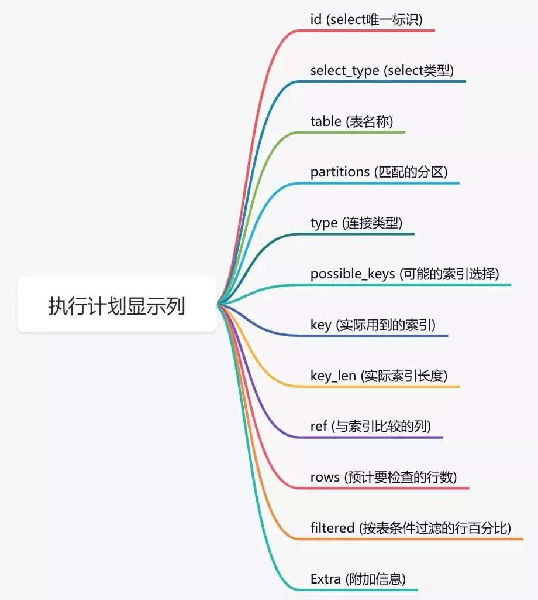

但有个问题：status字段只有1和0两个值，重复度很高，区分度非常低，不能走索引，会全表扫描，效率也不高。

还有其他的解决方案不？

答：使用多线程处理。

```
我们可以使用CompleteFuture使用两个线程异步调用统计有效订单的sql和统计无效订单的sql，
最后汇总数据，这样能够提升查询接口的性能查询接口的性能。
```

2、show profile分析，了解SQL执行的线程的状态以及消耗的时间
3、索引优化 （覆盖索引、最左前缀原则、隐式转换、order by以及group by的优化、join优化）

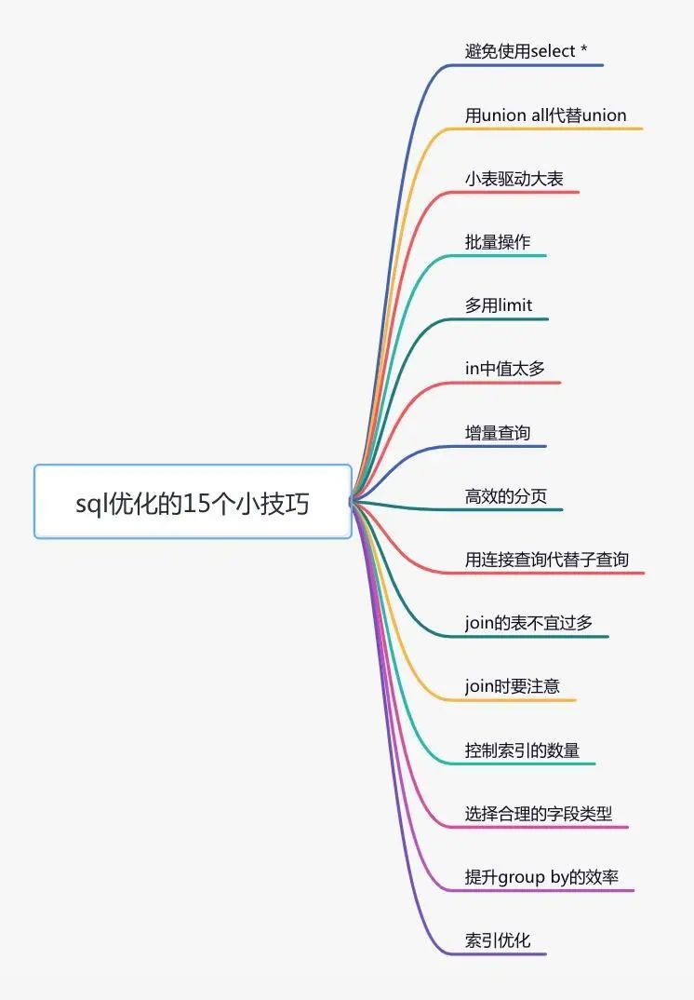

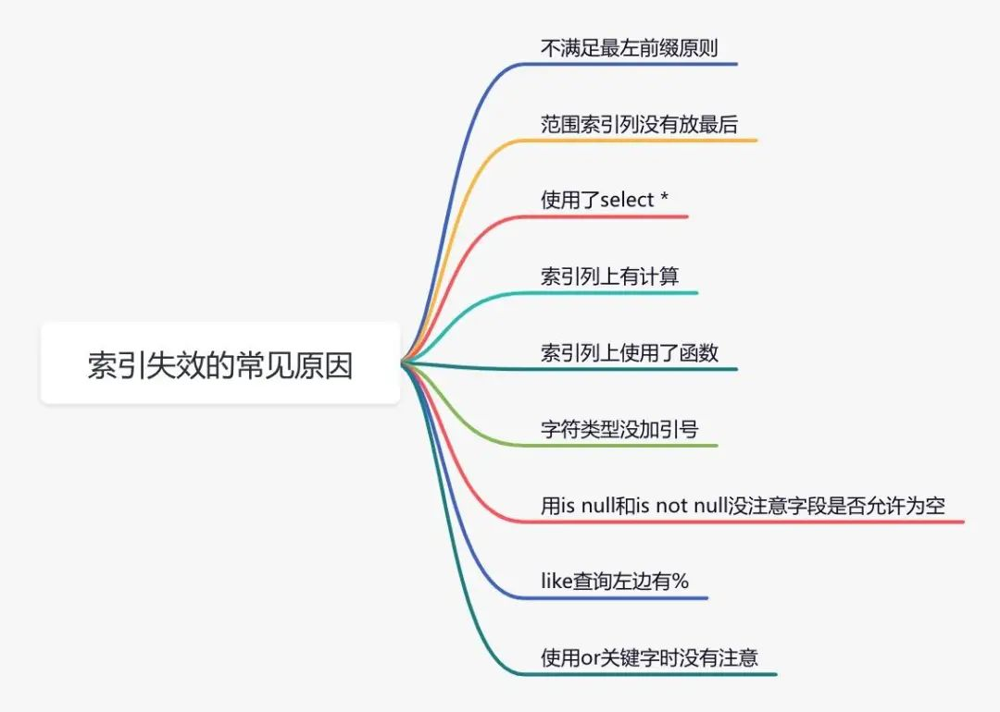

4、大分页问题优化（延迟关联、记录上一页最大ID）

5、数据量太大（分库分表、同步到es，用es查询）

<br/>

2-1：

加索引：

```
//能单独查看某张表的索引情况。
show create table `order`;
//也可以通过CREATE INDEX命令添加索引
CREATE INDEX idx_name ON `order` (name);
```

删除索引：

```
DROP INDEX idx_name ON `order`;
```

<br/>

<br/>

#### 3、开启慢查询日志

为了定位sql的性能瓶颈，我们需要开启mysql的慢查询日志。把超过指定时间的sql语句，单独记录下来，方面以后分析和定位问题。

开启慢查询日志需要重点关注三个参数：

slow_query_log 慢查询开关
slow_query_log_file 慢查询日志存放的路径
long_query_time 超过多少秒才会记录日志

```
set global slow_query_log='ON'; 
set global slow_query_log_file='/usr/local/mysql/data/slow.log';
set global long_query_time=2;
```

设置完之后，如果某条sql的执行时间超过了2秒，会被自动记录到slow.log文件中。

很多公司每天早上都会发一封慢查询日志的邮件，开发人员根据这些信息优化sql。

3-1：

为了出现sql问题时，能够让我们及时发现，我们需要对系统做监控。目前业界使用比较多的开源监控系统是：Prometheus。

可以看到mysql当前qps，活跃线程数，连接数，缓存池的大小等信息。

如果发现数据量连接池占用太多，对接口的性能肯定会有影响。

这时可能是代码中开启了连接忘了关，或者并发量太大了导致的，需要做进一步排查和系统优化。

如果你想了解更多功能，可以访问Prometheus的官网：https://prometheus.io/

<br/>

#### 4、读写分离-主从库

#### 5、避免大事务

很多小伙伴在使用spring框架开发项目时，为了方便，喜欢使用@Transactional注解提供事务功能。

没错，使用@Transactional注解这种声明式事务的方式提供事务功能，确实能少写很多代码，提升开发效率。

但也容易造成大事务，引发其他的问题。

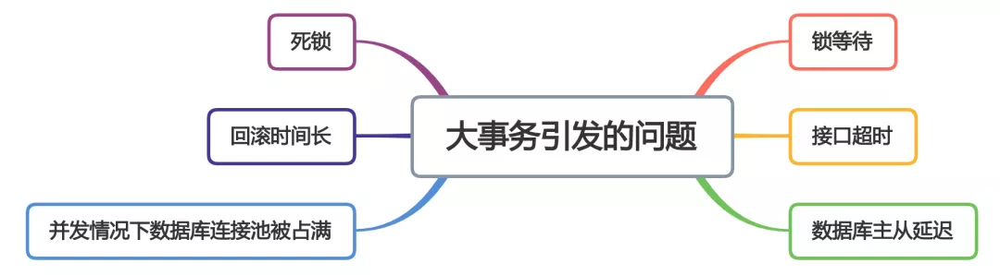

我们该如何优化大事务呢？

1、少用@Transactional注解

2、将查询(select)方法放到事务外
3、事务中避免远程调用
4、事务中避免一次性处理太多数据
5、有些功能可以非事务执行
6、有些功能可以异步处理

<br/>

#### 6、降低代码锁的粒度

反例：

```
//不涉及共享资源的慢方法
private void slowNotShare() {
    try {
        TimeUnit.MILLISECONDS.sleep(100);
    } catch (InterruptedException e) {
    }
}

//错误的加锁方法
public int wrong() {
    long beginTime = System.currentTimeMillis();
    IntStream.rangeClosed(1, 10000).parallel().forEach(i -> {
        //加锁粒度太粗了，slowNotShare其实不涉及共享资源
        synchronized (this) {
            slowNotShare();
            data.add(i);
        }
    });
    log.info("cosume time:{}", System.currentTimeMillis() - beginTime);
    return data.size();
}
```

正例：

```
public int right() {
    long beginTime = System.currentTimeMillis();
    IntStream.rangeClosed(1, 10000).parallel().forEach(i -> {
        slowNotShare();//可以不加锁
        //只对List这部分加锁
        synchronized (data) {
            data.add(i);
        }
    });
    log.info("cosume time:{}", System.currentTimeMillis() - beginTime);
    return data.size();
}
```

<br/>

<br/>

### （3）优化程序逻辑

优化程序逻辑这块还是挺重要的，也就是说，你实现的业务代码，如果是比较复杂的话，建议把注释写清楚。还有，代码逻辑尽量清晰，代码尽量高效。

比如，你要使用用户信息的属性，你根据session已经获取到userId了，然后就把用户信息从数据库查询出来，使用完后，后面可能又要用到用户信息的属性，有些小伙伴没想太多，反手就把userId再传进去，再查一次数据库。。。我在项目中，见过这种代码。。。直接把用户对象传下来不好嘛。。

<br/>

<br/>

<br/>

## 6、第三方接口

<br/>

（1）接口超时(对线程池的影响)

没法预估对方接口一般多久返回，一般设置个超时断开时间，以保护你的接口。之前见过一个生产问题，就是http调用不设置超时时间，最后响应方进程假死，请求一直占着线程不释放，拖垮线程池。

<br/>

<br/>

<br/>

# 二、并发编程

<br/>

## 1、从并发容器、并发代码块理解多线程

<br/>

```
//理解并发容器与并发代码块
class A{

  private static HashMap<String, Object> myHashMap1 = new HashMap<>();
  private static ConcurrentHashMap<String, Object> myHashMap1 = new ConcurrentHashMap<>();
  
  ---------------------------并发容器-----------------------------------
  void XX1{
  HashMap<String, Object> myHashMap2 = new HashMap<>();
  ConcurrentHashMap<String, Object> myHashMap22 = new ConcurrentHashMap<>();
  
  //在方法内开启多线程(重点！！！与下面方法外开启多线程区分)
  for(int i=1;i<100;i++){
    //对myHashMap1进行获取并修改，线程不安全
  new Thread(()->{myHashMap1.get(“a”).add()};)
  //对myHashMap2进行获取并修改，线程不安全
  new Thread(()->{myHashMap2.get(“a”).add()};)
  
  //对myHashMap11进行获取并修改，线程安全
  new Thread(()->{myHashMap11.get(“a”).add()};)
  //对myHashMap22进行获取并修改，线程安全
  new Thread(()->{myHashMap22.get(“a”).add()};)
  
  }
  
  ---------------------------并发代码块-----------------------------------
  void XX2{
     for(int i=1;i<100;i++){
     //对并发代码块进行线程访问，模拟高并发访问某个方法(重点！！！与上面方法内开启多线程区分，这是XX3的方法外)
     new Thread(()->{ XX3(); })
  }
  
  void XX3{
     HashMap<String, Object> myHashMap3 = new HashMap<>();
     ConcurrentHashMap<String, Object> myHashMap33 = new ConcurrentHashMap<>();
  
    //synchronized保证了代码块(所有使用到类中容器的地方)的原子性，即保证了类中所有容器的线程安全性
     synchronized(A.class){
     //对myHashMap1进行获取并修改，线程安全
     nmyHashMap1.get(“a”).add();
     //对myHashMap2进行获取并修改，线程安全
     myHashMap3.get(“a”).add();
  
     //对myHashMap11进行获取并修改，线程安全
     nmyHashMap11.get(“a”).add();
     //对myHashMap33进行获取并修改，线程安全
     myHashMap33.get(“a”).add();
  
  }

}
  
  
}
```

<br/>

## 2、异步框架 CompletableFuture

<br/>

**JDK1.8 中，Java 提供了 CompletableFuture 类，它是基于异步函数式编程。**

相对阻塞式等待返回结果，CompletableFuture 可以通过回调的方式来处理计算结果，实现了异步非阻塞，性能更优。

优点：

异步任务结束时，会自动回调某个对象的方法
异步任务出错时，会自动回调某个对象的方法
主线程设置好回调后，不再关心异步任务的执行

泡茶示例：

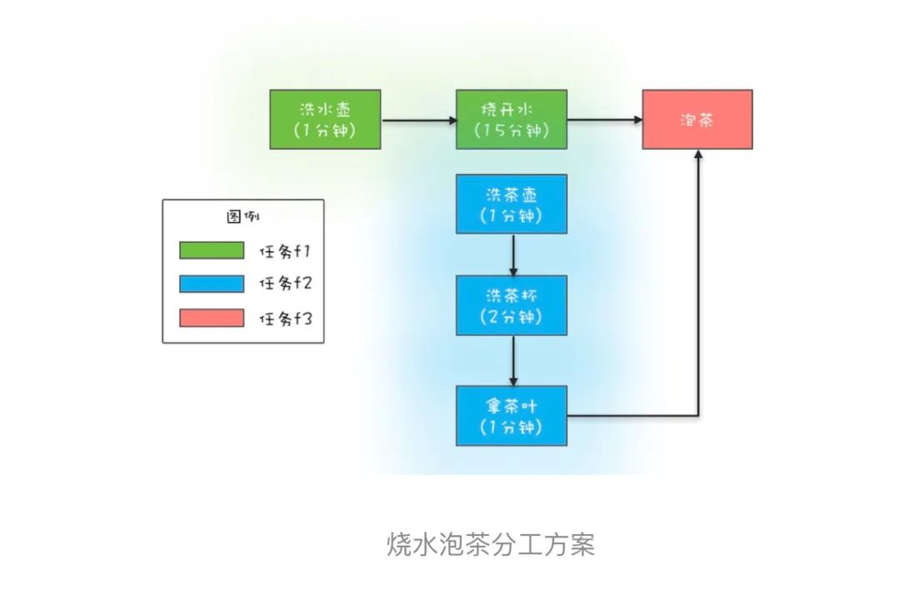

```
//任务1：洗水壶->烧开水
CompletableFuture<Void> f1 =
        CompletableFuture.runAsync(() -> {
            System.out.println("T1:洗水壶...");
            sleep(1, TimeUnit.SECONDS);

            System.out.println("T1:烧开水...");
            sleep(15, TimeUnit.SECONDS);
        });

//任务2：洗茶壶->洗茶杯->拿茶叶
CompletableFuture<String> f2 =
        CompletableFuture.supplyAsync(() -> {
            System.out.println("T2:洗茶壶...");
            sleep(1, TimeUnit.SECONDS);

            System.out.println("T2:洗茶杯...");
            sleep(2, TimeUnit.SECONDS);

            System.out.println("T2:拿茶叶...");
            sleep(1, TimeUnit.SECONDS);
            return "龙井";
        });

//任务3：任务1和任务2完成后执行：泡茶
CompletableFuture<String> f3 =
        f1.thenCombine(f2, (__, tf) -> {
            System.out.println("T1:拿到茶叶:" + tf);
            System.out.println("T1:泡茶...");
            return "上茶:" + tf;
        });

//join，等待任务3执行结果
System.out.println(f3.join());

}
```

<br/>

### 1.1-扩展：回调

不要被"回调"的回字迷惑了，并不是说真的是重新回去调取对象(错误:学生对象交作业->老师对象改作业的同时调用学生对象的方法)，而是去调用“任务系统”的任务执行任务，去来处理"作业"这个实例，而非是对着学生这个对象处理

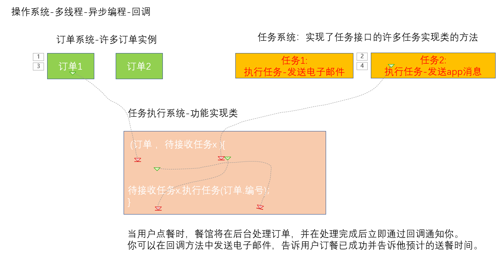

<br/>

<br/>

### 1.2-CompletableFuture每个方法例子(来源chatgpt、utools-java8)

11

####  (1) supplyAsync：

该方法可以接收一个 Supplier 函数作为参数，该函数用于异步处理任务。

```java
CompletableFuture<String> future = CompletableFuture.supplyAsync(() -> {
    try {
        Thread.sleep(1000);
    } catch (InterruptedException e) {
        e.printStackTrace();
    }
    return "Hello";
});

```

后续处理：

**		(1.1) thenApply：**

该方法可以接收一个 Function 函数作为参数，该函数用于对异步任务的结果进行处理。

```
CompletableFuture<String> future = CompletableFuture.supplyAsync(() -> {
    try {
        Thread.sleep(1000);
    } catch (InterruptedException e) {
        e.printStackTrace();
    }
    return "Hello";
}).thenApply(s -> s + " World");

```

**		(1.2) thenAccept：**

该方法可以接收一个 Consumer 函数作为参数，该函数用于对异步任务的结果进行消耗。

```
CompletableFuture<Void> future = CompletableFuture.supplyAsync(() -> {
    try {
        Thread.sleep(1000);
    } catch (InterruptedException e) {
        e.printStackTrace();
    }
    return "Hello";
}).thenAccept(s -> System.out.println(s + " World"));

```

		**(1.3) thenRun：**

该方法可以接收一个 Runnable 函数作为参数，该函数用于在异步任务完成后运行。

```
CompletableFuture<Void> future = CompletableFuture.supplyAsync(() -> {
    try {
        Thread.sleep(1000);
    } catch (InterruptedException e) {
        e.printStackTrace();
    }
    return "Hello";
}).thenRun(() -> System.out.println的 " World")；

```

<br/>

	**(1.4) exceptionally**

该方法可以在异步任务出现异常时执行指定的处理。

```
CompletableFuture<String> future = CompletableFuture.supplyAsync(() -> {
try {
Thread.sleep(1000);
} catch (InterruptedException e) {
e.printStackTrace();
}
throw new RuntimeException("Oops");
}).exceptionally(e -> "Error");
```

<br/>

**(1.5) handle**

该方法可以在异步任务完成时执行指定的处理，不管任务是正常完成还是异常完成。

```
CompletableFuture<String> future = CompletableFuture.supplyAsync(() -> {
    try {
        Thread.sleep(1000);
    } catch (InterruptedException e) {
        e.printStackTrace();
    }
    return "Hello";
}).handle((result, exception) -> {
    if (exception != null) {
        return "Error";
    } else {
        return result + " World";
    }
});

```

<br/>

**(1.6) whenComplete**

该方法可以在异步任务完成时执行指定的处理，不管任务是正常完成还是异常完成。与 handle 不同，whenComplete 不能修改任务的结果，而只能在完成时执行一些处理。

```
CompletableFuture<String> future = CompletableFuture.supplyAsync(() -> {
    try {
        Thread.sleep(1000);
    } catch (InterruptedException e) {
        e.printStackTrace();
    }
    return "Hello";
}).whenComplete((result, exception) -> {
    if (exception != null) {
        System.out.println("Error");
    } else {
        System.out.println(result + " World");
    }
});
```

<br/>

#### (2) thenCombine

该方法可以接收另一个 CompletableFuture 对象，并等待两个异步任务都完成，然后将两个任务的结果合并。

```
CompletableFuture<String> future1 = CompletableFuture.supplyAsync(() -> {
try {
Thread.sleep(1000);
} catch (InterruptedException e) {
e.printStackTrace();
}
return "Hello";
});

CompletableFuture<String> future2 = CompletableFuture.supplyAsync(() -> {
try {
Thread.sleep(1000);
} catch (InterruptedException e) {
e.printStackTrace();
}
return " World";
});

CompletableFuture<String> future = future1.thenCombine(future2, (s1, s2) -> s1 + s2);
```

<br/>

#### (3) join

该方法用于阻塞当前线程，直到 CompletableFuture 执行结束。该方法返回 CompletableFuture 的结果，或者在执行过程中抛出的异常。

```
 //调用 CompletableFuture 类的静态方法 allOf 并阻塞当前线程，直到所有 CompletableFuture 任务都完成。
 CompletableFuture.allOf(userFuture, bonusFuture, growthFuture).join();
```

<br/>

#### (4) getNow

该方法用于获取 CompletableFuture 的结果，如果任务尚未完成，则返回指定的默认值。

```
CompletableFuture<String> future = CompletableFuture.supplyAsync(() -> {
    try {
        Thread.sleep(1000);
    } catch (InterruptedException e) {
        e.printStackTrace();
    }
    return "Hello";
});
String result = future.getNow("World");
System.out.println(result);

```

<br/>

#### (5) cancel

该方法用于取消任务的执行。如果任务已经开始执行，则无法取消；如果任务尚未开始执行，则可以取消。

```
CompletableFuture<String> future = CompletableFuture.supplyAsync(() -> {
    try {
        Thread.sleep(1000);
    } catch (InterruptedException e) {
        e.printStackTrace();
    }
    return "Hello";
});
boolean cancelled = future.cancel(true);
if (cancelled) {
    System.out.println("Task cancelled");
} else {
    System.out.println("Task not cancelled");
}

```

<br/>

#### (6) completeExceptionally

该方法用于手动完成 CompletableFuture 任务，并抛出异常。

```
CompletableFuture<String> future = new CompletableFuture<>();
future.completeExceptionally(new Exception("Oops"));
try {
    String result = future.get();
} catch (InterruptedException | ExecutionException e) {
    System.out.println(e.getCause());
}

```

#### (7) obtrudeValue

该方法用于手动完成 CompletableFuture 任务，并强制设置结果。

```
CompletableFuture<String> future = new CompletableFuture<>();
future.obtrudeValue("Hello");
try {
    String result = future.get();
    System.out.println(result);
} catch (InterruptedException | ExecutionException e) {
    System.out.println(e.getCause());
}

```