# 一、计算机网络

<br/>

## 0、底层原理(会问)

<br/>

1、简单说，OSI是一个理论上的网络通信模型，TCP/IP是实际上的网络通信模型，五层结构就是为了介绍网络原理而折中的网络通信模型。

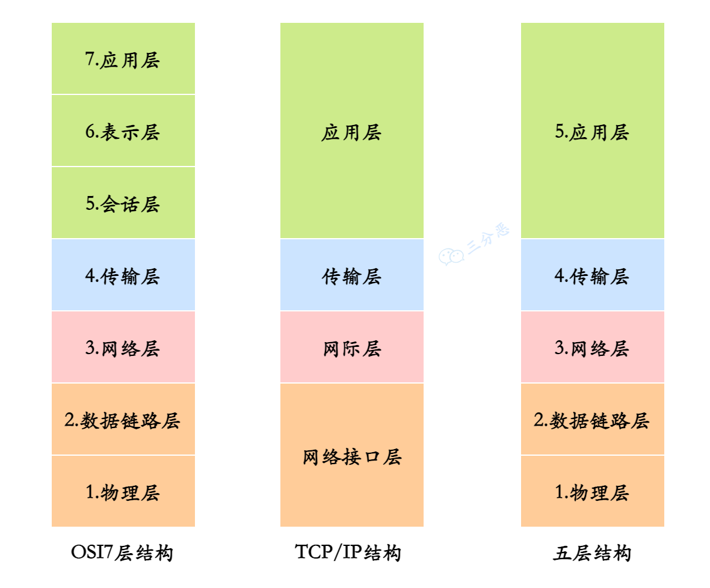

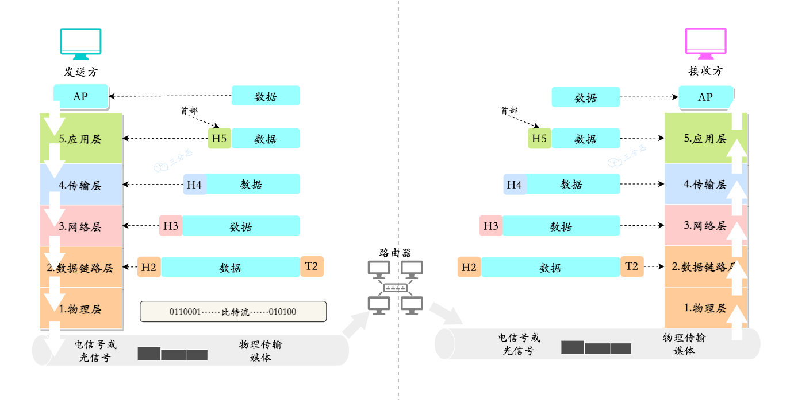

一句话：物联网叔用

//--------这三个都叫做应用层

应用层：电脑的进程，相当于QQ程序；通过应用进程之间的交互来完成特定网络应用，应用层协议定义的是应用进程间通信和交互的规则，常见的协议有：HTTP FTP SMTP SNMP DNS.
表示层：数据的表示、安全、压缩。确保一个系统的应用层所发送的信息可以被另一个系统的应用层读取。
会话层：建立、管理、终止会话，是用户应用程序和网络之间的接口。

//----------

运输层：电脑的端口通信，相当于8080；提供源端与目的端之间提供可靠的透明数据传输，传输层协议为不同主机上运行的进程提供逻辑通信。TCP/UDP
网络层：电脑的IP地址，相当于123.123.123.123；将网络地址翻译成对应的物理地址，实现不同网络之间的路径选择, 协议有 ICMP IGMP IP 等.
数据链路层：相当于两个ip+端口之间的比特流连接的中间人。在物理层提供比特流服务的基础上，建立相邻结点之间的数据链路。
物理层：给别人打电报的。传输比特流，010101。建立、维护、断开物理连接。进行比特流的传输

<br/>

## 1、工作流程（了解网络）

<br/>

### (1)从浏览器地址栏输入 url 到显示主页的过程？

我们以输入www.baidu.com 为例：

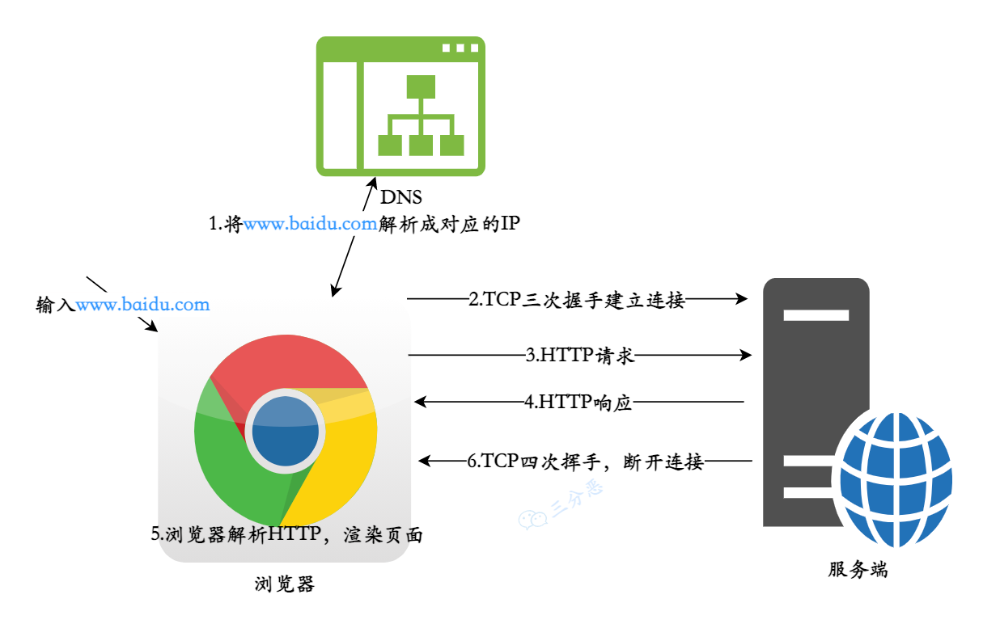

DNS：


域名服务器：先大后小


<br/>

<br/>

## 2、应用层

<br/>

### （1）http下“get”和“post”安全性(请求方法)

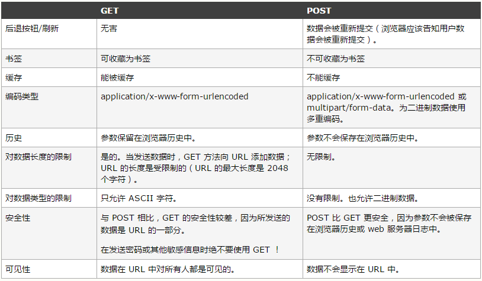

1、从 HTTP 报文层面来看，GET 请求将信息放在 URL，POST 将请求信息放在请求体中。这一点使得 GET 请求携带的数据量有限，因为 URL 本身是有长度限制的，而 POST 请求的数据存放在报文体中，因此对大小没有限制。而且从形式上看，GET 请求把数据放 URL 上不太安全，而 POST 请求把数据放在请求体里想比较而言安全一些。

2、从数据库层面来看，GET 符合幂等性和安全性，而 POST 请求不符合。这个其实和 GET/POST 请求的作用有关。按照 HTTP 的约定，GET 请求用于查看信息，不会改变服务器上的信息；而 POST 请求用来改变服务器上的信息。正因为 GET 请求只查看信息，不改变信息，对数据库的一次或多次操作获得的结果是一致的，认为它符合幂等性。安全性是指对数据库操作没有改变数据库中的数据。

3、从其他层面来看，GET 请求能够被缓存，GET 请求能够保存在浏览器的浏览记录里，GET 请求的 URL 能够保存为浏览器书签。这些都是 POST 请求所不具备的。缓存是 GET 请求被广泛应用的根本，他能够被缓存也是因为它的幂等性和安全性，除了返回结果没有其他多余的动作，因此绝大部分的 GET 请求都被 CDN 缓存起来了，大大减少了 Web 服务器的负担。

<br/>

其它：

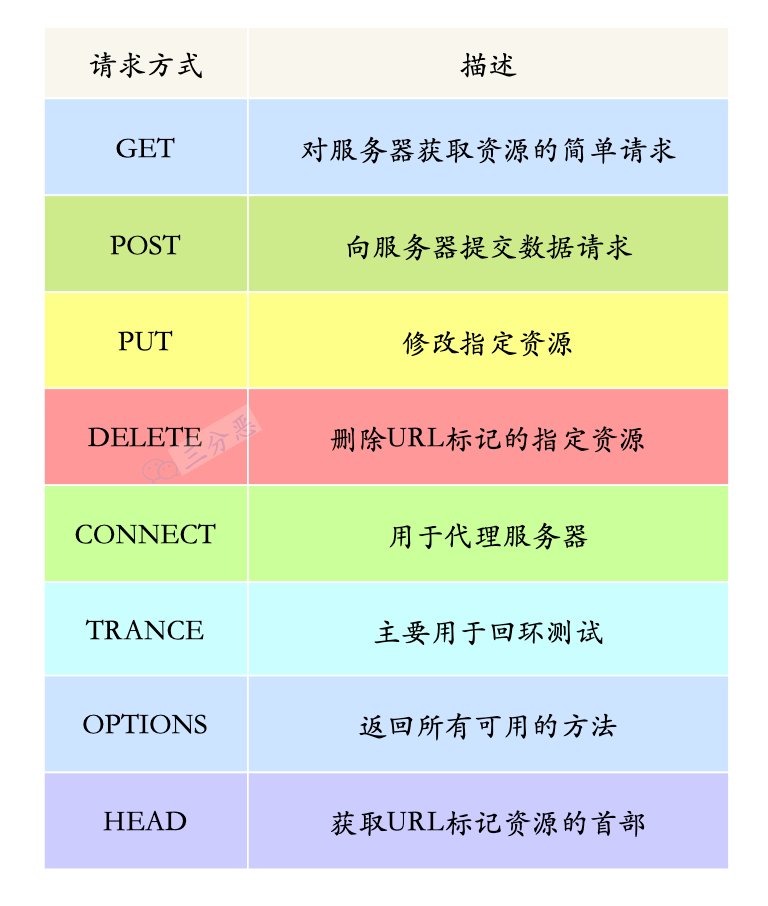

扩展：http1/2/3、https是什么？

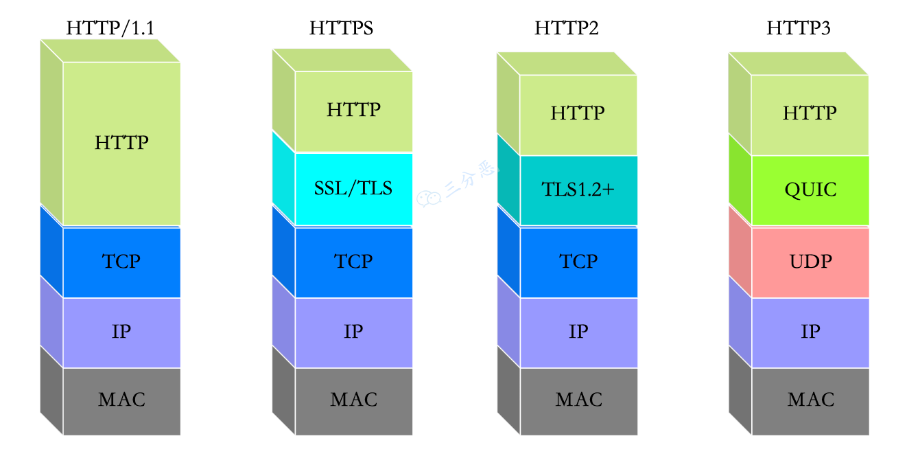

<br/>

1：默认使用短连接，每次请求都需要建立一个 TCP 连接。它可以设置Connection: **keep-alive **这个字段，强制开启长连接。

（什么是 HTTP 的长连接？HTTP 分为长连接和短连接，本质上说的是 TCP 的长短连接。TCP 连接是一个双向的通道，它是可以保持一段时间不关闭的，因此 TCP 连接才具有真正的长连接和短连接这一说法。）

<br/>

2：存在的一些问题，比如重传等等，都是由于TCP本身的特性导致的

<br/>

3：主要有两大变化，传输层基于UDP、使用QUIC保证UDP可靠性。

<br/>

https(本章第2点)：

HTTP 是超⽂本传输协议，信息是明⽂传输，存在安全⻛险的问题。HTTPS 则解决 HTTP 不安全的缺陷，在TCP 和 HTTP ⽹络层之间加⼊了** SSL/TLS 安全协议**，使得报⽂能够加密传输。**---(解决：信息加密：交互信息⽆法被窃取、校验机制：⽆法篡改通信内容，篡改了就不能正常显示)**

HTTP 连接建⽴相对简单， TCP 三次握⼿之后便可进⾏ HTTP 的报⽂传输。⽽ HTTPS 在 TCP 三次握⼿之后，还需进⾏ SSL/TLS 的握⼿过程，才可进⼊加密报⽂传输。

HTTP 的端⼝号是 80，HTTPS 的端⼝号是 443。

HTTPS 协议需要向 CA（证书权威机构）申请数字证书，来保证服务器的身份是可信的。**----(解决：身份证书：能证明淘宝是真淘宝)**

<br/>

<br/>

<br/>

<br/>

<br/>

### （2）HTTPS(对http的升级) 

主要工作流程：

这道题有几个要点：公私钥、数字证书、加密、对称加密、非对称加密。

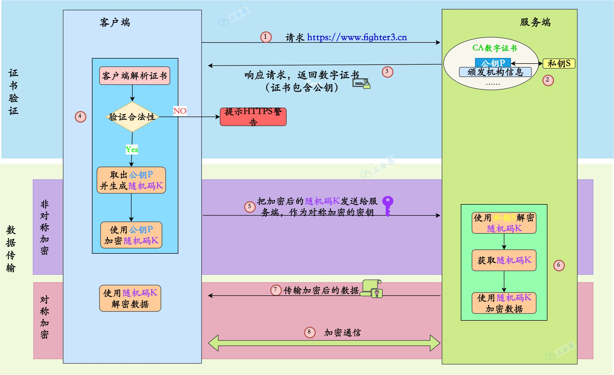

1客户端发起 HTTPS 请求，连接到服务端的 443 端口。
2服务端有一套数字证书（证书内容有公钥、证书颁发机构、失效日期等）。
3服务端将自己的数字证书发送给客户端（公钥在证书里面，私钥由服务器持有）。
**4客户端收到数字证书之后，会验证证书的合法性。如果证书验证通过，就会生成一个随机的对称密钥，用证书的公钥加密。**
5客户端将公钥加密后的密钥发送到服务器。
6服务器接收到客户端发来的密文密钥之后，用自己之前保留的私钥对其进行非对称解密，解密之后就得到客户端的密钥，然后用客户端密钥对返回数据进行对称加密，酱紫传输的数据都是密文啦。
7服务器将加密后的密文返回到客户端。
8客户端收到后，用自己的密钥对其进行对称解密，得到服务器返回的数据。


对于第4点的详细解释：

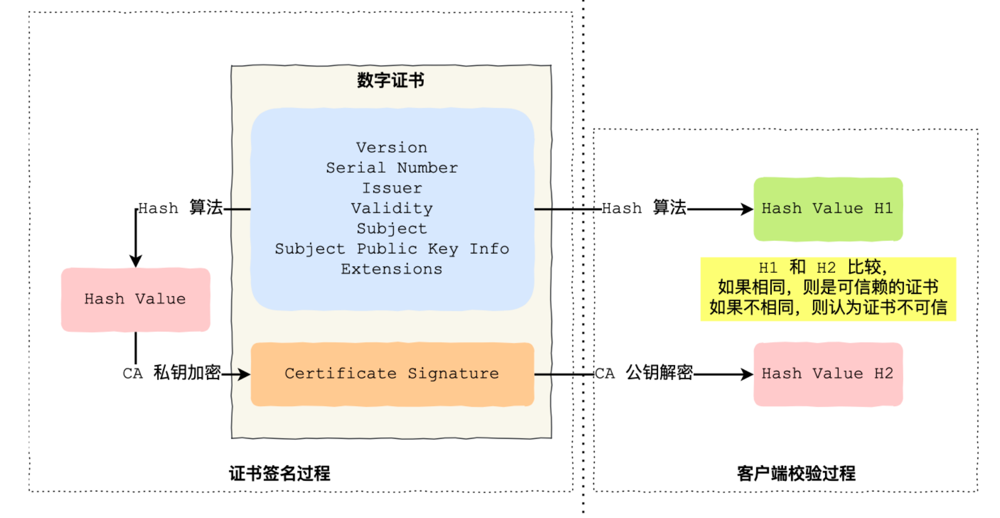

客户端校验服务端的数字证书的过程，如上图右边部分：

(小卖部老板说我这里有一种信纸，保证你的班主任不知道你们传什么小纸条。于是小红和你一起用这个信纸。

1、小红收到了一封信，先用老板说的跳1字法(hash算法)去算第一行文字，得出：这是李老板确认过的真信！

```
⾸先客户端会使⽤同样的 Hash 算法获取该证书的 Hash 值 H1；
```

2、这时候小红收到了隔壁小丽递过来的信，说是你给的，再用老板说的跳2字法(公钥解密)却得出信的title：快来学Java！

```
通常浏览器和操作系统中集成了 CA 的公钥信息，浏览器收到证书后可以使⽤ CA 的公钥解密 Certificate
Signature 内容，得到⼀个 Hash 值 H2 ；
```

3、这时小红知道这并不是小明从小卖部老板买的加密信

```
最后⽐较 H1 和 H2，如果值相同，则为可信赖的证书，否则则认为证书不可信。
```

4、假如有人换了信纸，用跳2字法就会解出不同的内容：快来学Java！

```
假如在HTTPS的通信过程中，中间人篡改了证书原文，由于他没有CA机构的私钥，所以CA公钥解密的内容就不一致。
```

<br/>

### （3）响应状态码(请求方法是否成功)

以一个幽默的说法来理解吧。(来源：https://fighter3.blog.csdn.net/article/details/116464416)

<br/>

拔剑四顾心茫然，不见妹子只见男。

```
404（Not Found）：服务器无法根据客户端的请求找到资源（网页）
```

老妈问和你一起长大的小美还联系吗？小美已经嫁做人妇，孩子都会叫爸爸了。

```
301（Moved Permanently）：永久移动。请求的资源已被永久的移动到新URI。
```

那你大学时谈过的小静呢？小静已经重新开始，找了新的男朋友。

```
302（Found）：临时移动。与301类似。但资源只是临时被移动。
```

那我帮你安排相亲好了。终于，妹子问了一句，你的工作怎么样？你说：

你知道能应对亿级流量的高并发架构如何搭建吗？你知道高并发下保证幂等性的几种方式吗？你知道保证Redis高可用的几种方法吗……啊吧啊吧

女孩子不知道你在说什么。

```
400（Bad Request）：客户端请求的语法错误，服务器无法理解。
```

妹子说，我吹了风，感觉头有点疼，今天就先到这吧。

```
500（Internal Server Error）：服务器内部错误，无法完成请求。
```

过了一段时间，他们在一起了。小星想๑乛◡乛๑，小萌：๑ ͡° ͜◡ ͡° ๑，讨厌,，才确定关系多久。

```
403（Forbidden）：服务器理解请求客户端的请求，但是拒绝执行此请求。
```

但是耐不住小星的软磨硬泡，还是……结果闹出人命了，但是孩子还不能生。

因为没有结婚证和准生证。

```
401（Unauthorized）：请求需要有通过HTTP认证（BASIC认证，DIGEST认证）的认证信息。
```

后来，小星和小萌结婚了，生了一个可爱的孩子，一家三口过上了幸福的生活。

```
200（OK）：请求成功。
```

<br/>

<br/>

### （4）URI和URL（请求的地址）

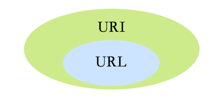

URI，统一资源标识符(Uniform Resource Identifier， URI)，标识的是Web上每一种可用的资源，如 HTML文档、图像、视频片段、程序等都是由一个URI进行标识的。

URL，统一资源定位符（Uniform Resource Location)，它是URI的一种子集，主要作用是提供资源的路径。


<br/>

<br/>

<br/>

## 3、传输层

<br/>

### （1）了解的端口及对应的服务

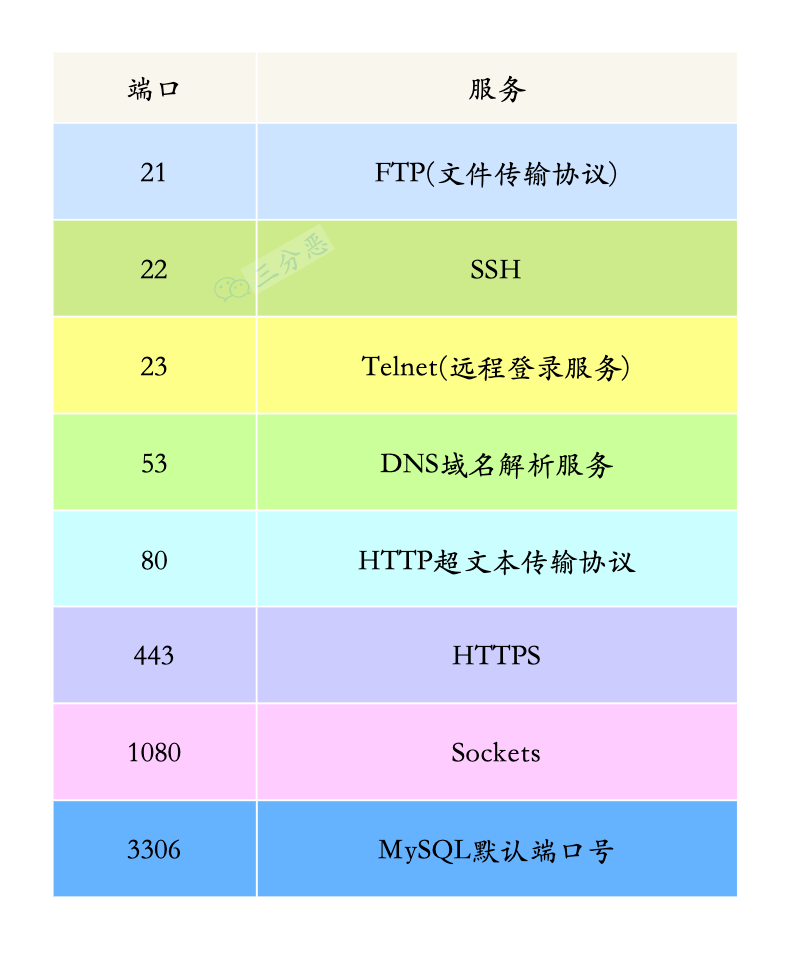

### （2）TCP

<br/>

<br/>

#### a.三次握手

<br/>

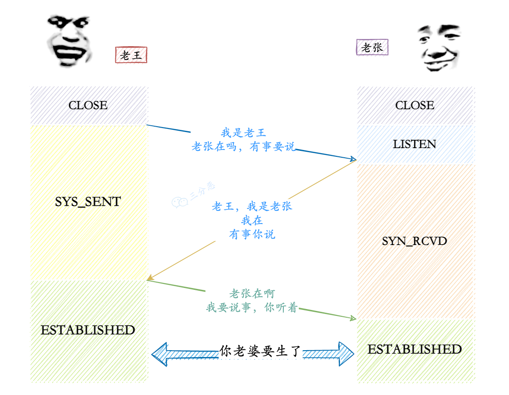

<br/>

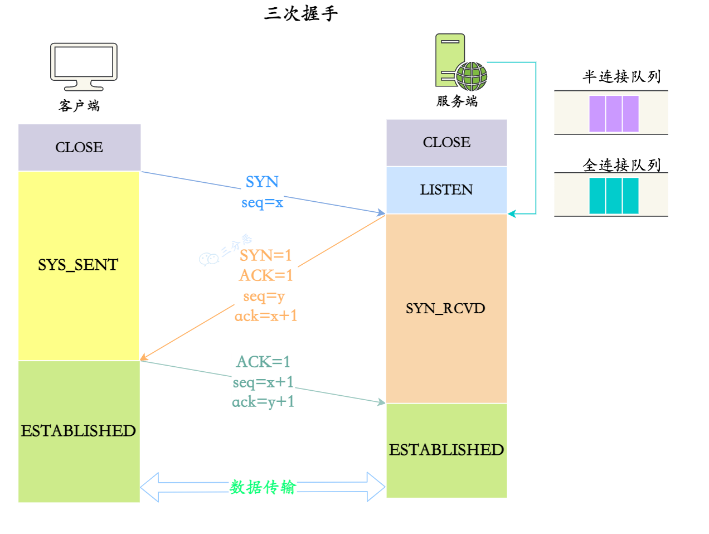

首先知道：

SYN：半连接队列SYN、全连接队列ACCEPT 

ACK：收到了

seq：我的序号

ack：你的序号

<br/>

第一次握手：SYN=1，seq=x。

```
老张，你快来听啊(SYN=1准备进入半连接队列)，我待会说的第x个字后开始说
```

第二次握手：SYN=1，ACK=1，acknum=x+1，seq=y

```
老王，我收到了(ACK=1)，我已经在听了(SYN=1进入了半连接队列)。那我待会从第x+1个字开始记(acknum=x+1)。
如果我说话，我待会说的第y个字后开始说(seq=y)，你也注意听
```

第三次握手：ACK=1，acknum=y+1，seq=x+1

```
老王，我收到了(ACK=1)。那我待会从第y+1个字开始记(acknum=y+1)。行，你从第x+1个字开始记就行(seq=x+1)。
```

<br/>

正题：你老婆快生了！

<br/>

<br/>

常见的问题：

1、为什么不能是两次？

还是先看幽默版本：

```
老张听到老王的问候，并回复，然后就傻傻地等着。但是老张并不知道老王没有收到他的消息。
```

<br/>

如果没有第三次握手告诉服务器端客户端收的到服务器端传输的数据的话，服务器端是不知道客户端有没有接收到服务器端返回的信息的。

服务端就认为这个连接是可用的，端口就一直开着，等到客户端因超时重新发出请求时，服务器就会重新开启一个端口连接。这样一来，就会有很多无效的连接端口白白地开着，导致资源的浪费。

**一句话：为了防止客户端下线原因或者网络包丢失原因，导致服务器端开启一些无用的连接增加服务器端口占用的开销**

<br/>

2、为什么不是四次？

简单说，就是三次挥手已经足够创建可靠的连接，没有必要再多一次握手导致花费更多的时间建立连接。

<br/>

3、第二次握手传回了 ACK，为什么还要传回 SYN？

ACK是为了告诉客户端传来的数据已经接收无误。而传回SYN是为了告诉客户端，服务端响应的确实是客户端发送的报文(为了确定老张听的确实是老王的话)。

<br/>

4、第1次握手可以携带数据吗？

第一次握手不能携带数据是出于安全的考虑，因为如果允许携带数据，攻击者每次在SYN报文中携带大量数据，就会导致服务端消耗更多的时间和空间去处理这些报文，会造成CPU和内存的消耗。

<br/>

5、第3次握手可以携带数据吗？

第3次握手是可以携带数据的。此时客户端已经处于ESTABLISHED状态。对于客户端来说，它已经建立连接成功，并且确认服务端的接收和发送能力是正常的。

<br/>

6、SYN Flood的DDOS攻击

通俗版本：

```
老王每次都去喊“老张我有重要的是告诉你”。老张来了之后“老王你有什么事”，老王就故意不说话，导致很多个老张一直傻傻地等。
```

SYN Flood 是一种典型的 DDos 攻击，它在短时间内，伪造不存在的 IP 地址, 向服务器发送大量SYN 报文。当服务器回复 SYN+ACK 报文后，不会收到 ACK 回应报文，那么SYN队列里的连接旧不会出对队，久⽽久之就会占满服务端的 SYN 接收队列（半连接队列），使得服务器不能为正常⽤户服务。
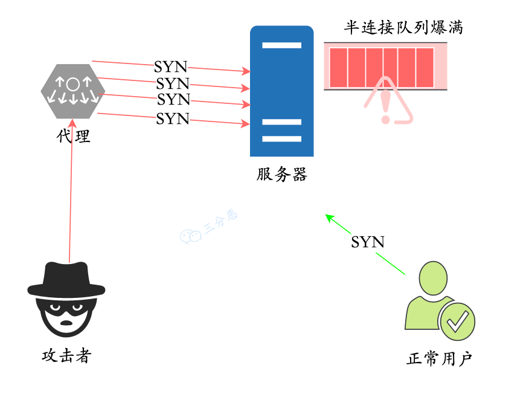

<br/>

<br/>

<br/>

防止措施：

通俗版本：

```
收到老王的问候，老张先不去山顶，老张用喇叭回复他并用录音机记下来他说的话，等老王再次回复了，老张再就去山上和他通话。
```

syn cookie：在收到 SYN 包后，服务器根据一定的方法，以数据包的源地址、端口等信息为参数计算出一个 cookie 值作为自己的 SYNACK 包的序列号，回复 SYN+ACK 后，服务器并不立即分配资源进行处理，等收到发送方的 ACK 包后，重新根据数据包的源地址、端口计算该包中的确认序列号是否正确，如果正确则建立连接，否则丢弃该包。


<br/>

<br/>

<br/>

#### b.四次挥手

<br/>

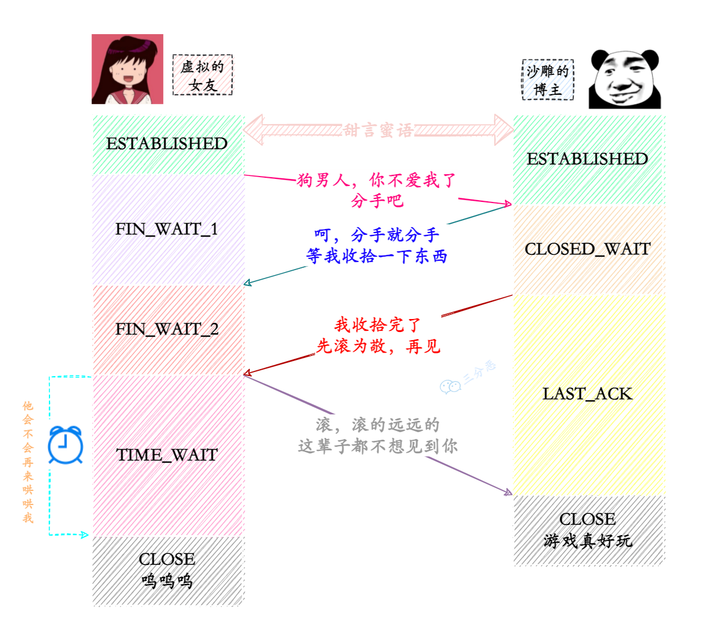

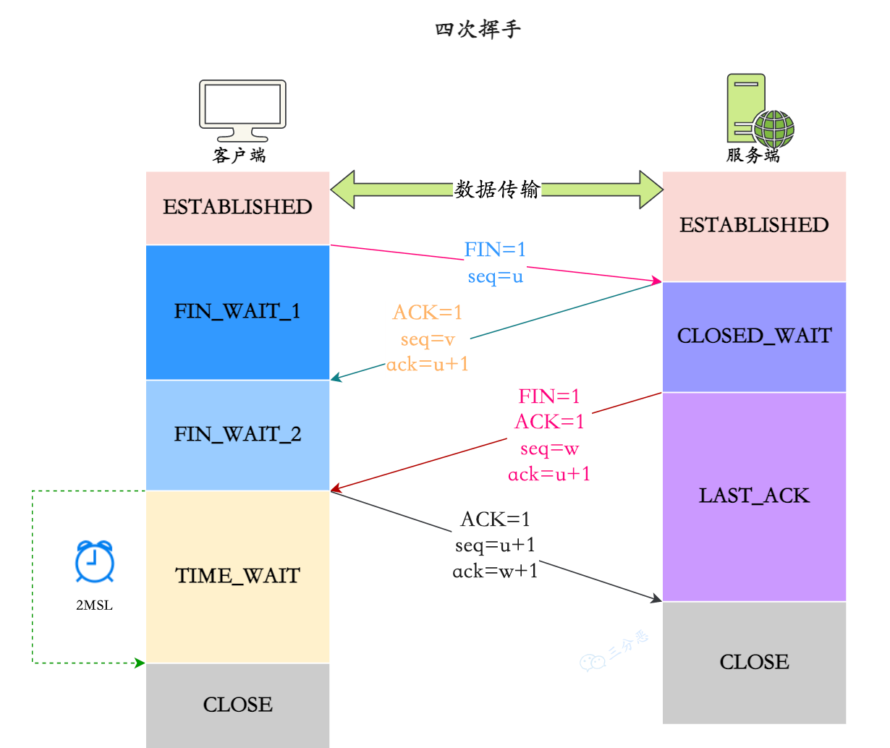

<br/>

首先知道：
FIN：结束行为
ACK：收到了
seq：我的序号
ack：你的序号

第一次挥手：FIN=1，seq=x。

第二次挥手：ACK=1，acknum=x+1，seq =z

第三次挥手：FIN=1，ACK=1，acknum=x+1，seq=y

第四次挥手：ACK=1，acknum=y+1，seq=x+1

<br/>

<br/>

还是以老张老王为例。

<br/>

第一次挥手：FIN=1，seq=x。

```
老张，我说完了(FIN=1)，你待会从我的第x个字后不要听了(seq=x)
```

第二次挥手：ACK=1，acknum=x+1，seq =z

```
老王，我收到了(ACK=1)。那我待会从第x+1个字开始不记了(acknum=x+1)。但是我会没说完，你还要再接收一下。
```

第三次挥手：FIN=1，ACK=1，acknum=x+1，seq=y

```
老王，这次谈话我收到完了(ACK=1)，我也说完了(FIN=1)。
我这次完成记到第x+1个字了(acknum=x+1)。那你待会从我的第y个字开始不要记(seq=y)。
```

第四次挥手：ACK=1，acknum=y+1，seq=x+1

```
老张，我收到了(ACK=1)。那我待会从第y+1个字开始不记了(acknum=y+1)。
(确认)是的，你完成第x+1个字已经行啦(seq=x+1)。
```

<br/>

<br/>

<br/>

1、为什么需要四次挥手？

因为客户端向服务端发送 FIN 时，仅仅表示客户端不再发送数据了，但是客户端还能接收数据。

服务端需要时间去处理剩下未发送完的数据对客户端的发送。

<br/>

<br/>

#### c. TCP为什么可靠

流量控制、超时重传、拥塞控制

<br/>

##### 1、TCP 的流量控制(从接收方角度)

TCP 连接的每一方都有固定大小的缓冲空间，TCP的接收端只允许发送端发送接收端缓冲区能接纳的数据。当接收方来不及处理发送方的数据，能提示发送方降低发送的速率，防止包丢失。TCP 使用的流量控制协议是可变大小的**滑动窗口**协议。

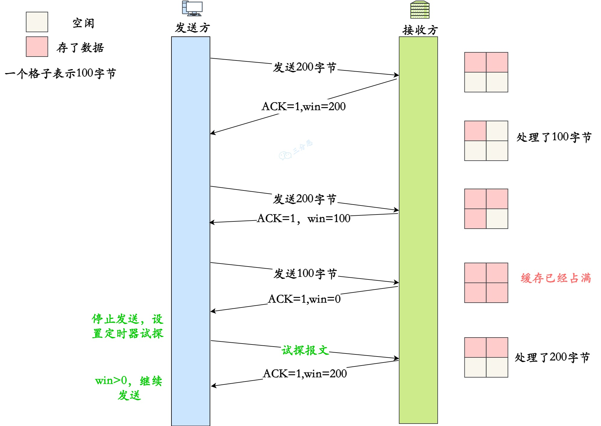

<br/>

流量控制协议是可变大小的**TCP滑动窗口**协议：(即右边那个粉红色的东西是怎么变化的)

win参数：TCP 引入了窗口，TCP 头部有个字段叫 win，也即那个 16 位的窗口大小，它是操作系统开辟的一个缓存空间。窗口大小值表示无需等待确认应答，而可以继续发送数据的最大值。

它告诉对方本端的 TCP 接收缓冲区还能容纳多少字节的数据，这样对方就可以控制发送数据的速度，从而达到流量控制的目的。

<br/>

上面粉红色对应的就是下图粉红色的未处理数据。

蓝色对应空黄色。

绿色对应已处理的。

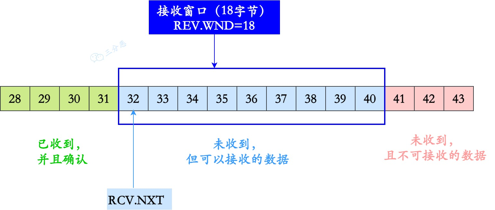

<br/>

REV.WND: 表示接收窗口的大小, 上图虚线框的格子就是 9 个。
REV.NXT: 下一个接收的位置，它指向未收到但可以接收的第一个字节的序列号。

<br/>

##### 2、TCP的拥塞控制 (从发送方角度)

<br/>

在⽹络出现拥堵时，如果继续发送⼤量数据包，可能会导致数据包时延、丢失等，这时 TCP 就会重传数据，但是⼀重传就会导致⽹络的负担更重，于是会导致更⼤的延迟以及更多的丢包，这个情况就会进⼊恶性循环被不断地放⼤…

所以，TCP 不能忽略**整个网络中发⽣的事**，它被设计成⼀个⽆私的协议，当⽹络发送拥塞时，TCP 会⾃我牺牲，降低发送的数据流。

于是，就有了拥塞控制，控制的⽬的就是避免发送⽅的数据填满整个⽹络。(大家都受罪)

<br/>

拥塞窗⼝ cwnd是发送⽅维护的⼀个的状态变量，它会根据⽹络的拥塞程度动态变化的。

只要⽹络中没有出现拥塞， cwnd 就会增⼤；
但⽹络中出现了拥塞， cwnd 就减少；

<br/>

为了防止 cwnd 增长过大引起网络拥塞，还需设置一个慢启动阀值 **ssthresh**（slow start threshold）状态变量。**当cwnd到达该阀值后，就好像水管被关小了水龙头一样，减少拥塞状态**。即当 cwnd >ssthresh 时，进入了拥塞避免算法。

<br/>

慢启动算法：它表示 TCP 建立连接完成后，一开始不要发送大量的数据，而是先探测一下网络的拥塞程度。由小到大逐渐增加拥塞窗口的大小，如果没有出现丢包，每收到一个 ACK，就将拥塞窗口 cwnd 大小就加 1（单位是 MSS）。每轮次发送窗口增加一倍，呈指数增长，如果出现丢包，拥塞窗口就减半，进入拥塞避免阶段。


<br/>

快速恢复：

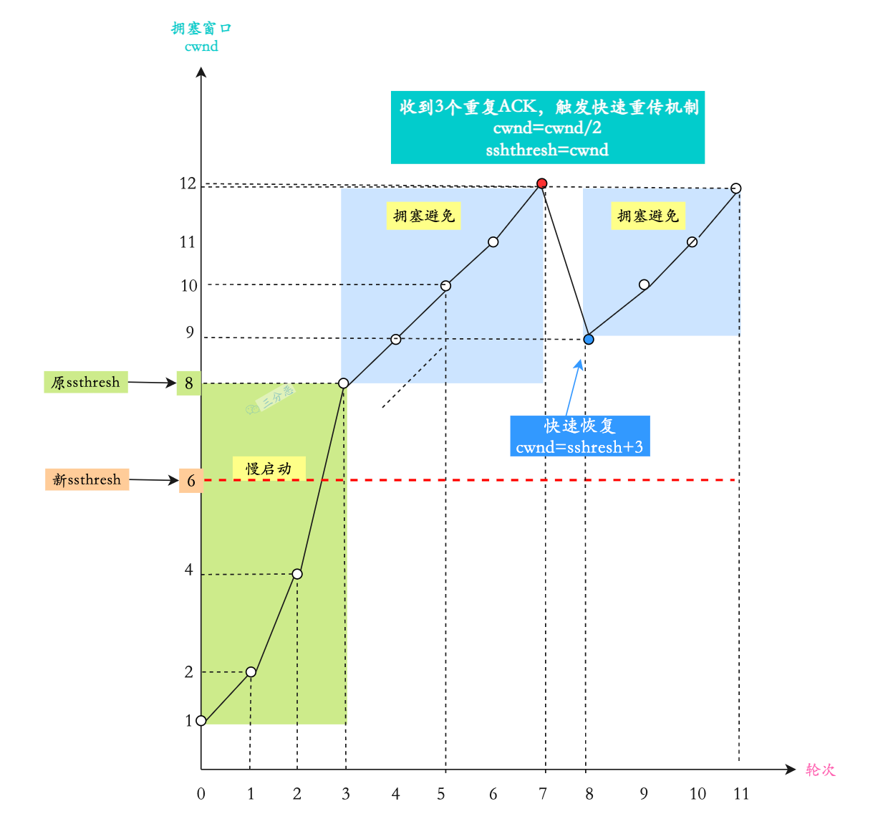

<br/>

<br/>

##### 3、TCP的超时重传 (从发送方、接收方两个角度)

超时重传，是 TCP 协议保证数据可靠性的另一个重要机制，其原理是在发送某一个数据以后就开启一个计时器，在一定时间内如果没有得到发送的数据报的 ACK 报文，那么就重新发送数据，直到发送成功为止。

<br/>

往返时间， RTT（Round-Trip Time）

超时重传时间，就是 RTO（Retransmission Timeout)

<br/>

如果 RTO 设置很大，等了很久都没重发，这样肯定就不行。

如果 RTO 设置很小，那很可能数据都没有丢失，就开始重发了，这会导致网络阻塞，从而恶性循环，导致更多的超时出现。

一般来说，RTO 略微大于 RTT，效果是最佳的。

<br/>

<br/>

TCP 还有另外⼀种快速重传（Fast Retransmit）机制，它不以时间为驱动，⽽是以数据驱动重传。

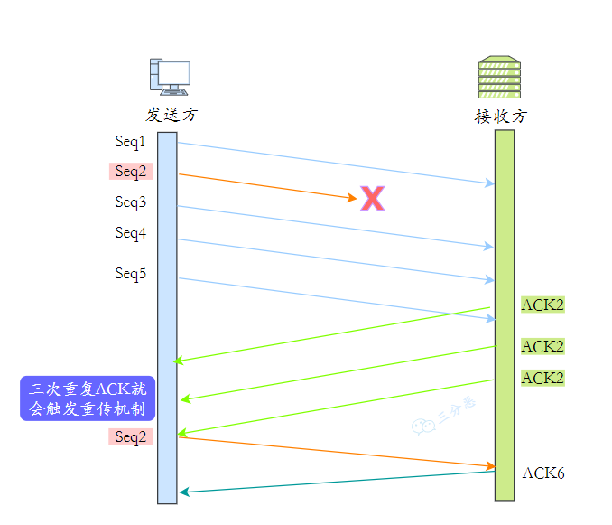

在上图，发送⽅发出了 1，2，3，4，5 份数据：

第⼀份 Seq1 先送到了，于是就 Ack 回 2；

结果 Seq2 因为某些原因没收到，Seq3 到达了，于是还是 Ack 回 2；

后⾯的 Seq4 和 Seq5 都到了，但还是 Ack 回 2，因为 Seq2 还是没有收到；

发送端收到了三个 Ack = 2 的确认，知道了 Seq2 还没有收到，就会在定时器过期之前，重传丢失的 Seq2。

最后，收到了 Seq2，此时因为 Seq3，Seq4，Seq5 都收到了，于是 Ack 回 6 。


<br/>

为了解决不知道该重传哪些 TCP 报⽂，于是就有 SACK ⽅法。

<br/>

DSACK 的目的是帮助发送方判断，是否发生了包失序、ACK 丢失、包重复或伪重传。让 TCP 可以更好的做网络流控。

缺失：

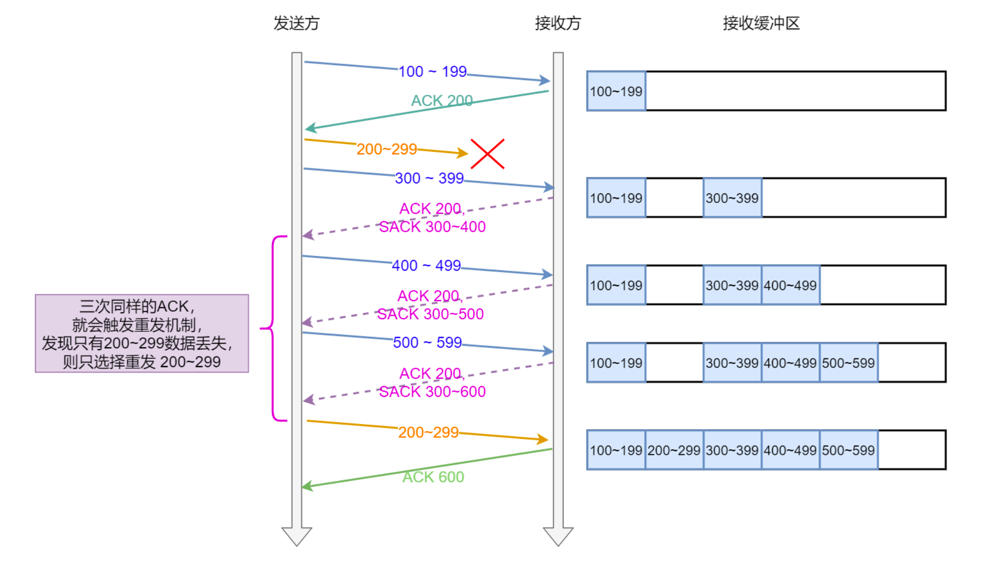

重复：

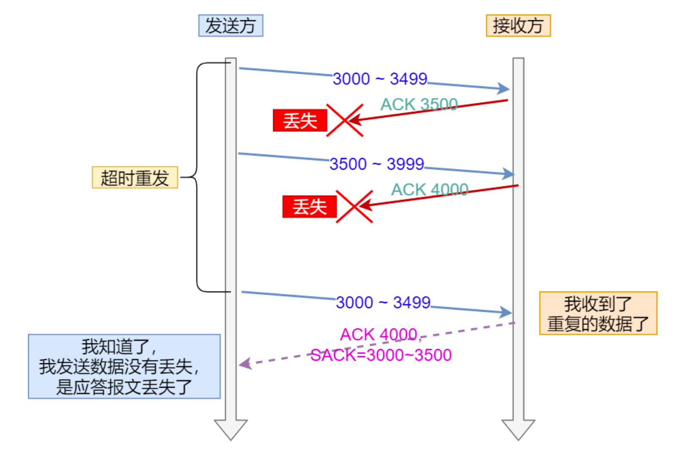

<br/>

#### d. TCP 的粘包和拆包

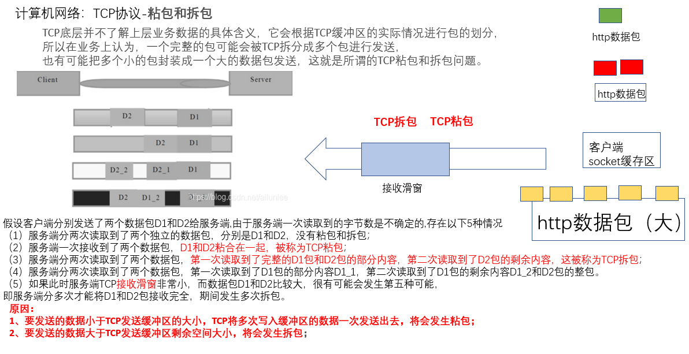

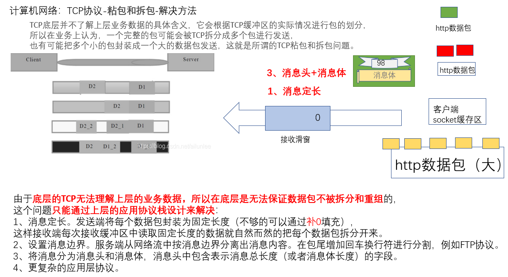

<br/>

<br/>

<br/>

### 4、网络层

<br/>

<br/>

<br/>

<br/>

#### （1）为什么有了IP地址还需要MAC地址？

只有当设备连入网络时，才能根据他进入了哪个子网来为其分配IP地址，在设备还没有IP地址的时候，或者在分配IP的过程中。我们需要MAC地址来区分不同的设备。(如联想用户)

IP 地址可以比作为地址，MAC 地址为收件人，在一次通信过程中，两者是缺一不可的。